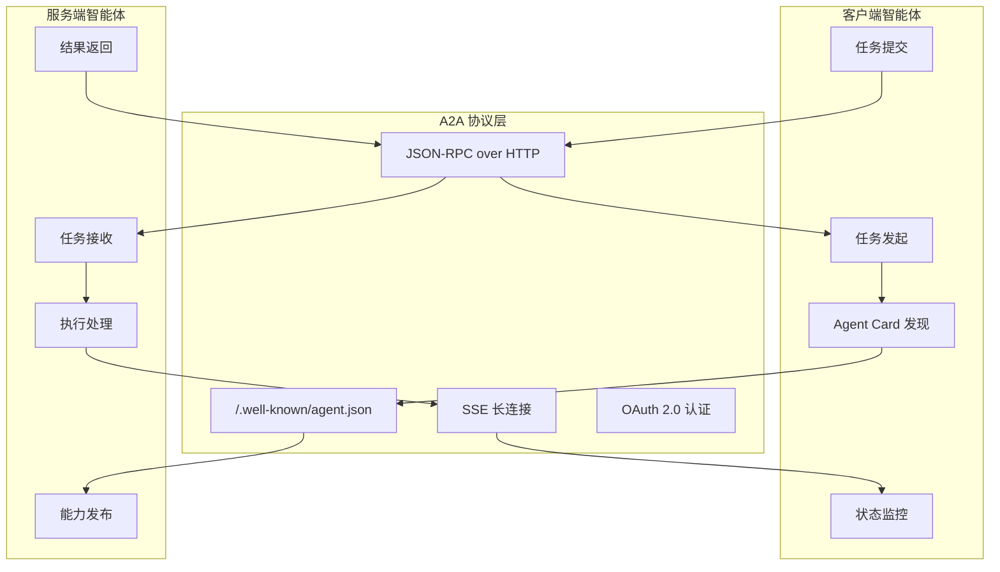
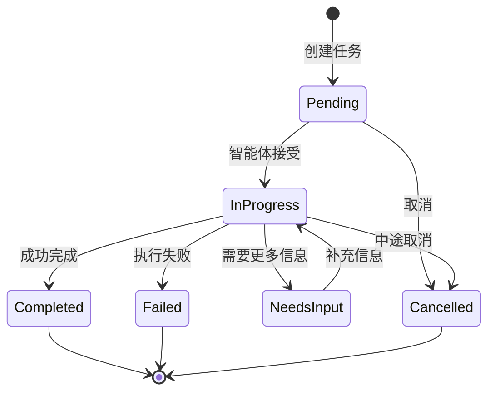
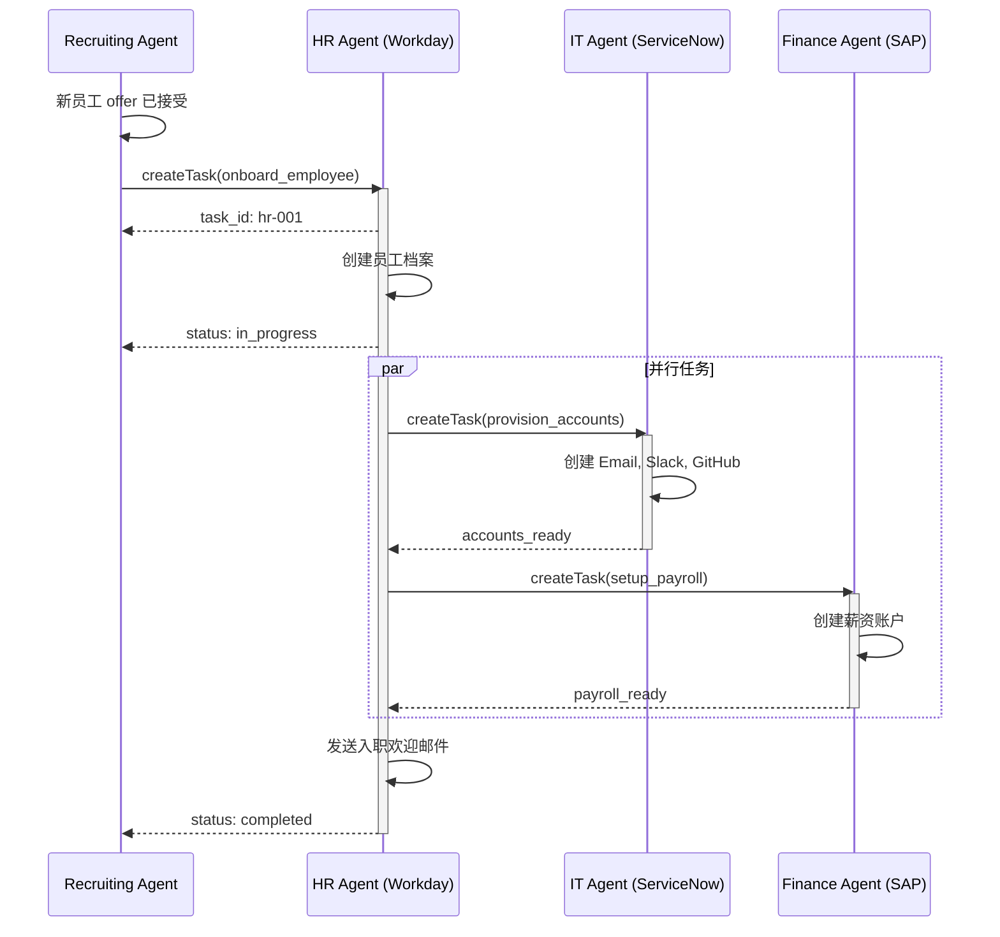

## 6.5 A2A：智能体-智能体协议

如果说 MCP 是智能体与工具/数据源的"USB 接口"，那么 **智能体对智能体协议（Agent-to-Agent Protocol, A2A）** 就是智能体与智能体之间的"互联网协议"。这两个标准共同构成了智能体 AI 时代的基础设施层。

> [!IMPORTANT]
> **里程碑**：2025 年 4 月，Google 联合 50+ 技术合作伙伴（包括 Atlassian、Salesforce、SAP、LangChain 等）发布 A2A 协议。同年 12 月，A2A 与 MCP 一起捐赠给 Linux Foundation 的 Agentic AI Foundation (AAIF)。

### 6.5.1 为什么需要 A2A

#### 多智能体协作的挑战

随着智能体系统的成熟，企业开始部署来自不同厂商的多个智能体：

```
企业 AI 部署现状：
├── HR 智能体 (来自 Workday)
├── Sales 智能体 (来自 Salesforce)  
├── IT Support 智能体 (来自 ServiceNow)
├── Finance 智能体 (来自 SAP)
├── Legal 智能体 (来自 DocuSign)
└── 自研智能体 (内部开发)

问题：这些智能体如何互相协作？
```

**没有 A2A 的世界**：

| 问题 | 影响 |
|------|------|
| 点对点集成 | N 个智能体需要 N(N-1)/2 个集成接口 |
| 供应商锁定 | 难以更换或新增厂商 |
| 不一致的通信 | 每个集成都有不同的格式和协议 |
| 安全碎片化 | 身份认证和权限管理分散 |
| 无法发现 | 智能体不知道其他智能体的存在和能力 |

**有 A2A 的世界**：

```
┌─────────────────────────────────────────────────────────────────┐
│                      A2A 协议层                                  │
├─────────────────────────────────────────────────────────────────┤
│                                                                  │
│    ┌────────┐  ┌────────┐  ┌────────┐  ┌────────┐             │
│    │HR Agent│  │Sales   │  │IT      │  │Finance │             │
│    │        │  │Agent   │  │Agent   │  │Agent   │             │
│    └───┬────┘  └───┬────┘  └───┬────┘  └───┬────┘             │
│        │           │           │           │                    │
│        └───────────┴─────┬─────┴───────────┘                    │
│                          │                                       │
│                    ┌─────┴─────┐                                │
│                    │   A2A     │                                │
│                    │ Protocol  │                                │
│                    └───────────┘                                │
│                                                                  │
│    统一的发现 → 统一的通信 → 统一的身份 → 统一的任务管理           │
│                                                                  │
└─────────────────────────────────────────────────────────────────┘
```

### 6.5.2 A2A 协议概览

A2A 定义了一套开放标准，让任何符合协议的智能体可以：

1. **发现**：找到能够帮助完成任务的其他智能体
2. **通信**：以标准化方式交换消息
3. **协作**：委托任务、共享上下文、协调行动
4. **安全**：统一的身份认证和授权

#### A2A vs MCP 对比

| 维度 | MCP | A2A |
|------|-----|-----|
| **连接对象** | 智能体 ↔ 工具/数据 | 智能体 ↔ 智能体 |
| **协议目的** | 获取能力 | 协作完成任务 |
| **交互模式** | 客户端-服务器 | 对等通信 |
| **核心概念** | 资源、工具、提示词 | 智能体名片、任务 |
| **典型场景** | 查询数据库、调用 API | 跨部门/跨平台协作 |
| **生命周期** | 请求-响应 | 完整的任务流程 |

#### 协议架构

具体示例如下：



### 6.5.3 核心概念

#### Agent Card（智能体名片）

每个符合 A2A 协议的智能体必须发布一个 **智能体名片**——描述自己身份和能力的 JSON 文档，位于 `/.well-known/agent.json`。

```json
{
  "name": "HR Assistant",
  "description": "处理员工入职、离职、请假等人力资源事务",
  "version": "1.0.0",
  "provider": {
    "name": "Workday Inc.",
    "url": "https://www.workday.com"
  },
  "capabilities": [
    {
      "name": "onboard_employee",
      "description": "处理新员工入职流程",
      "inputSchema": {
        "type": "object",
        "properties": {
          "employee_name": {"type": "string"},
          "department": {"type": "string"},
          "start_date": {"type": "string", "format": "date"}
        },
        "required": ["employee_name", "department", "start_date"]
      },
      "outputSchema": {
        "type": "object",
        "properties": {
          "employee_id": {"type": "string"},
          "onboarding_checklist": {"type": "array"}
        }
      }
    },
    {
      "name": "process_leave_request",
      "description": "处理员工请假申请",
      "inputSchema": {...}
    }
  ],
  "authentication": {
    "type": "oauth2",
    "authorization_url": "https://api.workday.com/oauth/authorize",
    "token_url": "https://api.workday.com/oauth/token"
  },
  "endpoint": "https://api.workday.com/a2a/v1"
}
```

#### Task（任务）

A2A 中的通信以 **任务（Task）** 为核心单元：

```json
{
  "id": "task-12345-abcde",
  "type": "onboard_employee",
  "status": "in_progress",
  "created_at": "2026-01-15T10:30:00Z",
  "updated_at": "2026-01-15T10:35:00Z",
  "requester": {
    "agent_id": "recruiting-agent",
    "organization": "acme-corp"
  },
  "target": {
    "agent_id": "hr-assistant",
    "organization": "workday"
  },
  "input": {
    "employee_name": "张三",
    "department": "工程部",
    "start_date": "2026-02-01"
  },
  "output": null,
  "progress": [
    {"step": "创建员工档案", "status": "completed", "timestamp": "..."},
    {"step": "配置系统账号", "status": "in_progress", "timestamp": "..."},
    {"step": "发送入职邮件", "status": "pending"}
  ]
}
```

#### Task 生命周期

具体示例如下：



### 6.5.4 协议实现

#### 技术栈

A2A 构建于成熟的 Web 标准之上：

| 层次 | 技术 | 用途 |
|------|------|------|
| **传输层** | HTTP/HTTPS | 基础通信 |
| **消息格式** | JSON-RPC 2.0 | 结构化请求/响应 |
| **实时通信** | Server-Sent Events (SSE) | 任务状态推送 |
| **认证** | OAuth 2.0 | 身份验证和授权 |
| **发现** | Well-Known URI | 智能体能力发现 |

#### 典型交互流程

具体示例如下：

```python
import httpx
import json

class A2AClient:
    """A2A 协议客户端"""
    
    async def discover_agent(self, agent_url: str) -> dict:
        """发现智能体能力"""
        async with httpx.AsyncClient() as client:
            response = await client.get(
                f"{agent_url}/.well-known/agent.json"
            )
            return response.json()
    
    async def create_task(
        self, 
        agent_url: str, 
        capability: str, 
        input_data: dict,
        auth_token: str
    ) -> dict:
        """创建并提交任务"""
        async with httpx.AsyncClient() as client:
            response = await client.post(
                f"{agent_url}/tasks",
                headers={"Authorization": f"Bearer {auth_token}"},
                json={
                    "jsonrpc": "2.0",
                    "method": "createTask",
                    "params": {
                        "capability": capability,
                        "input": input_data
                    },
                    "id": "req-001"
                }
            )
            return response.json()
    
    async def monitor_task(self, agent_url: str, task_id: str):
        """监控任务状态（SSE）"""
        async with httpx.AsyncClient() as client:
            async with client.stream(
                "GET",
                f"{agent_url}/tasks/{task_id}/events"
            ) as response:
                async for line in response.aiter_lines():
                    if line.startswith("data:"):
                        event = json.loads(line[5:])
                        yield event
                        if event["status"] in ["completed", "failed"]:
                            break
```

### 6.5.5 实战案例：跨系统入职流程

具体示例如下：



#### 实现代码

具体示例如下：

```python
class RecruitingAgent:
    """招聘智能体 - 协调入职流程"""
    
    async def onboard_new_hire(self, employee: dict):
        # 1. 发现必要的智能体

        hr_agent = await self.a2a.discover_agent("https://hr.company.com")
        it_agent = await self.a2a.discover_agent("https://it.company.com")
        finance_agent = await self.a2a.discover_agent("https://finance.company.com")
        
        # 2. 提交 HR 入职任务

        hr_task = await self.a2a.create_task(
            agent_url=hr_agent["endpoint"],
            capability="onboard_employee",
            input_data={
                "employee_name": employee["name"],
                "department": employee["department"],
                "start_date": employee["start_date"]
            }
        )
        
        # 3. 监控 HR 任务进度

        async for event in self.a2a.monitor_task(hr_agent["endpoint"], hr_task["id"]):
            self.log(f"HR 进度: {event['progress']}")
            
            # HR 完成后自动触发 IT 和 Finance

            if event.get("sub_tasks"):
                for sub_task in event["sub_tasks"]:
                    self.log(f"子任务 {sub_task['agent']}: {sub_task['status']}")
        
        # 4. 汇总结果

        return {
            "employee_id": hr_task["output"]["employee_id"],
            "accounts": hr_task["output"]["accounts"],
            "onboarding_checklist": hr_task["output"]["checklist"]
        }
```

### 6.5.6 扩展协议

Google 推出的 A2A 扩展协议还包括：

#### A2UI（Agent-to-UI）

智能体动态生成用户界面的标准：

```json
{
  "type": "form",
  "title": "请补充员工信息",
  "fields": [
    {
      "name": "emergency_contact",
      "type": "text",
      "label": "紧急联系人",
      "required": true
    },
    {
      "name": "dietary_restrictions",
      "type": "select",
      "label": "饮食限制",
      "options": ["无", "素食", "清真", "其他"]
    }
  ],
  "actions": [
    {"type": "submit", "label": "提交"},
    {"type": "cancel", "label": "稍后填写"}
  ]
}
```

#### AP2（Agent Payments Protocol）

智能体代理支付的标准：

```json
{
  "payment_request": {
    "amount": 99.00,
    "currency": "USD",
    "description": "办公用品采购",
    "requires_approval": true,
    "approval_from": "user@company.com"
  }
}
```

### 6.5.7 安全性考虑

#### 身份与信任

| 层次 | 机制 | 说明 |
|------|------|------|
| **智能体身份** | X.509 证书 | 验证智能体来源 |
| **用户授权** | OAuth 2.0 | 获取用户权限 |
| **任务权限** | Scope 限制 | 限定任务范围 |
| **审计追踪** | 不可篡改日志 | 记录所有交互 |

#### 安全最佳实践

具体示例如下：

```python
class SecureA2AServer:
    """安全的 A2A 服务端"""
    
    def validate_request(self, request: dict, headers: dict):
        # 1. 验证调用方身份

        agent_cert = headers.get("X-Agent-Certificate")
        if not self.verify_certificate(agent_cert):
            raise AuthenticationError("Invalid agent certificate")
        
        # 2. 检查 OAuth token

        token = headers.get("Authorization", "").replace("Bearer ", "")
        claims = self.verify_token(token)
        
        # 3. 验证权限范围

        requested_capability = request["params"]["capability"]
        if requested_capability not in claims["scope"]:
            raise PermissionError(f"No permission for {requested_capability}")
        
        # 4. 记录审计日志

        self.audit_log.record({
            "timestamp": datetime.utcnow(),
            "caller": claims["sub"],
            "agent": claims["agent_id"],
            "action": requested_capability,
            "input_hash": hash(str(request["params"]["input"]))
        })
        
        return True
```

### 6.5.8 小结

A2A 协议代表了多智能体系统互操作性的重大突破：

| 维度 | 要点 |
|------|------|
| **开放标准** | 由 Linux Foundation AAIF 治理，避免供应商锁定 |
| **能力发现** | Agent Card 让智能体自描述能力 |
| **任务导向** | 完整的 Task 生命周期管理 |
| **企业就绪** | 安全、可控、可审计 |
| **生态整合** | 与 MCP 互补，形成完整基础设施 |

> [!TIP]
> **相关资源**：
> - A2A 官方规范：https://github.com/google/a2a-protocol
> - AAIF 官网：https://aaif.io
> - MCP 规范：https://modelcontextprotocol.io

---

**下一节**: [本章小结](summary.md)
