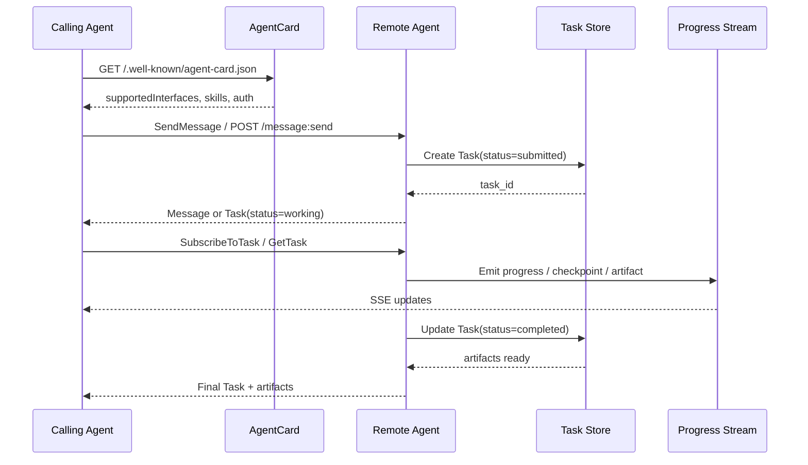
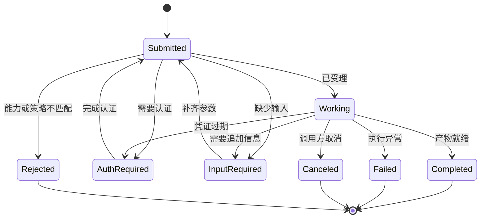

## 6.5 智能体间互操作协议

当一个系统里存在多个智能体（来自不同团队、不同系统、甚至不同组织）时，仅靠“把提示词写好”无法让它们稳定协作。你需要一类 **智能体间互操作协议**，把“发现、委派、回传、审计”做成可移植的接口。

### 6.5.1 为什么需要互操作协议

多智能体协作的常见挑战包括：

- **点对点集成爆炸**：每新增一个智能体，都要为既有智能体增加对接逻辑。
- **供应商/实现锁定**：更换智能体实现会牵连大量调用方。
- **通信不一致**：消息格式、任务状态与错误语义各说各话。
- **安全碎片化**：身份认证、授权与审计分散，治理困难。
- **不可发现**：上游智能体无法“自动找到”合适的下游能力。

互操作协议的目标是提供一个统一层，让智能体能够以一致方式：

1. 发现对方的能力
2. 提交任务并追踪状态
3. 在长任务中持续回传进度
4. 在安全边界内传递上下文并完成审计

### 6.5.2 两类协议：智能体互操作与工具连接

工程上常见两类“连接协议”，解决的问题不同：

| 维度 | 工具连接协议 | 智能体互操作协议 |
|------|--------------|------------------|
| **连接对象** | 智能体 ↔ 工具/数据源 | 智能体 ↔ 智能体 |
| **协议目的** | 让智能体获得外部能力 | 让智能体协作完成任务 |
| **交互粒度** | 原子操作与资源访问 | 任务级工作单元与状态机 |
| **核心抽象** | 资源、工具、提示模板 | 能力描述、任务、进度、审计 |
| **生命周期** | 请求-响应为主 | 可能跨秒/分钟/小时的任务流 |

### 6.5.3 协议能力结构

一个实用的智能体互操作协议通常包含以下组件。

#### 1. 能力描述

每个智能体需要发布一个“能力描述文档”，用于：

- 说明智能体身份与用途
- 列出可接受的任务类型
- 给出输入/输出结构（例如 JSON Schema）
- 声明认证方式与调用端点

示意如下：

```json
{
  "name": "HR Assistant",
  "description": "处理员工入职、离职、请假等事务",
  "capabilities": [
    {
      "name": "onboard_employee",
      "description": "处理新员工入职流程",
      "inputSchema": {"type": "object", "properties": {"employee_name": {"type": "string"}}},
      "outputSchema": {"type": "object", "properties": {"employee_id": {"type": "string"}}}
    }
  ],
  "authentication": {"type": "oauth2"},
  "endpoint": "<endpoint>"
}
```

#### 2. 任务模型与上下文透传

智能体之间的协作应该以“任务”为核心单元。为了避免信息在跨节点传递时丢失结构或丧失追踪能力，工程上强烈建议复用 [第 3.6 章](../03_memory/3.6_context_engineering.md) 介绍的 `ContextPack` 结构体来承载数据包，并确保 `trace_id` 全链路透传：

- `id`：任务唯一标识
- `type`：对应能力类型
- `status`：任务状态机（如 `queued` / `in_progress` / `done` / `failed` / `canceled`）
- `payload`：结构化的 `ContextPack` 数据包（包含 system, tools, memory, evidence 等上下文视图）
- `created_at` / `updated_at`：时间戳
- `trace_id`：**核心字段**，必须与 `ContextPack.trace_id` 绑定，串联起上游的规划节点与下游的执行日志。

示意如下：

```json
{
  "id": "task-12345",
  "type": "onboard_employee",
  "status": "in_progress",
  "created_at": "<timestamp>",
  "trace_id": "req-9876-abc",
  "payload": {
    "system": "处理入职逻辑的系统提示词...",
    "memory": [{"role": "user", "content": "张三入职"}],
    "evidence": ["policy_hr_v2_1"]
  }
}
```

#### 3. 进度回传

长任务需要支持“增量回传”，典型形态包括：

- 轮询：客户端按间隔拉取任务状态
- 流式：服务端推送进度事件（例如 Server-Sent Events 或 WebSocket）

关键是事件语义要稳定：`progress`、`checkpoint`、`error`、`final_output` 等。

#### 4. 安全与审计

互操作协议必须能表达：

- 调用方身份与租户归属
- 授权范围（能做什么、不能做什么）
- 审计事件（谁在何时触发了什么任务，传递了哪些上下文）

建议把“敏感上下文”与“可审计元数据”分离传递，避免把凭证或隐私信息直接塞进任务输入。

### 6.5.4 为什么不用自然语言做智能体间通信

这个问题在 [6.1](6.1_protocols.md) 已有详细讨论。核心结论：人类用户和智能体之间用自然语言，智能体和智能体之间应尽量用结构化协议——A2A 的价值就在于让多智能体协作从“会说话”升级到“能稳定集成”。

### 6.5.5 A2A 协议详解（v1.0）

多智能体系统快速增长后，各框架（LangGraph、CrewAI、AutoGen 等）之间一直缺乏统一的通信标准，智能体协作只能依赖框架内部机制或定制集成。**A2A（Agent2Agent）协议** 旨在解决异构智能体系统的互操作问题，让不同厂商、不同框架构建的智能体能够标准化地发现彼此、委派任务、回传结果。按照官方仓库的发布记录，`v1.0.0` 已在 **2026 年 3 月 10 日**发布；因此这里应以 v1.0 的字段、接口与 transport 口径介绍，而不是混用早期草案。

A2A 协议已于 2026 年初发布 **v1.0 生产级版本**，引入签名 Agent Card、多租户支持、多协议绑定（JSON-RPC + gRPC）等企业级特性，标志着从早期探索进入稳定阶段。协议已获得 150 余家组织参与，GitHub 星标超过 22,000，并在 Azure AI Foundry 和 Amazon Bedrock AgentCore 等平台上实现生产部署。具体兼容边界和演进节奏仍应以官方仓库与文档的最新说明为准。协议本身以开源形式发布，采用 Apache 2.0 许可证，2025 年 6 月由 Google 捐赠给 Linux Foundation 进行中立治理；2025 年 12 月 Linux Foundation 成立 Agentic AI Foundation（AAIF）后，A2A 与 MCP 一同转入 AAIF 旗下统一治理。

**设计哲学**：A2A 与 MCP 更适合被理解为互补关系。MCP 解决“智能体如何连接工具”，A2A 解决“智能体如何连接智能体”。两者都围绕标准化消息与结构化能力描述展开，在工程上可以组合使用。

A2A 协议的核心设计原则可以概括为：

1. **Agentic**：支持面向任务的多轮协作，而不是把智能体当作普通 API。
2. **基于已有标准**：优先复用 HTTP、JSON-RPC、SSE 等成熟机制，降低实现门槛。
3. **默认安全**：通过认证、授权与审计机制约束跨智能体调用。
4. **支持长任务**：既支持即时消息，也支持长任务的状态跟踪与流式回传。
5. **模态无关**：支持文本、文件与结构化数据等多种内容类型。

#### 6.5.5.1 核心概念

**AgentCard**：每个 A2A 智能体通常在 `/.well-known/agent-card.json` 发布一个 JSON 描述文件，相当于智能体的“名片”。在 v1.0 里，客户端不应再只读一个顶层 `url` 字段，而应从 `supportedInterfaces` 里选择匹配的绑定与 URL：

```json
{
  "name": "HR Assistant",
  "description": "处理员工入职、离职、请假等事务",
  "version": "1.0.0",
  "supportedInterfaces": [
    {
      "url": "https://hr-agent.example.com/a2a/v1/rpc",
      "protocolBinding": "JSONRPC",
      "protocolVersion": "1.0"
    },
    {
      "url": "https://hr-agent.example.com/a2a/v1",
      "protocolBinding": "HTTP+JSON",
      "protocolVersion": "1.0"
    }
  ],
  "capabilities": {
    "streaming": true,
    "pushNotifications": false,
    "extendedAgentCard": false
  },
  "defaultInputModes": ["text/plain"],
  "defaultOutputModes": ["text/plain"],
  "skills": [
    {
      "id": "onboard_employee",
      "name": "员工入职",
      "description": "处理新员工入职全流程",
      "tags": ["hr", "onboarding"]
    }
  ],
  "securitySchemes": {
    "oauth2": {
      "type": "oauth2"
    }
  }
}
```

v1.0 下最值得记住的 AgentCard 核心字段是：

- `supportedInterfaces`：按优先级声明可用接口；第一项是首选接口
- `capabilities`：声明是否支持 `streaming`、`pushNotifications`、`extendedAgentCard`
- `defaultInputModes` / `defaultOutputModes`：声明默认输入输出媒体类型
- `skills`：描述该 agent 擅长完成的任务

客户端通过读取 AgentCard 来**发现**远程智能体的能力，并且必须针对自己选中的 transport 使用对应的 URL，不能“读到一个 URL 后再手工拼另一套 path”。

**Task 生命周期**：A2A 以“任务”（Task）为核心交互单元。当前 v1 语义中，任务状态通常封装在 `Task.status.state` 这样的结构里，而不是一个简单字符串；状态集合也比早期草案更丰富：

```text
TASK_STATE_SUBMITTED → TASK_STATE_WORKING → TASK_STATE_COMPLETED
                                        → TASK_STATE_FAILED
                                        → TASK_STATE_CANCELED
                                        → TASK_STATE_REJECTED
                                        → TASK_STATE_AUTH_REQUIRED
                                        → TASK_STATE_INPUT_REQUIRED
```

每个 Task 通常包含：`id`（唯一标识）、`status`（其中包含 `state` 等状态信息）、`messages`（对话历史）、`artifacts`（结构化产出物）。

**Message 与 Artifact**：Message 是智能体之间的对话轮次（包含一个或多个 Part），Artifact 是任务的结构化产出物（如生成的报告、分析结果）。在 v1.0 的 JSON 表示里，`Part` 的写法也已经从早期草案里的嵌套 discriminator 收紧为更直接的结构，例如文本 part 会写成 `{"text": "..."}`，而不是旧示例里常见的 `textPart` 包装。

如果把这些概念投影到一次真实调用中，最关键的不是“发了一条消息”，而是“发现能力 → 创建任务 → 订阅进度 → 回收产物”这条完整链路。


```mermaid
sequenceDiagram
    participant CA as Calling Agent
    participant Card as AgentCard
    participant RA as Remote Agent
    participant TS as Task Store
    participant Stream as Progress Stream

    CA->>Card: GET /.well-known/agent-card.json
    Card-->>CA: supportedInterfaces, skills, auth
    CA->>RA: SendMessage / POST /message:send
    RA->>TS: Create Task(status=submitted)
    TS-->>RA: task_id
    RA-->>CA: Message or Task(status=working)
    CA->>RA: SubscribeToTask / GetTask
    RA->>Stream: Emit progress / checkpoint / artifact
    Stream-->>CA: SSE updates
    RA->>TS: Update Task(status=completed)
    TS-->>RA: artifacts ready
    RA-->>CA: Final Task + artifacts
```

图 6-4：A2A 协议中的任务委派与回传时序

对应到状态演进，A2A 的 Task 不是一个简单的“成功/失败”二元结果，而是一个可被认证、补参、取消和拒绝的显式状态机。


```mermaid
stateDiagram-v2
    [*] --> Submitted
    Submitted --> Working: 已受理
    Submitted --> Rejected: 能力或策略不匹配
    Submitted --> AuthRequired: 需要认证
    Submitted --> InputRequired: 缺少输入
    AuthRequired --> Submitted: 完成认证
    InputRequired --> Submitted: 补齐参数
    Working --> Completed: 产物就绪
    Working --> Failed: 执行异常
    Working --> Canceled: 调用方取消
    Working --> AuthRequired: 凭证过期
    Working --> InputRequired: 需要追加信息
    Completed --> [*]
    Failed --> [*]
    Canceled --> [*]
    Rejected --> [*]
```

图 6-5：A2A Task 生命周期状态机

#### 6.5.5.2 交互流程

典型的 A2A 调用流程：

```text
1. 客户端读取 /.well-known/agent-card.json → 获取 AgentCard
2. 客户端解析 `supportedInterfaces`         → 选择 JSONRPC / GRPC / HTTP+JSON 之一
3. 客户端按所选 binding 调用核心接口       → 例如 JSON-RPC `SendMessage`
4. 服务端返回 Message 或 Task              → 根据任务复杂度决定直接回复或进入异步任务
5. 客户端调用 `GetTask` / `SubscribeToTask`
   或 REST `/tasks/{id}` / `/tasks/{id}:subscribe`
   → 轮询或流式接收进度
6. 服务端返回 Task {status: {state: "TASK_STATE_COMPLETED"}, artifacts: [...]}
```

v1.0 的 transport 口径需要分开看：

- **JSON-RPC binding**：`JSON-RPC 2.0 over HTTP(S)`，方法名采用 `SendMessage`、`GetTask` 这类 PascalCase；流式更新使用 `SSE`
- **HTTP+JSON/REST binding**：标准 endpoint 是 `POST /message:send`、`POST /message:stream`、`GET /tasks/{id}`、`POST /tasks/{id}:cancel`、`POST /tasks/{id}:subscribe`
- **gRPC binding**：使用对应的 gRPC service / RPC 定义

下面表格保留“概念操作”，并给出常见映射：

| 方法 | 说明 |
|------|------|
| `SendMessage` / `POST /message:send` | 提交消息并触发智能体处理 |
| `SendStreamingMessage` / `POST /message:stream` | 以 SSE 流式接收处理过程 |
| `GetTask` / `GET /tasks/{id}` | 查询任务状态与结果 |
| `CancelTask` / `POST /tasks/{id}:cancel` | 取消进行中的任务 |
| `SubscribeToTask` / `POST /tasks/{id}:subscribe` | 订阅长任务更新 |
| `CreateTaskPushNotificationConfig` | 配置异步推送（前提是 `capabilities.pushNotifications=true`） |

#### 6.5.5.3 代码示例

发送一个 A2A 任务请求：

```python
import httpx

async def send_a2a_task(agent_url: str, message: str) -> dict:
    """向远程智能体发送 A2A 消息"""
    payload = {
        "jsonrpc": "2.0",
        "id": "req-001",
        "method": "SendMessage",
        "params": {
            "message": {
                "role": "ROLE_USER",
                "parts": [{"text": message}],
                "messageId": "msg-12345"
            }
        }
    }
    async with httpx.AsyncClient() as client:
        resp = await client.post(
            agent_url,
            json=payload,
            headers={"A2A-Version": "1.0"}
        )
        return resp.json()

# 使用：先读取 AgentCard，再选择与 URL 配套的接口
card = httpx.get("https://hr-agent.example.com/.well-known/agent-card.json").json()
jsonrpc_interface = next(
    iface for iface in card["supportedInterfaces"]
    if iface["protocolBinding"] == "JSONRPC"
)
result = await send_a2a_task(
    jsonrpc_interface["url"],
    "为张三办理入职，工号 EMP-2026-001"
)
# result["result"]["task"]["status"]["state"] → "TASK_STATE_COMPLETED" / "TASK_STATE_WORKING" / ...
```

### 6.5.6 A2A 与 MCP 的关系

两者是 **互补而非竞争** 的关系：

| 维度 | MCP | A2A |
|------|-----|-----|
| **连接对象** | 智能体 ↔ 工具/数据源 | 智能体 ↔ 智能体 |
| **协议基础** | JSON-RPC 2.0（stdio / Streamable HTTP） | 可映射到 JSON-RPC、gRPC、HTTP+JSON/REST |
| **核心抽象** | Resources, Tools, Prompts | AgentCard, Task, Artifact |
| **生命周期** | 单次请求-响应 | 可跨分钟/小时的任务流 |
| **发现机制** | 客户端配置 Server 列表 | `/.well-known/agent-card.json` + `supportedInterfaces` |
| **安全焦点** | 路径白名单、最小权限 | OAuth2、跨组织信任 |
| **生态成熟度(2026)** | 广泛采用 | v1.0 生产级，150+ 组织参与 |

**协同模式**：在实际系统中，一个远程智能体通过 A2A 接收任务，内部通过 MCP 调用工具和数据源。两类协议在 `trace_id` 上应保持对齐，确保跨节点可观测性。

**选择建议**：

```text
┌─ 需要多个独立 Agent 跨组织协作？ → A2A
├─ 需要为 LLM 接入工具和数据？     → MCP
├─ 分布式多服务器部署？             → A2A
├─ 单机内集成外部能力？             → MCP
└─ 企业级完整方案？                 → 两者结合
```

### 6.5.7 跨框架互操作最佳实践

#### 6.5.7.1 跨框架迁移

从一个框架迁移到另一个框架时，关键是抽取核心业务逻辑，适配到新框架。核心步骤：定义标准化状态 → 创建节点复用原逻辑 → 构建图 → 统一工具定义为 MCP 标准。

#### 6.5.7.2 协议互操作适配层

当使用不同协议的系统需要互通时，适配器模式可以在 A2A 与 MCP 之间转换。两者都基于 JSON-RPC 2.0，转换主要是字段映射：

```python
class ProtocolAdapter:
    """A2A Message ↔ MCP Tool Call 适配器"""
    @staticmethod
    def a2a_message_to_mcp_call(message: dict) -> dict:
        """将 A2A SendMessage 请求转为 MCP tools/call"""
        text_part = message["params"]["message"]["parts"][0]["text"]
        # 真实实现应依据 AgentCard / skills 解析出具体的 MCP 工具名
        return {
            "jsonrpc": "2.0",
            "id": message["id"],
            "method": "tools/call",
            "params": {"name": "target_tool_name", "arguments": {"input": text_part}}
        }

    @staticmethod
    def mcp_result_to_a2a_artifact(mcp_resp: dict) -> dict:
        """将 MCP 响应转为 A2A Artifact"""
        return {
            "type": "text",
            "text": mcp_resp.get("result", {}).get("content", [{}])[0].get("text", "")
        }
```

### 6.5.8 展望：去中心化智能体发现网络

现有的智能体集成高度依赖硬编码和定制化的联邦模式，无法支撑未来由数以十亿计的智能体构成的动态交互网络。业界正在探索类似“智能体 DNS”的去中心化注册表与协议栈。

**三层架构设想**：

1. **身份层**：采用 W3C 去中心化标识符（DID）标准，为每个智能体提供端到端加密通信、持久的身份证明与行为归因。不同于传统的中央化身份管理，DID 允许智能体维护自主可控的身份证书。

2. **元协议层**：允许智能体就如何通信进行协商——例如动态选择 MCP、A2A 或 GraphQL 协议。这一层的核心价值是“协议适配器的自动发现与协商”，使得具有不同通信偏好的智能体仍然能够互操作。

3. **应用协议层**：智能体以机器可读格式在公认的 HTTPS 位置发布核心能力、服务端点、信任假设和约束条件。这类似于网页的 robots.txt，但针对智能体网络的能力广告。

**运行机制**：基于 Gossip 协议的点对点信息传播使得智能体网络中的每个节点可以在设定间隔内随机交换已知节点列表，实现无需中央服务器的节点发现与能力匹配。

**制度创新**：除了技术层面的连接，还需要构建“数字制度”（Digital Institutions）来规范智能体之间的经济行为——包括注册机制、行为记录保存、基于加密签名的纠纷解决框架。这为跨组织、甚至跨信任边界的智能体协作创造了法律与技术基础。

这些协议与制度的成熟，将使智能体从“被编排的执行单元”进化为真正的“自治网络参与者”。

---

**下一节**: [本章小结](summary.md)
