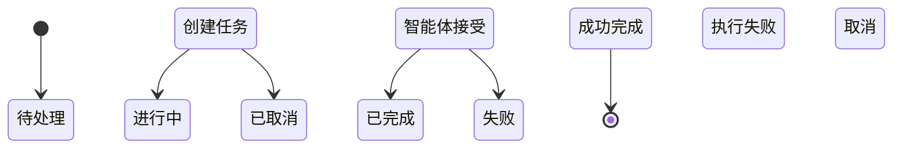

## 6.5 A2A：智能体-智能体协议

如果说 MCP 是智能体与工具/数据源的"USB 接口"，那么 **智能体对智能体协议（Agent-to-Agent Protocol, A2A）** 就是智能体与智能体之间的"互联网协议"。这两个标准共同构成了 Agentic AI 时代的基础设施层。

> [!IMPORTANT]
> **里程碑**：2025年4月，Google 联合 50+ 技术合作伙伴（包括 Atlassian、Salesforce、SAP、LangChain 等）发布 A2A 协议。同年 12 月，A2A 与 MCP 一起捐赠给 Linux Foundation 的 Agentic AI Foundation (AAIF)。

### 6.5.1 为什么需要 A2A

#### 多智能体协作的挑战

随着智能体系统的成熟，企业开始部署来自不同厂商的多个智能体：

```
企业 AI 部署现状：
├── HR 智能体 (来自 Workday)
├── Sales 智能体 (来自 Salesforce)  
├── IT Support 智能体 (来自 ServiceNow)
├── Finance 智能体 (来自 SAP)
└── 自研智能体 (内部开发)

问题：这些智能体如何互相协作？
```

**没有 A2A 的世界**：
- 每对智能体需要定制集成
- N 个智能体需要 N(N-1)/2 个集成接口
- 供应商锁定严重
- 跨平台协作几乎不可能

### 6.5.2 A2A 协议概览

A2A 定义了一套开放标准，让任何符合协议的智能体可以：
1. **发现**：找到能够帮助完成任务的其他智能体
2. **通信**：以标准化方式交换消息
3. **协作**：委托任务、共享上下文、协调行动

#### A2A vs MCP

| 维度 | MCP | A2A |
|------|-----|-----|
| 连接对象 | 智能体 ↔ 工具/数据 | 智能体 ↔ 智能体 |
| 协议目的 | 获取能力 | 协作完成任务 |
| 交互模式 | 客户端-服务器 | 对等通信 |
| 核心概念 | 资源 (Resources), 工具 (Tools), 提示词 (Prompts) | 智能体名片 (Agent Cards), 任务 (Tasks) |
| 典型场景 | 查询数据库、调用 API | 跨部门/跨平台协作 |

### 6.5.3 核心概念

#### Agent Card（智能体名片）

每个符合 A2A 协议的智能体必须发布一个 **智能体名片（Agent Card）**——描述自己身份和能力的 JSON 文档。

```json
{
  "name": "HR Assistant",
  "description": "处理员工入职、离职、请假等人力资源事务",
  "capabilities": [
    {
      "name": "onboard_employee",
      "description": "处理新员工入职流程"
    }
  ],
  "endpoint": "https://api.workday.com/a2a/v1"
}
```

#### Task（任务）

A2A 中的通信以 **任务（Task）** 为核心单元。它包含了任务 ID、描述、发起方、执行方以及输入输出数据。

#### Task 生命周期



### 6.5.4 协议实现与生态

A2A 构建于 HTTP/HTTPS, JSON-RPC 2.0, SSE 和 OAuth 2.0 等成熟 Web 标准之上。

Google 推出的 A2A 扩展协议还包括：
- **A2UI (Agent-to-UI)**：智能体如何动态生成用户界面
- **AP2 (Agent Payments Protocol)**：智能体代理支付的标准

### 6.5.5 小结

A2A 协议代表了多智能体系统互操作性的重大突破：

1. **开放标准**：由 Linux Foundation AAIF 治理
2. **能力发现**：Agent Card 让智能体自描述能力
3. **任务导向**：完整的 Task 生命周期管理
4. **企业就绪**：安全、可控

> [!TIP]
> **相关资源**：
> - A2A 官方规范：https://github.com/google/a2a-protocol
> - AAIF 官网：https://aaif.io

---

**下一节**: [本章小结](summary.md)
