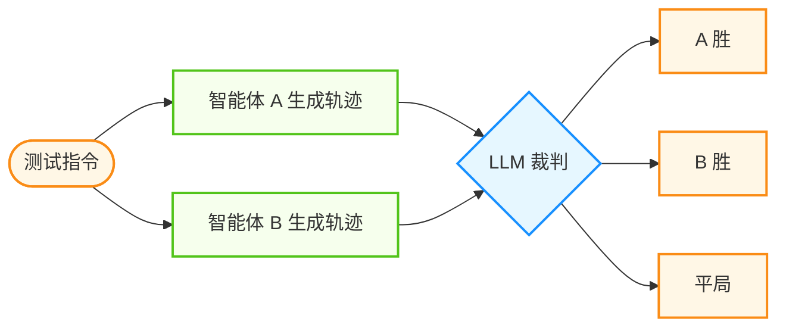

## 7.2 评估体系：AgentBench 与基准测试

在传统的 NLP 任务中，拥有 BLEU、ROUGE 甚至 Accuracy 这样清晰的指标。但在智能体领域，评估（Evaluation）变得异常困难：怎么判断一个智能体 "做对了"？怎么量化它的"智能"？

本节将深入探讨智能体评估的独特挑战，介绍构建立体评估体系的方法，并解析目前主流的基准测试框架。

### 7.2.1 评估核心术语

在构建智能体评估体系时，首先需要统一术语定义：

| 术语 | 英文 | 定义 |
|------|------|------|
| **任务** | Task / Test Case | 一个单独的测试，包含定义的输入和成功标准 |
| **试验** | Trial | 对任务的一次尝试。由于模型输出在运行之间会变化，需要运行多次试验以产生更一致的结果 |
| **评估器** | Grader | 对智能体性能某方面进行评分的逻辑。一个任务可以有多个评估器 |
| **轨迹** | Transcript / Trace | 一次试验的完整记录，包括输出、工具调用、推理、中间结果等 |
| **结果** | Outcome | 试验结束时环境中的最终状态（例如：数据库中是否存在预订记录） |
| **评估框架** | Evaluation Harness | 端到端运行评估的基础设施 |
| **评估套件** | Evaluation Suite | 为测量特定能力或行为而设计的任务集合 |

#### 智能体评估的独特挑战

##### 解法的非唯一性

要达成"订一张去上海的票"这个目标，智能体可以先查航班再订票，也可以先查高铁，甚至可以发邮件给秘书。路径千变万化，无法用标准答案进行字符串匹配。

##### 环境副作用

智能体的操作会改变世界状态。
- **测试前**：数据库里没有订单。
- **测试后**：数据库里多了一条订单。
评估必须在一个隔离的 **沙箱环境**中进行，并且支持**状态重置**。

##### 多维度权衡

单个指标无法概括智能体的表现：
- **成功率**：任务完成了吗？
- **效率**：用了多少步？花了多少 Token？耗时多久？
- **安全性**：有没有泄露隐私？有没有误删文件？
- **鲁棒性**：Prompt 稍微变一点，还能完成吗？

#### 评估方法论体系

建立一整套评估体系，通常包含三种类型的评估器和三个测试层次。

**三类评估器对比**：

| 类型 | 方法 | 优势 | 劣势 |
|------|------|------|------|
| **代码评估器** | 字符串匹配、单元测试、静态分析、状态验证、工具调用检查 | 快速、低成本、客观、可复现、易调试 | 对有效变体过于脆弱、缺乏细微差别判断能力 |
| **模型评估器** | 基于量规评分、自然语言断言、成对比较、参考答案评估 | 灵活、可扩展、捕捉细微差别、处理开放式任务 | 非确定性、比代码评估更昂贵、需要与人工校准 |
| **人工评估器** | SME 审查、众包判断、抽样检查、A/B 测试 | 黄金标准质量、匹配专家用户判断、校准模型评估器 | 昂贵、缓慢、需要大规模获取人类专家 |

**三个测试层次**：

### 7.2.2 第一层级：单元测试

针对特定工具或子任务的确定性测试。

- **适用对象**：工具选择、函数调用格式。
- **方法**：
  - 给定输入："查询北京天气"。
  - 断言输出：必须包含 `get_weather(city='Beijing')` 调用。
- **工具**：`pytest`, `unittest`。

```python
def test_calculator_tool():
    agent = Agent(tools=[Calculator()])
    response = agent.run("23 * 4等于多少？")
    
    # 检查是否正确调用了工具

    assert "calculator" in agent.trace.tool_calls
    # 检查最终结果

    assert "92" in response.text
```

### 7.2.3 第二层级：轨迹评估

评估智能体解决问题的过程质量。这通常需要 **大模型即裁判**。

- **方法**：记录智能体的完整执行轨迹，喂给评审模型（LLM-as-Judge）进行打分。
- **维度**：
  - **逻辑性**：推理步骤是否连贯？
  - **幻觉**：是否编造了不存在的参数？
  - **冗余**：有没有重复调用同一个工具？

```python
EVAL_PROMPT = """
请评估以下智能体执行轨迹的质量：

任务：{task}
轨迹：
{trajectory}

请从以下维度打分 (1-5)：
1. 目标达成度
2. 工具使用效率
3. 推理逻辑性
"""
```

#### 进阶模式：LLM-as-Judge 最佳实践

单纯的让 LLM 打分容易产生偏差（Bias），以下是三种更稳健的评估模式：

**1. 直接评分法 (Direct Scoring)**使用带有权重和详细标准的**量规**，而非模糊的 "1-5 分"。
*   *关键点*：明确定义每个分数的含义（例如：3分=完成任务但有冗余，4分=完成任务且高效）。

**2. 成对比较法**
类似于 RLHF 中的 Reward Model 训练，让 LLM 对比两个不同的轨迹 A 和 B，选出更好的一个。
*   *优势*：避免了绝对分数的方差，人类/模型在做"二选一"时往往比"打分"更准确。
*   *注意*：需要交换位置（A 与 B、B 与 A）运行两次以消除 **位置偏差**。

**3. 自动化量规生成**
在特定垂直领域，手写评估标准很累。可以让更强的评审模型先阅读标准操作程序（SOP），再生成该领域的评估标准。



图 7-1：成对比较法评估流程


### 7.2.4 第三层级：端到端基准测试

在真实或模拟环境中运行完整任务。

- **成功判定**：通过检查环境状态变化来判定。
- **例如**：任务是"在当前目录下创建一个名为 test.txt 的文件"。评估脚本运行后检查 `os.path.exists('test.txt')` 是否为 True。

### 7.2.5 主流基准测试框架

#### AgentBench：清华大学

[AgentBench](https://github.com/THUDM/AgentBench) 是目前最全面的综合评估框架之一，涵盖 8 个核心能力维度：

| 环境 | 描述 | 测试能力 |
|------|------|----------|
| **OS World** | 真实的 Linux Bash 环境 | 操作系统指令、文件管理 |
| **Database** | SQL 数据库交互 | 数据库查询与操作 |
| **Knowledge Graph** | 知识图谱游走 | 复杂知识推理 |
| **AlfWorld** | 虚拟家居环境 | 具身智能、规划 |
| **WebShop** | 模拟电商网站 | 网页浏览、决策 |
| **Card Game**| 数字卡牌游戏 | 博弈论、对抗策略 |

**特点**：全方位、跨领域，不仅测对话，更测行动。

#### GAIA

GAIA 是一个以复杂现实任务为导向的基准测试集合，其特点是 **问题极其困难**且**贴近真实生活**。

- **问题示例**：
  > "请找到这篇 PDF 论文中提到的所有数据集，并对比它们在某一时间段内的引用量变化趋势，最后生成一张折线图。"
  
- **难度**：这需要智能体结合 PDF 读取、Web 搜索、数据提取、Python 代码编写和图表绘制多种能力。
- **现状**：这类基准通常通过率较低、区分度较高，能更好地拉开不同系统的差距。

#### SWE-bench：软件工程

专注于编程和软件工程能力的评估。

- **数据源**：从真实的 GitHub 开源项目中收集的 Issue 和 Pull Request。
- **任务**：给定一个庞大的代码库和一个 Bug 描述，智能体需要：
  1. 定位 Bug 代码。
  2. 编写复现 Bug 的测试用例。
  3. 修改代码修复 Bug。
  4. 确保通过所有测试。
- **意义**：这是目前编程智能体领域的"黄金标准"。

#### WebArena：网页浏览

专门评估智能体操控浏览器的能力。

- **环境**：完全模拟的电商、论坛、代码托管网站。
- **任务**："在这个网站上买最便宜的红色雨伞，并寄到这个地址..."
- **评估**：检查最终的页面状态和数据库记录。

#### Terminal-Bench：Linux 终端

专注于评估智能体在 Linux 命令行环境下的任务执行能力。
- **任务**：文件操作、系统管理、网络配置等。
- **意义**：评估智能体作为系统管理员或 DevOps 的潜力。

#### Tau-Bench：对话交互

专注于评估 Conversational Agent 的多轮对话与工具使用能力。
- **特点**：模拟真实用户（User persona）与智能体进行多轮交互，测试智能体是否能在保持对话连贯的同时完成复杂任务（如改签机票、处理退款）。

#### 失败轨迹数据集（思路）

除了“成功/失败”的结果标签，很多团队会维护“失败轨迹库”：记录失败发生的上下文、失败类型、以及复现步骤。

其价值在于：

1. **定向优化**：识别系统中最频繁的失败模式
2. **对比分析**：比较不同架构在相同任务上的失败分布
3. **验证改进**：量化验证修复措施是否真的减少了某类失败

#### 评估与模型选型指南

在为你的智能体系统选择基座模型 (Base Model) 时，不要只看 MMLU 分数（那个主要是测做题能力的）。

**选型建议**：

1. **Coding 任务**：优先关注贴近真实软件工程流程的评测（代码库级修复、测试通过）。
2. **工具调用**：关注结构化调用成功率、参数正确性与错误恢复能力。
3. **长上下文**：关注长文档定位、跨段引用与信息保持能力的评测。

### 7.2.6 进阶评估策略

随着智能体应用的深入，仅靠简单的通过率已经无法满足需求。需要更精细的指标和更立体的防御体系。

#### 瑞士奶酪模型

在安全工程中，没有单一的防御层是完美的。Agent 评估也是如此，需要建立多层防御体系，让一层漏掉的缺陷被下一层捕捉。

- **Layer 1: 自动化评估**
  - **特点**：快速、低成本、高频运行（每次 Commit）。
  - **内容**：单元测试、基于 LLM 的评分（Promptfoo 等工具）。
  - **作用**：即使没有真实用户，也能大规模测试基准任务，建立信心。

- **Layer 2: 生产环境监控**
  - **特点**：真实世界的 Ground Truth。
  - **内容**：监控错误率、延迟、用户投诉、Token 消耗。
  - **作用**：发现自动化测试覆盖不到的 "长尾问题" 和 "分布漂移"。

- **Layer 3: A/B 测试**
  - **特点**：统计学显著性。
  - **内容**：对比新旧版本的转化率、任务完成率。
  - **作用**：在全面上线前验证改动的实际业务价值。

- **Layer 4: 人工审查**
  - **特点**：慢、贵，但是黄金标准。
  - **作用**：定期抽样阅读轨迹日志，通过人工直觉发现隐蔽的质量问题，并用于校准自动化评估的 LLM 裁判。

#### 非确定性与概率性指标

智能体的行为本质上是非确定性的。同一个任务跑两次，结果可能不同。因此，需要概率性指标：

- **pass@k**: 在 k 次尝试中，**至少有一次** 成功的概率。
  - **适用场景**：创意生成、代码生成（只要生成一个能跑的方案就行）。
  - *意义*：衡量智能体的"上限"潜力。

- **pass^k**: 在 k 次尝试中，**每一次都** 成功的概率。
  - **计算**：如果单次成功率是 p，k 次全对的概率约等于 $p^k$。
  - **适用场景**：面向客户的客服、金融操作（必须极其稳定，不能时好时坏）。
  - *意义*：衡量智能体的"下限"可靠性。

#### 能力评估与回归评估

- **能力评估**：针对智能体目前还做不到或勉强能做到的难题，用来"爬坡"。通过率通常较低。
- **回归评估**：针对智能体已经掌握的技能，用来"守底"。通过率应尽可能高，并对关键能力设置告警阈值。防止新模型或新提示词导致原有能力退化。

### 7.2.7 小结

评估是智能体开发中最容易被忽视，但最重要的环节。"如果你无法度量它，你就无法改进它。"

构建一个可靠的智能体系统，你需要：

1. **CI/CD 中的单元测试**：保证工具调用的基本逻辑不坏。
2. **定期的 LLM 评分**：监控推理质量的变化。
3. **引入公开 Benchmark**：明确你的智能体在行业中的水平。

下一节将探讨如何通过轨迹分析来提升智能体的可解释性。

---

**下一节**: [7.3 轨迹分析与行为可解释性](7.3_tracing.md)
