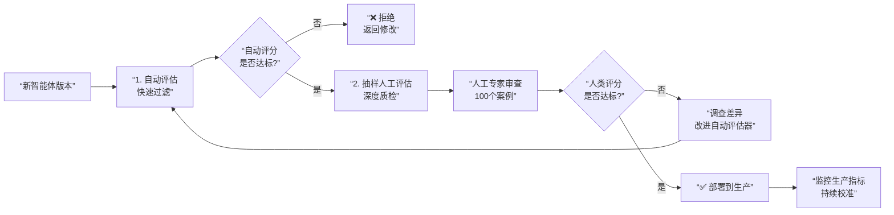

## 7.2 评估体系：AgentBench 与基准测试

在传统的 NLP 任务中，拥有 BLEU、ROUGE 甚至 Accuracy 这样清晰的指标。但在智能体领域，评估（Evaluation）变得异常困难：怎么判断一个智能体 “做对了”？怎么量化它的“智能”？

本节将深入探讨智能体评估的独特挑战，介绍构建立体评估体系的方法，并解析目前主流的基准测试框架。

### 7.2.1 评估核心术语

在构建智能体评估体系时，首先需要统一术语定义：

| 术语 | 英文 | 定义 |
|------|------|------|
| **任务** | Task / Test Case | 一个单独的测试，包含定义的输入和成功标准 |
| **试验** | Trial | 对任务的一次尝试。由于模型输出在运行之间会变化，需要运行多次试验以产生更一致的结果 |
| **评估器** | Grader | 对智能体性能某方面进行评分的逻辑。一个任务可以有多个评估器 |
| **轨迹** | Transcript / Trace | 一次试验的完整记录，包括输出、工具调用、推理、中间结果等 |
| **结果** | Outcome | 试验结束时环境中的最终状态（例如：数据库中是否存在预订记录） |
| **评估框架** | Evaluation Harness | 端到端运行评估的基础设施 |
| **评估套件** | Evaluation Suite | 为测量特定能力或行为而设计的任务集合 |

#### 智能体评估的独特挑战

##### 解法的非唯一性

要达成“订一张去上海的票”这个目标，智能体可以先查航班再订票，也可以先查高铁，甚至可以发邮件给秘书。路径千变万化，无法用标准答案进行字符串匹配。

##### 环境副作用

智能体的操作会改变世界状态。
- **测试前**：数据库里没有订单。
- **测试后**：数据库里多了一条订单。
评估必须在一个隔离的 **沙箱环境** 中进行，并且支持 **状态重置**。

##### 多维度权衡

单个指标无法概括智能体的表现：
- **成功率**：任务完成了吗？
- **效率**：用了多少步？花了多少 Token？耗时多久？
- **安全性**：有没有泄露隐私？有没有误删文件？
- **鲁棒性**：Prompt 稍微变一点，还能完成吗？

#### 评估方法论体系

建立一整套评估体系，通常包含三种类型的评估器和三个测试层次。

**三类评估器对比**：

| 类型 | 方法 | 优势 | 劣势 |
|------|------|------|------|
| **代码评估器** | 字符串匹配、单元测试、静态分析、状态验证、工具调用检查 | 快速、低成本、客观、可复现、易调试 | 对有效变体过于脆弱、缺乏细微差别判断能力 |
| **模型评估器** | 基于量规评分、自然语言断言、成对比较、参考答案评估 | 灵活、可扩展、捕捉细微差别、处理开放式任务 | 非确定性、比代码评估更昂贵、需要与人工校准 |
| **人工评估器** | SME 审查、众包判断、抽样检查、A/B 测试 | 黄金标准质量、匹配专家用户判断、校准模型评估器 | 昂贵、缓慢、需要大规模获取人类专家 |

**三个测试层次**：

### 7.2.2 第一层级：单元测试

针对特定工具或子任务的确定性测试。

- **适用对象**：工具选择、函数调用格式。
- **方法**：
  - 给定输入：“查询北京天气”。
  - 断言输出：必须包含 `get_weather(city='Beijing')` 调用。
- **工具**：`pytest`, `unittest`。

```python
def test_calculator_tool():
    agent = Agent(tools=[Calculator()])
    response = agent.run("23 * 4等于多少？")
    
    # 检查是否正确调用了工具

    assert "calculator" in agent.trace.tool_calls
    # 检查最终结果

    assert "92" in response.text
```

### 7.2.3 第二层级：轨迹评估

评估智能体解决问题的过程质量。这通常需要 **大模型即裁判**。

- **方法**：记录智能体的完整执行轨迹，喂给评审模型（LLM-as-Judge）进行打分。
- **维度**：
  - **逻辑性**：推理步骤是否连贯？
  - **幻觉**：是否编造了不存在的参数？
  - **冗余**：有没有重复调用同一个工具？

```python
EVAL_PROMPT = """
请评估以下智能体执行轨迹的质量：

任务：{task}
轨迹：
{trajectory}

请从以下维度打分 (1-5)：
1. 目标达成度
2. 工具使用效率
3. 推理逻辑性
"""
```

#### 基础模式：规则与一致性检查

在引入评审模型之前，可以先用更便宜、更可控的规则做“硬性门禁”，用于捕获明显错误并降低评审成本：

- **结构校验**：输出是否符合约定格式（JSON Schema、字段必填等）。
- **权限与工具白名单**：是否调用了允许的工具，参数是否通过校验。
- **重复与超时**：是否出现重复调用、无进展循环或超过步数阈值。

#### 进阶模式：LLM-as-Judge 最佳实践

单纯的让 LLM 打分容易产生偏差（Bias），以下是三种更稳健的评估模式：

**1. 直接评分法 (Direct Scoring)** 使用带有权重和详细标准的 **量规**，而非模糊的 “1-5 分”。
*   *关键点*：明确定义每个分数的含义（例如：3分=完成任务但有冗余，4分=完成任务且高效）。

**2. 成对比较法**
类似于 RLHF 中的 Reward Model 训练，让 LLM 对比两个不同的轨迹 A 和 B，选出更好的一个。
*   *优势*：避免了绝对分数的方差，人类/模型在做“二选一”时往往比“打分”更准确。
*   *注意*：需要交换位置（A 与 B、B 与 A）运行两次以消除 **位置偏差**。

**3. 自动化量规生成**
在特定垂直领域，手写评估标准很累。可以让更强的评审模型先阅读标准操作程序（SOP），再生成该领域的评估标准。


```mermaid
graph LR
    %% Agentic Design System
    classDef user fill:#fff7e6,stroke:#fa8c16,stroke-width:2px;
    classDef agent fill:#e6f7ff,stroke:#1890ff,stroke-width:2px;
    classDef tool fill:#f6ffed,stroke:#52c41a,stroke-width:2px;

    Input([测试指令]) --> GenA[智能体 A 生成轨迹]
    Input --> GenB[智能体 B 生成轨迹]
    GenA & GenB --> Judge{LLM 裁判}
    Judge --> WinA[A 胜]
    Judge --> WinB[B 胜]
    Judge --> Tie[平局]
    
    class Input user;
    class GenA,GenB tool;
    class Judge agent;
    class WinA,WinB,Tie user;
```

图 7-1：成对比较法评估流程

**4. 裁判校准与盲区警告 (Judge Calibration Warnings)**

使用 LLM-as-Judge 必须时刻警惕其固有的盲区与偏见。在投入生产前，所有的评测 LLM 必须经过 **人类基准校准 (Human Baseline Calibration)**：
- **自我偏好与长度偏见 (Self-enhancement Bias)**：模型往往倾向于给“长篇大论”或“自己生成的语风”毫无理由地打高分。
- **校准指标**：定期抽取 50-100 个判定案例交由领域专家 (SME) 盲审打分。计算 LLM 裁判与人类专家的一致性（如 Cohen's Kappa 系数）。如果一致性过低（例如 $< 0.8$），则说明裁判的 Prompt 规则存在歧义，或模型本身逻辑能力不足，必须调整量规细节或更换更强大的裁判模型。

**校准失败时的应对策略**：

| Cohen's Kappa (κ) | 评估等级 | 对应行动 |
|---------|---------|---------|
| κ < 0.4 | 差 | 评估提示词可能存在歧义，需重新设计评分标准和示例 |
| 0.4 ≤ κ < 0.6 | 一般 | 增加 Few-shot 示例数量，细化评分维度的定义 |
| 0.6 ≤ κ < 0.8 | 良好 | 可投入使用，但应定期抽样人工复核 |
| κ ≥ 0.8 | 优秀 | 可信赖地用于自动化评估 |


### 7.2.4 第三层级：端到端基准测试

在真实或模拟环境中运行完整任务。

- **成功判定**：通过检查环境状态变化来判定。
- **例如**：任务是“在当前目录下创建一个名为 test.txt 的文件”。评估脚本运行后检查 `os.path.exists('test.txt')` 是否为 True。

### 7.2.5 主流基准测试框架

#### AgentBench：清华大学

[AgentBench](https://github.com/THUDM/AgentBench) 是目前最全面的综合评估框架之一，涵盖 8 个核心能力维度：

| 环境 | 描述 | 测试能力 |
|------|------|----------|
| **OS World** | 真实的 Linux Bash 环境 | 操作系统指令、文件管理 |
| **Database** | SQL 数据库交互 | 数据库查询与操作 |
| **Knowledge Graph** | 知识图谱游走 | 复杂知识推理 |
| **AlfWorld** | 虚拟家居环境 | 具身智能、规划 |
| **WebShop** | 模拟电商网站 | 网页浏览、决策 |
| **Card Game** | 数字卡牌游戏 | 博弈论、对抗策略 |

**特点**：全方位、跨领域，不仅测对话，更测行动。

#### GAIA

GAIA 是一个以复杂现实任务为导向的基准测试集合，其特点是 **问题极其困难** 且 **贴近真实生活**。

- **问题示例**：
  > “请找到这篇 PDF 论文中提到的所有数据集，并对比它们在某一时间段内的引用量变化趋势，最后生成一张折线图。”
  
- **难度**：这需要智能体结合 PDF 读取、Web 搜索、数据提取、Python 代码编写和图表绘制多种能力。
- **现状**：这类基准通常通过率较低、区分度较高，能更好地拉开不同系统的差距。

#### SWE-bench：软件工程

专注于编程和软件工程能力的评估。

- **数据源**：从真实的 GitHub 开源项目中收集的 Issue 和 Pull Request。
- **任务**：给定一个庞大的代码库和一个 Bug 描述，智能体需要：
  1. 定位 Bug 代码。
  2. 编写复现 Bug 的测试用例。
  3. 修改代码修复 Bug。
  4. 确保通过所有测试。
- **意义**：这是目前编程智能体领域的“黄金标准”。

#### WebArena：网页浏览

专门评估智能体操控浏览器的能力。

- **环境**：完全模拟的电商、论坛、代码托管网站。
- **任务**：“在这个网站上买最便宜的红色雨伞，并寄到这个地址...”
- **评估**：检查最终的页面状态和数据库记录。

#### Terminal-Bench：Linux 终端

专注于评估智能体在 Linux 命令行环境下的任务执行能力。
- **任务**：文件操作、系统管理、网络配置等。
- **意义**：评估智能体作为系统管理员或 DevOps 的潜力。

#### Tau-Bench：对话交互

专注于评估 Conversational Agent 的多轮对话与工具使用能力。
- **特点**：模拟真实用户（User persona）与智能体进行多轮交互，测试智能体是否能在保持对话连贯的同时完成复杂任务（如改签机票、处理退款）。

#### 失败轨迹数据集（思路）

除了“成功/失败”的结果标签，很多团队会维护“失败轨迹库”：记录失败发生的上下文、失败类型、以及复现步骤。

其价值在于：

1. **定向优化**：识别系统中最频繁的失败模式
2. **对比分析**：比较不同架构在相同任务上的失败分布
3. **验证改进**：量化验证修复措施是否真的减少了某类失败

#### 评估与模型选型指南

在为你的智能体系统选择基座模型 (Base Model) 时，不要只看 MMLU 分数（那个主要是测做题能力的）。

**选型建议**：

1. **Coding 任务**：优先关注贴近真实软件工程流程的评测（代码库级修复、测试通过）。
2. **工具调用**：关注结构化调用成功率、参数正确性与错误恢复能力。
3. **长上下文**：关注长文档定位、跨段引用与信息保持能力的评测。

### 7.2.6 进阶评估策略

随着智能体应用的深入，仅靠简单的通过率已经无法满足需求。需要更精细的指标和更立体的防御体系。

#### 瑞士奶酪模型

在安全工程中，没有单一的防御层是完美的。Agent 评估也是如此，需要建立多层防御体系，让一层漏掉的缺陷被下一层捕捉。

- **Layer 1: 自动化评估**
  - **特点**：快速、低成本、高频运行（每次 Commit）。
  - **内容**：单元测试、基于 LLM 的评分（Promptfoo 等工具）。
  - **作用**：即使没有真实用户，也能大规模测试基准任务，建立信心。

- **Layer 2: 生产环境监控**
  - **特点**：真实世界的 Ground Truth。
  - **内容**：监控错误率、延迟、用户投诉、Token 消耗。
  - **作用**：发现自动化测试覆盖不到的 “长尾问题” 和 “分布漂移”。

- **Layer 3: A/B 测试**
  - **特点**：统计学显著性。
  - **内容**：对比新旧版本的转化率、任务完成率。
  - **作用**：在全面上线前验证改动的实际业务价值。

- **Layer 4: 人工审查**
  - **特点**：慢、贵，但是黄金标准。
  - **作用**：定期抽样阅读轨迹日志，通过人工直觉发现隐蔽的质量问题，并用于校准自动化评估的 LLM 裁判。

#### 非确定性与概率性指标

智能体的行为本质上是非确定性的。同一个任务跑两次，结果可能不同。因此，需要概率性指标：

- **pass@k**: 在 k 次尝试中，**至少有一次** 成功的概率。
  - **适用场景**：创意生成、代码生成（只要生成一个能跑的方案就行）。
  - *意义*：衡量智能体的“上限”潜力。

- **pass^k**: 在 k 次尝试中，**每一次都** 成功的概率。
  - **计算**：如果单次成功率是 p，k 次全对的概率约等于 $p^k$。
  - **适用场景**：面向客户的客服、金融操作（必须极其稳定，不能时好时坏）。
  - *意义*：衡量智能体的“下限”可靠性。

#### 能力评估与回归评估

- **能力评估**：针对智能体目前还做不到或勉强能做到的难题，用来”爬坡”。通过率通常较低。
- **回归评估**：针对智能体已经掌握的技能，用来”守底”。通过率应尽可能高，并对关键能力设置告警阈值。防止新模型或新提示词导致原有能力退化。

### 7.2.7 评估套件设计与自定义指标

在实际工程中，现成的基准测试往往不足以评估特定领域的智能体。需要根据业务特性设计定制化的评估套件。

#### 评估套件设计模板

一个完整的评估套件应该包含以下组件：

```python
class EvaluationSuite:
    “””通用的评估套件模板”””

    def __init__(self, name: str, domain: str):
        self.name = name
        self.domain = domain
        self.test_cases = []
        self.graders = []
        self.metrics = {}

    def add_test_case(self, task_id: str, input_data: dict, expected_output: dict):
        “””添加测试用例”””
        self.test_cases.append({
            “id”: task_id,
            “input”: input_data,
            “expected”: expected_output,
            “category”: self._categorize_task(task_id)
        })

    def add_grader(self, grader_name: str, grader_fn: Callable):
        “””注册评估器”””
        self.graders.append({
            “name”: grader_name,
            “fn”: grader_fn
        })

    def run_evaluation(self, agent, sample_size: int = None) -> dict:
        “””运行评估并收集结果”””
        if sample_size:
            test_cases = random.sample(self.test_cases, sample_size)
        else:
            test_cases = self.test_cases

        results = {
            “suite_name”: self.name,
            “timestamp”: datetime.now().isoformat(),
            “total_cases”: len(test_cases),
            “grader_results”: {},
            “category_breakdown”: {}
        }

        for grader in self.graders:
            grader_name = grader[“name”]
            grader_fn = grader[“fn”]
            grader_results = []

            for test_case in test_cases:
                # 运行智能体
                try:
                    agent_output = agent.execute(test_case[“input”])
                except Exception as e:
                    agent_output = None
                    error = str(e)

                # 调用评估器
                score = grader_fn(
                    test_case[“input”],
                    agent_output,
                    test_case[“expected”]
                )

                grader_results.append({
                    “case_id”: test_case[“id”],
                    “score”: score,
                    “category”: test_case[“category”]
                })

            results[“grader_results”][grader_name] = {
                “mean_score”: sum(r[“score”] for r in grader_results) / len(grader_results),
                “scores_by_category”: self._group_by_category(grader_results),
                “individual_scores”: grader_results
            }

        return results

    def _categorize_task(self, task_id: str) -> str:
        “””根据任务ID分类（可被重写）”””
        if “simple” in task_id:
            return “simple”
        elif “complex” in task_id:
            return “complex”
        else:
            return “medium”

    def _group_by_category(self, results: list) -> dict:
        “””按类别分组结果”””
        grouped = {}
        for result in results:
            category = result[“category”]
            if category not in grouped:
                grouped[category] = []
            grouped[category].append(result[“score”])

        return {
            cat: {
                “mean”: sum(scores) / len(scores),
                “min”: min(scores),
                “max”: max(scores),
                “count”: len(scores)
            }
            for cat, scores in grouped.items()
        }
```

#### 实际案例：电商搜索智能体评估套件

```python
# 定义评估套件
ecommerce_suite = EvaluationSuite(
    name=”E-Commerce Search Agent”,
    domain=”shopping”
)

# 1. 添加不同难度等级的测试用例
ecommerce_suite.add_test_case(
    task_id=”simple_product_search”,
    input_data={“query”: “红色雨伞”},
    expected_output={“product_ids”: [...], “result_count”: 5}
)

ecommerce_suite.add_test_case(
    task_id=”complex_filtered_search”,
    input_data={
        “query”: “运动鞋”,
        “filters”: {“price_range”: [100, 500], “brand”: “Nike”, “size”: 42}
    },
    expected_output={“product_ids”: [...], “applied_filters”: {...}}
)

# 2. 定义多个评估器

# 评估器1：准确性（产品是否匹配查询）
def accuracy_grader(input_data, agent_output, expected_output):
    if not agent_output or “product_ids” not in agent_output:
        return 0.0

    matched = set(agent_output[“product_ids”]) & set(expected_output[“product_ids”])
    recall = len(matched) / len(expected_output[“product_ids”]) if expected_output[“product_ids”] else 0
    return recall

ecommerce_suite.add_grader(“accuracy”, accuracy_grader)

# 评估器2：效率（是否使用了正确的工具链）
def efficiency_grader(input_data, agent_output, expected_output):
    “””检查工具调用序列是否高效”””
    if not hasattr(agent_output, “tool_calls”):
        return 0.5

    # 最优路径应该是：分析查询 → 应用过滤 → 搜索
    call_sequence = [call[“tool”] for call in agent_output.tool_calls]
    optimal_sequence = [“parse_query”, “apply_filters”, “search”]

    # 计算编辑距离，越小越高效
    from difflib import SequenceMatcher
    similarity = SequenceMatcher(None, call_sequence, optimal_sequence).ratio()
    return similarity

ecommerce_suite.add_grader(“efficiency”, efficiency_grader)

# 评估器3：鲁棒性（是否能处理异常情况）
def robustness_grader(input_data, agent_output, expected_output):
    “””检查对异常输入的处理能力”””
    if “invalid_filter” in input_data:
        # 应该优雅地处理无效过滤器
        return 1.0 if agent_output.get(“warning”) else 0.5
    return 1.0

ecommerce_suite.add_grader(“robustness”, robustness_grader)

# 运行评估
results = ecommerce_suite.run_evaluation(my_agent)
print(results)
# 输出示例:
# {
#   “suite_name”: “E-Commerce Search Agent”,
#   “grader_results”: {
#     “accuracy”: {“mean_score”: 0.87, “scores_by_category”: {...}},
#     “efficiency”: {“mean_score”: 0.92, “scores_by_category”: {...}},
#     “robustness”: {“mean_score”: 0.95, “scores_by_category”: {...}}
#   }
# }
```

### 7.2.8 A/B 测试框架在智能体评估中的应用

A/B测试是验证架构或提示词改进的金标准。与传统A/B测试不同，智能体的A/B测试需要处理非确定性的行为。

#### A/B 测试设计框架

```python
class AgentABTest:
    “””智能体 A/B 测试框架”””

    def __init__(self, agent_a, agent_b, test_suite):
        self.agent_a = agent_a
        self.agent_b = agent_b
        self.test_suite = test_suite
        self.results = {“a”: [], “b”: []}

    def run_test(self, num_trials: int = 100, num_repeats_per_trial: int = 3):
        “””
        运行 A/B 测试

        :param num_trials: 测试用例数量
        :param num_repeats_per_trial: 每个用例运行多次（因为智能体非确定性）
        “””
        test_cases = random.sample(self.test_suite.test_cases, min(num_trials, len(self.test_suite.test_cases)))

        for test_case in test_cases:
            # Agent A 的多次运行
            agent_a_scores = []
            for _ in range(num_repeats_per_trial):
                output_a = self.agent_a.execute(test_case[“input”])
                score_a = self._evaluate(output_a, test_case[“expected”])
                agent_a_scores.append(score_a)

            # Agent B 的多次运行
            agent_b_scores = []
            for _ in range(num_repeats_per_trial):
                output_b = self.agent_b.execute(test_case[“input”])
                score_b = self._evaluate(output_b, test_case[“expected”])
                agent_b_scores.append(score_b)

            self.results[“a”].extend(agent_a_scores)
            self.results[“b”].extend(agent_b_scores)

    def analyze_results(self) -> dict:
        “””
        分析A/B测试结果，进行统计显著性检验
        “””
        from scipy import stats

        scores_a = self.results[“a”]
        scores_b = self.results[“b”]

        # 计算基本统计
        mean_a = sum(scores_a) / len(scores_a)
        mean_b = sum(scores_b) / len(scores_b)
        std_a = (sum((x - mean_a) ** 2 for x in scores_a) / len(scores_a)) ** 0.5
        std_b = (sum((x - mean_b) ** 2 for x in scores_b) / len(scores_b)) ** 0.5

        # 进行 t-test（两独立样本 t 检验）
        t_stat, p_value = stats.ttest_ind(scores_a, scores_b)

        # 计算效果量（Cohen's d）
        pooled_std = ((std_a ** 2 + std_b ** 2) / 2) ** 0.5
        cohens_d = (mean_a - mean_b) / pooled_std if pooled_std > 0 else 0

        return {
            “agent_a”: {
                “mean_score”: mean_a,
                “std_dev”: std_a,
                “sample_size”: len(scores_a)
            },
            “agent_b”: {
                “mean_score”: mean_b,
                “std_dev”: std_b,
                “sample_size”: len(scores_b)
            },
            “statistical_test”: {
                “method”: “independent t-test”,
                “t_statistic”: t_stat,
                “p_value”: p_value,
                “significant_at_0.05”: p_value < 0.05
            },
            “effect_size”: {
                “cohens_d”: cohens_d,
                “interpretation”: self._interpret_cohens_d(cohens_d)
            },
            “recommendation”: self._get_recommendation(mean_a, mean_b, p_value)
        }

    def _evaluate(self, output, expected):
        “””评估单个输出”””
        # 使用测试套件的评估器
        # 这里简化处理，实际应该调用多个评估器
        return 1.0 if output == expected else 0.0

    def _interpret_cohens_d(self, d):
        “””解释 Cohen's d 效果量”””
        d = abs(d)
        if d < 0.2:
            return “negligible”
        elif d < 0.5:
            return “small”
        elif d < 0.8:
            return “medium”
        else:
            return “large”

    def _get_recommendation(self, mean_a, mean_b, p_value):
        “””根据统计结果给出建议”””
        if p_value >= 0.05:
            return “No statistically significant difference. Continue testing or accept current solution.”

        if mean_a > mean_b:
            improvement = ((mean_a - mean_b) / mean_b * 100) if mean_b != 0 else 0
            return f”Agent A is better by {improvement:.1f}%. Consider deploying Agent A.”
        else:
            improvement = ((mean_b - mean_a) / mean_a * 100) if mean_a != 0 else 0
            return f”Agent B is better by {improvement:.1f}%. Consider deploying Agent B.”
```

#### A/B 测试案例

```python
# 比较两个不同的提示词策略
agent_original = Agent(prompt=original_system_prompt)
agent_improved = Agent(prompt=improved_system_prompt)

# 运行 A/B 测试
ab_test = AgentABTest(agent_original, agent_improved, ecommerce_suite)
ab_test.run_test(num_trials=50, num_repeats_per_trial=3)

# 分析结果
results = ab_test.analyze_results()
print(f”Agent A (Original): {results['agent_a']['mean_score']:.2%}”)
print(f”Agent B (Improved): {results['agent_b']['mean_score']:.2%}”)
print(f”P-value: {results['statistical_test']['p_value']:.4f}”)
print(f”Effect Size (Cohen's d): {results['effect_size']['cohens_d']:.3f}”)
print(f”Recommendation: {results['recommendation']}”)
```

### 7.2.9 人类评估与自动评估的结合策略

虽然自动评估快速且便宜，但最终的质量标准仍然是人类用户的判断。最佳实践是构建一个混合评估流程。

#### 混合评估流程


```mermaid
graph LR
    Input[“新智能体版本”] --> AutoEval[“1. 自动评估<br/>快速过滤”]
    AutoEval --> PassAuto{“自动评分<br/>是否达标?”}

    PassAuto -->|否| Reject[“❌ 拒绝<br/>返回修改”]
    PassAuto -->|是| Sample[“2. 抽样人工评估<br/>深度质检”]

    Sample --> HumanReview[“人工专家审查<br/>100个案例”]
    HumanReview --> HumanScore{“人类评分<br/>是否达标?”}

    HumanScore -->|否| Investigate[“调查差异<br/>改进自动评估器”]
    HumanScore -->|是| Deploy[“✅ 部署到生产”]

    Investigate --> AutoEval
    Deploy --> Monitor[“监控生产指标<br/>持续校准”]
```

#### 实现混合评估

```python
class HybridEvaluationFramework:
    “””混合人类-自动评估框架”””

    def __init__(self, auto_evaluators, human_evaluators):
        self.auto_evaluators = auto_evaluators
        self.human_evaluators = human_evaluators
        self.calibration_data = []

    def evaluate_version(self, agent_version, test_suite):
        “””
        第一阶段：自动评估（100%覆盖）
        “””
        print(“Phase 1: Running automatic evaluation...”)
        auto_results = self._run_auto_evaluation(agent_version, test_suite)

        # 检查是否通过自动评估的门槛
        if auto_results[“mean_score”] < 0.8:
            return {
                “decision”: “REJECTED”,
                “reason”: “Failed automatic evaluation threshold”,
                “auto_score”: auto_results[“mean_score”]
            }

        “””
        第二阶段：人类评估（抽样）
        “””
        print(“Phase 2: Running human evaluation on sample...”)

        # 从失败的案例中抽样更多（更容易发现问题）
        failed_cases = [c for c in auto_results[“case_results”] if c[“score”] < 1.0]
        passed_cases = [c for c in auto_results[“case_results”] if c[“score”] == 1.0]

        # 混合抽样：失败的70%，通过的30%
        sample_size = 100
        failed_sample_size = int(sample_size * 0.7)
        passed_sample_size = sample_size - failed_sample_size

        sampled_cases = (
            random.sample(failed_cases, min(failed_sample_size, len(failed_cases))) +
            random.sample(passed_cases, min(passed_sample_size, len(passed_cases)))
        )

        human_results = self._run_human_evaluation(agent_version, sampled_cases)

        “””
        第三阶段：比对与校准
        “””
        print(“Phase 3: Comparing and calibrating...”)

        # 比对自动评估与人类评估的一致性
        agreement = self._calculate_agreement(
            auto_results,
            human_results,
            sampled_cases
        )

        result = {
            “decision”: self._make_decision(auto_results, human_results, agreement),
            “auto_score”: auto_results[“mean_score”],
            “human_score”: human_results[“mean_score”],
            “agreement”: agreement,
            “recommendations”: self._get_calibration_recommendations(auto_results, human_results)
        }

        # 记录用于未来校准的数据
        self.calibration_data.append({
            “version”: agent_version.id,
            “auto_results”: auto_results,
            “human_results”: human_results,
            “agreement”: agreement
        })

        return result

    def _run_auto_evaluation(self, agent_version, test_suite):
        “””运行自动评估”””
        results = {“case_results”: []}
        total_score = 0

        for test_case in test_suite.test_cases:
            output = agent_version.execute(test_case[“input”])
            scores = [e(output, test_case[“expected”]) for e in self.auto_evaluators]
            avg_score = sum(scores) / len(scores) if scores else 0
            total_score += avg_score

            results[“case_results”].append({
                “case_id”: test_case[“id”],
                “output”: output,
                “score”: avg_score
            })

        results[“mean_score”] = total_score / len(test_suite.test_cases)
        return results

    def _run_human_evaluation(self, agent_version, sampled_cases):
        “””运行人类评估”””
        human_scores = []

        for case in sampled_cases:
            # 呈现给人类评估者
            human_rating = self._present_to_human_evaluator(
                case,
                agent_version
            )
            human_scores.append(human_rating)

        return {
            “mean_score”: sum(human_scores) / len(human_scores),
            “individual_scores”: human_scores
        }

    def _calculate_agreement(self, auto_results, human_results, sampled_cases):
        “””计算自动评估与人类评估的一致性”””
        # 对于抽样的案例，比对两者的评分是否一致
        auto_case_scores = {c[“case_id”]: c[“score”] for c in auto_results[“case_results”]}

        matches = 0
        for i, case in enumerate(sampled_cases):
            auto_score = auto_case_scores.get(case[“case_id”], 0)
            human_score = human_results[“individual_scores”][i]

            # 如果自动和人类的判断都是”好”或都是”坏”，就视为一致
            if (auto_score >= 0.5 and human_score >= 0.5) or \
               (auto_score < 0.5 and human_score < 0.5):
                matches += 1

        return matches / len(sampled_cases)

    def _make_decision(self, auto_results, human_results, agreement):
        “””综合决策”””
        # 如果人类与自动评估的一致性高，优先考虑自动评估
        if agreement >= 0.9 and auto_results[“mean_score”] >= 0.85:
            return “APPROVE”

        # 如果人类评估高于自动评估，认可人类判断
        if human_results[“mean_score”] >= 0.85 and agreement >= 0.7:
            return “APPROVE_WITH_CAUTION”

        return “REJECT”

    def _get_calibration_recommendations(self, auto_results, human_results):
        “””提出校准建议”””
        recommendations = []

        # 如果自动和人类评估差异大，说明自动评估器需要调整
        diff = abs(auto_results[“mean_score”] - human_results[“mean_score”])
        if diff > 0.1:
            recommendations.append(
                f”Large discrepancy ({diff:.1%}) between automatic and human evaluation. “
                “Consider retraining automatic evaluators.”
            )

        return recommendations
```

### 小结

评估是智能体开发中最容易被忽视，但最重要的环节。“如果你无法度量它，你就无法改进它。”

构建一个可靠的智能体系统，你需要：

1. **CI/CD 中的单元测试**：保证工具调用的基本逻辑不坏。
2. **定期的 LLM 评分**：监控推理质量的变化。
3. **引入公开 Benchmark**：明确你的智能体在行业中的水平。

下一节将探讨如何通过轨迹分析来提升智能体的可解释性。

---

**下一节**: [7.3 轨迹分析与行为可解释性](7.3_tracing.md)
