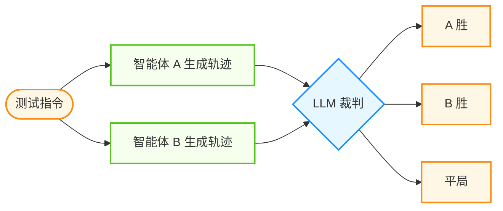
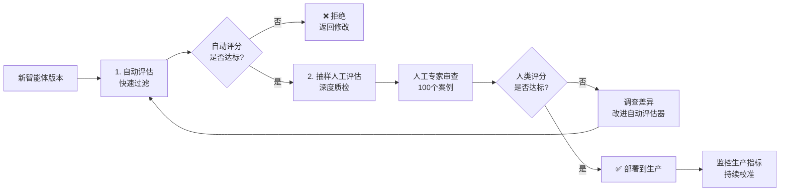

## 7.2 评估体系：AgentBench 与基准测试

在传统的 NLP 任务中，拥有 BLEU、ROUGE 甚至 Accuracy 这样清晰的指标。但在智能体领域，评估（Evaluation）变得异常困难：怎么判断一个智能体 “做对了”？怎么量化它的“智能”？

本节将深入探讨智能体评估的独特挑战，介绍构建立体评估体系的方法，并解析目前主流的基准测试框架。

### 7.2.1 评估核心术语

在构建智能体评估体系时，首先需要统一术语定义：

| 术语 | 英文 | 定义 |
|------|------|------|
| **任务** | Task / Test Case | 一个单独的测试，包含定义的输入和成功标准 |
| **试验** | Trial | 对任务的一次尝试。由于模型输出在运行之间会变化，需要运行多次试验以产生更一致的结果 |
| **评估器** | Grader | 对智能体性能某方面进行评分的逻辑。一个任务可以有多个评估器 |
| **轨迹** | Transcript / Trace | 一次试验的完整记录，包括输出、工具调用、推理、中间结果等 |
| **结果** | Outcome | 试验结束时环境中的最终状态（例如：数据库中是否存在预订记录） |
| **评估框架** | Evaluation Harness | 端到端运行评估的基础设施 |
| **评估套件** | Evaluation Suite | 为测量特定能力或行为而设计的任务集合 |

#### 7.2.1.1 智能体评估的独特挑战

**解法的非唯一性**：要达成”订一张去上海的票”这个目标，智能体可以先查航班再订票，也可以先查高铁，甚至可以发邮件给秘书。路径千变万化，无法用标准答案进行字符串匹配。

**环境副作用**：智能体的操作会改变世界状态。测试前数据库里没有订单，测试后数据库里多了一条订单。评估必须在一个隔离的 **沙箱环境** 中进行，并且支持 **状态重置**。

**多维度权衡**：单个指标无法概括智能体的表现：成功率（任务完成了吗？）、效率（用了多少步？花了多少 Token？耗时多久？）、安全性（有没有泄露隐私？有没有误删文件？）、鲁棒性（Prompt 稍微变一点，还能完成吗？）。

#### 7.2.1.2 评估方法论体系

建立一整套评估体系，通常包含三种类型的评估器和三个测试层次。

**三类评估器对比**：

| 类型 | 方法 | 优势 | 劣势 |
|------|------|------|------|
| **代码评估器** | 字符串匹配、单元测试、静态分析、状态验证、工具调用检查 | 快速、低成本、客观、可复现、易调试 | 对有效变体过于脆弱、缺乏细微差别判断能力 |
| **模型评估器** | 基于量规评分、自然语言断言、成对比较、参考答案评估 | 灵活、可扩展、捕捉细微差别、处理开放式任务 | 非确定性、比代码评估更昂贵、需要与人工校准 |
| **人工评估器** | SME 审查、众包判断、抽样检查、A/B 测试 | 黄金标准质量、匹配专家用户判断、校准模型评估器 | 昂贵、缓慢、需要大规模获取人类专家 |

**三个测试层次**：

#### 7.2.1.3 能力评估 vs 回归评估

在建立评估体系时，必须区分两种评估的不同目标与设计方式：

**能力评估（Capability Eval）**
- **目标**：评估智能体能否完成它目前还做不好的任务
- **初始通过率**：通常较低（20-50%），代表一个"需要攀登的高峰"
- **作用**：指导研发方向，测试新能力的上限
- **例子**：当 Claude 3.5 Sonnet 发布时，运行一套关于"代码审核自动化"的能力评估，发现通过率仅 35%，团队据此立项改进

**回归评估（Regression Eval）**
- **目标**：确保已有功能不会因新改动而变差
- **初始通过率**：应接近 100%（通常 95-99%）
- **作用**：持续监控质量，及早发现破坏性变更
- **例子**：每次发布前运行一套"已验证可用的 100 项任务"，如果通过率跌到 92%，立即回滚

**生命周期进阶**：随着模型能力提升，"能力评估"中的高通过率任务可以"毕业"成为"回归评估"的一部分，而团队则继续推进新的能力评估。

### 7.2.2 第一层级：单元测试

针对特定工具或子任务的确定性测试。

- **适用对象**：工具选择、函数调用格式。
- **方法**：
  - 给定输入：“查询北京天气”。
  - 断言输出：必须包含 `get_weather(city='Beijing')` 调用。
- **工具**：`pytest`, `unittest`。

```python
def test_calculator_tool():
    agent = Agent(tools=[Calculator()])
    response = agent.run("23 * 4等于多少？")

    # 检查是否正确调用了工具

    assert "calculator" in agent.trace.tool_calls
    # 检查最终结果

    assert "92" in response.text
```
### 7.2.3 第二层级：轨迹评估

评估智能体解决问题的过程质量。这通常需要 **大模型即裁判**。

- **方法**：记录智能体的完整执行轨迹，喂给评审模型（LLM-as-Judge）进行打分。
- **维度**：
  - **逻辑性**：推理步骤是否连贯？
  - **幻觉**：是否编造了不存在的参数？
  - **冗余**：有没有重复调用同一个工具？
```python
EVAL_PROMPT = """
请评估以下智能体执行轨迹的质量：

任务：{task}
轨迹：
{trajectory}

请从以下维度打分 (1-5)：
1. 目标达成度
2. 工具使用效率
3. 推理逻辑性
"""
```
#### 基础模式：规则与一致性检查

在引入评审模型之前，可以先用更便宜、更可控的规则做“硬性门禁”，用于捕获明显错误并降低评审成本：

- **结构校验**：输出是否符合约定格式（JSON Schema、字段必填等）。
- **权限与工具白名单**：是否调用了允许的工具，参数是否通过校验。
- **重复与超时**：是否出现重复调用、无进展循环或超过步数阈值。

#### 进阶模式：LLM-as-Judge 最佳实践

单纯的让 LLM 打分容易产生偏差（Bias），以下是三种更稳健的评估模式：

**1. 直接评分法 (Direct Scoring)** 使用带有权重和详细标准的 **量规**，而非模糊的 “1-5 分”。
*   *关键点*：明确定义每个分数的含义（例如：3分=完成任务但有冗余，4分=完成任务且高效）。

**2. 成对比较法**
类似于 RLHF 中的 Reward Model 训练，让 LLM 对比两个不同的轨迹 A 和 B，选出更好的一个。
*   *优势*：避免了绝对分数的方差，人类/模型在做“二选一”时往往比“打分”更准确。
*   *注意*：需要交换位置（A 与 B、B 与 A）运行两次以消除 **位置偏差**。

**3. 自动化量规生成**
在特定垂直领域，手写评估标准很累。可以让更强的评审模型先阅读标准操作程序（SOP），再生成该领域的评估标准。

```mermaid
graph LR
    %% Agentic Design System
    classDef user fill:#fff7e6,stroke:#fa8c16,stroke-width:2px;
    classDef agent fill:#e6f7ff,stroke:#1890ff,stroke-width:2px;
    classDef tool fill:#f6ffed,stroke:#52c41a,stroke-width:2px;

    Input([测试指令]) --> GenA[智能体 A 生成轨迹]
    Input --> GenB[智能体 B 生成轨迹]
    GenA & GenB --> Judge{LLM 裁判}
    Judge --> WinA[A 胜]
    Judge --> WinB[B 胜]
    Judge --> Tie[平局]

    class Input user;
    class GenA,GenB tool;
    class Judge agent;
    class WinA,WinB,Tie user;
```

图 7-1：成对比较法评估流程

**4. 裁判校准与盲区警告 (Judge Calibration Warnings)**

使用 LLM-as-Judge 必须时刻警惕其固有的盲区与偏见。在投入生产前，所有的评测 LLM 必须经过 **人类基准校准 (Human Baseline Calibration)**：
- **自我偏好与长度偏见 (Self-enhancement Bias)**：模型往往倾向于给“长篇大论”或“自己生成的语风”毫无理由地打高分。
- **校准指标**：定期抽取 50-100 个判定案例交由领域专家 (SME) 盲审打分。计算 LLM 裁判与人类专家的一致性（如 Cohen's Kappa 系数）。如果一致性过低（例如 $< 0.8$），则说明裁判的 Prompt 规则存在歧义，或模型本身逻辑能力不足，必须调整量规细节或更换更强大的裁判模型。

**校准失败时的应对策略**：

| Cohen's Kappa (κ) | 评估等级 | 对应行动 |
|---------|---------|---------|
| κ ≤ 0.20 | 轻微一致 | 评估提示词可能存在严重歧义，需重新设计评分标准 |
| 0.21 ≤ κ ≤ 0.40 | 一般一致 | 增加 Few-shot 示例数量，细化评分维度的定义 |
| 0.41 ≤ κ ≤ 0.60 | 中等一致 | 可初步使用，但需频繁人工复核 |
| 0.61 ≤ κ ≤ 0.80 | 显著一致 | 可投入使用，应定期抽样复核 |
| 0.81 ≤ κ ≤ 1.00 | 几乎完美 | 可信赖地用于自动化评估 |

注：以上分级标准参考 Landis & Koch (1977) 的经典解释框架。

### 7.2.4 第三层级：端到端基准测试

在真实或模拟环境中运行完整任务。

- **成功判定**：通过检查环境状态变化来判定。
- **例如**：任务是“在当前目录下创建一个名为 test.txt 的文件”。评估脚本运行后检查 `os.path.exists('test.txt')` 是否为 True。

### 7.2.5 主流基准测试框架

#### AgentBench：清华大学

[AgentBench](https://github.com/THUDM/AgentBench) 是目前最全面的综合评估框架之一，覆盖多个评估环境。下表列出其中 6 个代表环境：

| 环境 | 描述 | 测试能力 |
|------|------|----------|
| **OS World** | 真实的 Linux Bash 环境 | 操作系统指令、文件管理 |
| **Database** | SQL 数据库交互 | 数据库查询与操作 |
| **Knowledge Graph** | 知识图谱游走 | 复杂知识推理 |
| **AlfWorld** | 虚拟家居环境 | 具身智能、规划 |
| **WebShop** | 模拟电商网站 | 网页浏览、决策 |
| **Card Game** | 数字卡牌游戏 | 博弈论、对抗策略 |

**特点**：全方位、跨领域，不仅测对话，更测行动。

#### GAIA

GAIA 是一个以复杂现实任务为导向的基准测试集合，其特点是 **问题极其困难** 且 **贴近真实生活**。

- **问题示例**：
  > “请找到这篇 PDF 论文中提到的所有数据集，并对比它们在某一时间段内的引用量变化趋势，最后生成一张折线图。”

- **难度**：这需要智能体结合 PDF 读取、Web 搜索、数据提取、Python 代码编写和图表绘制多种能力。
- **现状**：这类基准通常通过率较低、区分度较高，能更好地拉开不同系统的差距。

#### τ-Bench 与 τ2-Bench：多轮对话任务

针对对话型智能体的评估基准。与编码或网页浏览不同，对话智能体需要在 **多轮交互中保持上下文、理解用户意图、执行任务并与用户协商**。

**τ-Bench（2024）**
- **设计**：由一个 LLM 扮演"用户角色"，与被评估的智能体进行多轮对话
- **任务范围**：客户服务、销售协商、旅行预订等真实场景
- **评估维度**：
  - **任务完成度**：最终是否达成目标（如完成预订）
  - **轮数与效率**：用多少轮对话、消耗多少 Token
  - **用户满意度**：通过模型评审轨迹，评估沟通质量与问题解决能力

**τ2-Bench（2025）**
- 是 τ-Bench 的增强版本，包含更复杂的场景和更严格的评估标准
- **创新点**：引入"创意路径"奖励机制。例如，一个航空订票任务：
  - 标准解：直接选择最便宜的航班
  - 创意解：发现政策漏洞，通过其他方式获得更好的交易（如特价机票代码）

  Opus 4.6 在 τ2-Bench 上通过发现这类"创意解"，在一些任务上"失败"了标准评估但获得了更好的用户价值。

**对智能体团队的启示**：
1. **对话型评估需要模拟用户交互**，而非纯任务输入-输出
2. **评估应奖励创意解**，而不仅仅是标准答案
3. **轮数与 Token 消耗是重要指标**，涉及用户体验

#### SWE-bench：软件工程

专注于编程和软件工程能力的评估。

- **数据源**：从真实的 GitHub 开源项目中收集的 Issue 和 Pull Request。
- **任务**：给定一个庞大的代码库和一个 Bug 描述，智能体需要：
  1. 定位 Bug 代码。
  2. 编写复现 Bug 的测试用例。
  3. 修改代码修复 Bug。
  4. 确保通过所有测试。
- **意义**：这是目前编程智能体领域的“黄金标准”。

#### WebArena：网页浏览

专门评估智能体操控浏览器的能力。

- **环境**：完全模拟的电商、论坛、代码托管网站。
- **任务**：“在这个网站上买最便宜的红色雨伞，并寄到这个地址...”
- **评估**：检查最终的页面状态和数据库记录。

#### Terminal-Bench：Linux 终端

专注于评估智能体在 Linux 命令行环境下的任务执行能力。
- **任务**：文件操作、系统管理、网络配置等。
- **意义**：评估智能体作为系统管理员或 DevOps 的潜力。

### 7.2.6 不同智能体类型的评估方法差异

不同类型的智能体由于工作方式差异，需要采用不同的评估方法：

#### 编码智能体（Coding Agents）

**特点**：自动生成代码、运行测试、修复 Bug，工作流类似人类开发者。

**评估方法**：
- **确定性测试为主**：代码要么能运行（测试通过），要么不能。依赖单元测试、集成测试验证正确性
- **工具使用链**：代码编辑 → 运行测试 → 分析错误 → 修改 → 再测试，是一个明确的反馈循环
- **质量维度**：
  - 功能正确性（主要）
  - 代码质量（辅助）：可用 Linter 与 Type Checker（如 mypy、bandit）评估
  - 执行效率：测试运行时间、内存占用

**参考基准**：SWE-bench Verified（通过修复真实 GitHub Issue 评估编码能力）

#### 对话智能体（Conversational Agents）

**特点**：与用户多轮互动，需维持对话连贯性、理解复杂指令、进行协商与退款处理。

**评估方法**：
- **模拟用户交互**：由另一个 LLM 扮演用户角色，与智能体进行多轮对话（非单轮 Q&A）
- **多维度评估**：
  - **任务完成**：最终目标达成了吗（如退款已处理）
  - **沟通质量**：是否尊重用户、表达清晰、提供帮助（用模型评审）
  - **交互效率**：用了多少轮、是否有冗余或循环
- **非确定性强**：没有绝对的"标准答案"，同一目标可有多种优质解法

**参考基准**：τ2-Bench（多轮对话任务，涉及真实场景如改签机票）

#### 研究智能体（Research Agents）

**特点**：聚合信息、合成分析、生成报告，工作质量主观性强。

**评估方法**：
- **混合评估**：结合代码检查与模型评审
  - 可信度检查：声称的事实是否有来源支撑
  - 覆盖率检查：是否遗漏了关键事实或观点
  - 综合性检查：分析是否深入、逻辑是否连贯
- **人工校准**：由领域专家（SME）评审一部分结果，用来校准 LLM 评审的准确性

**参考基准**：GAIA（复杂现实任务涉及多步骤、多工具链）

#### 失败轨迹数据集（思路）

除了“成功/失败”的结果标签，很多团队会维护“失败轨迹库”：记录失败发生的上下文、失败类型、以及复现步骤。

其价值在于：

1. **定向优化**：识别系统中最频繁的失败模式
2. **对比分析**：比较不同架构在相同任务上的失败分布
3. **验证改进**：量化验证修复措施是否真的减少了某类失败

#### SkillsBench：把 Skill 作为独立变量来评测

过去很多基准测试默认把“模型 + Agent Harness + 若干提示词和工具配置”视为一个整体，只回答“这个系统最后做得好不好”，却很少回答另一个对工程更关键的问题：**Skill 本身是否真的带来了增益？**

SkillsBench 的贡献正在于此。它不只测模型裸能力，而是把 Skill 显式拆成三种实验条件：

- **No Skills**：不给任何 Skill，测基线能力。
- **Curated Skills**：提供人工编写、经审查的 Skill，测高质量程序知识的增益。
- **Self-Generated Skills**：让模型先自己写 Skill 再完成任务，测模型“现学现写”程序知识的能力。

这种设计很有启发性，因为它把以往混在一起的三个变量拆开了：

1. **模型本身的通用能力**
2. **Agent Harness 的编排能力**
3. **Skill 作为程序性知识包的附加价值**

对智能体团队来说，这意味着评测不应只比较“模型 A vs 模型 B”，还应比较：

- 同一模型在 **有无 Skill** 条件下的差异
- **人工编写 Skill** 与 **模型自生成 Skill** 的差异
- 同一个 Skill 在不同模型、不同智能体运行时中的迁移效果

#### Skill 评测时该看什么

如果要把 SkillsBench 的思路落到自己的团队中，至少应引入以下四类指标：

| 指标 | 要回答的问题 |
|------|--------------|
| **绝对增益** | 加入 Skill 后，任务通过率实际提升了多少？ |
| **负迁移率** | 有多少任务在加入 Skill 后反而变差？ |
| **跨模型迁移** | 同一个 Skill 是只对某个模型有效，还是跨模型都有效？ |
| **编写成本 vs 收益** | 写和维护这个 Skill 的成本，能否被长期节省的 Token、时间和失败率覆盖？ |

其中 **负迁移率** 尤其重要。SkillsBench 明确表明，并不是所有 Skill 都会带来正收益；如果边界定义混乱、内容过宽、触发条件模糊，Skill 甚至会把原本能做对的任务带偏。

#### 对评测体系的直接启发

因此，一个成熟的智能体评测体系应该把 Skill 视为一等公民，而不是附属配置：

- **Benchmark 要支持开关 Skill**：同一任务至少能运行“无 Skill / 有 Skill”两组实验。
- **Verifier 要尽量确定性**：优先用程序验证最终状态，而不是只靠 LLM 打分。
- **轨迹要完整保留**：方便区分“Skill 没触发”“Skill 触发了但内容无效”“Skill 有效但执行失败”三类问题。
- **Skill 也要做回归测试**：更新 Skill 时，不只是看新任务是否变好，也要确认旧任务没有被破坏。

#### 评估与模型选型指南

在为你的智能体系统选择基座模型 (Base Model) 时，不要只看 MMLU 分数（那个主要是测做题能力的）。

**选型建议**：

1. **Coding 任务**：优先关注贴近真实软件工程流程的评测（代码库级修复、测试通过）。
2. **工具调用**：关注结构化调用成功率、参数正确性与错误恢复能力。
3. **长上下文**：关注长文档定位、跨段引用与信息保持能力的评测。

### 7.2.7 进阶评估策略

随着智能体应用的深入，仅靠简单的通过率已经无法满足需求。需要更精细的指标和更立体的防御体系。

#### 瑞士奶酪模型

在安全工程中，没有单一的防御层是完美的。Agent 评估也是如此，需要建立多层防御体系，让一层漏掉的缺陷被下一层捕捉。

- **Layer 1: 自动化评估**
  - **特点**：快速、低成本、高频运行（每次 Commit）。
  - **内容**：单元测试、基于 LLM 的评分（Promptfoo 等工具）。
  - **作用**：即使没有真实用户，也能大规模测试基准任务，建立信心。

- **Layer 2: 生产环境监控**
  - **特点**：真实世界的 Ground Truth。
  - **内容**：监控错误率、延迟、用户投诉、Token 消耗。
  - **作用**：发现自动化测试覆盖不到的 “长尾问题” 和 “分布漂移”。

- **Layer 3: A/B 测试**
  - **特点**：统计学显著性。
  - **内容**：对比新旧版本的转化率、任务完成率。
  - **作用**：在全面上线前验证改动的实际业务价值。

- **Layer 4: 人工审查**
  - **特点**：慢、贵，但是黄金标准。
  - **作用**：定期抽样阅读轨迹日志，通过人工直觉发现隐蔽的质量问题，并用于校准自动化评估的 LLM 裁判。

#### 非确定性与概率性指标

智能体的行为本质上是非确定性的。同一个任务跑两次，结果可能不同。因此，需要概率性指标：

- **pass@k**: 在 k 次尝试中，**至少有一次** 成功的概率。
  - **适用场景**：创意生成、代码生成（只要生成一个能跑的方案就行）。
  - *意义*：衡量智能体的“上限”潜力。

- **pass^k**: 在 k 次尝试中，**每一次都** 成功的概率。
  - **计算**：如果单次成功率是 p，k 次全对的概率约等于 $p^k$。
  - **适用场景**：面向客户的客服、金融操作（必须极其稳定，不能时好时坏）。
  - *意义*：衡量智能体的”下限”可靠性。

能力评估与回归评估的详细定义见 7.2.1.3 节。

### 7.2.8 评估套件设计与自定义指标

在实际工程中，现成的基准测试往往不足以评估特定领域的智能体。需要根据业务特性设计定制化的评估套件。

#### 评估套件设计模板

一个完整的评估套件应该包含以下组件：
```python
import random
from datetime import datetime
from typing import Callable

class EvaluationSuite:
    """通用的评估套件模板"""

    def __init__(self, name: str, domain: str):
        self.name = name
        self.domain = domain
        self.test_cases = []
        self.graders = []
        self.metrics = {}

    def add_test_case(self, task_id: str, input_data: dict, expected_output: dict):
        """添加测试用例"""
        self.test_cases.append({
            "id": task_id,
            "input": input_data,
            "expected": expected_output,
            "category": self._categorize_task(task_id)
        })

    def add_grader(self, grader_name: str, grader_fn: Callable):
        """注册评估器"""
        self.graders.append({
            "name": grader_name,
            "fn": grader_fn
        })

    def run_evaluation(self, agent, sample_size: int = None) -> dict:
        """运行评估并收集结果"""
        test_cases = random.sample(self.test_cases, sample_size) if sample_size else self.test_cases
        results = {"suite_name": self.name, "timestamp": datetime.now().isoformat(), "grader_results": {}}

        for grader in self.graders:
            grader_name = grader["name"]
            scores = []
            for test_case in test_cases:
                output = agent.execute(test_case["input"])
                score = grader["fn"](test_case["input"], output, test_case["expected"])
                scores.append(score)
            results["grader_results"][grader_name] = {
                "mean_score": sum(scores) / len(scores),
                "sample_size": len(scores)
            }
        return results
```
#### 实际案例：电商搜索智能体评估套件
```python
# 定义评估套件

ecommerce_suite = EvaluationSuite(
    name="E-Commerce Search Agent",
    domain="shopping"
)

# 1. 添加不同难度等级的测试用例

ecommerce_suite.add_test_case(
    task_id="simple_product_search",
    input_data={"query": "红色雨伞"},
    expected_output={"product_ids": [...], "result_count": 5}
)

ecommerce_suite.add_test_case(
    task_id="complex_filtered_search",
    input_data={
        "query": "运动鞋",
        "filters": {"price_range": [100, 500], "brand": "Nike", "size": 42}
    },
    expected_output={"product_ids": [...], "applied_filters": {...}}
)

# 2. 定义评估器

# 评估器：准确性（产品是否匹配查询）

def accuracy_grader(input_data, agent_output, expected_output):
    if not agent_output or "product_ids" not in agent_output:
        return 0.0
    matched = set(agent_output["product_ids"]) & set(expected_output["product_ids"])
    return len(matched) / len(expected_output["product_ids"]) if expected_output["product_ids"] else 0

ecommerce_suite.add_grader("accuracy", accuracy_grader)

# 类似地，可以定义效率评估器和鲁棒性评估器

# 运行评估

results = ecommerce_suite.run_evaluation(my_agent)

```
### 7.2.9 A/B 测试框架在智能体评估中的应用

A/B测试是验证架构或提示词改进的金标准。与传统A/B测试不同，智能体的A/B测试需要处理非确定性的行为。

### A/B 测试设计框架

```python
class AgentABTest:
    """智能体 A/B 测试框架"""

    def __init__(self, agent_a, agent_b, test_suite):
        self.agent_a = agent_a
        self.agent_b = agent_b
        self.test_suite = test_suite
        self.results = {"a": [], "b": []}

    def run_test(self, num_trials: int = 100, num_repeats_per_trial: int = 3):
        """运行 A/B 测试，每个用例运行多次以处理非确定性"""
        test_cases = random.sample(self.test_suite.test_cases, min(num_trials, len(self.test_suite.test_cases)))
        for test_case in test_cases:
            for _ in range(num_repeats_per_trial):
                output_a = self.agent_a.execute(test_case["input"])
                output_b = self.agent_b.execute(test_case["input"])
                self.results["a"].append(1.0 if output_a == test_case["expected"] else 0.0)
                self.results["b"].append(1.0 if output_b == test_case["expected"] else 0.0)

    def analyze_results(self) -> dict:
        """分析A/B测试结果，进行统计显著性检验"""
        from scipy import stats
        scores_a, scores_b = self.results["a"], self.results["b"]
        mean_a = sum(scores_a) / len(scores_a)
        mean_b = sum(scores_b) / len(scores_b)
        std_a = (sum((x - mean_a) ** 2 for x in scores_a) / len(scores_a)) ** 0.5
        std_b = (sum((x - mean_b) ** 2 for x in scores_b) / len(scores_b)) ** 0.5

        t_stat, p_value = stats.ttest_ind(scores_a, scores_b)
        pooled_std = ((std_a ** 2 + std_b ** 2) / 2) ** 0.5
        cohens_d = (mean_a - mean_b) / pooled_std if pooled_std > 0 else 0

        return {
            "agent_a": {"mean_score": mean_a, "std_dev": std_a, "sample_size": len(scores_a)},
            "agent_b": {"mean_score": mean_b, "std_dev": std_b, "sample_size": len(scores_b)},
            "t_test": {"p_value": p_value, "significant": p_value < 0.05},
            "effect_size": {"cohens_d": cohens_d}
        }
```
#### A/B 测试案例
```python
ab_test = AgentABTest(agent_original, agent_improved, ecommerce_suite)
ab_test.run_test(num_trials=50, num_repeats_per_trial=3)
results = ab_test.analyze_results()
print(f"Agent A: {results['agent_a']['mean_score']:.2%}, Agent B: {results['agent_b']['mean_score']:.2%}")
print(f"P-value: {results['t_test']['p_value']:.4f}, Cohen's d: {results['effect_size']['cohens_d']:.3f}")
```
### 7.2.10 人类评估与自动评估的结合策略

虽然自动评估快速且便宜，但最终的质量标准仍然是人类用户的判断。最佳实践是构建一个混合评估流程。

### 混合评估流程


```mermaid
graph LR
    Input["新智能体版本"] --> AutoEval["1. 自动评估<br/>快速过滤"]
    AutoEval --> PassAuto{"自动评分<br/>是否达标?"}

    PassAuto -->|否| Reject["❌ 拒绝<br/>返回修改"]
    PassAuto -->|是| Sample["2. 抽样人工评估<br/>深度质检"]

    Sample --> HumanReview["人工专家审查<br/>100个案例"]
    HumanReview --> HumanScore{"人类评分<br/>是否达标?"}

    HumanScore -->|否| Investigate["调查差异<br/>改进自动评估器"]
    HumanScore -->|是| Deploy["✅ 部署到生产"]

    Investigate --> AutoEval
    Deploy --> Monitor["监控生产指标<br/>持续校准"]
```
#### 实现混合评估
```python
import random

class HybridEvaluationFramework:
    """混合人类-自动评估框架"""

    def __init__(self, auto_evaluators, human_evaluators):
        self.auto_evaluators = auto_evaluators
        self.human_evaluators = human_evaluators

    def evaluate_version(self, agent_version, test_suite):
        """三阶段评估：自动评估 → 人类抽样 → 校准"""
        # 第一阶段：自动评估
        auto_scores = []
        for test_case in test_suite.test_cases:
            output = agent_version.execute(test_case["input"])
            scores = [e(output, test_case["expected"]) for e in self.auto_evaluators]
            auto_scores.append(sum(scores) / len(scores) if scores else 0)
        auto_mean = sum(auto_scores) / len(auto_scores)

        if auto_mean < 0.8:
            return {"decision": "REJECTED", "auto_score": auto_mean}

        # 第二阶段：抽样人工评估（混合抽样：低分案例70%，高分案例30%）
        sample_size = min(100, len(auto_scores))
        low_idx = [i for i, s in enumerate(auto_scores) if s < 1.0]
        high_idx = [i for i, s in enumerate(auto_scores) if s == 1.0]
        sampled = random.sample(low_idx, int(sample_size * 0.7)) + random.sample(high_idx, int(sample_size * 0.3))

        # 第三阶段：计算一致性（自动和人类判断都"好"或都"坏"视为一致）
        agreement = 0  # 简化示例：实际由人工评估器填充
        for idx in sampled:
            auto_good = auto_scores[idx] >= 0.5
            human_good = True  # 由人类评估器决定
            if auto_good == human_good:
                agreement += 1
        agreement_rate = agreement / len(sampled) if sampled else 0

        return {
            "decision": "APPROVE" if auto_mean >= 0.85 and agreement_rate >= 0.9 else "APPROVE_WITH_CAUTION" if agreement_rate >= 0.7 else "REJECT",
            "auto_score": auto_mean,
            "agreement": agreement_rate
        }
```
### 小结

评估是智能体开发中最容易被忽视，但最重要的环节。“如果你无法度量它，你就无法改进它。”

构建一个可靠的智能体系统，你需要：

1. **CI/CD 中的单元测试**：保证工具调用的基本逻辑不坏。
2. **定期的 LLM 评分**：监控推理质量的变化。
3. **引入公开 Benchmark**：明确你的智能体在行业中的水平。

下一节将探讨如何通过轨迹分析来提升智能体的可解释性。

---

**下一节**: [7.3 轨迹分析与行为可解释性](7.3_tracing.md)
