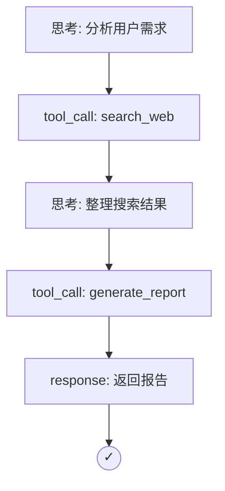

## 7.3 轨迹分析与行为可解释性

当智能体完成一个任务时，它的决策过程是否合理？如何追踪和理解智能体的每一步行动？本节探讨如何记录、分析和解释智能体的行为轨迹，实现可追溯的智能决策。

### 7.3.1 什么是轨迹

#### 轨迹的定义

**轨迹 (Trajectory)** 是智能体完成任务过程中所有状态和动作的序列：

```
τ = (s₀, a₀, s₁, a₁, s₂, a₂, ..., sₙ)

其中：
- sᵢ: 第 i 步的状态（观察、上下文）
- aᵢ: 第 i 步采取的动作
```

### 7.3.2 轨迹的组成要素

一个完整的轨迹记录应包含：

| 要素 | 说明 | 示例 |
|------|------|------|
| 时间戳 | 每步发生的时间 | 2024-01-15 10:32:15 |
| 状态 | 当前的观察和上下文 | 用户消息、API 响应 |
| 思考 | 智能体的推理过程 | "需要先查询数据库..." |
| 动作 | 采取的具体操作 | 调用 search_database() |
| 结果 | 动作的输出 | 返回 5 条记录 |
| 元数据 | 模型、温度、tokens | gpt-4, temp=0.7, 1500 tokens |

### 7.3.3 轨迹记录实现

### 7.3.4 数据结构设计

具体示例如下：

```python
from dataclasses import dataclass
from datetime import datetime
from typing import Any, Dict, List, Optional

@dataclass
class TrajectoryStep:
    timestamp: datetime
    step_id: int
    
    # 状态信息

    observation: str
    context: Dict[str, Any]
    
    # 推理信息

    thought: Optional[str]
    reasoning_type: str  # "cot" | "react" | "direct"
    
    # 动作信息

    action_type: str  # "tool_call" | "response" | "clarify"
    action_name: Optional[str]
    action_input: Optional[Dict]
    action_output: Optional[Any]
    
    # 元数据

    model: str
    tokens_used: int
    latency_ms: int
    confidence: Optional[float]

@dataclass
class Trajectory:
    task_id: str
    user_query: str
    start_time: datetime
    end_time: Optional[datetime]
    steps: List[TrajectoryStep]
    final_result: Optional[str]
    success: Optional[bool]
    
    def add_step(self, step: TrajectoryStep):
        self.steps.append(step)
        
    def total_tokens(self) -> int:
        return sum(s.tokens_used for s in self.steps)
    
    def total_latency(self) -> int:
        return sum(s.latency_ms for s in self.steps)
```

### 7.3.5 轨迹收集器

具体示例如下：

```python
class TrajectoryCollector:
    def __init__(self):
        self.current_trajectory: Optional[Trajectory] = None
        self.storage = TrajectoryStorage()
        
    def start_task(self, task_id: str, user_query: str):
        self.current_trajectory = Trajectory(
            task_id=task_id,
            user_query=user_query,
            start_time=datetime.now(),
            end_time=None,
            steps=[],
            final_result=None,
            success=None
        )
        
    def log_step(
        self,
        observation: str,
        thought: str,
        action_type: str,
        action_name: str = None,
        action_input: Dict = None,
        action_output: Any = None,
        **metadata
    ):
        step = TrajectoryStep(
            timestamp=datetime.now(),
            step_id=len(self.current_trajectory.steps),
            observation=observation,
            context=metadata.get("context", {}),
            thought=thought,
            reasoning_type=metadata.get("reasoning_type", "cot"),
            action_type=action_type,
            action_name=action_name,
            action_input=action_input,
            action_output=action_output,
            model=metadata.get("model", "unknown"),
            tokens_used=metadata.get("tokens", 0),
            latency_ms=metadata.get("latency", 0),
            confidence=metadata.get("confidence")
        )
        self.current_trajectory.add_step(step)
        
    def end_task(self, result: str, success: bool):
        self.current_trajectory.end_time = datetime.now()
        self.current_trajectory.final_result = result
        self.current_trajectory.success = success
        self.storage.save(self.current_trajectory)
```

### 7.3.6 轨迹分析

### 7.3.7 模式识别

分析轨迹中的常见模式：

```python
class TrajectoryAnalyzer:
    def analyze(self, trajectory: Trajectory) -> AnalysisReport:
        return AnalysisReport(
            efficiency=self._analyze_efficiency(trajectory),
            patterns=self._find_patterns(trajectory),
            bottlenecks=self._identify_bottlenecks(trajectory),
            anomalies=self._detect_anomalies(trajectory)
        )
    
    def _analyze_efficiency(self, trajectory: Trajectory) -> Dict:
        total_steps = len(trajectory.steps)
        tool_calls = sum(1 for s in trajectory.steps 
                        if s.action_type == "tool_call")
        redundant_calls = self._count_redundant_calls(trajectory)
        
        return {
            "total_steps": total_steps,
            "tool_calls": tool_calls,
            "redundant_calls": redundant_calls,
            "efficiency_score": 1 - (redundant_calls / max(tool_calls, 1))
        }
    
    def _find_patterns(self, trajectory: Trajectory) -> List[str]:
        patterns = []
        
        # 检测循环模式

        action_sequence = [s.action_name for s in trajectory.steps]
        if self._has_cycle(action_sequence):
            patterns.append("detected_loop")
            
        # 检测重试模式

        if self._has_retry_pattern(trajectory):
            patterns.append("retry_behavior")
            
        # 检测探索模式

        if self._is_exploration_heavy(trajectory):
            patterns.append("exploration_dominant")
            
        return patterns
    
    def _identify_bottlenecks(self, trajectory: Trajectory) -> List[Dict]:
        bottlenecks = []
        
        for step in trajectory.steps:
            # 延迟瓶颈

            if step.latency_ms > 5000:
                bottlenecks.append({
                    "type": "high_latency",
                    "step_id": step.step_id,
                    "latency_ms": step.latency_ms,
                    "action": step.action_name
                })
            
            # Token 消耗瓶颈

            if step.tokens_used > 3000:
                bottlenecks.append({
                    "type": "high_token_usage",
                    "step_id": step.step_id,
                    "tokens": step.tokens_used
                })
                
        return bottlenecks
```

### 7.3.8 可视化

将轨迹可视化为易于理解的图表：

```python
def visualize_trajectory(trajectory: Trajectory) -> str:
    """生成轨迹的 Mermaid 图"""
    mermaid = ["graph TD"]
    
    for i, step in enumerate(trajectory.steps):
        node_id = f"S{i}"
        label = f"{step.action_type}"
        if step.action_name:
            label += f"\\n{step.action_name}"
        
        # 添加节点

        mermaid.append(f"    {node_id}[\"{label}\"]")
        
        # 添加边

        if i > 0:
            prev_node = f"S{i-1}"
            mermaid.append(f"    {prev_node} --> {node_id}")
            
    # 标记成功/失败

    if trajectory.success:
        mermaid.append(f"    S{len(trajectory.steps)-1} --> SUCCESS((✓))")
    else:
        mermaid.append(f"    S{len(trajectory.steps)-1} --> FAIL((✗))")
        
    return "\n".join(mermaid)
```

**示例输出**：



### 7.3.9 行为可解释性

### 7.3.10 决策归因

理解智能体为什么做出某个决策：

```python
class DecisionExplainer:
    async def explain_decision(
        self, 
        step: TrajectoryStep,
        context: List[TrajectoryStep]
    ) -> str:
        prompt = f"""
        智能体在以下情境中做出了决策：
        
        观察：{step.observation}
        思考：{step.thought}
        决策：{step.action_type} - {step.action_name}
        
        之前的步骤：
        {format_context(context)}
        
        请解释：
        1. 为什么智能体选择了这个动作？
        2. 有哪些替代方案被考虑/排除？
        3. 这个决策的主要依据是什么？
        """
        
        return await self.llm.generate(prompt)
    
    async def attribution_analysis(
        self, 
        trajectory: Trajectory
    ) -> List[Dict]:
        """分析每个决策的关键影响因素"""
        attributions = []
        
        for i, step in enumerate(trajectory.steps):
            if step.action_type == "tool_call":
                # 找出影响这个决策的关键输入

                relevant_context = trajectory.steps[max(0, i-3):i]
                
                attribution = await self._compute_attribution(
                    step, 
                    relevant_context
                )
                attributions.append(attribution)
                
        return attributions
```

### 7.3.11 反事实分析

探索"如果做了不同选择会怎样"：

```python
class CounterfactualAnalyzer:
    async def analyze(
        self, 
        trajectory: Trajectory,
        step_index: int,
        alternative_action: str
    ) -> Dict:
        original_step = trajectory.steps[step_index]
        
        # 模拟替代路径

        simulated_trajectory = await self._simulate_alternative(
            trajectory,
            step_index,
            alternative_action
        )
        
        return {
            "original_action": original_step.action_name,
            "alternative_action": alternative_action,
            "original_outcome": trajectory.final_result,
            "simulated_outcome": simulated_trajectory.final_result,
            "difference_summary": self._summarize_difference(
                trajectory, 
                simulated_trajectory
            )
        }
```

### 7.3.12 与可观测性工具集成

### 7.3.13 LangSmith 集成

具体示例如下：

```python
from langsmith import Client

class LangSmithTracer:
    def __init__(self):
        self.client = Client()
        
    def trace_trajectory(self, trajectory: Trajectory):
        with self.client.trace(
            name=f"Task: {trajectory.task_id}",
            inputs={"query": trajectory.user_query}
        ) as trace:
            for step in trajectory.steps:
                with trace.child(name=step.action_name or step.action_type):
                    trace.log_input(step.observation)
                    trace.log_output(step.action_output)
                    trace.log_metadata({
                        "thought": step.thought,
                        "tokens": step.tokens_used,
                        "latency": step.latency_ms
                    })
```

### 7.3.14 小结

轨迹分析和行为可解释性是智能体系统走向生产的关键能力：

- **轨迹记录**：完整记录每一步的状态、思考、动作和结果
- **模式分析**：识别效率问题、循环和瓶颈
- **决策解释**：理解智能体为什么做出某个选择
- **反事实推理**：探索替代方案的可能结果

这些能力不仅帮助调试和优化，更是满足合规审计要求的基础。

下一节将探讨智能体如何通过持续学习不断进化。

---

**下一节**: [持续学习与知识更新](7.4_continuous_learning.md)
