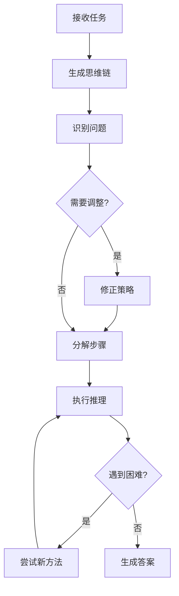
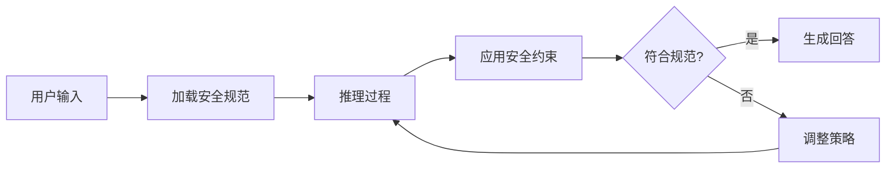
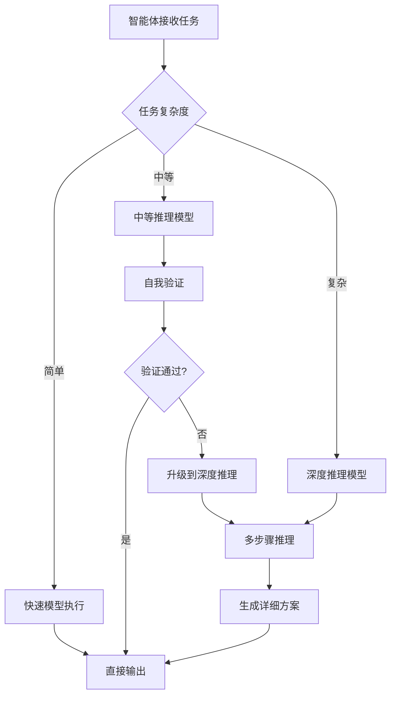

## 7.5 推理能力的提升：从快速响应到深度思考

传统的 LLM 采用 **系统 1** 思维模式——快速、直觉性的响应。2024 年底开始，OpenAI 和 Anthropic 推出的推理模型引入了 **系统 2** 思维——慢速、深思熟虑的推理过程，为智能体的决策能力带来了质的飞跃。

### 7.5.1 推理模型的工作机制

#### Chain of Thought

类似于人类在面对困难问题时会花时间思考，推理模型在回答前会进行长时间的内在推理。



图 7-3：思维链推理流程

**核心机制**：

- 模型使用内在的 **思维链** 进行推理
- 通过强化学习优化思维过程
- 学会识别和纠正自己的错误
- 将复杂步骤分解为简单步骤
- 当前方法不奏效时尝试不同途径

#### OpenAI o1 系列

**训练方法**：

- 大规模强化学习算法
- 高度数据高效的训练过程
- 性能随训练时计算和测试时计算双重提升

**性能突破**：

| 基准测试 | GPT-4o | o1 | 说明 |
|---------|--------|-----|------|
| AIME 2024 数学竞赛 | 12% | 74%（单次）/ 93%（1000样本） | 达到美国数学奥赛前500名水平 |
| GPQA Diamond | 博士级别以下 | 超越人类专家 | 首个超越人类专家的模型 |
| Codeforces 编程 | - | 89th 百分位 | 竞赛编程水平 |
| MMLU | - | 54/57子类别领先 | 广泛知识评估 |

**思维链示例对比**：

以密码解码任务为例：

**GPT-4o 的方法**：

- 直接尝试识别模式
- 遇到困难时询问更多规则
- 缺乏系统性推理

**o1 的方法**：

1. 分析样本：对比密文和明文字符
2. 发现规律：每对字母的平均值对应明文字母
3. 验证假设：用多个样本验证规律
4. 应用规则：系统性解码新密文
5. 完整输出：生成准确答案

#### OpenAI o3-mini 系列

o3-mini 是首个支持可调节推理深度的成本高效推理模型。

**可调节推理深度**：

```python
# 三档推理深度配置

response = client.chat.completions.create(
    model="o3-mini",
    messages=[{"role": "user", "content": task}],
    reasoning_effort="medium"  # 可选：low, medium, high
)
```

| 模式 | 适用场景 | 性能特点 |
|------|---------|---------|
| Low | 快速响应需求 | 接近 o1-mini 水平，延迟最低 |
| Medium | 平衡场景 | 接近 o1 水平，延迟适中（7.7s 平均） |
| High | 复杂任务 | 超越 o1，准确度最高 |

**STEM 专项优化**：

- **数学**：AIME 2024 达到 83.6%（high 模式）
- **科学**：GPQA Diamond 达到 77.0%
- **编程**：
  - Codeforces Elo 2073
  - SWE-bench Verified 48.9%
  - LiveBench 编程任务领先

**性能改进**：

- 比 o1-mini 快 24%（medium 模式）
- 首次到达 token 时间减少 2500ms
- 人类评估显示 56% 偏好率，错误率降低 39%

### 7.5.2 Deliberative Alignment

推理模型引入了一种新的安全对齐方式——**审慎对齐**——在推理过程中应用安全约束。

#### 工作原理

具体示例如下：



图 7-4：审慎对齐机制

**核心思想**：

- 训练模型在回答前先推理人类编写的安全规范
- 在思维链中显式考虑安全约束
- 比传统对齐方法更能抵御攻击

**安全评估结果**：

| 评估维度 | GPT-4o | o3-mini |
|---------|--------|---------|
| 禁止内容拒绝率 | 基准 | 显著提升 |
| Jailbreak 抵御 | 基准 | 显著提升 |
| 复杂场景安全性 | 中等 | 优秀 |

### 7.5.3 推理模型在智能体中的应用

#### 适用场景

**高价值的复杂决策**：

```python
class ReasoningAgent:
    """使用推理模型的智能体"""
    
    def complex_decision(self, scenario: dict) -> dict:
        """需要深度推理的决策"""
        
        # 使用推理模型进行关键决策

        reasoning_response = self.o1.chat.completions.create(
            model="o3-mini",
            messages=[{
                "role": "user",
                "content": f"""
                分析以下场景并制定行动计划：
                
                场景：{scenario}
                
                请考虑：
                1. 所有可能的风险
                2. 不同方案的利弊
                3. 潜在的副作用
                4. 最优执行路径
                """
            }],
            reasoning_effort="high"  # 复杂决策使用高推理深度
        )
        
        return self.parse_decision(reasoning_response)
    
    def routine_action(self, task: str) -> str:
        """常规任务使用快速模型"""
        return self.gpt5.chat.completions.create(
            model="gpt-5.3",
            messages=[{"role": "user", "content": task}]
        )
```

**智能体架构中的混合使用**：

```mermaid
graph TD
    subgraph DecisionLayer [智能体决策层]
        Router[路由层 (GPT-5.3)] --> Classifier[任务分类器]
        Classifier -->|常规任务| Routine[常规任务 (GPT-5.3)]
        Classifier -->|复杂推理| Complex[复杂推理 (o3-mini-high)]
        Classifier -->|编程调试| Coding[编程调试 (o3-mini-med)]
    end
```

图 7-5：混合推理模型架构

#### 成本权衡策略

**智能路由**：

```python
class CostAwareRouter:
    """成本感知的模型路由器"""
    
    COMPLEXITY_THRESHOLDS = {
        "simple": {"model": "gpt-5.3", "cost_per_token": 0.005},
        "moderate": {"model": "o3-mini", "reasoning": "medium", "cost_per_token": 0.015},
        "complex": {"model": "o3-mini", "reasoning": "high", "cost_per_token": 0.030}
    }
    
    def route_task(self, task: str, context: dict) -> dict:
        """根据任务复杂度选择模型"""
        
        complexity = self.assess_complexity(task, context)
        
        if complexity == "simple":
            # 快速响应，低成本

            return self.call_gpt5(task)
        
        elif complexity == "moderate":
            # 中等推理，平衡成本与质量

            return self.call_o3_mini(task, reasoning_effort="medium")
        
        else:  # complex
            # 深度推理，优先质量

            return self.call_o3_mini(task, reasoning_effort="high")
    
    def assess_complexity(self, task: str, context: dict) -> str:
        """评估任务复杂度"""
        indicators = {
            "multi_step": "需要多步推理" in task,
            "uncertainty": "不确定" in task or "可能" in task,
            "critical": context.get("criticality") == "high",
            "math_heavy": self.has_complex_math(task),
            "code_debug": "调试" in task or "bug" in task
        }
        
        if sum(indicators.values()) >= 3:
            return "complex"
        elif sum(indicators.values()) >= 1:
            return "moderate"
        else:
            return "simple"
```

**延迟考虑**：

| 模型 | 平均响应时间 | 适用场景 |
|------|------------|---------|
| GPT-5.3 | ~1-2s | 实时交互 |
| o3-mini (low) | ~4-5s | 准实时决策 |
| o3-mini (medium) | ~7-8s | 批处理任务 |
| o3-mini (high) | ~15-20s | 离线分析 |

### 7.5.4 典型应用案例

#### 代码审查 Agent

具体示例如下：

```python
class CodeReviewAgent:
    """使用推理模型的代码审查智能体"""
    
    def review_pull_request(self, pr_diff: str, context: dict) -> dict:
        """深度审查代码变更"""
        
        review = self.o3_mini.chat.completions.create(
            model="o3-mini",
            messages=[{
                "role": "user", 
                "content": f"""
                审查以下代码变更，特别关注：
                
                1. 逻辑错误和边界情况
                2. 安全漏洞（SQL注入、XSS等）
                3. 性能问题
                4. 代码可维护性
                
                代码变更：
                {pr_diff}
                
                项目上下文：
                {context}
                
                请提供：
                - 发现的问题清单（按严重程度排序）
                - 每个问题的详细分析
                - 修复建议
                """
            }],
            reasoning_effort="high"  # 代码审查需要深度推理
        )
        
        return self.parse_review(review)
```

#### 数学证明 Agent

具体示例如下：

```python
class MathProofAgent:
    """数学证明助手"""
    
    def verify_proof(self, theorem: str, proof: str) -> dict:
        """验证数学证明的正确性"""
        
        verification = self.o1.chat.completions.create(
            model="o1",
            messages=[{
                "role": "user",
                "content": f"""
                验证以下数学证明：
                
                定理：{theorem}
                
                证明：{proof}
                
                请：
                1. 逐步检查证明的每个推理步骤
                2. 识别任何逻辑漏洞或跳跃
                3. 确认所有引用的定理是否正确应用
                4. 给出总体评估
                """
            }]
        )
        
        return verification
```

### 7.5.5 推理模型的局限性

#### 当前限制

**计算成本**：

- Token 成本比传统模型高 3-6 倍
- 响应延迟增加（medium 模式约 7.7s）
- 不适合高频次调用场景

**能力边界**：

- o3-mini 不支持视觉能力（需视觉推理请使用 o3-pro）
- 对于简单任务可能过度推理
- 复杂界面操作仍有挑战

**适用性判断**：

```python
def should_use_reasoning_model(task: dict) -> bool:
    """判断是否需要使用推理模型"""
    
    # 适合推理模型

    suitable_cases = [
        task.get("requires_multi_step_logic"),
        task.get("has_edge_cases"),
        task.get("needs_self_correction"),
        task.get("math_or_code_heavy"),
        task.get("critical_decision"),
        task["expected_failure_cost"] > task["reasoning_model_cost"] * 10
    ]
    
    # 不适合推理模型

    unsuitable_cases = [
        task.get("real_time_required"),
        task.get("simple_pattern"),
        task.get("already_cached"),
        task["latency_budget"] < 5000  # ms
    ]
    
    return any(suitable_cases) and not any(unsuitable_cases)
```

### 7.5.6 未来演进方向

#### 测试时计算扩展

推理模型的性能随测试时计算量平滑提升，这开辟了新的优化方向：

```
推理能力 ∝ 训练时计算 × 测试时计算
```

**实践启示**：

- 关键决策可通过增加推理时间提升准确度
- 多样本共识（Consensus）进一步提升可靠性
- 动态调节推理深度实现成本与质量平衡

#### 与智能体系统的深度整合

具体示例如下：



图 7-6：智能体与推理模型深度整合流程

### 7.5.7 小结

推理模型代表了 AI 能力的重要进步：

1. **思维方式转变**：从快速直觉到深度推理
2. **性能突破**：在数学、编程、科学等领域超越人类专家水平
3. **安全对齐**：通过 **审慎对齐** 提升安全性
4. **灵活配置**：可调节推理深度实现成本与质量平衡
5. **智能体应用**：在复杂决策、代码审查、数学证明等场景价值显著

**对智能体开发的启示**：

- 混合架构：将推理模型用于关键决策节点
- 成本优化：智能路由实现成本与质量平衡
- 延迟管理：根据场景选择合适的推理深度
- 信任升级：更可靠的推理支持更高自主性

> [!TIP]
> **相关资源**：
> - OpenAI o1: https://openai.com/index/learning-to-reason-with-llms/
> - OpenAI o3-mini: https://openai.com/index/openai-o3-mini/
> - Deliberative Alignment: https://openai.com/index/deliberative-alignment/

---

**下一节**: [本章小结](summary.md)
