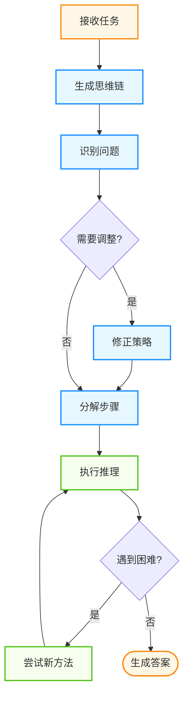
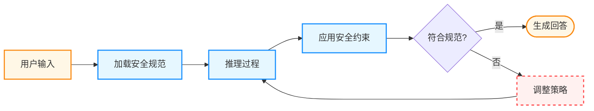
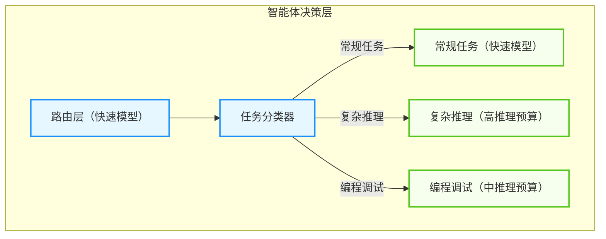
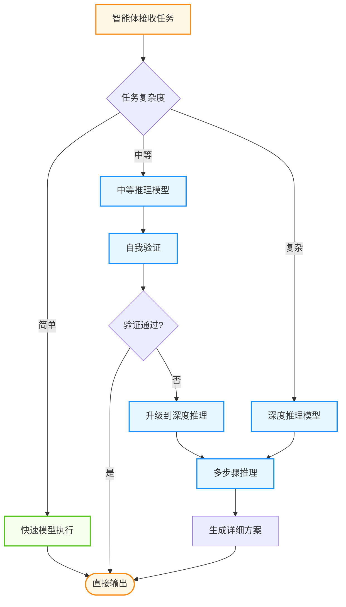

## 7.5 推理能力的提升：从快速响应到深度思考

传统的 LLM 采用 **系统 1**思维模式——快速、直觉性的响应。随着推理能力的提升，一些模型开始更像“系统 2”思维——慢速、深思熟虑的推理过程，为智能体的决策能力带来显著增强。

### 7.5.1 推理模型的工作机制

本节将依次介绍“Chain of Thought”与“推理增强模型的训练与能力特征”等内容。

#### Chain of Thought

类似于人类在面对困难问题时会花时间思考，推理模型在回答前会进行长时间的内在推理。



图 7-3：思维链推理流程

**核心机制**：

- 模型使用内在的 **思维链** 进行推理
- 通过强化学习优化思维过程
- 学会识别和纠正自己的错误
- 将复杂步骤分解为简单步骤
- 当前方法不奏效时尝试不同途径

#### 推理增强模型的训练与能力特征

推理增强模型通常在两方面做工程化强化：

- **训练侧**：引入对多步推理、验证、回溯等行为的奖励信号（结果奖励 + 过程监督）。
- **推理侧**：允许在推理时分配更多计算预算（更长的推理、更严格的自检）。

常见效果包括：更强的多步规划、更稳健的错误修正、更高的“在复杂任务中坚持到底”的能力。

### 7.5.2 Deliberative Alignment

推理模型引入了一种新的安全对齐方式——**审慎对齐**——在推理过程中应用安全约束。

#### 工作原理

具体示例如下：



图 7-4：审慎对齐机制

**核心思想**：

- 训练模型在回答前先推理人类编写的安全规范
- 在思维链中显式考虑安全约束
- 比传统对齐方法更能抵御攻击

**安全评估结果**：在一些评测设置中，这类“推理时应用安全规范”的方法往往能提升对抗性场景下的稳健性与一致性，但具体效果取决于安全规则质量、评测口径与系统权限边界。

#### 工程落地要点

将审慎对齐落到工程系统时，关键不在于“提示词写得更凶”，而在于把安全规则变成可执行、可审计、可回滚的系统能力：

- **策略外置**：把核心安全规则放在运行时策略层与权限系统中，避免只靠模型自觉。
- **证据链与审计**：记录触发了哪些规则、拦截了哪些动作，并为每次决策打上 `trace_id`。
- **最小权限**：对高风险工具启用审批与沙箱隔离，必要时做动态授权。

### 7.5.3 推理模型在智能体中的应用

本节将依次介绍“适用场景”与“成本权衡策略”等内容。

#### 适用场景

**高价值的复杂决策**：

```python
class ReasoningAgent:
    """使用推理模型的智能体"""
    
    def complex_decision(self, scenario: dict) -> dict:
        """需要深度推理的决策"""
        
        # 使用推理模型进行关键决策

        reasoning_response = self.reasoning_client.generate(
            model="<REASONING_MODEL>",
            messages=[{
                "role": "user",
                "content": f"""
                分析以下场景并制定行动计划：
                
                场景：{scenario}
                
                请考虑：
                1. 所有可能的风险
                2. 不同方案的利弊
                3. 潜在的副作用
                4. 最优执行路径
                """
            }],
            reasoning_budget="high"  # 复杂决策使用高推理深度
        )
        
        return self.parse_decision(reasoning_response)
    
    def routine_action(self, task: str) -> str:
        """常规任务使用快速模型"""
        return self.fast_client.generate(
            model="<FAST_MODEL>",
            messages=[{"role": "user", "content": task}]
        )
```

**智能体架构中的混合使用**：



图 7-5：混合推理模型架构

#### 成本权衡策略

**智能路由**：

```python
class CostAwareRouter:
    """成本感知的模型路由器"""
    
    COMPLEXITY_THRESHOLDS = {
    "simple": {"model": "<FAST_MODEL>"},
    "moderate": {"model": "<REASONING_MODEL>", "reasoning_budget": "medium"},
    "complex": {"model": "<REASONING_MODEL>", "reasoning_budget": "high"},
}
    }
    
    def route_task(self, task: str, context: dict) -> dict:
        """根据任务复杂度选择模型"""
        
        complexity = self.assess_complexity(task, context)
        
        if complexity == "simple":
            # 快速响应，低成本

            return self.call_gpt5(task)
        
        elif complexity == "moderate":
            # 中等推理，平衡成本与质量

            return self.call_reasoning(task, reasoning_budget="medium")
        
        else:  # complex
            # 深度推理，优先质量

            return self.call_reasoning(task, reasoning_budget="high")
    
    def assess_complexity(self, task: str, context: dict) -> str:
        """评估任务复杂度"""
        indicators = {
            "multi_step": "需要多步推理" in task,
            "uncertainty": "不确定" in task or "可能" in task,
            "critical": context.get("criticality") == "high",
            "math_heavy": self.has_complex_math(task),
            "code_debug": "调试" in task or "bug" in task
        }
        
        if sum(indicators.values()) >= 3:
            return "complex"
        elif sum(indicators.values()) >= 1:
            return "moderate"
        else:
            return "simple"
```

**延迟考虑**：推理预算越高，延迟通常越高。工程上可以按任务重要性与交互实时性做分层：实时交互优先低预算，离线分析可用高预算。

### 7.5.4 典型应用案例

本节将依次介绍“代码审查 Agent”与“数学证明 Agent”等内容。

#### 代码审查 Agent

具体示例如下：

```python
class CodeReviewAgent:
    """使用推理模型的代码审查智能体"""
    
    def review_pull_request(self, pr_diff: str, context: dict) -> dict:
        """深度审查代码变更"""
        
        review = self.reasoning_client.generate(
            model="<REASONING_MODEL>",
            messages=[{
                "role": "user", 
                "content": f"""
                审查以下代码变更，特别关注：
                
                1. 逻辑错误和边界情况
                2. 安全漏洞（SQL注入、XSS等）
                3. 性能问题
                4. 代码可维护性
                
                代码变更：
                {pr_diff}
                
                项目上下文：
                {context}
                
                请提供：
                - 发现的问题清单（按严重程度排序）
                - 每个问题的详细分析
                - 修复建议
                """
            }],
            reasoning_budget="high"  # 代码审查需要深度推理
        )
        
        return self.parse_review(review)
```

#### 数学证明 Agent

具体示例如下：

```python
class MathProofAgent:
    """数学证明助手"""
    
    def verify_proof(self, theorem: str, proof: str) -> dict:
        """验证数学证明的正确性"""
        
        verification = self.reasoning_client.generate(
            model="<REASONING_MODEL>",
            messages=[{
                "role": "user",
                "content": f"""
                验证以下数学证明：
                
                定理：{theorem}
                
                证明：{proof}
                
                请：
                1. 逐步检查证明的每个推理步骤
                2. 识别任何逻辑漏洞或跳跃
                3. 确认所有引用的定理是否正确应用
                4. 给出总体评估
                """
            }]
        )
        
        return verification
```

### 7.5.5 推理模型的局限性

本节将依次介绍“当前限制”与“规避策略”等内容。

#### 当前限制

**计算成本**：

- Token 成本比传统模型高 3-6 倍
- 响应延迟增加（medium 模式约 7.7s）
- 不适合高频次调用场景

**能力边界**：

- 对于简单任务可能出现“过度推理”，导致成本上升。
- 若任务需要视觉/环境操作能力，需选择支持对应模态与工具调用的模型与运行环境。
- 复杂界面操作仍可能失败，需要人机协作与回退策略。

**适用性判断**：

```python
def should_use_reasoning_model(task: dict) -> bool:
    """判断是否需要使用推理模型"""
    
    # 适合推理模型

    suitable_cases = [
        task.get("requires_multi_step_logic"),
        task.get("has_edge_cases"),
        task.get("needs_self_correction"),
        task.get("math_or_code_heavy"),
        task.get("critical_decision"),
        task.get("expected_failure_cost") and task.get("reasoning_model_cost") and task["expected_failure_cost"] > task["reasoning_model_cost"]
    ]
    
    # 不适合推理模型

    unsuitable_cases = [
        task.get("real_time_required"),
        task.get("simple_pattern"),
        task.get("already_cached"),
        task.get("latency_budget") and task["latency_budget"] < task.get("reasoning_latency_budget", 0)
    ]
    
    return any(suitable_cases) and not any(unsuitable_cases)
```

#### 规避策略

为了在效果与成本之间取得平衡，常见做法是先把“推理模型”用在最关键的节点上：

- **分层路由**：简单任务走普通模型，复杂节点再升级到推理模型。
- **先证据后推理**：先用工具拿到关键事实与数据，再进行推理总结，减少长链幻觉。
- **回归与熔断**：维护回归样例集并设置成本告警，发现异常时自动降级或停止执行。

### 7.5.6 未来演进方向

本节将依次介绍“测试时计算扩展”与“与智能体系统的深度整合”等内容。

#### 测试时计算扩展

推理模型的性能随测试时计算量平滑提升，这开辟了新的优化方向：

```
推理能力 ∝ 训练时计算 × 测试时计算
```

**实践启示**：

- 关键决策可通过增加推理时间提升准确度
- 多样本共识（Consensus）进一步提升可靠性
- 动态调节推理深度实现成本与质量平衡

#### 与智能体系统的深度整合

具体示例如下：



图 7-6：智能体与推理模型深度整合流程

### 7.5.7 小结

推理模型代表了 AI 能力的重要进步：

1. **思维方式转变**：从快速直觉到深度推理
2. **性能突破**：在数学、编程、科学等领域超越人类专家水平
3. **安全对齐**：通过 **审慎对齐** 提升安全性
4. **灵活配置**：可调节推理深度实现成本与质量平衡
5. **智能体应用**：在复杂决策、代码审查、数学证明等场景价值显著

**对智能体开发的启示**：

- 混合架构：将推理模型用于关键决策节点
- 成本优化：智能路由实现成本与质量平衡
- 延迟管理：根据场景选择合适的推理深度
- 信任升级：更可靠的推理支持更高自主性

---

**下一节**: [本章小结](summary.md)
