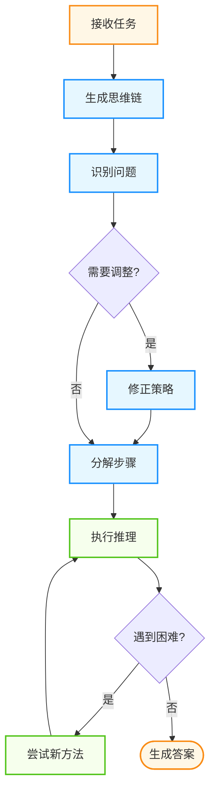
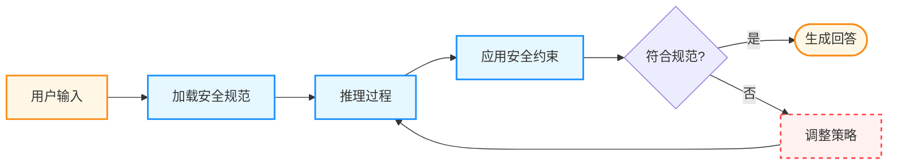
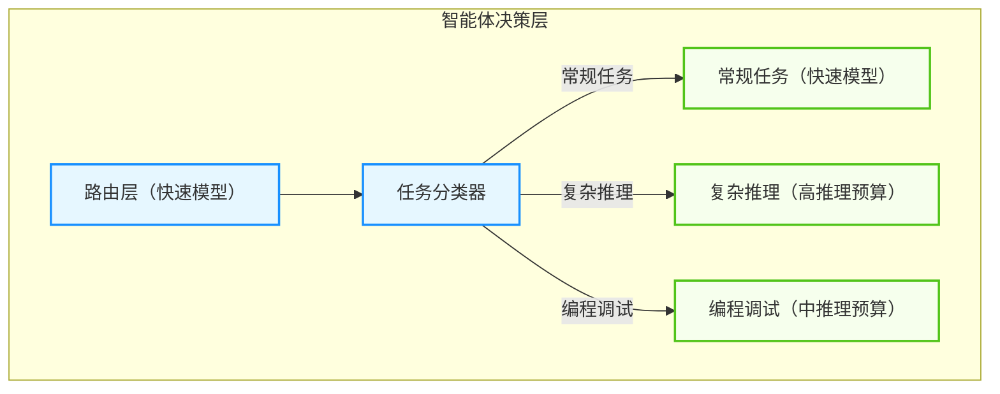
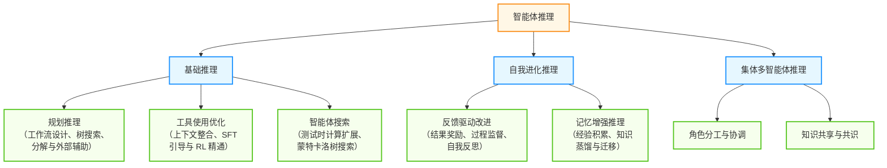
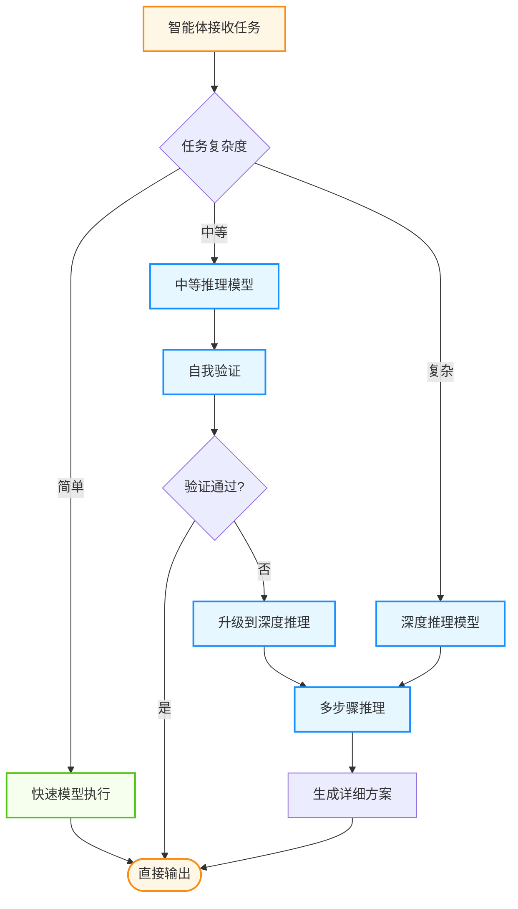

## 7.5 推理能力的提升：从快速响应到深度思考

传统的 LLM 采用 **系统 1** 思维模式——快速、直觉性的响应。随着推理能力的提升，一些模型开始更像“系统 2”思维——慢速、深思熟虑的推理过程，为智能体的决策能力带来显著增强。

### 7.5.1 推理模型的工作机制

#### Chain of Thought

类似于人类在面对困难问题时会花时间思考，推理模型在回答前会进行长时间的内在推理。


```mermaid
flowchart TD
    %% Agentic Design System
    classDef agent fill:#e6f7ff,stroke:#1890ff,stroke-width:2px;
    classDef tool fill:#f6ffed,stroke:#52c41a,stroke-width:2px;
    classDef user fill:#fff7e6,stroke:#fa8c16,stroke-width:2px;

    a["接收任务"] --> b["生成思维链"]
    b --> c["识别问题"]
    c --> d{需要调整?}
    d -->|是| e["修正策略"]
    e --> f["分解步骤"]
    d -->|否| f
    f --> g["执行推理"]
    g --> h{遇到困难?}
    h -->|是| i["尝试新方法"]
    i --> g
    h -->|否| j(["生成答案"])

    class a user;
    class b,c,e,f agent;
    class g,i tool;
    class j user;
```

图 7-3：思维链推理流程

**核心机制**：

- 模型使用内在的 **思维链** 进行推理
- 通过强化学习优化思维过程
- 学会识别和纠正自己的错误
- 将复杂步骤分解为简单步骤
- 当前方法不奏效时尝试不同途径

#### 推理增强模型的训练与能力特征

推理增强模型通常在两方面做工程化强化：

- **训练侧**：引入对多步推理、验证、回溯等行为的奖励信号（结果奖励 + 过程监督）。
- **推理侧**：允许在推理时分配更多计算预算（更长的推理、更严格的自检）。

常见效果包括：更强的多步规划、更稳健的错误修正、更高的“在复杂任务中坚持到底”的能力。

#### 推理模型的发展历程

推理模型从 2024 年的首次出现到 2026 年初，经历了快速迭代与优化：

```text
2024年9月   OpenAI o1-preview
           - 首次引入LLM推理预算概念
           - 推理时间: 5-30秒
           - 准确率显著提升

2024年12月  o1 正式发布
           - 推理速度优化
           - API稳定化
           - 应用到更多领域

2025年1月   o3-mini (轻量版)
           - 推理时间下降到1-3秒
           - 成本大幅降低
           - 适合实时Agent应用

2025年4月   o3 正式发布
           - 推理能力大幅提升
           - 支持扩展推理预算
           - 并行推理优化
           （注：o3-pro于2025年6月发布）

2025年8月   GPT-5
           - OpenAI新一代旗舰模型
           - 推理能力进一步提升
           - 支持流式推理输出

2026年2月   Claude Opus 4.6 Adaptive Thinking
           - 随Claude Opus 4.6发布的自适应推理能力
           - 支持扩展思考与长上下文结合
           - 在编程和智能体场景树立新标杆
```

#### 推理时间的预算分配

推理模型允许给定一个“思考预算”（thinking budget），模型会在该时间范围内进行思考：

```python

# 伪代码：推理预算的概念

class ReasoningModel:
    def generate(
        self,
        prompt: str,
        thinking_budget: int = 5000,  # tokens
        output_budget: int = 2000,    # tokens
    ):
        # 第一阶段：思考（不对用户可见）
        thinking_chain = self.internal_reasoning(
            prompt,
            max_tokens=thinking_budget
        )

        # 第二阶段：输出（用户可见）
        output = self.generate_output(
            prompt,
            thinking_chain,
            max_tokens=output_budget
        )

        return {
            "thinking": thinking_chain,      # 推理链（可选展示）
            "output": output,                # 最终答案
            "thinking_tokens": len(thinking_chain),
            "confidence_score": self.compute_confidence(
                thinking_chain,
                output
            )
        }
```

#### 推理时间的缩放律

**推理时间缩放律**（Inference-Time Compute Scaling）是推理模型性能优化的核心原理：

```text
假设：任务准确率 = f(推理时间)

一个常见的经验建模方式，是用对数型收益函数近似描述“思考时间增加，但边际收益递减”的趋势：
Task Accuracy ≈ A + B * ln(thinking_time)

其中：
- A ≈ 0.65（零推理时的基础准确率）
- B ≈ 0.12（推理收益系数）
- ln 表示自然对数（natural logarithm，以e为底）
```

**关键发现**：
1. 在很多任务上，额外思考时间通常呈现边际收益递减
2. 预算最优点依赖任务类型、模型能力和成本约束
3. 不应把单一实验曲线当作跨模型、跨任务的通用定律

**数据示例**（数学推理任务）：

| 思考时间 | 推理 tokens | 准确率 | 成本增加 | 成本-性能比 |
|---------|-----------|-------|--------|----------|
| 0 秒 | 0 | 65% | $0 | - |
| 0.5 秒 | 300 | 72% | $0.02 | 35% |
| 2 秒 | 1200 | 82% | $0.07 | 70% |
| 5 秒 | 3000 | 88% | $0.18 | 30% |
| 10 秒 | 6000 | 91% | $0.36 | 10% |
| 20 秒 | 12000 | 93% | $0.72 | 2% |

**洞察**：在这组示意数据里，2-5 秒区间的成本-性能比较优；但真实系统仍应按具体任务和模型重新标定。

### 7.5.2 Deliberative Alignment

推理模型引入了一种新的安全对齐方式——**审慎对齐**——在推理过程中应用安全约束。

#### 工作原理

审慎对齐的实现流程如下，展示了安全规范如何在推理过程中被应用：


```mermaid
flowchart LR
    %% Agentic Design System
    classDef user fill:#fff7e6,stroke:#fa8c16,stroke-width:2px;
    classDef agent fill:#e6f7ff,stroke:#1890ff,stroke-width:2px;
    classDef error fill:#fff1f0,stroke:#ff4d4f,stroke-width:2px,stroke-dasharray: 5 5;

    a["用户输入"] --> b["加载安全规范"]
    b --> c["推理过程"]
    c --> d["应用安全约束"]
    d --> e{符合规范?}
    e -->|是| f(["生成回答"])
    e -->|否| g["调整策略"]
    g --> c

    class a user;
    class b,c,d agent;
    class f user;
    class g error;
```

图 7-4：审慎对齐机制

**核心思想**：

- 训练模型在回答前先推理人类编写的安全规范
- 在思维链中显式考虑安全约束
- 比传统对齐方法更能抵御攻击

**安全评估结果**：在一些评测设置中，这类“推理时应用安全规范”的方法往往能提升对抗性场景下的稳健性与一致性，但具体效果取决于安全规则质量、评测口径与系统权限边界。

#### 工程落地要点

将审慎对齐落到工程系统时，关键不在于“提示词写得更凶”，而在于把安全规则变成可执行、可审计、可回滚的系统能力：

- **策略外置**：把核心安全规则放在运行时策略层与权限系统中，避免只靠模型自觉。
- **证据链与审计**：记录触发了哪些规则、拦截了哪些动作，并为每次决策打上 `trace_id`。
- **最小权限**：对高风险工具启用审批与沙箱隔离，必要时做动态授权。

### 7.5.3 主流推理模型对比

#### Claude Extended Thinking

**工作原理**：

```text
标准思维链 (Standard CoT)：
prompt + few-shot examples
         ↓
    [单一前向传递]
         ↓
  implicit reasoning → output


Extended Thinking：
prompt + thinking_budget + tools
         ↓
    [迭代推理循环]
    ↙          ↖
内部思考    检验假设
  ↓          ↓
消除矛盾  修正错误
  ↓          ↓
构造方案  最终输出
    ↖          ↙
 [一致性检查]
         ↓
    output + thinking_trace
```

**API 使用示例**：

```python
from anthropic import Anthropic

client = Anthropic()

def extended_thinking_example(complex_task: str):
    """展示Extended Thinking的工作原理"""

    response = client.messages.create(
        model="claude-opus-4-6",
        max_tokens=16000,  # 思考+输出总预算
        thinking={
            "type": "enabled",
            "budget_tokens": 10000  # 分配10000 tokens用于思考
        },
        messages=[
            {
                "role": "user",
                "content": complex_task
            }
        ]
    )

    # 响应包含两个内容块
    thinking_content = None
    text_content = None

    for block in response.content:
        if block.type == "thinking":
            thinking_content = block.thinking
            print("="*50)
            print("推理链过程（以下是模型的思考过程）：")
            print("="*50)
            print(thinking_content[:1000] + "...")  # 只显示前1000字

        elif block.type == "text":
            text_content = block.text
            print("\n" + "="*50)
            print("最终答案（呈现给用户）：")
            print("="*50)
            print(text_content)

    # 分析推理效率
    thinking_words = len(thinking_content.split()) if thinking_content else 0
    print(f"\n推理效率: {thinking_words} 个词用于思考")

    return {
        "thinking": thinking_content,
        "answer": text_content,
        "efficiency": thinking_words
    }

# 使用示例

task = """
设计一个微服务架构，支持：
1. 100万日活跃用户
2. 每用户日均10条请求
3. P99延迟 < 200ms
4. 可用性 > 99.9%

要求列出主要服务、通信模式、数据库设计和成本估算。
"""

result = extended_thinking_example(task)
```

**成本模型与计算**：

Extended Thinking 的定价结构特殊：思考 tokens 按输出价格计费，不是输入价格。使用 Claude Opus 4.6 的正确定价：

```text
Claude Opus 4.6 定价：
- 输入: $5/百万 tokens
- 思考: $25/百万 tokens
- 输出: $25/百万 tokens

实际案例成本计算：
- 标准回答：5000 输入 + 500 输出
  = (5000/1,000,000)×$5 + (500/1,000,000)×$25
  = $0.025 + $0.0125 = $0.0375

- 带思考回答：5000 输入 + 8000 思考 + 1500 输出
  = (5000/1,000,000)×$5 + (8000/1,000,000)×$25 + (1500/1,000,000)×$25
  = $0.025 + $0.20 + $0.0375 = $0.2625

成本增加：约 600%（相比 $0.0375）
```

**特性总结**：

```text
思考块的特性：
├─ 成本：输入 $5/百万 tokens，思考 $25/百万 tokens，输出 $25/百万 tokens
├─ 延迟：增加 3-8 秒（取决于思考预算）
├─ 隐私：思考内容通常不返回给用户
├─ 容量：单个思考块最多 512K tokens
└─ 可控性：可通过 budget_tokens 精确控制
```

#### OpenAI o1/o3 系列

**o1（2024年12月发布）的推理特点**：

```text
1. 长链推理：能进行50-100步的逻辑推导
2. 错误自纠正：在推理中识别错误并修正
3. 计数能力：精确处理需要多步计数的问题
4. 数学证明：能推导数学定理

典型性能提升：
- 数学奥林匹克问题：83% → 92%（+9%）
- 编码竞赛：71% → 89%（+18%）
- AIME数学：20% → 59%（+39%）
- 知识测试：88% → 92%（+4%）
```

**o3-mini（2025年1月）的轻量化设计**：

背景：o1 虽然准确，但推理时间太长（5-30 秒），不适合实时 Agent。

性能对比表：

| 任务         | o1    | o3-mini | GPT-4 | 推荐 |
|-------------|-------|---------|-------|------|
| AIME数学    | 59%   | 48%     | 25%   | 关键问题 |
| 中等推理     | 92%   | 88%     | 84%   | 通用 |
| 简单QA      | 96%   | 94%     | 92%   | 任意 |
| 代码生成    | 95%   | 90%     | 85%   | 关键 |
| 推理时间    | 15s   | 2s      | 0.1s  | 时间约束 |

成本对比（单位：$）：

| 任务              | o1     | o3-mini | GPT-4 | 倍数 |
|----------------|--------|---------|-------|------|
| 1000个中等任务   | $120   | $30     | $20   | 1.5x |
| 100万token输入   | $45    | $11     | $30   | 0.4x |
| 实时性要求 (ms) | 15000  | 2000    | 100   | ❌ |

**应用决策矩阵**：

```text
如果延迟 < 1秒      → GPT-4 / Claude Opus
如果延迟 < 5秒      → o3-mini / Claude Extended Thinking
如果延迟 < 60秒     → o1 / o3
如果精度 > 95%      → o1 / o3 + 多轮验证
```

**o3（2025年4月）的推理能力**：

```text
基准测试结果：
- AIME 2024数学：96.7%（大幅超越前代）
- ARC-AGI：87.5%（vs GPT-4的约35%）
- 编码竞赛：大幅领先
- 科学推理：显著提升

核心突破：
1. 多层推理：能进行200+步推理
2. 领域专业性：对特定领域知识的应用更深入
3. 验证机制：自动验证推理的正确性
4. 上下文利用：更有效地利用长上下文信息
```

**推理级别与成本权衡**：

```python
class O3ReasoningLevel:
    """不同推理深度的成本权衡"""

    LOW = {
        "thinking_tokens": 5000,
        "estimated_time": 1,  # 秒
        "cost_multiplier": 1.0,  # vs标准模型
        "best_for": "简单推理、实时响应"
    }

    MEDIUM = {
        "thinking_tokens": 15000,
        "estimated_time": 3,
        "cost_multiplier": 2.5,
        "best_for": "中等复杂任务、决策支持"
    }

    HIGH = {
        "thinking_tokens": 30000,
        "estimated_time": 8,
        "cost_multiplier": 5.0,
        "best_for": "研究问题、关键决策"
    }

    EXPERT = {
        "thinking_tokens": 50000,
        "estimated_time": 15,
        "cost_multiplier": 8.0,
        "best_for": "突破性研究、新领域探索"
    }
```

#### DeepSeek-R1 与开源推理

**突破意义**：

DeepSeek-R1（2025 年 1 月发布）是首个开源的强推理模型，证明了强推理能力可以被蒸馏，使企业能够本地部署推理 Agent。

**性能与部署选项**：

```text
基准对标 o1:
- AIME 2024数学：79.8% （vs o1的79.2%，略超）
- 编码（Codeforces）：96.3% （vs o1的96.6%，基本持平）
- 自然语言推理：87% （与o1相当）
- 整体：达到o1同级别水平

量化版本可用性：
- 完整版本：671B参数（需要A100×128）
- 蒸馏版本：14B（2张A100可部署）
- Mini版本：7B（单GPU可部署）

成本对比（按月）：
| 模型 | GPU成本 | API成本 | 总成本 |
|------|--------|--------|------|
| o1 API | 0 | $5000 | $5000 |
| R1开源 | $8000 | 0 | $8000 |
| o3-mini | 0 | $1500 | $1500 |

破局点：企业长期来看，开源推理模型的总成本会更低（ROI周期18个月）
```

**开源 vs API 模型的选择**：

```text
决策树：
├─ 月API调用 < 10万次
│  └─ 使用API（降低维护成本）
│
├─ 月API调用 10-100万次
│  ├─ 成本 > $50K/月
│  └─ 考虑部署开源版本
│
└─ 月API调用 > 100万次
   ├─ 需要本地推理
   └─ 部署开源版本（ROI < 6个月）

实际案例（某大厂Agent平台）：
- 初期：使用Claude API
- 3个月后：月成本$12万
- 切换到本地R1部署：GPU成本$8万（一次性），月运维$1万
- 12个月ROI = ($12*12 - $8 - $1*12)/$8 = 16倍
```

### 7.5.4 推理模型在智能体中的应用

#### 适用场景

**高价值的复杂决策**：

```python
from anthropic import Anthropic

client = Anthropic()

class ReasoningAgent:
    """使用推理模型的智能体"""

    def complex_decision(self, scenario: dict) -> dict:
        """需要深度推理的决策"""

        # 使用推理模型进行关键决策
        reasoning_response = client.messages.create(
            model="claude-opus-4-6",
            max_tokens=10000,
            thinking={
                "type": "enabled",
                "budget_tokens": 5000  # 为复杂决策分配推理预算
            },
            messages=[{
                "role": "user",
                "content": f"""
                分析以下场景并制定行动计划：

                场景：{scenario}

                请考虑：
                1. 所有可能的风险
                2. 不同方案的利弊
                3. 潜在的副作用
                4. 最优执行路径
                """
            }]
        )

        return self.parse_decision(reasoning_response)

    def routine_action(self, task: str) -> str:
        """常规任务使用标准模型"""
        response = client.messages.create(
            model="claude-opus-4-6",
            max_tokens=1000,
            messages=[{"role": "user", "content": task}]
        )
        return response.content[0].text

    def parse_decision(self, response):
        """解析决策结果"""
        for block in response.content:
            if block.type == "text":
                return {"decision": block.text}
```

**智能体架构中的混合使用**：


```mermaid
graph TD
    %% Agentic Design System
    classDef agent fill:#e6f7ff,stroke:#1890ff,stroke-width:2px;
    classDef tool fill:#f6ffed,stroke:#52c41a,stroke-width:2px;

    subgraph DecisionLayer [智能体决策层]
        Router[路由层（快速模型）] --> Classifier[任务分类器]
        Classifier -->|常规任务| Routine[常规任务（快速模型）]
        Classifier -->|复杂推理| Complex[复杂推理（高推理预算）]
        Classifier -->|编程调试| Coding[编程调试（中推理预算）]
    end

    class Router,Classifier agent;
    class Routine,Complex,Coding tool;
```

图 7-5：混合推理模型架构

#### 成本权衡策略

**推理预算分配指南**：

| 任务类型 | 推理预算 | 示例 |
|---------|---------|------|
| 简单任务 | 低（标准模型） | 格式转换、信息提取、模板填充 |
| 中等任务 | 中（标准模型+CoT） | 多步骤问题求解、代码调试、数据分析 |
| 复杂任务 | 高（推理模型） | 数学证明、系统架构设计、安全审计 |

#### 典型应用案例

**代码审查 Agent**：

```python
class CodeReviewAgent:
    """使用推理模型的代码审查智能体"""

    def __init__(self):
        self.client = Anthropic()

    def review_pull_request(self, pr_diff: str, context: dict) -> dict:
        """深度审查代码变更"""

        review = self.client.messages.create(
            model="claude-opus-4-6",
            max_tokens=8000,
            thinking={
                "type": "enabled",
                "budget_tokens": 5000
            },
            messages=[{
                "role": "user",
                "content": f"""
                审查以下代码变更，特别关注：

                1. 逻辑错误和边界情况
                2. 安全漏洞（SQL注入、XSS等）
                3. 性能问题
                4. 代码可维护性

                代码变更：
                {pr_diff}

                项目上下文：
                {context}

                请提供：
                - 发现的问题清单（按严重程度排序）
                - 每个问题的详细分析
                - 修复建议
                """
            }]
        )

        return self.parse_review(review)

    def parse_review(self, review):
        """解析审查结果"""
        for block in review.content:
            if block.type == "text":
                return {"review": block.text}
```

**数学证明 Agent**：

```python
class MathProofAgent:
    """数学证明助手"""

    def __init__(self):
        self.client = Anthropic()

    def verify_proof(self, theorem: str, proof: str) -> dict:
        """验证数学证明的正确性"""

        verification = self.client.messages.create(
            model="claude-opus-4-6",
            max_tokens=8000,
            thinking={
                "type": "enabled",
                "budget_tokens": 5000
            },
            messages=[{
                "role": "user",
                "content": f"""
                验证以下数学证明：

                定理：{theorem}

                证明：{proof}

                请：
                1. 逐步检查证明的每个推理步骤
                2. 识别任何逻辑漏洞或跳跃
                3. 确认所有引用的定理是否正确应用
                4. 给出总体评估
                """
            }]
        )

        for block in verification.content:
            if block.type == "text":
                return {"verification": block.text}
```

### 7.5.5 成本与性能优化

#### 分层推理策略

**自动复杂度评估与模型选择**：

根据任务复杂度自动选择推理模型可以显著降低成本，同时保持高性能。

```python
class TieredReasoningAgent:
    """根据任务复杂度自动选择推理模型"""

    def estimate_complexity(self, task: str) -> str:
        """评估任务复杂度"""
        # 简单启发式规则
        if len(task) < 100 and "简单" in task:
            return "simple"
        elif len(task) < 300:
            return "medium"
        else:
            return "complex"

    def process_task(self, task: str) -> str:
        """根据复杂度选择模型"""

        complexity = self.estimate_complexity(task)

        if complexity == "simple":
            # 简单任务：使用快速模型
            return self.simple_model_response(task)

        elif complexity == "medium":
            # 中等任务：使用轻量推理
            return self.reasoning_mini_response(task)

        else:
            # 复杂任务：使用完整推理
            return self.full_reasoning_response(task)

    def simple_model_response(self, task: str) -> str:
        """直接使用标准模型"""
        response = Anthropic().messages.create(
            model="claude-opus-4-6",
            max_tokens=1000,
            messages=[{"role": "user", "content": task}]
        )
        return response.content[0].text

    def reasoning_mini_response(self, task: str) -> str:
        """使用轻量推理"""
        response = Anthropic().messages.create(
            model="claude-opus-4-6",
            max_tokens=4000,
            thinking={
                "type": "enabled",
                "budget_tokens": 2000
            },
            messages=[{"role": "user", "content": task}]
        )
        return response.content[0].text

    def full_reasoning_response(self, task: str) -> str:
        """使用完整推理"""
        response = Anthropic().messages.create(
            model="claude-opus-4-6",
            max_tokens=10000,
            thinking={
                "type": "enabled",
                "budget_tokens": 6000
            },
            messages=[{"role": "user", "content": task}]
        )
        return response.content[0].text


# 成本模拟

costs = {
    "simple": 0.01,        # $0.01/任务
    "medium": 0.05,        # $0.05/任务
    "complex": 0.20        # $0.20/任务
}

# 假设一个月有1万个任务，分布为：20%简单，50%中等，30%复杂

monthly_cost = (
    10000 * 0.20 * costs["simple"] +
    10000 * 0.50 * costs["medium"] +
    10000 * 0.30 * costs["complex"]
)

print(f"预计月成本: ${monthly_cost:.2f}")  # ~$920/月
```

#### 推理结果缓存

推理结果缓存可以避免对相同问题的重复推理，大幅降低成本。

```python
from functools import lru_cache
import hashlib
import json
import os
import time
from anthropic import Anthropic

client = Anthropic()

class ReasoningCache:
    """推理结果缓存系统"""

    def __init__(self, cache_dir: str = "/tmp/reasoning_cache"):
        self.cache_dir = cache_dir
        os.makedirs(cache_dir, exist_ok=True)

    def get_cache_key(self, prompt: str) -> str:
        """生成缓存键"""
        return hashlib.md5(prompt.encode()).hexdigest()

    def get_reasoning(self, prompt: str) -> str:
        """获取推理结果（带缓存）"""

        cache_key = self.get_cache_key(prompt)
        cache_file = f"{self.cache_dir}/{cache_key}.json"

        # 尝试从缓存读取
        if os.path.exists(cache_file):
            with open(cache_file, 'r') as f:
                cached = json.load(f)
                if not self.is_expired(cached):
                    print(f"从缓存返回: {cache_key}")
                    return cached["result"]

        # 执行推理
        response = client.messages.create(
            model="claude-opus-4-6",
            max_tokens=8000,
            thinking={
                "type": "enabled",
                "budget_tokens": 4000
            },
            messages=[{"role": "user", "content": prompt}]
        )

        result = response.content[0].text

        # 存储到缓存
        cache_data = {
            "result": result,
            "timestamp": time.time(),
            "ttl_hours": 24  # 缓存24小时
        }

        with open(cache_file, 'w') as f:
            json.dump(cache_data, f)

        return result

    def is_expired(self, cached: dict) -> bool:
        """检查缓存是否过期"""
        age_hours = (time.time() - cached["timestamp"]) / 3600
        return age_hours > cached["ttl_hours"]


# 使用示例

cache = ReasoningCache()

# 第一次调用：执行推理（成本：$0.15）

result1 = cache.get_reasoning("分析这个系统架构的瓶颈")

# 第二次调用：从缓存返回（成本：$0）

result2 = cache.get_reasoning("分析这个系统架构的瓶颈")

# 成本节省：100%（对于相同提示）

```

### 7.5.6 局限与注意事项

#### 计算成本与延迟限制

- **Token 消耗不确定性**：推理模型在内部会生成大量隐式的“思考型 Token”，导致实际消耗的总 Token 量显著上升（在某些复杂任务的标准化评测中，综合消耗可能是同级别非推理模型的数倍，具体取决于任务类型）。
- **首字生成延迟 (TTFT) 增加**：由于需要先闭环完成内在思维链的初步推导，即使是中等复杂度的任务，首字响应延迟也可能从常规模型的百毫秒级飙升至数秒甚至十几秒。
- **不适合高频实时场景**：上述物理限制意味着它目前不适合用于需要极致低延迟的 C 端高频对话拦截、补全动作或流式 UI 反馈。

#### 能力边界

- 对于简单任务可能出现“过度推理”，导致成本上升。
- 若任务需要视觉/环境操作能力，需选择支持对应模态与工具调用的模型与运行环境。
- 复杂界面操作仍可能失败，需要人机协作与回退策略。

#### 推理模型的适用性判断

通过检查任务的特征，可以智能地判断是否应该启用推理模型，如下所示：

```python
def should_use_reasoning_model(task: dict) -> bool:
    """判断是否需要使用推理模型"""

    # 适合推理模型
    suitable_cases = [
        task.get("requires_multi_step_logic"),
        task.get("has_edge_cases"),
        task.get("needs_self_correction"),
        task.get("math_or_code_heavy"),
        task.get("critical_decision"),
        task.get("expected_failure_cost") and task.get("reasoning_model_cost") and
        task["expected_failure_cost"] > task["reasoning_model_cost"]
    ]

    # 不适合推理模型
    unsuitable_cases = [
        task.get("real_time_required"),
        task.get("simple_pattern"),
        task.get("already_cached"),
        task.get("latency_budget") and task["latency_budget"] < task.get("reasoning_latency_budget", 0)
    ]

    return any(suitable_cases) and not any(unsuitable_cases)
```

#### 推理模型的适用场景

**最适合使用推理模型**：

```text
✅ 最适合使用推理模型：
├─ 数学和逻辑问题（+20-30%准确率）
├─ 代码和架构设计（+15-25%质量）
├─ 战略规划和决策（+20-40%全面性）
├─ 问题诊断（+25-35%准确性）
└─ 复杂约束求解（+30-50%成功率）

❌ 不适合使用推理模型：
├─ 实时性要求极高的任务（<100ms）
│  └─ 推理最少增加500ms延迟
├─ 高频低复杂度任务（如简单分类）
│  └─ 推理开销 > 问题难度增益
├─ 长上下文信息整合
│  └─ 推理对长上下文的处理不最优化
├─ 多轮交互任务
│  └─ 推理与交互的冲突
└─ 可视化生成
   └─ 推理对创意任务效果有限
```

#### 规避策略

为了在效果与成本之间取得平衡，常见做法是先把“推理模型”用在最关键的节点上：

- **分层路由**：简单任务走普通模型，复杂节点再升级到推理模型。
- **先证据后推理**：先用工具拿到关键事实与数据，再进行推理总结，减少长链幻觉。
- **回归与熔断**：维护回归样例集并设置成本告警，发现异常时自动降级或停止执行。

### 7.5.7 未来演进方向

#### 智能体推理的系统分类框架

2026 年初，Wei 等人在综述论文 *Agentic Reasoning for Large Language Models*（arXiv: 2601.12538）中，提出了一个三层分类体系，将智能体推理能力按环境复杂度递进组织。该框架为理解和设计智能体的推理系统提供了一个全面的认知地图。


```mermaid
graph TD
    classDef agent fill:#e6f7ff,stroke:#1890ff,stroke-width:2px;
    classDef tool fill:#f6ffed,stroke:#52c41a,stroke-width:2px;
    classDef user fill:#fff7e6,stroke:#fa8c16,stroke-width:2px;

    AR["智能体推理"] --> F["基础推理"]
    AR --> S["自我进化推理"]
    AR --> C["集体多智能体推理"]

    F --> F1["规划推理<br/>（工作流设计、树搜索、<br/>分解与外部辅助）"]
    F --> F2["工具使用优化<br/>（上下文整合、SFT<br/>引导与 RL 精通）"]
    F --> F3["智能体搜索<br/>（测试时计算扩展、<br/>蒙特卡洛树搜索）"]

    S --> S1["反馈驱动改进<br/>（结果奖励、过程监督、<br/>自我反思）"]
    S --> S2["记忆增强推理<br/>（经验积累、知识<br/>蒸馏与迁移）"]

    C --> C1["角色分工与协调"]
    C --> C2["知识共享与共识"]

    class AR user;
    class F,S,C agent;
    class F1,F2,F3,S1,S2,C1,C2 tool;
```

图 7-6：智能体推理三层分类体系（基于 Wei et al., 2026）

三层体系的核心特征如下：

- **基础智能体推理**（Foundational）：单智能体在相对稳定的环境中完成规划、工具调用和搜索。本书 [第 2 章](../02_reasoning/README.md) 讨论的 CoT、ToT、ReAct 等技术均属于此层。论文进一步区分了 **上下文内推理**（in-context reasoning，通过提示词编排在推理时实现）与 **训练后推理**（post-training reasoning，通过强化学习和监督微调将推理能力内化到模型权重中）。这一区分对工程选型有直接指导意义：前者灵活但依赖提示词质量，后者稳定但需要训练投入。

- **自我进化推理**（Self-Evolving）：智能体通过反馈信号（结果奖励、过程监督）和记忆机制不断改进自身推理策略。本书 [2.4 反思与自我修正](../02_reasoning/2.4_reflexion.md) 和 [7.4 持续学习](7.4_continuous_learning.md) 已覆盖部分内容。论文强调，自我进化的关键在于将短期经验转化为可复用的长期策略——这与 [第 3 章 记忆系统](../03_memory/README.md) 中讨论的记忆层次化设计紧密呼应。

- **集体多智能体推理**（Collective）：多个智能体通过角色分工、知识共享和协商达成共识。本书 [第 5 章 协作](../05_collaboration/README.md) 对此有详细讨论。论文的新贡献在于将多智能体协作也纳入“推理”范畴——协调本身就是一种分布式推理过程。

**对工程实践的启示**：

1. **推理策略选型**：简单工具调用场景使用上下文内推理即可；高频关键决策场景应考虑训练后推理（如 RL 微调）以获得更稳定的性能。
2. **进化闭环设计**：生产系统应内建从“执行 → 反馈 → 记忆 → 策略更新”的完整循环，而非仅做一次性部署。
3. **多智能体推理开销**：集体推理虽然强大，但协调通信的开销随智能体数量超线性增长，需要在任务复杂度与系统开销间权衡。

#### 测试时计算扩展

推理模型的性能随测试时计算量平滑提升，这开辟了新的优化方向：

```text
推理能力 ∝ 训练时计算 × 测试时计算
```

**实践启示**：

- 关键决策可通过增加推理时间提升准确度
- 多样本共识（Consensus）进一步提升可靠性
- 动态调节推理深度实现成本与质量平衡

#### 与智能体系统的深度整合

推理模型可以在智能体架构中进行深度整合，以下流程展示了集成点：


```mermaid
flowchart TD
    %% Agentic Design System
    classDef user fill:#fff7e6,stroke:#fa8c16,stroke-width:2px;
    classDef agent fill:#e6f7ff,stroke:#1890ff,stroke-width:2px;
    classDef tool fill:#f6ffed,stroke:#52c41a,stroke-width:2px;

    a["智能体接收任务"] --> b{任务复杂度}
    b -->|简单| c["快速模型执行"]
    b -->|中等| d["中等推理模型"]
    b -->|复杂| e["深度推理模型"]

    c --> f(["直接输出"])
    d --> g["自我验证"]
    e --> h["多步骤推理"]

    g --> i{验证通过?}
    h --> j["生成详细方案"]

    i -->|是| f
    i -->|否| k["升级到深度推理"]

    k --> h
    j --> f

    class a user;
    class c tool;
    class d,e,g,h agent;
    class f user;
    class k agent;
```

图 7-7：智能体与推理模型深度整合流程

### 7.5.8 小结

推理模型代表了 AI 能力的重要进步：

1. **思维方式转变**：从快速直觉到深度推理
2. **性能突破**：在数学、编程、科学等领域超越人类专家水平
3. **安全对齐**：通过 **审慎对齐** 提升安全性
4. **灵活配置**：可调节推理深度实现成本与质量平衡
5. **智能体应用**：在复杂决策、代码审查、数学证明等场景价值显著

**对智能体开发的启示**：

- 混合架构：将推理模型用于关键决策节点
- 成本优化：智能路由实现成本与质量平衡
- 延迟管理：根据场景选择合适的推理深度
- 信任升级：更可靠的推理支持更高自主性

---

**上一节**: [7.4 持续学习与知识更新](7.4_continuous_learning.md)

**下一节**: [本章小结](summary.md)
