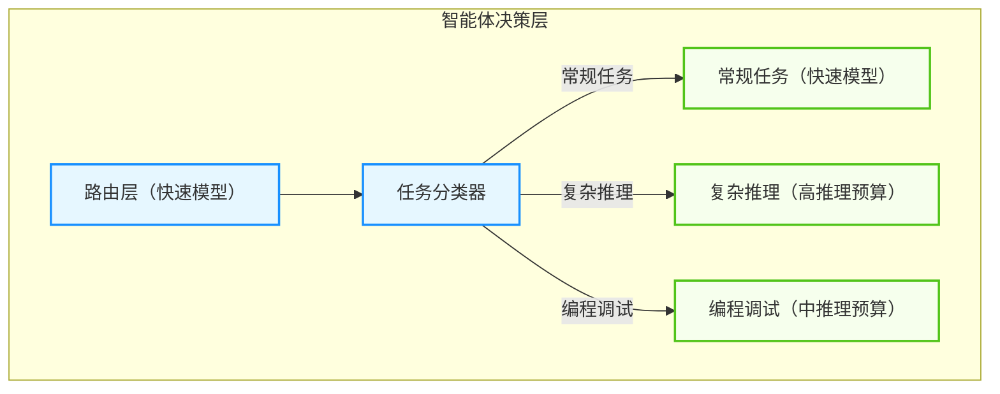
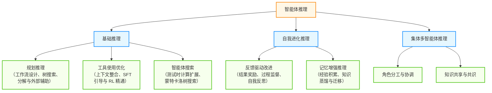

## 7.5 推理能力的提升：从快速响应到深度思考

传统的 LLM 采用 **系统 1** 思维模式——快速、直觉性的响应。随着推理能力的提升，一些模型开始更像“系统 2”思维——慢速、深思熟虑的推理过程，为智能体的决策能力带来显著增强。


### 7.5.1 从 CoT 到原生推理能力

思维链（Chain of Thought）的基础原理详见[第 2.1 节](../02_reasoning/2.1_cot.md)。本节聚焦于推理模型如何通过训练和推理时计算预算，将 CoT 从提示词技巧提升为原生模型能力。

**推理模型的核心特性**：

- 在回答前进行额外的内部推理或验证
- 通过强化学习（结果奖励 + 过程监督）优化思维过程
- 学会识别和纠正自己的错误，将复杂步骤分解为简单步骤

#### 7.5.1.1 推理增强模型的训练与能力特征

推理增强模型通常在两方面做工程化强化：

- **训练侧**：引入对多步推理、验证、回溯等行为的奖励信号（结果奖励 + 过程监督）。
- **推理侧**：允许在推理时分配更多计算预算（更长的推理、更严格的自检）。

常见效果包括：更强的多步规划、更稳健的错误修正、更高的“在复杂任务中坚持到底”的能力。

#### 7.5.1.2 推理模型的发展历程

2024 年以后，推理能力开始从“提示词技巧”逐步变成独立的模型产品能力。以 OpenAI 的 o 系列，以及 Anthropic 在 Claude 4.x 上暴露的 thinking / adaptive thinking 能力为代表，行业趋势变成了：把更多 **测试时计算（test-time compute）** 作为可配置能力交给开发者，而不是完全依赖一次前向生成。

根据 Anthropic 官方文档，Claude 4.x 的推理能力分为两种模式：

- **Extended Thinking**（`thinking: {"type": "enabled"}`）：支持 Claude Sonnet 4.6、Opus 4.6、Haiku 4.5 及更早版本，通过 `budget_tokens` 手动分配推理预算。
- **Adaptive Thinking**（`thinking: {"type": "adaptive"}`）：支持 Claude Opus 4.7 和 Sonnet 4.6，由模型自主决定推理深度，无需手动设置预算。
- **Claude Opus 4.7**：不支持 Extended Thinking，仅支持 Adaptive Thinking。Adaptive Thinking 是 Opus 4.7 唯一支持的推理模式，在 API 调用时无法再使用固定的 budget_tokens。

> **时效说明**
> 这一领域的模型命名、发布日期、价格与基准分数变化很快。正文更适合保留”能力形态”和”工程取舍”，具体型号与价格请以各厂商官方模型页和定价页为准。
### 7.5.2 测试时计算与推理预算

#### 7.5.2.1 推理时间的预算分配

推理模型允许给定一个“思考预算”（thinking budget），模型会在该时间范围内进行思考：
```python
# 伪代码：推理预算的概念

class ReasoningModel:
    def generate(
        self,
        prompt: str,
        thinking_budget: int = 5000,  # tokens
        output_budget: int = 2000,    # tokens
    ):
        # 第一阶段：思考（不对用户可见）
        thinking_chain = self.internal_reasoning(
            prompt,
            max_tokens=thinking_budget
        )

        # 第二阶段：输出（用户可见）
        output = self.generate_output(
            prompt,
            thinking_chain,
            max_tokens=output_budget
        )

        return {
            "thinking": thinking_chain,      # 推理摘要或推理痕迹（是否可见依平台而定）
            "output": output,                # 最终答案
            "thinking_tokens": len(thinking_chain),
            "confidence_score": self.compute_confidence(
                thinking_chain,
                output
            )
        }
```
#### 7.5.2.2 推理时间的缩放现象

研究与产品实践都表明：在不少 **困难且可验证** 的任务上，增加测试时计算往往能提升表现，但收益通常会递减，而且不同模型、任务与运行时设计的曲线差异很大。
```text
更稳妥的写法是：
Performance = f(model, task, test_time_compute, tooling, verifier)

其中 f 并不是跨任务通用的固定公式。
```
**关键发现**：
1. 在很多任务上，额外思考时间通常呈现边际收益递减
2. 预算最优点依赖任务类型、模型能力和成本约束
3. 不应把单一实验曲线当作跨模型、跨任务的通用定律

工程上更合理的做法是：用你自己的 eval 集分别测“禁用 thinking / 低预算 / 中预算 / 高预算”，再按成功率、延迟、成本三者共同定预算，而不是套用一个伪公式或固定收益百分比。

### 7.5.3 Deliberative Alignment

推理模型引入了**审慎对齐**——在推理过程中应用安全约束。通过训练模型在回答前显式推理安全规范，比传统对齐方法更能抵御攻击。详细的安全设计详见[第 11.2 节](../11_future/11.2_alignment.md)。

工程落地的关键是把安全规则变成可执行、可审计的系统能力：
- **策略外置**：核心安全规则放在运行时策略层与权限系统中
- **证据链与审计**：记录规则触发、动作拦截，并为决策打上 `trace_id`
- **最小权限**：对高风险工具启用审批与沙箱隔离

### 7.5.4 主流推理模型对比

#### 7.5.4.1 工作原理

```text
标准思维链 (Standard CoT)：
prompt + few-shot examples
         ↓
    [单一前向传递]
         ↓
  implicit reasoning → output


Adaptive / Extended Thinking：
prompt + thinking_config + tools
         ↓
    [迭代推理循环]
    ↙          ↖
内部思考    检验假设
  ↓          ↓
消除矛盾  修正错误
  ↓          ↓
构造方案  最终输出
    ↖          ↙
 [一致性检查]
         ↓
    output + reasoning_blocks
```
#### 7.5.4.2 API 使用示例

```python
from anthropic import Anthropic

client = Anthropic()

def adaptive_thinking_example(complex_task: str):
    """展示 Adaptive Thinking 调用方式（按官方文档）"""

    response = client.messages.create(
        model="claude-opus-4-7",
        max_tokens=16000,
        thinking={
            "type": "adaptive",
            # Opus 4.7 默认是 omitted；这里显式要求返回可读的摘要
            "display": "summarized",
        },
        output_config={"effort": "medium"},
        messages=[
            {
                "role": "user",
                "content": complex_task
            }
        ]
    )

    thinking_summaries = []
    text_blocks = []
    has_redacted_thinking = False

    for block in response.content:
        if block.type == "thinking" and block.thinking:
            thinking_summaries.append(block.thinking)
        elif block.type == "redacted_thinking":
            # 这是不透明的加密块；多轮工具调用时应原样传回 API
            has_redacted_thinking = True
        elif block.type == "text":
            text_blocks.append(block.text)

    return {
        "thinking_summary": "\n".join(thinking_summaries),
        "answer": "".join(text_blocks),
        "has_redacted_thinking": has_redacted_thinking,
    }

# 使用示例

task = """
设计一个微服务架构，支持：
1. 100万日活跃用户
2. 每用户日均10条请求
3. P99延迟 < 200ms
4. 可用性 > 99.9%

要求列出主要服务、通信模式、数据库设计和成本估算。
"""

result = adaptive_thinking_example(task)
```

在 Opus 4.7 上，thinking 内容默认被 omitted，即 thinking block 中的 `thinking` 字段为空。如需查看思考过程的摘要，应显式设置 `display: “summarized”`。不设置此项时，thinking block 仍存在于响应流中，但其文本为空；多轮连续推理的状态通常由内部协议字段维护，而非暴露的”完整思维链”。

**成本与工程特征**：

- 深度推理通常意味着更高的 token 消耗与更长的首字延迟。
- 一些平台会把“思考”作为独立预算暴露出来，另一些则把它封装在模型档位里。
- 是否返回思考内容、能否缓存、如何计费，都依赖具体平台实现。

#### 7.5.4.3 推理模型选型视角

与其维护很快过时的“型号排行榜”，更建议按 **能力形态** 比较推理模型：

| 形态 | 代表能力 | 优势 | 代价 | 更适合的 Agent 场景 |
|------|----------|------|------|---------------------|
| **托管式思考模式** | Claude Opus 4.x 的 thinking / adaptive thinking 一类能力 | 接入简单，预算可调，与现有工具链结合自然 | 供应商锁定更强，价格与返回格式依平台变化 | 复杂代码审查、架构设计、关键节点决策 |
| **独立推理产品线** | OpenAI o 系列一类”推理优先”模型 | 多步推理、自检和回溯通常更强 | 延迟更高，不适合所有交互节点 | 数学、规划、故障定位、复杂策略推演 |
| **开源推理模型** | DeepSeek-R1 一类可自托管推理模型 | 可私有化部署，可控性高，便于企业内网治理 | 运维和评测成本更高，实际表现受部署配置影响大 | 合规要求高、长期高频调用、需要自托管的系统 |

**选择建议**：

1. 不要先问“哪家分最高”，先问“哪个节点真的需要深推理”。
2. 如果任务是高价值、低频、可容忍数秒延迟，优先考虑推理模型。
3. 如果任务是高频、低复杂度、强交互，优先用普通模型或把推理预算压到最低。
4. 如果需要私有化、审计与成本封顶，优先评估开源推理模型，但要把运维与评测成本算进去。

**一个更稳定的决策矩阵**：

| 约束 | 建议 |
|------|------|
| 延迟极敏感 | 普通模型或低推理预算 |
| 决策错误代价高 | 推理模型 + 外部验证 |
| 任务需要多步证据整合 | 检索/工具优先，再启用推理 |
| 需要本地部署 | 优先评估开源推理模型 |

### 7.5.5 推理模型在智能体中的应用

#### 7.5.5.1 适用场景

**高价值的复杂决策**：
```python
from anthropic import Anthropic

client = Anthropic()

class ReasoningAgent:
    """使用推理模型的智能体"""

    def complex_decision(self, scenario: dict) -> dict:
        """需要深度推理的决策"""

        # 使用推理模型进行关键决策
        reasoning_response = client.messages.create(
            model="claude-opus-4-7",
            max_tokens=10000,
            thinking={
                "type": "adaptive"
            },
            messages=[{
                "role": "user",
                "content": f"""
                分析以下场景并制定行动计划：

                场景：{scenario}

                请考虑：
                1. 所有可能的风险
                2. 不同方案的利弊
                3. 潜在的副作用
                4. 最优执行路径
                """
            }]
        )

        return self.parse_decision(reasoning_response)

    def routine_action(self, task: str) -> str:
        """常规任务使用标准模型"""
        response = client.messages.create(
            model="claude-opus-4-7",
            max_tokens=1000,
            messages=[{"role": "user", "content": task}]
        )
        return response.content[0].text

    def parse_decision(self, response):
        """解析决策结果"""
        for block in response.content:
            if block.type == "text":
                return {"decision": block.text}
```
**智能体架构中的混合使用**：

```mermaid
graph TD
    %% Agentic Design System
    classDef agent fill:#e6f7ff,stroke:#1890ff,stroke-width:2px;
    classDef tool fill:#f6ffed,stroke:#52c41a,stroke-width:2px;

    subgraph DecisionLayer [智能体决策层]
        Router[路由层（快速模型）] --> Classifier[任务分类器]
        Classifier -->|常规任务| Routine[常规任务（快速模型）]
        Classifier -->|复杂推理| Complex[复杂推理（高推理预算）]
        Classifier -->|编程调试| Coding[编程调试（中推理预算）]
    end

    class Router,Classifier agent;
    class Routine,Complex,Coding tool;
```
图 7-4：混合推理模型架构

#### 7.5.5.2 成本权衡策略

**推理预算分配指南**：

| 任务类型 | 推理预算 | 示例 |
|---------|---------|------|
| 简单任务 | 低（标准模型） | 格式转换、信息提取、模板填充 |
| 中等任务 | 中（标准模型+CoT） | 多步骤问题求解、代码调试、数据分析 |
| 复杂任务 | 高（推理模型） | 数学证明、系统架构设计、安全审计 |

#### 7.5.5.3 典型应用案例

**代码审查 Agent**（基于上述 API 模式）：
```python
# 核心调用相同，prompt 改为：
"""
审查代码变更，特别关注：
1. 逻辑错误和边界情况
2. 安全漏洞（SQL注入、XSS等）
3. 性能问题和可维护性

代码变更：{pr_diff}
项目上下文：{context}

请提供：问题清单（按严重程度）、详细分析、修复建议
"""
```

**数学证明 Agent**（基于上述 API 模式）：
```python
# 核心调用相同，prompt 改为：
"""
验证数学证明的正确性：

定理：{theorem}
证明：{proof}

请逐步检查推理步骤，识别逻辑漏洞，确认定理应用正确性，给出总体评估
"""
```
### 7.5.6 成本与性能优化

**自动复杂度评估与模型选择**：

根据任务复杂度自动选择推理模型可以显著降低成本，同时保持高性能。
```python
class TieredReasoningAgent:
    """根据任务复杂度自动选择推理模型"""

    def estimate_complexity(self, task: str) -> str:
        """评估任务复杂度"""
        # 简单启发式规则
        if len(task) < 100 and "简单" in task:
            return "simple"
        elif len(task) < 300:
            return "medium"
        else:
            return "complex"

    def process_task(self, task: str) -> str:
        """根据复杂度选择模型"""

        complexity = self.estimate_complexity(task)

        if complexity == "simple":
            # 简单任务：使用快速模型
            return self.simple_model_response(task)

        elif complexity == "medium":
            # 中等任务：使用轻量推理
            return self.reasoning_mini_response(task)

        else:
            # 复杂任务：使用完整推理
            return self.full_reasoning_response(task)

    def simple_model_response(self, task: str) -> str:
        """直接使用标准模型"""
        response = Anthropic().messages.create(
            model="claude-opus-4-7",
            max_tokens=1000,
            messages=[{"role": "user", "content": task}]
        )
        return response.content[0].text

    def reasoning_mini_response(self, task: str) -> str:
        """使用轻量推理"""
        response = Anthropic().messages.create(
            model="claude-opus-4-7",
            max_tokens=4000,
            thinking={
                "type": "adaptive"
            },
            messages=[{"role": "user", "content": task}]
        )
        return response.content[0].text

    def full_reasoning_response(self, task: str) -> str:
        """使用完整推理"""
        response = Anthropic().messages.create(
            model="claude-opus-4-7",
            max_tokens=10000,
            thinking={
                "type": "adaptive"
            },
            messages=[{"role": "user", "content": task}]
        )
        return response.content[0].text


# 成本模拟

costs = {
    "simple": 0.01,        # $0.01/任务
    "medium": 0.05,        # $0.05/任务
    "complex": 0.20        # $0.20/任务
}

# 假设一个月有1万个任务，分布为：20%简单，50%中等，30%复杂

monthly_cost = (
    10000 * 0.20 * costs["simple"] +
    10000 * 0.50 * costs["medium"] +
    10000 * 0.30 * costs["complex"]
)

print(f"预计月成本: ${monthly_cost:.2f}")  # ~$920/月
```
#### 7.5.6.1 推理结果缓存

推理结果缓存可以避免对相同问题的重复推理，大幅降低成本。核心思路是对 prompt 计算哈希值，用 TTL 机制管理缓存有效期：

```python
import hashlib, json, time

class ReasoningCache:
    """推理结果缓存系统（简化版）"""

    def __init__(self, ttl_hours=24):
        self.cache = {}
        self.ttl_hours = ttl_hours

    def get_reasoning(self, prompt: str) -> str:
        key = hashlib.md5(prompt.encode()).hexdigest()

        # 检查缓存
        if key in self.cache:
            cached = self.cache[key]
            age_hours = (time.time() - cached["timestamp"]) / 3600
            if age_hours < self.ttl_hours:
                return cached["result"]

        # 执行推理（使用 client.messages.create）
        result = ... # 推理调用

        # 存储缓存
        self.cache[key] = {"result": result, "timestamp": time.time()}
        return result
```

**成本节省示例**：第一次调用消耗 $0.15；相同 prompt 的第二次调用从缓存返回，成本为 $0（节省 100%）。
### 7.5.7 局限与注意事项

#### 7.5.7.1 计算成本与延迟限制

- **Token 消耗不确定性**：推理模型在内部会生成大量隐式的“思考型 Token”，导致实际消耗的总 Token 量显著上升（在某些复杂任务的标准化评测中，综合消耗可能是同级别非推理模型的数倍，具体取决于任务类型）。
- **首字生成延迟 (TTFT) 增加**：由于需要先闭环完成内在思维链的初步推导，即使是中等复杂度的任务，首字响应延迟也可能从常规模型的百毫秒级飙升至数秒甚至十几秒。
- **不适合高频实时场景**：上述物理限制意味着它目前不适合用于需要极致低延迟的 C 端高频对话拦截、补全动作或流式 UI 反馈。

#### 7.5.7.2 能力边界

- 对于简单任务可能出现“过度推理”，导致成本上升。
- 若任务需要视觉/环境操作能力，需选择支持对应模态与工具调用的模型与运行环境。
- 复杂界面操作仍可能失败，需要人机协作与回退策略。

#### 7.5.7.3 推理模型的适用性判断

通过检查任务的特征，可以智能地判断是否应该启用推理模型，如下所示：
```python
def should_use_reasoning_model(task: dict) -> bool:
    """判断是否需要使用推理模型"""

    # 适合推理模型
    suitable_cases = [
        task.get("requires_multi_step_logic"),
        task.get("has_edge_cases"),
        task.get("needs_self_correction"),
        task.get("math_or_code_heavy"),
        task.get("critical_decision"),
        task.get("expected_failure_cost") and task.get("reasoning_model_cost") and
        task["expected_failure_cost"] > task["reasoning_model_cost"]
    ]

    # 不适合推理模型
    unsuitable_cases = [
        task.get("real_time_required"),
        task.get("simple_pattern"),
        task.get("already_cached"),
        task.get("latency_budget") and task["latency_budget"] < task.get("reasoning_latency_budget", 0)
    ]

    return any(suitable_cases) and not any(unsuitable_cases)
```
#### 7.5.7.4 推理模型的适用场景

**最适合使用推理模型**：
```text
✅ 最适合使用推理模型：
├─ 数学和逻辑问题
├─ 代码和架构设计
├─ 战略规划和决策
├─ 问题诊断
└─ 复杂约束求解

❌ 不适合使用推理模型：
├─ 实时性要求极高的任务
│  └─ 额外思考通常会显著增加首字延迟
├─ 高频低复杂度任务（如简单分类）
│  └─ 推理开销 > 问题难度增益
├─ 长上下文信息整合
│  └─ 推理对长上下文的处理不最优化
├─ 多轮交互任务
│  └─ 推理与交互的冲突
└─ 可视化生成
   └─ 推理对创意任务效果有限
```
#### 7.5.7.5 规避策略

为了在效果与成本之间取得平衡，常见做法是先把“推理模型”用在最关键的节点上：

- **分层路由**：简单任务走普通模型，复杂节点再升级到推理模型。
- **先证据后推理**：先用工具拿到关键事实与数据，再进行推理总结，减少长链幻觉。
- **回归与熔断**：维护回归样例集并设置成本告警，发现异常时自动降级或停止执行。

### 7.5.8 未来演进方向

#### 7.5.8.1 智能体推理的系统分类框架

2026 年初，Wei 等人在综述论文 *Agentic Reasoning for Large Language Models*（arXiv: 2601.12538）中，提出了一个三层分类体系，将智能体推理能力按环境复杂度递进组织。该框架为理解和设计智能体的推理系统提供了一个全面的认知地图。

```mermaid
graph TD
    classDef agent fill:#e6f7ff,stroke:#1890ff,stroke-width:2px;
    classDef tool fill:#f6ffed,stroke:#52c41a,stroke-width:2px;
    classDef user fill:#fff7e6,stroke:#fa8c16,stroke-width:2px;

    AR["智能体推理"] --> F["基础推理"]
    AR --> S["自我进化推理"]
    AR --> C["集体多智能体推理"]

    F --> F1["规划推理<br/>（工作流设计、树搜索、<br/>分解与外部辅助）"]
    F --> F2["工具使用优化<br/>（上下文整合、SFT<br/>引导与 RL 精通）"]
    F --> F3["智能体搜索<br/>（测试时计算扩展、<br/>蒙特卡洛树搜索）"]

    S --> S1["反馈驱动改进<br/>（结果奖励、过程监督、<br/>自我反思）"]
    S --> S2["记忆增强推理<br/>（经验积累、知识<br/>蒸馏与迁移）"]

    C --> C1["角色分工与协调"]
    C --> C2["知识共享与共识"]

    class AR user;
    class F,S,C agent;
    class F1,F2,F3,S1,S2,C1,C2 tool;
```
图 7-5：智能体推理三层分类体系（基于 Wei et al., 2026）

三层体系的核心特征如下：

- **基础智能体推理**（Foundational）：单智能体在相对稳定的环境中完成规划、工具调用和搜索。本书 [第 2 章](../02_reasoning/README.md) 讨论的 CoT、ToT、ReAct 等技术均属于此层。论文进一步区分了 **上下文内推理**（in-context reasoning，通过提示词编排在推理时实现）与 **训练后推理**（post-training reasoning，通过强化学习和监督微调将推理能力内化到模型权重中）。这一区分对工程选型有直接指导意义：前者灵活但依赖提示词质量，后者稳定但需要训练投入。

- **自我进化推理**（Self-Evolving）：智能体通过反馈信号（结果奖励、过程监督）和记忆机制不断改进自身推理策略。本书 [2.4 反思与自我修正](../02_reasoning/2.4_reflexion.md) 和 [7.4 持续学习](7.4_continuous_learning.md) 已覆盖部分内容。论文强调，自我进化的关键在于将短期经验转化为可复用的长期策略——这与 [第 3 章 记忆系统](../03_memory/README.md) 中讨论的记忆层次化设计紧密呼应。

- **集体多智能体推理**（Collective）：多个智能体通过角色分工、知识共享和协商达成共识。本书 [第 5 章 协作](../05_collaboration/README.md) 对此有详细讨论。论文的新贡献在于将多智能体协作也纳入“推理”范畴——协调本身就是一种分布式推理过程。

**对工程实践的启示**：

1. **推理策略选型**：简单工具调用场景使用上下文内推理即可；高频关键决策场景应考虑训练后推理（如 RL 微调）以获得更稳定的性能。
2. **进化闭环设计**：生产系统应内建从“执行 → 反馈 → 记忆 → 策略更新”的完整循环，而非仅做一次性部署。
3. **多智能体推理开销**：集体推理虽然强大，但协调通信的开销随智能体数量超线性增长，需要在任务复杂度与系统开销间权衡。

#### 7.5.8.2 测试时计算扩展

推理模型往往能从额外的测试时计算中受益，但更准确的说法是“常相关、需实测”，而不是简单线性关系：
```text
更多训练时计算和更多测试时计算，都可能提升推理表现；
两者如何组合，取决于具体模型、任务与验证器设计。
```
**实践启示**：

- 关键决策可通过增加推理时间提升准确度
- 多样本共识（Consensus）进一步提升可靠性
- 动态调节推理深度实现成本与质量平衡

#### 7.5.8.3 与智能体系统的深度整合

推理模型在智能体架构中的集成遵循分层路由策略：简单任务使用快速模型，中等任务启用轻量推理并自我验证，复杂任务升级到深度推理。这一策略在第 7.5.5 节的混合使用架构中已详细说明，同时在第 7.5.6 节的成本权衡策略中提供了具体的任务分类与预算配置指南。

### 7.5.9 小结

推理模型代表了 AI 能力的重要进步：

1. **思维方式转变**：从快速直觉到深度推理
2. **性能提升**：在数学、编程、科学等一部分高难任务上显著提升表现
3. **安全对齐**：通过 **审慎对齐** 提升安全性
4. **灵活配置**：可调节推理深度实现成本与质量平衡
5. **智能体应用**：在复杂决策、代码审查、数学证明等场景价值显著

**对智能体开发的启示**：

- 混合架构：将推理模型用于关键决策节点
- 成本优化：智能路由实现成本与质量平衡
- 延迟管理：根据场景选择合适的推理深度
- 信任升级：更可靠的推理支持更高自主性

---

**上一节**: [7.4 持续学习与知识更新](7.4_continuous_learning.md)

**下一节**: [本章小结](summary.md)
