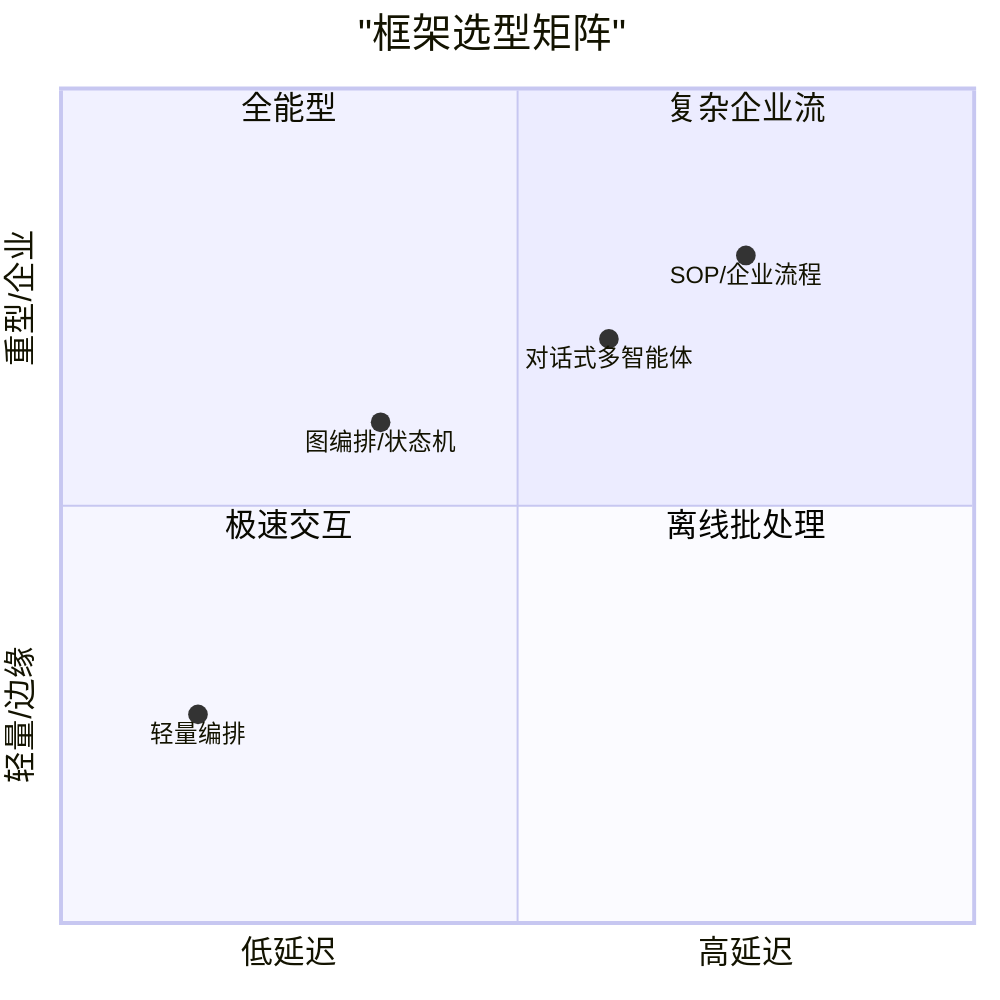

## 8.7 框架性能基准评测

在选择智能体框架时，功能往往是第一考量，但随着应用从原型走向生产，**性能** 逐渐成为决定生死的关键。如今，模型推理速度已不再是唯一瓶颈，框架本身的运行时开销在端侧和高频场景下愈发凸显。

本节将从延迟、内存、Token 开销和并发能力四个维度，对主流框架进行基准评测对比。

### 8.7.1 评测维度与环境

框架性能对比高度依赖运行环境与任务形态。更建议把评测设计成可复现的基准套件，并在你的真实部署环境中跑：

- **延迟**：端到端 TTFT、工具调用往返、队列等待。
- **内存**：空闲占用、峰值占用、并发增长曲线。
- **Token 开销**：系统提示词/协议头/中间消息的隐性膨胀。
- **并发能力**：异步模型、批处理能力、背压与限流策略。

### 8.7.2 延迟分析

延迟主要来自三部分：模型推理、工具执行、以及框架编排开销。评测时建议拆分并分别记录：

- **模型层**：请求排队、首字延迟、流式输出速度。
- **工具层**：外部 API 延迟、重试/退避策略、并发限制。
- **编排层**：状态序列化/反序列化、消息路由、检查点与恢复。

对实时交互应用，优先关注“最坏情况延迟（P95/P99）”与“中断/恢复”的用户体验。

### 8.7.3 内存占用

内存占用通常由：依赖库体积、索引/缓存常驻、并发会话状态、以及中间结果存储决定。端侧/Serverless 场景建议：

- 避免常驻大索引与大对象缓存
- 对工具结果做卸载（文件/对象存储）
- 对会话状态做裁剪与摘要

### 8.7.4 Token 开销

Token 开销常被低估：框架可能隐式注入系统提示词、协议头、路由说明、工具 Schema 与中间对话。建议把“实际发送的输入 Token”作为一等指标：

- 系统提示词是否可复用/可缓存
- 工具定义是否可按需加载
- 中间结果是否需要回填全文还是回填摘要/引用

### 8.7.5 并发与吞吐量

并发能力取决于框架是否支持异步执行、是否能批处理模型请求、以及是否能对工具调用做限流与背压。建议评测：

- 并发会话数从 1→N 时的吞吐量曲线
- 工具调用限流下的排队与超时
- 失败重试对系统稳定性的影响

### 8.7.6 选型建议矩阵

根据上述评测，给出选型建议：

图 8-1：框架选型象限图

- **实时交互 / 边缘侧**：优先轻量、低状态的编排形态。
- **企业级业务流**：优先图编排/状态机，强调可控性与可审计。
- **多智能体仿真 / 离线分析**：可接受更高延迟以换取更强的协作与验证机制。

---

**下一节**: [本章小结](summary.md)
