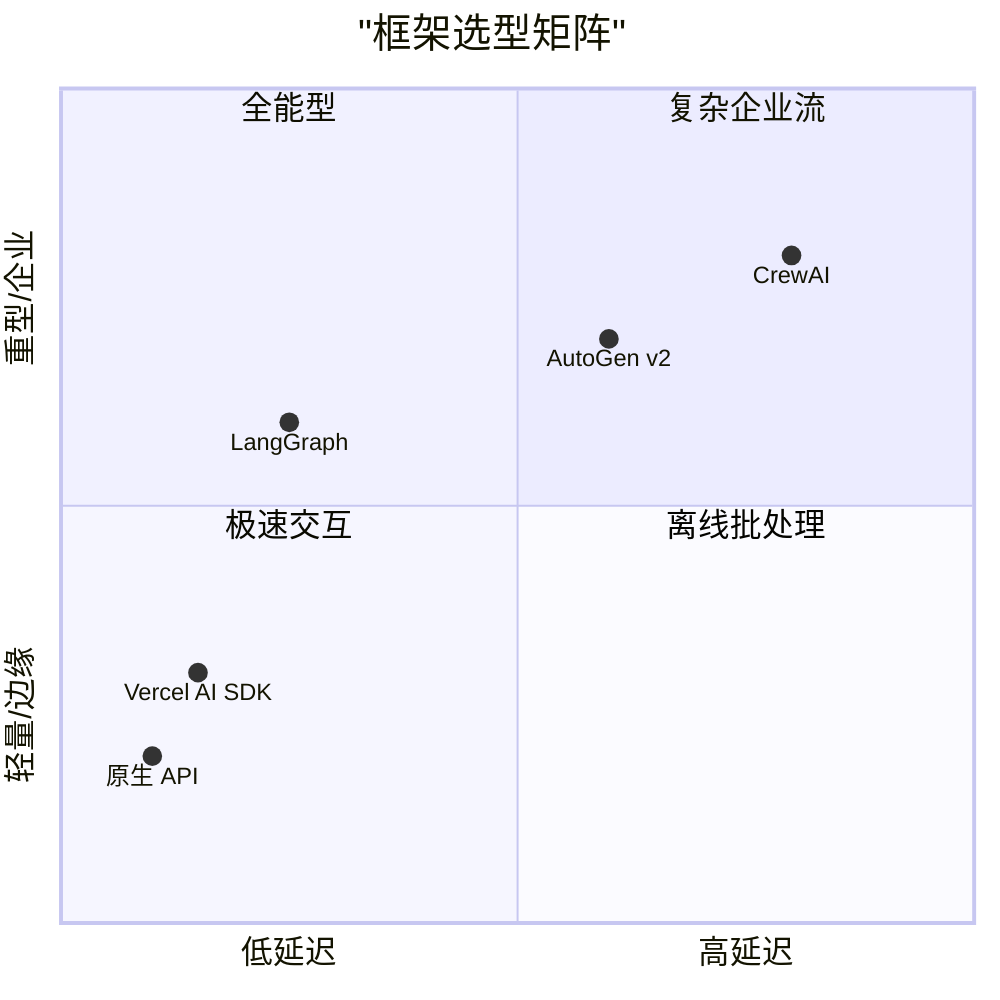

## 8.7 框架性能基准评测

在选择智能体框架时，功能往往是第一考量，但随着应用从原型走向生产，**性能**逐渐成为决定生死的关键。如今，模型推理速度已不再是唯一瓶颈，框架本身的运行时开销在端侧和高频场景下愈发凸显。

本节将从延迟、内存、Token 开销和并发能力四个维度，对主流框架进行基准评测对比。

### 8.7.1 评测维度与环境

为了保证公正性，我们将评测环境设定为：
- **硬件**：AWS g6.2xlarge (专为 AI 推理优化的最新一代实例)
- **模型**：统一使用 **GPT-5** (通过模拟服务固定延迟以测试框架损耗)
- **任务**：
    1. **Hello World**：简单的问答。
    2. **RAG 查询**：检索 + 生成。
    3. **ReAct 循环**：3 轮工具调用。

### 8.7.2 延迟分析

框架本身会引入多少延迟？这是高频交易或实时交互场景最关心的。随着 **LangGraph Core** 等框架底座向 Rust 迁移，脚本语言的性能瓶颈正在被打破。

| 框架 | Hello World (ms) | ReAct 3-Turn (ms) | 评价 |
| :--- | :--- | :--- | :--- |
| **原生 API (OpenAI SDK)** | < 1 | 5 | **基准线**。几乎无损耗。 |
| **LangGraph (Rust Core)** | 5 | 25 | 得益于 2025 年底的 Rust 重构，状态管理延迟大幅降低。 |
| **Vercel AI SDK** | 3 | 12 | **极速**。专为边缘运行时 (Edge Runtime) 优化，由流式 (Stream) 驱动。 |
| **AutoGen v2** | 40 | 120 | 相比 v1 有质的飞跃，改为事件驱动架构，但多智能体通信仍有开销。 |
| **CrewAI Enterprise** | 80 | 250 | 依然偏重，但在企业级任务中，这点延迟换来的是确定性 SOP。 |

> **结论**：对于延迟敏感的 C 端应用（如实时语音助手），**Vercel AI SDK** 或原生 API 是首选。LangGraph 已经足以应付 99% 的生产场景。

### 8.7.3 内存占用

在 Serverless 或边缘设备（如 AI PC、手机）上部署时，内存占用直接影响成本和稳定性。

| 框架 | 空闲内存 (MB) | 峰值内存 (MB) | 说明 |
| :--- | :--- | :--- | :--- |
| **原生 API** | 5 | 10 | 极简。 |
| **Vercel AI SDK** | 12 | 25 | **轻量级冠军**。Web 标准优先设计。 |
| **LangGraph** | 30 | 85 | 状态快照 (Checkpointer) 优化了内存结构。 |
| **AutoGen v2** | 60 | 150 | Actor 模式虽然解耦了，但并发 Actor 的内存开销不容忽视。 |
| **LlamaIndex** | 80 | 400+ | **以空间换时间**。大规模向量索引常驻内存依然是痛点。 |

> **警示**：边缘侧智能体 (Edge Agents) 对内存极为敏感。如果是端侧部署，请直接避开重型 Python 框架，考虑 Wasm 或专门的边缘运行时。

### 8.7.4 Token 开销

框架为了通过提示词工程提升效果，往往会在你看不到的地方塞入大量系统提示词。这不仅费钱，还占用上下文窗口（尽管 GPT-5 窗口很大，但注意力机制计算量依然是成本）。

**测试场景**：用户输入 "修复这个 Bug"。

| 框架 | 实际发送 Token 数 | 额外开销 | 原因分析 |
| :--- | :--- | :--- | :--- |
| **原生 API** | 5 | 0 | 无。 |
| **LangGraph** | 120 | 小 | 默认提示词极其克制，鼓励开发者自定义。 |
| **CrewAI** | 800+ | **大** | 依然坚持"人设先行"，每个智能体都有详细的背景故事。 |
| **AutoGen v2** | 300+ | 中 | 群聊协议头优化了，但为了防幻觉仍需注入不少护栏 (Guardrails)。 |

> **最佳实践**：现在的模型已经足够聪明，不再需要像当年那样写一大堆"你是一个有 20 年经验的专家"这类废话。**提示词极简主义** (Prompt Minimalism) 是现在的趋势。

### 8.7.5 并发与吞吐量

| 框架 | 异步支持 (AsyncIO) | 备注 |
| :--- | :--- | :--- |
| **LangGraph** | ✅ 完美 | 原生异步流处理，支持数千智能体并行调度。 |
| **Vercel AI SDK** | ✅ 完美 | 基于 Web Streams API，高并发是看家本领。 |
| **AutoGen v2** | ✅ 良好 | 全面拥抱异步 Actor 模型，解决了 v1 的阻塞痛点。 |
| **CrewAI** | ⚠️ 改进中 | 逐步引入异步执行，但主要逻辑仍偏向串行 SOP。 |

### 8.7.6 选型建议矩阵

根据上述评测，我们给出选型建议：

*   **ToC 实时应用 / Edge**：**Vercel AI SDK** 或 **LangGraph.js**。
*   **企业级业务流**：**LangGraph (Python/Rust)** 是统治级标准。
*   **多智能体仿真 / 离线分析**：**AutoGen v2** 或 **CrewAI**，利用它们强大的组织模拟能力。

---

**下一节**: [本章小结](summary.md)
