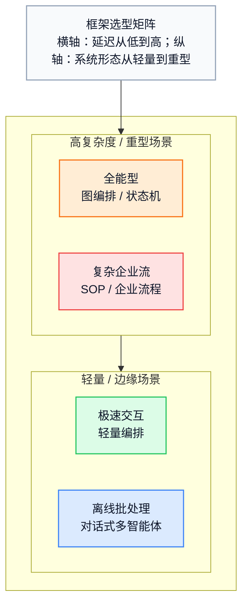

## 8.7 框架性能基准评测

在选择智能体框架时，功能往往是第一考量，但随着应用从原型走向生产，**性能** 逐渐成为决定生死的关键。如今，模型推理速度已不再是唯一瓶颈，框架本身的运行时开销在端侧和高频场景下愈发凸显。

但在这一主题上，最容易犯的错误恰恰是：把某个环境下测出来的一组数字，误写成“框架的客观排名”。对智能体系统而言，延迟、内存、Token 开销和并发能力都高度依赖 **模型、工具、网络、状态持久化方式、以及是否使用托管运行时**。

因此，本节的重点不是给出一张“看起来精确”的排行榜，而是说明 **如何做一套可复现、可解释、可迁移的 benchmark**。

框架性能对比高度依赖运行环境与任务形态。在任何企业级评测项目中，**最核心的产出往往不是一份结论数据，而是一套可复现的基准评测套件 (Benchmark Suite)**。

强烈建议该套件遵循标准化的工程组织，以下给出一个标准的性能基准套件 `README.md` 结构模板参考：

````markdown
# Agent Framework Benchmark Suite

## 1. 环境声明

- **硬件配置**：CPU / GPU 型号、网络带宽、内存容量
- **基础依赖**：操作系统版本、基座语言环境（如 Python 3.11+）
- **模型服务**：精确模型 ID（如 `gpt-5.4-mini` 或 `gemini-2.5-flash`）、部署形态（公有云 SaaS / 私有化 vLLM）

## 2. 评测指标定义

- **Time To First Token (TTFT)**: 收到请求到返回第一个生成 Token 的 P95 时间 (ms)
- **End-to-End Latency**: 包含工具调用与框架编排的全链路端到端 P95 延迟 (ms)
- **Token Amplification Rate**: 框架隐式注入协议与路由配置导致的 Token 膨胀系数
- **Peak Memory Usage**: 满载并发压测下的进程峰值内存开销 (MB)

## 3. 运行指南

```bash
# 启动压测示例

export TARGET_FRAMEWORK="langgraph"
export MOCK_API_DELAY_MS=200
export CONCURRENCY_LEVEL=50
pytest tests/benchmarks/ --benchmark-only
```
````

具体来说，在设计上述套件时，需重点监控以下四个维度的指标波动：

- **延迟**：端到端 TTFT、工具调用往返、队列等待。
- **内存**：空闲占用、峰值占用、并发增长曲线。
- **Token 开销**：系统提示词/协议头/中间消息的隐性膨胀。
- **并发能力**：异步模型、批处理能力、背压与限流策略。

还要补上一条经常被忽略的约束：**如果你的评测包含平台托管工具（如 hosted shell / code interpreter / browser），那测到的其实是“框架 + 平台运行时 + 工具环境”的组合开销，而不是纯编排层开销。**

### 8.7.2 延迟分析

延迟主要来自三部分：模型推理、工具执行、以及框架编排开销。评测时建议拆分并分别记录：

- **模型层**：请求排队、首字延迟、流式输出速度。
- **工具层**：外部 API 延迟、重试/退避策略、并发限制。
- **编排层**：状态序列化/反序列化、消息路由、检查点与恢复。

对实时交互应用，优先关注“最坏情况延迟（P95/P99）”与“中断/恢复”的用户体验。

### 8.7.3 内存占用

内存占用通常由：依赖库体积、索引/缓存常驻、并发会话状态、以及中间结果存储决定。端侧/Serverless 场景建议：

- 避免常驻大索引与大对象缓存
- 对工具结果做卸载（文件/对象存储）
- 对会话状态做裁剪与摘要

### 8.7.4 Token 开销

Token 开销常被低估：框架可能隐式注入系统提示词、协议头、路由说明、工具 Schema 与中间对话。建议把“实际发送的输入 Token”作为一等指标。

**测量方法**：

在评估框架性能时，一个常被忽视的指标是 **框架自身对 Token 的膨胀效应**。除了用户业务逻辑所需的 Token，框架可能在幕后注入额外的协议、路由配置、中间步骤说明等，这些“看不见的 Token”会直接影响成本。

**测量步骤**：

1. **基线测试**（最小化框架干预）：
   - 直接调用 LLM API，发送最小必要的提示词
   - 记录实际发送的 Input Tokens（从 API 响应的 `usage.prompt_tokens` 读取）
   - 这个数值作为“理论最优 Token 数” `T_baseline`

2. **框架测试**（完整编排）：
   - 通过目标框架执行同一任务（工具定义、系统提示、中间步骤完整）
   - 监控框架发送给 LLM API 的所有请求，累计 Input Tokens
   - 记录为 `T_framework`

3. **计算膨胀系数**：

```text
框架开销比 = T_framework / T_baseline

示例：
- T_baseline = 2,000 tokens (用户 prompt)
- T_framework = 2,800 tokens (用户 prompt + 系统提示词 + 工具 Schema)
- 膨胀系数 = 2,800 / 2,000 = 1.4 (额外 40% 开销)
```

4. **归因分析**：拆解这 800 个额外 Token 的来源：
   - 系统提示词：X tokens
   - 工具定义（JSON Schema）：Y tokens
   - 中间对话记录（工具调用历史）：Z tokens
   - 协议头与路由信息：W tokens

**优化策略**（包括提示词缓存、上下文压缩、计划缓存等）详见[第 9.4 节](../09_agentops/9.4_optimization.md)。本节重点在于**如何测量和解释 Token 膨胀系数**，而不是在缺乏统一实验条件时轻率比较具体框架的绝对高低。

### 8.7.5 并发与吞吐量（续）

并发能力取决于框架是否支持异步执行、是否能批处理模型请求、以及是否能对工具调用做限流与背压。建议评测：

- 并发会话数从 1→N 时的吞吐量曲线
- 工具调用限流下的排队与超时
- 失败重试对系统稳定性的影响

**极简性能打点模板（续）**：

为了方便在真实的业务代码中落地性能指标搜集，以下提供一个极简的 Python 评测上下文管理器脚手架。建议在重构智能体框架的关键执行节点包裹此代码，以建立基线：

```python
import time
import tracemalloc

class AgentBenchmark:
    def __init__(self, name: str):
        self.name = name
        self.metrics = {}

    def __enter__(self):
        tracemalloc.start()
        self.start_time = time.perf_counter()
        return self

    def __exit__(self, exc_type, exc_val, exc_tb):
        self.metrics["latency_ms"] = (time.perf_counter() - self.start_time) * 1000
        current, peak = tracemalloc.get_traced_memory()
        self.metrics["peak_memory_mb"] = peak / 10**6
        tracemalloc.stop()
        # 实际生产中应写入 Prometheus 或可观测背板
        print(
            f"[{self.name}] Latency: {self.metrics['latency_ms']:.2f}ms | "
            f"Peak RAM: {self.metrics['peak_memory_mb']:.2f}MB"
        )

# 使用示例：
# with AgentBenchmark("Agent_Tool_Call_Chain"):
#     response = agent_executor.invoke("分析财务数据并绘图")
```

### 8.7.5.1 示意读表示例（非公开 benchmark 结论）

下表**不是**某组公开基准的真实测量结果，而是一个**明确标注的假设示意表**，只用于说明“应该如何读这类表”。如果你要比较 LangGraph、CrewAI、AG2、LlamaIndex Workflows 等具体框架，必须在同一模型、同一工具、同一网络条件、同一状态持久化策略下重新实测。

| 编排形态（示意） | 端到端延迟 (P95, ms) | 峰值内存占用 (MB) | Token 膨胀系数 | 并发能力评级 |
|------|------------------|-----------------|----------------|-----------|
| 轻量链式编排（假设） | 180 | 60 | 1.10× | 高 |
| 图编排 / 状态机（假设） | 260 | 90 | 1.25× | 高 |
| 角色任务编排（假设） | 420 | 140 | 1.60× | 中 |
| 对话式多智能体（假设） | 520 | 160 | 1.90× | 中 |

**这个示意表想表达的只有三点**：

- 控制流越复杂、轮次越多，编排层开销通常越高。
- “更慢”不一定代表“更差”，因为多轮协作可能换来更好的成功率、可审计性或恢复能力。
- 如果工具调用本身远慢于模型推理，编排层差异可能被外部 I/O 完全淹没。

### 8.7.6 选型建议矩阵

根据上述方法学，可以给出更稳妥的选型建议：


```mermaid
flowchart TB
    classDef axis fill:#f8fafc,stroke:#94a3b8,stroke-width:1.5px,color:#0f172a;
    classDef q1 fill:#fee2e2,stroke:#ef4444,stroke-width:1.5px,color:#0f172a;
    classDef q2 fill:#ffedd5,stroke:#f97316,stroke-width:1.5px,color:#0f172a;
    classDef q3 fill:#dcfce7,stroke:#22c55e,stroke-width:1.5px,color:#0f172a;
    classDef q4 fill:#dbeafe,stroke:#3b82f6,stroke-width:1.5px,color:#0f172a;

    Title["框架选型矩阵<br/>横轴：延迟从低到高；纵轴：系统形态从轻量到重型"]:::axis

    subgraph Matrix[" "]
        direction TB
        subgraph Top["高复杂度 / 重型场景"]
            direction LR
            Q2["全能型<br/>图编排 / 状态机"]:::q2
            Q1["复杂企业流<br/>SOP / 企业流程"]:::q1
        end
        subgraph Bottom["轻量 / 边缘场景"]
            direction LR
            Q3["极速交互<br/>轻量编排"]:::q3
            Q4["离线批处理<br/>对话式多智能体"]:::q4
        end
    end

    Title --> Top
    Top --> Bottom
```

**图 8-1：框架选型象限图**

- **实时交互 / 边缘侧**：优先轻量、低状态的编排形态，并尽量把工具延迟和网络抖动单独测出。
- **企业级业务流**：优先图编排 / 状态机，接受一定编排开销，换取可控、可审计、可恢复。
- **多智能体仿真 / 离线分析**：可以接受更高延迟和 Token 放大，以换取更强的协作、验证与分工。
- **平台能力对比**：若对比对象混入托管运行时或 hosted tools，应把“平台执行环境”单列为实验变量，避免把平台优势误写成框架优势。

---

**下一节**: [本章小结](summary.md)
