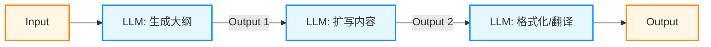
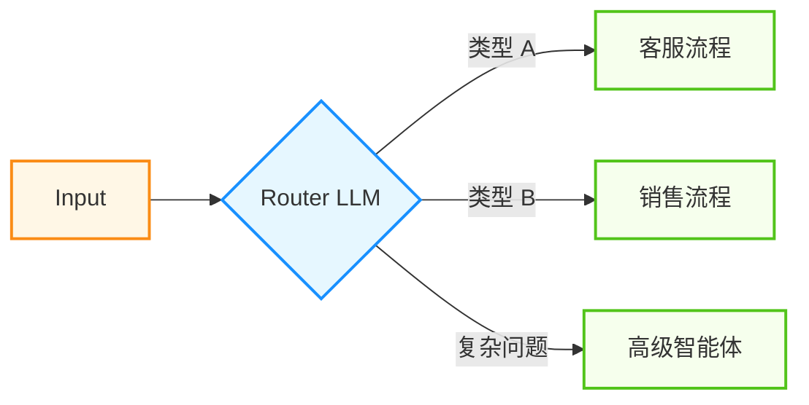
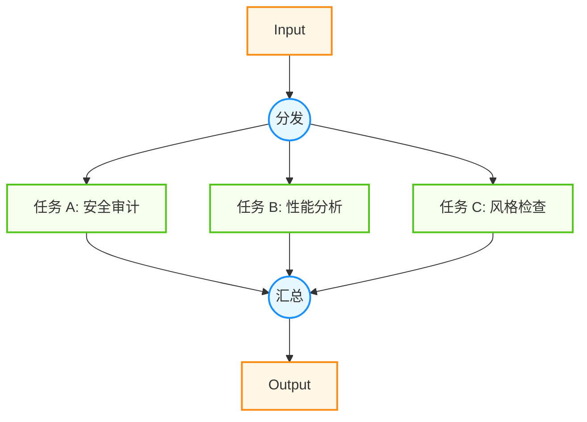
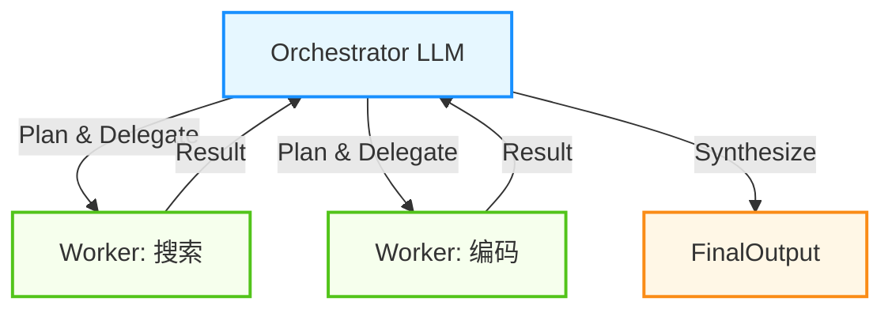
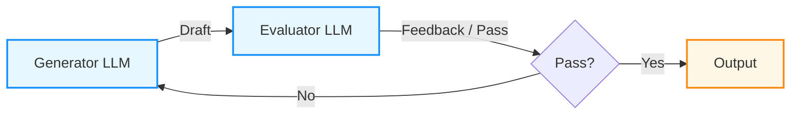
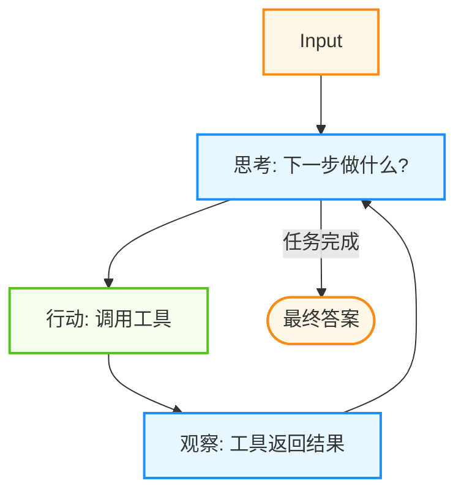

## 9.1 设计模式：从 Workflow 到 Agent

最成功的系统往往不是用最复杂的框架构建的，而是使用了简单、可组合的模式。

在构建 LLM 应用时，常面临一个核心选择：**谁来负责编排多个智能体和任务？**

根据编排方式的不同，可将系统划分为两种典型的架构：

* **静态编排**：
    * **核心**: 代码主导 (Code-driven)。开发者预先定义好执行路径（如 `if/else`, `loop`）。
    *   LLM 可以参与决策，但仅限于在**预定义的路径**中进行选择，无法改变系统预设的**控制流拓扑**。
    * **特点**: 确定性强，路径固定，性能可控。
    
* **自主编排**：
    * **核心**: 模型主导 (Model-driven)。系统给予 LLM 目标和工具，由 LLM 自主决定执行步骤。
    *   模型根据环境反馈动态调整策略，决定“下一步做什么”。
    * **特点**: 适应性强，能应对未知情况，但不可控性增加。

> [!NOTE]
> 实际上，静态编排和自主编排并非对立，实践中往往是两者的结合。越接近自主编排，系统越灵活，但可靠性越难保证；越接近静态编排，系统越稳定，但泛化能力越弱。

本节将详细解析这两种架构下的核心设计模式。

### 9.1.1 静态编排：确定性工作流

当任务可以被清晰分解时，应优先使用 **静态编排**。它们能提供更高的可预测性和更低的延迟。

#### 1. 提示词链

最基础的模式。将任务分解为一系列线性步骤，上一步的输出作为下一步的输入。



* **适用场景**：文案生成（大纲->初稿->润色）、简单的数据处理管道。
* **优势**：延迟较低，易于调试；每个节点可以使用不同规格的模型（例如大纲用高质量模型，扩写用低成本模型）。
* **权衡**：如果中间某一步出错，错误会级联传导。

#### 2. 路由分发

根据输入内容的分类，将其导向不同的后续流程。这不仅是分类，更是**专业化分工**的体现。



* **适用场景**：
    * **客服分流**：根据用户意图（售后/投诉/咨询）路由到不同处理模块。
    * **模型分层**：简单问题路由给低成本模型，复杂问题路由给高质量模型。
* **实现技巧**：Router 可以是一个专门微调过的分类小模型，也可以是基于 Embedding 的向量相似度匹配，只需极低的开销。

#### 3. 并行执行

利用 LLM 并行处理能力，同时执行多个任务，提升速度或质量。包括两个变体：

* **切片**: 将大任务拆解为独立的子任务并行处理。
    *   *例子*: 给出一段长代码，同时运行三个 LLM 分别检查“安全性”、“性能”和“代码风格”，最后汇总。
* **投票 (Voting / Majority Vote)**: 对同一任务运行多次，通过投票减少幻觉。
    *   *例子*: 让 3 个模型分别“找出文中的事实错误”，取交集或多数票。



#### 4. 编排者-工作者

当子任务无法预知或需要动态生成时，通过一个中心编排者来分派任务。这就像是一个“包工头”带着一群“工人”。



* **流程**:
    1.  Orchestrator 分析用户请求，分解出需要执行的子任务。
    2.  并行或串行调用相应的 Worker LLM 或工具。
    3.  收集 Worker 的结果，进行综合（Synthesize），生成最终回复。
* **适用场景**：复杂编码任务（修改一个功能涉及多个文件）、多源信息调研。
* **区别**：虽然子任务列表是动态的，但**执行模式是固定的**（例如：Split -> Map -> Reduce），依然属于静态编排；而自主智能体可以自主决定是否循环、调用何种工具，流程拓扑是动态的。

#### 5. 评估者-优化者

评估者-优化者模式即经典的 **反思** 模式。在一个循环流程中，引入“评估者”角色来提升质量。



* **流程**：生成器 (Generator) 生成初稿 -> 评估者 (Evaluator) 提出修改意见 -> 生成器 (Generator) 优化 -> 循环。
* **适用场景**：高质量翻译、复杂代码生成。
* **关键点**：必须设置明确的终止条件（如最大循环次数或评分阈值），防止死循环。

---

### 9.1.2 自主编排：智能体与动态决策

当无法预定义路径时，需要让 LLM 接管控制权，即 **自主编排** 模式。此时，智能体不仅仅是调用工具，更是模拟这种**认知循环**。

常见的自主编排模式包括：ReAct、规划与执行、多智能体协作。

#### 1. ReAct

这是最经典的单智能体模式（详见 [2.3 节](../02_reasoning/2.3_react.md)）。



* **Traces 示例**:
    ```text
    Thought: 用户想知道北京现在的天气。我需要调用天气查询工具。
    Action: search_weather(city="Beijing")
    Observation: 25°C, Sunny.
    Thought: 此时天气不错。用户还问了适合穿什么。基于天气...
    Action: search_clothing_recommendation(temp="25°C")
    ...
    ```
* **核心挑战**: 容易陷入循环，或在高压环境下（如复杂多步推理）迷失目标。

#### 2. 规划与执行

为了解决 ReAct “走一步看一步”导致的短视问题，引入了显式的**规划**阶段。

* **阶段一：规划 (Planner)**
    *   LLM 接收复杂请求，不直接执行，而是输出一个 `Step-by-Step Plan`。
* **阶段二：执行 (Executor)**
    *   按照 Plan 逐条执行。如果执行中遇到阻碍，可以请求 Planner **重规划 (Replanning)**。

> [!TIP]
> **Cursor 的 Plan Mode** 就是这种模式的最佳实践。它先扫描代码库，生成 Implementation Plan，用户确认后，再一步步 Apply Changes。

#### 3. 多智能体协作

当单体智能体复杂度过高时，通常将其拆分为多智能体系统。

* **层级制**: 
    *   类似于公司组织架构。
    * **管理智能体**: 负责拆解目标，监督进度，协调资源。
    * **专家智能体**: 专注特定领域（如 DB设计专家、前端专家、QA专家）。
    *   *优势*: 权责分明，管理者可以纠正下属的错误。

* **协作制**:
    *   类似于头脑风暴会议。
    *   多个智能体（如 Developer + Tester）处于同一个会话中，都能通过消息总线发言。
    *   通常需要一个发言选择（Speaker Selection）机制来决定谁下一个发言。

* **竞争制**:
    *   多个智能体对同一问题持不同立场，通过辩论提升决策质量。
    *   详见 [6.3 节博弈论与群体智能](../06_communication/6.3_game_theory.md)。

### 9.1.3 模式选择指南

如何决定使用哪种模式？主要参考 **不确定性**和**复杂性**两个维度。这对应了认知科学中的**快思考**与**慢思考** 理论。

| 模式 | 认知模式 | 适用场景 | 复杂度 | 成本 |
| :--- | :--- | :--- | :--- | :--- |
| **提示词链** | 快思考 | 任务固定，步骤明确 | ⭐ | 💲 |
| **路由分发** | 快思考 | 任务有几个明确变体 | ⭐⭐ | 💲 |
| **并行执行** | 快思考 | 独立子任务，关注速度/覆盖面 | ⭐⭐ | 💲💲 |
| **编排者模式** | 混合态 | 动态子任务，需要统一协调 | ⭐⭐⭐ | 💲💲 |
| **评估优化** | 慢思考 | 质量优先，容忍高延迟 | ⭐⭐⭐ | 💲💲💲 |
| **ReAct 智能体** | 慢思考 | 开放式探索，步骤未知 | ⭐⭐⭐⭐ | 💲💲💲 |
| **自主规划** | 慢思考 | 极度复杂，长跨度任务 | ⭐⭐⭐⭐⭐ | 💲💲💲💲 |

> [!IMPORTANT]
> **Start Simple**: 总是从简单的静态编排开始。只有当固定流程无法应对需求的变化时，才引入自主编排。过早引入自主编排会导致系统变得不可预测且难以调试。

### 9.1.4 行业最佳实践

本节将依次介绍“行业共识”与“落地清单”等内容。

#### 行业共识

工程实践中，一个反复被验证的经验是：**优先使用简单、可组合的静态模式**，在必要时再引入更强的自主性与动态规划。

同时，围绕“跨模型/跨工具互操作”的标准化工作也在推进，例如将“工具描述、权限边界、上下文传递、可观测性事件”做成可移植的协议与数据结构（相关内容可结合 [4.3 节](../04_tools/4.3_mcp.md) 阅读）。这些努力使得上述设计模式更容易跨框架复用。

#### 落地清单

如果你需要把设计模式从“概念”落到“能上线”，可以先用这份最小清单做自检：

- 明确任务完成条件与最大步数，避免无限循环
- 为高风险工具设置审批与最小权限，并在运行时硬拦截
- 为关键链路打上 `trace_id`，并记录工具调用与结果作为证据链
- 维护回归样例集，支持版本对比与灰度发布

---

**下一节**: [可观测性与调试](9.2_observability.md)
