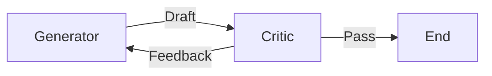

## 9.1 设计模式：从 ReAct 到 Planner 与 Reflection

如同面向对象编程有单例模式、工厂模式一样，Agent 开发也涌现出了一套成熟的设计模式。这些模式是前人踩坑总结出的最佳实践，能帮助我们构建更稳定、更聪明的智能体。

本节详细解析 Agent 四大核心设计模式：**Router（路由）**、**ReAct（推理与行动）**、**Planner（规划器）** 和 **Reflection（反思）**。

#### 1. 对话路由模式 (Routing)

这是最简单但最高效的模式。

### 9.1.1 原理
并不是所有的用户請求都需要昂贵的 GPT-4 和复杂的工具链。
**Router Agent** 就像公司的前台，它只做一件事：**分类 (Classification)**。

### 9.1.2 结构
- **Input**: 用户请求。
- **Router**: 一个轻量级 LLM，输出意图标签（如 "coding", "chat", "search"）。
- **Branch**:
  - `coding` -> 转给 Coding Agent (GPT-4)。
  - `chat` -> 转给 Chat Model (Llama-3-8B)。
  - `search` -> 直接调用 Google Search API。

### 9.1.3 适用场景
- 客服系统（分流售后、售前、投诉）。
- 成本优化（把简单问题分给小模型）。

#### 2. ReAct 模式 (Reasoning + Acting)

这是目前最主流的通用 Agent 模式。

### 9.1.4 原理
结合了 **思维链 (Chain of Thought)** 和 **工具使用 (Tool Use)**。Agent 在执行每一步动作前，必须先输出一段"思考"。

### 9.1.5 结构
```text
Question: 谁是现在的英国首相？他的妻子是谁？
Thought 1: 我需要先查一下现在的英国首相是谁。
Action 1: Search("current UK prime minister")
Observation 1: Keir Starmer became Prime Minister in July 2024.
Thought 2: 我查到了首相是 Keir Starmer，现在查他的妻子。
Action 2: Search("Keir Starmer wife")
Observation 2: He is married to Victoria Starmer.
Though 3: 我知道了所有信息。
Answer: 现在的英国首相是 Keir Starmer，他的妻子是 Victoria Starmer。
```

### 9.1.6 适用场景
- 中等复杂度的任务。
- 需要实时获取外部信息的任务。
- **局限性**：对于超过 10 步的长链条任务，ReAct 容易在中途"迷路"（Lost in the middle）或陷入死循环。

#### 3. 规划与执行模式 (Planner-Executor)

为了解决 ReAct 在长任务中的迷失问题，我们模仿人类项目管理的思路：**先把计划列好，再照着做**。

### 9.1.7 结构
包含两个独立的 Agent：

1.  **Planner (大脑)**：
    - **职责**：不执行任何具体操作。只接收用户目标，生成一个包含 5-10 个步骤的有序列表 (Plan)。
    - **Prompt**: "不要执行，通过逻辑推理，把目标拆解为子任务清单。"
    
2.  **Executor (手脚)**：
    - **职责**：接收 Planner 给的清单，在一个 `for` 循环中逐个执行子任务。
    - **特性**：Executor 每次只关注当前这一步，拥有独立的短上下文，因此不容易分心。

3.  **Replanning (动态调整)**：
    - 如果 Executor 在第 3 步失败了，或者发现第 3 步的结果让第 4 步变得没必要了，它会把当前状态发回给 Planner。
    - Planner 根据新情况，更新剩余的计划。

### 9.1.8 适用场景
- 复杂的工程任务（如"写一个贪吃蛇游戏"）。
- 深度调研报告（"分析 5 家竞品的优劣势"）。

#### 4. 反思模式 (Reflection / Self-Correction)

普通的 Agent 是"直线思维"：想 -> 做 -> 结束。
反思模式增加了"回路"：想 -> 做 -> **评** -> 改。

### 9.1.9 结构

1.  **Generator (生成器)**：
    - 负责生成初稿（无论是代码还是文章）。
    
2.  **Critic (批评家)**：
    - 负责挑刺。它有一套检查清单（Checklist）。
    - **Prompt**: "请检查上面的代码是否存在安全漏洞？是否处理了异常？如果没有，请通过；如果有，请列出具体修改建议。"
    
3.  **Verifier (验证器)**：
    - 对于 Coding 任务，Verifier 可以直接是 Python 解释器。代码报错就是最硬的"批评"。

### 9.1.10 流程 (Reflextion Loop)


### 9.1.11 适用场景
- 追求高精度的代码生成（AlphaCode 模式）。
- 严谨的公文写作。
- 翻译（先直译，再反思并润色）。

### 9.1.12 模式与框架的对应

| 模式 | LangGraph 实现 | AutoGen 实现 | 备注 |
| :--- | :--- | :--- | :--- |
| **Router** | Conditional Edges | GroupChat Manager | 最基础的控制流 |
| **ReAct** | `prebuilt.create_react_agent` | `AssistantAgent` | 默认模式 |
| **Planner** | StateGraph (Plan -> Loop) | Two-Agent Chat | 解决长任务首选 |
| **Reflection** | Cycle Graph (A <-> B) | Nested Chat | 提升质量首选 |

### 9.1.13 小结

- 简单的任务用 **Router** + **ReAct**。
- 复杂的任务用 **Planner**。
- 要求高质量的任务用 **Reflection**。

Agent 设计的艺术，就在于根据业务场景，灵活组合这些模式。例如，你完全可以构建一个 Agent，它先**Planning**，在执行每一步时使用 **ReAct**，做完后进行 **Reflection**，最后输出结果。

#### 行业最佳实践

随着 Agentic AI Foundation (AAIF) 的成立和行业标准化进程的推进，各大 AI 厂商也总结出了一套成熟的 Agent 设计最佳实践。

#### Anthropic 的 Agent 设计原则

Anthropic 在 Claude Agent SDK 中推广以下设计模式：

1. **核心 Agent 循环**
   ```
   收集上下文 → 采取行动 → 验证工作 → 重复
   ```

2. **给 Claude 一台"计算机"**
   - 提供 bash 命令执行能力
   - 提供文件编辑和创建能力
   - 提供 Web 访问能力

3. **Agent Skills（技能包）**
   - 将领域专业知识封装为可动态加载的"技能"
   - 技能包含指令、脚本和资源文件
   - Agent 可根据任务需求自动发现和加载技能

4. **CLAUDE.md 项目记忆**
   - 类似 AGENTS.md，用于存储项目约定和架构笔记
   - 作为 Claude 的持久化参考文档

#### OpenAI 的 Guardrails 最佳实践

OpenAI 在其 Agent 开发指南中强调"护栏"的重要性：

1. **分层护栏**
   - **输入层**：验证和过滤用户输入
   - **行为层**：限制 Agent 可执行的操作范围
   - **输出层**：审计和过滤 Agent 输出

2. **人类监督机制**
   - 高风险操作需人工确认
   - 敏感任务触发审批流程
   - 拒绝执行明显危险操作

3. **最小权限原则**
   - 只授予 Agent 完成任务所需的最小权限
   - 限制数据源访问范围
   - 沙箱化执行环境

### 9.1.14 Google 的 Agent 安全指南

Google Cloud 在 Agent Development Kit (ADK) 中集成了以下安全机制：

1. **Model Armor**
   - 防止 Prompt 注入攻击
   - 检测数据泄露风险
   - 防范工具投毒（Tool Poisoning）

2. **自动发现与保护**
   - 自动发现运行中的 Agent 和 MCP 服务器
   - 识别潜在漏洞
   - 提供实时保护

3. **可观测性**
   - 全链路追踪 Agent 执行过程
   - 监控异常行为
   - 记录审计日志

### 9.1.15 跨厂商共识

尽管各厂商有不同的实现细节，但在以下原则上达成了共识：

| 原则 | 说明 |
|------|------|
| **透明性** | Agent 的决策过程应可解释和可追溯 |
| **可控性** | 人类应能随时介入和终止 Agent 行为 |
| **安全性** | 默认采用最小权限，敏感操作需确认 |
| **可审计** | 所有操作应记录日志以供审计 |
| **互操作** | 遵循开放标准（如 MCP）实现跨平台协作 |

> [!TIP]
> 建议参考 AAIF 官网 (https://aaif.io) 获取最新的行业标准和最佳实践文档。

### 9.1.16 小结

- 简单的任务用 **Router** + **ReAct**。
- 复杂的任务用 **Planner**。
- 要求高质量的任务用 **Reflection**。
- 生产级部署遵循**行业最佳实践**和**安全护栏**。

下一节我们将探讨如何对这些复杂的 Agent 系统进行监控和调试。

---

**下一节**: [可观测性 (Observability) 与调试](9.2_observability.md)