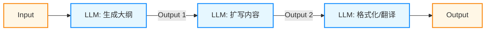
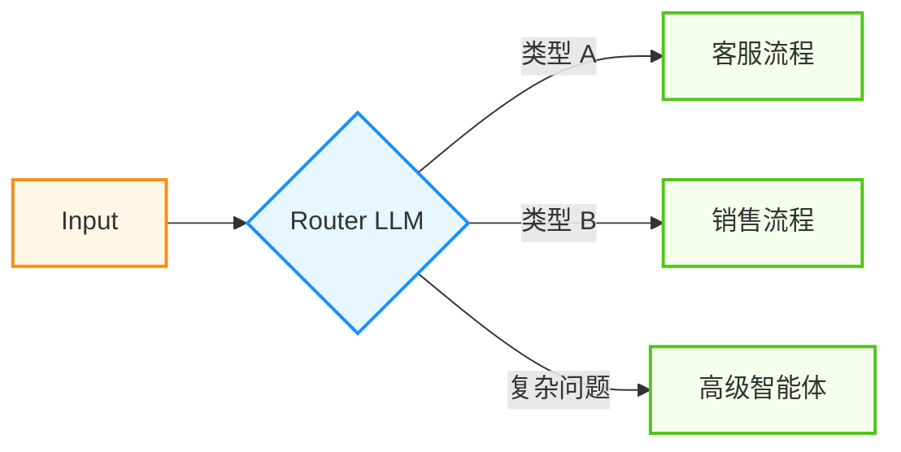
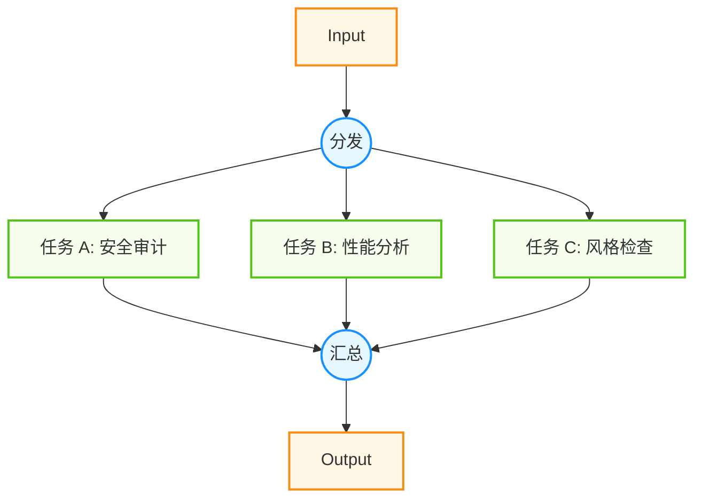
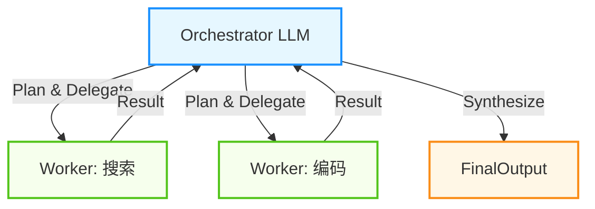
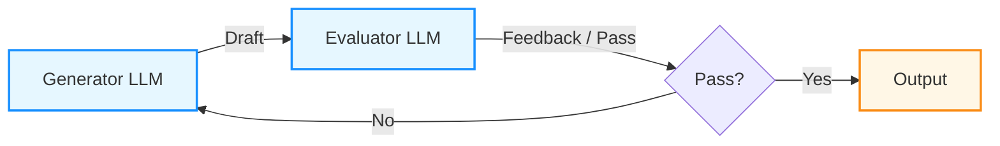
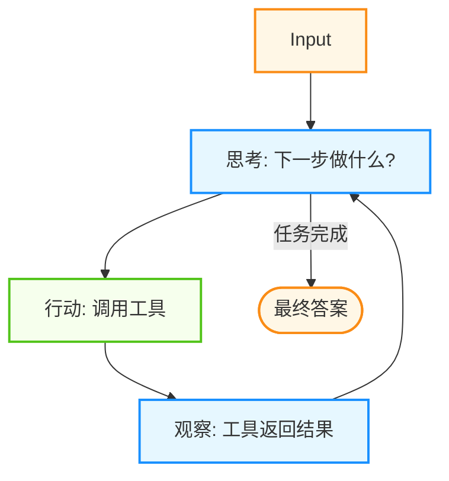

## 9.1 设计模式：从 Workflow 到智能体

最成功的系统往往不是用最复杂的框架构建的，而是使用了简单、可组合的模式。

在构建 LLM 应用时，常面临一个核心选择：**谁来负责编排多个智能体和任务？**

根据编排方式的不同，可将系统划分为两种典型的架构：

* **静态编排**：
    * **核心**: 代码主导 (Code-driven)。开发者预先定义好执行路径（如 `if/else`, `loop`）。
    *   LLM 可以参与决策，但仅限于在 **预定义的路径** 中进行选择，无法改变系统预设的 **控制流拓扑**。
    * **特点**: 确定性强，路径固定，性能可控。

* **自主编排**：
    * **核心**: 模型主导 (Model-driven)。系统给予 LLM 目标和工具，由 LLM 自主决定执行步骤。
    *   模型根据环境反馈动态调整策略，决定“下一步做什么”。
    * **特点**: 适应性强，能应对未知情况，但不可控性增加。

> **注意**：
> 实际上，静态编排和自主编排并非对立，实践中往往是两者的结合。越接近自主编排，系统越灵活，但可靠性越难保证；越接近静态编排，系统越稳定，但泛化能力越弱。

本节将详细解析这两种架构下的核心设计模式。


当任务可以被清晰分解时，应优先使用 **静态编排**。它们能提供更高的可预测性和更低的延迟。

### 1. 提示词链

最基础的模式。将任务分解为一系列线性步骤，上一步的输出作为下一步的输入。


```mermaid
graph LR
    %% Agentic Design System
    classDef user fill:#fff7e6,stroke:#fa8c16,stroke-width:2px;
    classDef agent fill:#e6f7ff,stroke:#1890ff,stroke-width:2px;

    Input --> Step1[LLM: 生成大纲]
    Step1 -->|Output 1| Step2[LLM: 扩写内容]
    Step2 -->|Output 2| Step3[LLM: 格式化/翻译]
    Step3 --> Output

    class Input,Output user;
    class Step1,Step2,Step3 agent;
```

图 9-1：提示词链模式

* **适用场景**：文案生成（大纲->初稿->润色）、简单的数据处理管道。
* **优势**：延迟较低，易于调试；每个节点可以使用不同规格的模型（例如大纲用高质量模型，扩写用低成本模型）。
* **权衡**：如果中间某一步出错，错误会级联传导。

### 2. 路由分发

根据输入内容的分类，将其导向不同的后续流程。这不仅是分类，更是 **专业化分工** 的体现。


```mermaid
graph LR
    %% Agentic Design System
    classDef user fill:#fff7e6,stroke:#fa8c16,stroke-width:2px;
    classDef agent fill:#e6f7ff,stroke:#1890ff,stroke-width:2px;
    classDef tool fill:#f6ffed,stroke:#52c41a,stroke-width:2px;

    Input --> Router{Router LLM}
    Router -->|类型 A| HandlerA[客服流程]
    Router -->|类型 B| HandlerB[销售流程]
    Router -->|复杂问题| HandlerC[高级智能体]

    class Input user;
    class Router agent;
    class HandlerA,HandlerB,HandlerC tool;
```

图 9-2：路由分发模式

* **适用场景**：
    * **客服分流**：根据用户意图（售后/投诉/咨询）路由到不同处理模块。
    * **模型分层**：简单问题路由给低成本模型，复杂问题路由给高质量模型。
* **实现技巧**：Router 可以是一个专门微调过的分类小模型，也可以是基于 Embedding 的向量相似度匹配，只需极低的开销。

### 3. 并行执行

利用 LLM 并行处理能力，同时执行多个任务，提升速度或质量。包括两个变体：

* **切片**: 将大任务拆解为独立的子任务并行处理。
    *   *例子*: 给出一段长代码，同时运行三个 LLM 分别检查“安全性”、“性能”和“代码风格”，最后汇总。
* **投票 (Voting / Majority Vote)**: 对同一任务运行多次，通过投票减少幻觉。
    *   *例子*: 让 3 个模型分别“找出文中的事实错误”，取交集或多数票。


```mermaid
graph TD
    %% Agentic Design System
    classDef user fill:#fff7e6,stroke:#fa8c16,stroke-width:2px;
    classDef agent fill:#e6f7ff,stroke:#1890ff,stroke-width:2px;
    classDef tool fill:#f6ffed,stroke:#52c41a,stroke-width:2px;

    Input --> Split((分发))
    Split --> TaskA[任务 A: 安全审计]
    Split --> TaskB[任务 B: 性能分析]
    Split --> TaskC[任务 C: 风格检查]
    TaskA --> Aggregate((汇总))
    TaskB --> Aggregate
    TaskC --> Aggregate
    Aggregate --> Output

    class Input,Output user;
    class Split,Aggregate agent;
    class TaskA,TaskB,TaskC tool;
```

图 9-3：并行执行模式

### 4. 编排者-工作者

当子任务无法预知或需要动态生成时，通过一个中心编排者来分派任务。这就像是一个“包工头”带着一群“工人”。


```mermaid
graph TD
    %% Agentic Design System
    classDef agent fill:#e6f7ff,stroke:#1890ff,stroke-width:2px;
    classDef tool fill:#f6ffed,stroke:#52c41a,stroke-width:2px;
    classDef user fill:#fff7e6,stroke:#fa8c16,stroke-width:2px;

    Orchestrator[Orchestrator LLM] -->|Plan & Delegate| WorkerA[Worker: 搜索]
    Orchestrator -->|Plan & Delegate| WorkerB[Worker: 编码]
    WorkerA -->|Result| Orchestrator
    WorkerB -->|Result| Orchestrator
    Orchestrator -->|Synthesize| FinalOutput

    class Orchestrator agent;
    class WorkerA,WorkerB tool;
    class FinalOutput user;
```

图 9-4：编排者-工作者模式

* **流程**:
    1.  Orchestrator 分析用户请求，分解出需要执行的子任务。
    2.  并行或串行调用相应的 Worker LLM 或工具。
    3.  收集 Worker 的结果，进行综合（Synthesize），生成最终回复。
* **适用场景**：复杂编码任务（修改一个功能涉及多个文件）、多源信息调研。
* **区别**：虽然子任务列表是动态的，但 **执行模式是固定的**（例如：Split -> Map -> Reduce），依然属于静态编排；而自主智能体可以自主决定是否循环、调用何种工具，流程拓扑是动态的。

### 5. 评估者-优化者

评估者-优化者模式即经典的 **反思** 模式。在一个循环流程中，引入“评估者”角色来提升质量。


```mermaid
graph LR
    %% Agentic Design System
    classDef agent fill:#e6f7ff,stroke:#1890ff,stroke-width:2px;
    classDef user fill:#fff7e6,stroke:#fa8c16,stroke-width:2px;

    Generator[Generator LLM] -->|Draft| Evaluator[Evaluator LLM]
    Evaluator -->|Feedback / Pass| Decision{Pass?}
    Decision -->|No| Generator
    Decision -->|Yes| Output

    class Generator,Evaluator agent;
    class Output user;
```

图 9-5：评估者-优化者模式

* **流程**：生成器 (Generator) 生成初稿 -> 评估者 (Evaluator) 提出修改意见 -> 生成器 (Generator) 优化 -> 循环。
* **适用场景**：高质量翻译、复杂代码生成。
* **关键点**：必须设置明确的终止条件（如最大循环次数或评分阈值），防止死循环。
* **max_iterations 降级处理**：当达到最大迭代次数而未通过评估时，应返回迄今为止质量最优的方案，而非抛出异常。

```python
# 评估者-优化者的健壮实现

best_result = None
best_score = -1

for iteration in range(max_iterations):
    result = generator.generate(task)
    score = evaluator.score(result)

    if score > best_score:
        best_score = score
        best_result = result

    if score >= pass_threshold:
        return result  # 通过评估，立即返回

    if iteration == max_iterations - 1:
        # 最后一轮未通过，返回最优方案
        return {
            "result": best_result,
            "score": best_score,
            "status": "max_iterations_reached",
            "message": f"未在 {max_iterations} 轮内通过评估，返回最优方案"
        }
```

---

### 9.1.2 自主编排：智能体与动态决策

当无法预定义路径时，需要让 LLM 接管控制权，即 **自主编排** 模式。此时，智能体不仅仅是调用工具，更是模拟这种 **认知循环**。

常见的自主编排模式包括：ReAct、规划与执行、多智能体协作。

### 1. ReAct

这是最经典的单智能体模式（详见 [2.3 节](../02_reasoning/2.3_react.md)）。


```mermaid
graph TD
    %% Agentic Design System
    classDef agent fill:#e6f7ff,stroke:#1890ff,stroke-width:2px;
    classDef tool fill:#f6ffed,stroke:#52c41a,stroke-width:2px;
    classDef user fill:#fff7e6,stroke:#fa8c16,stroke-width:2px;

    Input --> Thought[思考: 下一步做什么?]
    Thought --> Action[行动: 调用工具]
    Action --> Observation[观察: 工具返回结果]
    Observation --> Thought
    Thought -->|任务完成| Finish([最终答案])

    class Input user;
    class Thought agent;
    class Action tool;
    class Observation agent;
    class Finish user;
```

图 9-6：ReAct 循环模式

* **Traces 示例**:
    ```text
    Thought: 用户想知道北京现在的天气。我需要调用天气查询工具。
    Action: search_weather(city="Beijing")
    Observation: 25°C, Sunny.
    Thought: 此时天气不错。用户还问了适合穿什么。基于天气...
    Action: search_clothing_recommendation(temp="25°C")
    ...
    ```
* **核心挑战**: 容易陷入循环，或在高压环境下（如复杂多步推理）迷失目标。

### 2. 规划与执行

为了解决 ReAct “走一步看一步”导致的短视问题，引入了显式的 **规划** 阶段。

* **阶段一：规划 (Planner)**
    *   LLM 接收复杂请求，不直接执行，而是输出一个 `Step-by-Step Plan`。
* **阶段二：执行 (Executor)**
    *   按照 Plan 逐条执行。如果执行中遇到阻碍，可以请求 Planner **重规划 (Replanning)**。

> **提示**：
> **Cursor 的 Plan Mode** 就是这种模式的最佳实践。它先扫描代码库，生成 Implementation Plan，用户确认后，再一步步 Apply Changes。

### 3. 多智能体协作

当单体智能体复杂度过高时，通常将其拆分为多智能体系统。

* **层级制**:
    *   类似于公司组织架构。
    * **管理智能体**: 负责拆解目标，监督进度，协调资源。
    * **专家智能体**: 专注特定领域（如 DB设计专家、前端专家、QA专家）。
    *   *优势*: 权责分明，管理者可以纠正下属的错误。

* **协作制**:
    *   类似于头脑风暴会议。
    *   多个智能体（如 Developer + Tester）处于同一个会话中，都能通过消息总线发言。
    *   通常需要一个发言选择（Speaker Selection）机制来决定谁下一个发言。

* **竞争制**:
    *   多个智能体对同一问题持不同立场，通过辩论提升决策质量。
    *   详见 [6.3 节博弈论与群体智能](../06_communication/6.3_game_theory.md)。

### 9.1.3 模式选择指南

如何决定使用哪种模式？主要参考 **不确定性** 和 **复杂性** 两个维度。这对应了认知科学中的 **快思考** 与 **慢思考** 理论。

| 模式 | 认知模式 | 适用场景 | 复杂度 | 成本 |
| :--- | :--- | :--- | :--- | :--- |
| **提示词链** | 快思考 | 任务固定，步骤明确 | ⭐ | 💲 |
| **路由分发** | 快思考 | 任务有几个明确变体 | ⭐⭐ | 💲 |
| **并行执行** | 快思考 | 独立子任务，关注速度/覆盖面 | ⭐⭐ | 💲💲 |
| **编排者模式** | 混合态 | 动态子任务，需要统一协调 | ⭐⭐⭐ | 💲💲 |
| **评估优化** | 慢思考 | 质量优先，容忍高延迟 | ⭐⭐⭐ | 💲💲💲 |
| **ReAct 智能体** | 慢思考 | 开放式探索，步骤未知 | ⭐⭐⭐⭐ | 💲💲💲 |
| **自主规划** | 慢思考 | 极度复杂，长跨度任务 | ⭐⭐⭐⭐⭐ | 💲💲💲💲 |

> **重要**：
> **Start Simple**: 总是从简单的静态编排开始。只有当固定流程无法应对需求的变化时，才引入自主编排。过早引入自主编排会导致系统变得不可预测且难以调试。

### 9.1.4 行业最佳实践

#### Agentic Workflows：把模式编排成生产流水线

如果把前面的 ReAct、规划与执行、多智能体协作、评估优化放在一起看，就会发现它们并不是彼此割裂的技巧，而是同一个更大范式的组成部分：**Agentic Workflows**。

它的核心思想不是“让一个更聪明的模型一次性回答所有问题”，而是围绕模型设计一条可重复、可观测、可纠错的工作流。常见的四个积木是：

1. **Reflection**：让系统检查自己的工作
2. **Tool Use**：让系统调用外部工具与环境交互
3. **Planning**：让系统先拆任务、再执行
4. **Multi-Agent Collaboration**：让多个角色分工协作

可以把它理解为一个分层工作流：

| 层 | 典型模式 | 解决什么问题 |
|----|----------|--------------|
| **执行层** | Tool Use / ReAct | 当前这一步该做什么 |
| **规划层** | Plan-and-Execute | 整个任务应该怎么拆 |
| **质量层** | Reflection / Evaluator | 当前结果是否足够好 |
| **组织层** | Multi-Agent | 谁来做、谁来审、谁来汇总 |

在真正的生产系统里，这四层往往是组合出现的。例如：

- Orchestrator 先生成全局计划
- 每个子任务内部再跑一轮小型 ReAct 循环
- 关键结果交给 Reviewer 做 Reflection
- 最终由多智能体协作完成整体交付

这也是智能体系统从“会调用几个工具的 Demo”走向“能稳定交付业务结果的生产系统”的关键分水岭。

#### 行业共识

工程实践中，一个反复被验证的经验是：**优先使用简单、可组合的静态模式**，在必要时再引入更强的自主性与动态规划。

同时，围绕“跨模型/跨工具互操作”的标准化工作也在推进，例如将“工具描述、权限边界、上下文传递、可观测性事件”做成可移植的协议与数据结构（相关内容可结合 [4.3 节](../04_tools/4.3_mcp.md) 阅读）。这些努力使得上述设计模式更容易跨框架复用。

#### 落地清单

如果你需要把设计模式从”概念”落到”能上线”，可以先用这份最小清单做自检：

- 明确任务完成条件与最大步数，避免无限循环
- 为高风险工具设置审批与最小权限，并在运行时硬拦截
- 为关键链路打上 `trace_id`，并记录工具调用与结果作为证据链
- 维护回归样例集，支持版本对比与灰度发布

#### 案例：Claude 设计系统的 Agent 工作流

Anthropic 在 Claude 设计工具中实现了一套完整的 Agent 工作流，其系统提示词为 Agent 设计模式提供了极具参考价值的生产实践。

**六步 Agent 循环**。该系统将设计任务分解为：(1) 理解需求——对新任务提出澄清问题，明确输出物、保真度、约束条件；(2) 探索资源——阅读设计系统定义及关联文件；(3) 制定计划——创建待办清单；(4) 搭建结构——准备文件夹和资源；(5) 执行交付——产出设计文件并验证无错误；(6) 简短总结——只写注意事项与下一步。这个循环体现了典型的 Plan-Act-Observe 模式，但在每一步都注入了领域特定的行为约束。

**上下文窗口管理**。该系统引入了 `snip` 机制——当一个工作阶段完成（一次探索已解决、一次迭代已收敛），Agent 标记该区间可被移除。标记是延迟执行的：只有当上下文压力增大时才统一清理。这种”惰性回收”策略避免了两个极端——频繁清理导致丢失有用上下文，和从不清理导致窗口溢出。对于长期运行的 Agent 系统，这是一个值得借鉴的设计。

**工具使用规范与信息隐藏**。系统严格区分了”能力描述”和”实现细节”：Agent 可以告诉用户”我能创建 HTML 和 PPTX 文件”，但绝不暴露工具名称、系统标签或内部机制。这种信息隐藏原则不仅是安全需要，也减少了用户试图直接操控工具链的风险，是 Agent 系统 API 设计的重要参考。

### 9.1.5 长期运行的智能体设计模式

当智能体任务跨越数小时甚至数天时，设计模式需要特殊考量。学术界与工业界在 2025-2026 年总结了几个关键的长期运行模式。

#### 计划、文档与 Git 驱动

在长期科学计算和代码生成任务中，**蓝图文件（Blueprint File）** 模式被证实有效。核心要素包括：

1. **CLAUDE.md 计划蓝图**：项目初期，生成一份结构化计划文件，列举可交付成果、成功标准、架构决策。这个文件在整个开发过程中保持在智能体的上下文中，作为目标锚点。

2. **CHANGELOG.md 进度记录**：维护一份”实验室笔记”，记录已完成任务、失败的尝试、性能基准和已知限制。**失败的方案同样重要**——它们防止后续会话重复踩坑。

3. **版本控制驱动的进度监控**：指示智能体在有意义的工作段后执行 Git 提交，并在提交前运行测试套件。Commit 历史成为可审计的进度证明。

4. **测试预言与量化目标**：建立可测试的参考标准（如单位测试、性能基准、精度指标）。Long-term Agent 相比短期 Agent 更需要显式的成功标准，而非模糊的”质量好”。

#### 编排循环与任务验证

应对”智能体懒惰”的常见策略是 **Ralph Loop**——反复验证任务完成情况，直到满足规范。这个模式的核心是：不依赖单次推理就”认为”任务完成，而是通过多轮检查确保交付物达标。

---

**下一节**: [Harness 架构：智能体的执行与治理层](9.2_harness.md)
