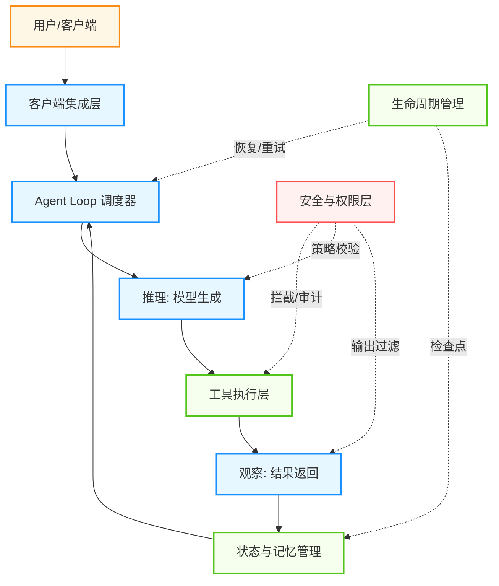
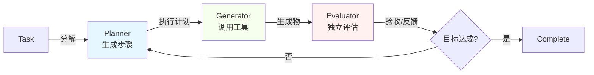

## 9.2 Harness 架构：智能体的执行与治理层

上一节介绍了从 Workflow 到 Agent 的各种设计模式。但把一个 Agent “跑起来”和“跑得稳”之间，存在巨大的鸿沟。2025 年证明了智能体能完成复杂任务；2026 年，行业发现 **构建智能体并不难，难的是让它在生产环境中可靠、可控、可审计地持续运行**。

填补这道鸿沟的关键，是一个被称为 **Harness（驭具）** 的架构层。

### 9.2.1 什么是智能体 Harness

**Agent Harness** 是包裹在 AI 模型外围的软件基础设施，负责管理模型推理之外的一切：工具执行、状态持久化、安全边界、错误恢复和生命周期管理。

一个直观的类比：

> **模型是 CPU，上下文窗口是 RAM，Harness 是操作系统。**
> CPU 只负责计算，操作系统负责调度进程、管理文件系统、控制硬件访问、处理异常。同样，模型只负责推理，Harness 负责让推理在真实环境中安全、持续地运行。

用一个公式表达：

```text
Agent = Model + Harness
```

模型是“大脑”，Harness 是“身体”——它为大脑提供感官输入、运动控制、免疫系统和能量管理。没有 Harness 的模型只能进行一次性对话；有了 Harness，模型才能成为能持续工作的智能体。

### 9.2.2 从 Prompt 到 Harness：工程范式的三次跃迁

理解 Harness 的最好方式，是把它放在工程范式演进的时间线上：

| 阶段 | 范式 | 核心关注点 | 工程对象 |
| :--- | :--- | :--- | :--- |
| 2023 | **Prompt Engineering** | 这一轮推理怎么答 | 单次输入文本 |
| 2024–2025 | **Context Engineering** | 模型每一步看到什么 | 系统提示词 + 检索文档 + 工具结果 + 对话历史 |
| 2025–2026 | **Harness Engineering** | 智能体如何在环境中持续运行 | 工具执行 + 状态管理 + 安全边界 + 生命周期 + 可观测性 |

三者是递进关系，而非替代关系：

* **Prompt Engineering** 解决“说什么”——如何措辞让模型理解意图。
* **Context Engineering** 解决“看什么”——如何组装完整的信息环境（详见 [3.6 节](../03_memory/3.6_context_engineering.md)）。
* **Harness Engineering** 解决“怎么跑”——如何让智能体在真实环境中安全、持续、可恢复地执行任务。

Harness 包含 Context Engineering 作为子系统（决定每一步喂给模型什么），但远不止于此——它还要管理工具调用的权限、处理执行失败的恢复、维护跨会话的状态、以及在整个过程中保证安全与合规。

### 9.2.3 Harness 的核心子系统

一个生产级 Harness 通常由以下四个核心子系统构成：



图 9-7：Agent Harness 四大核心子系统

#### 1. 工具执行层（Tool Integration Layer）

Harness 负责暴露可调用的工具接口、校验调用参数、在沙箱中执行、并将清洗后的结果返回给模型。

核心职责包括：

* **调用校验**：在执行前验证参数合法性和权限范围
* **沙箱隔离**：文件系统隔离 + 网络隔离，防止越权操作（详见 [4.3 节](../04_tools/4.3_mcp.md) MCP 协议的权限治理）
* **结果清洗**：过滤敏感信息，截断过长输出，格式化返回结构
* **超时与熔断**：单次工具调用超时自动终止，连续失败触发熔断

#### 2. 状态与记忆管理（Memory & State Management）

无状态的 LLM 依赖 Harness 来维护跨步骤、跨会话的状态。Harness 通常管理三层记忆：

| 记忆层 | 生命周期 | 内容 | 实现方式 |
| :--- | :--- | :--- | :--- |
| **工作上下文** | 单次推理 | 当前提示词 + 工具结果 | 上下文窗口 |
| **会话状态** | 单次任务 | 执行日志、中间结果、检查点 | 文件/数据库 |
| **长期记忆** | 跨任务 | 用户偏好、历史经验、知识库 | 向量数据库/知识图谱 |

当上下文窗口接近容量上限时，Harness 通过 **上下文压缩**（将历史对话浓缩为摘要笔记）和 **选择性检索**（每步只召回相关文档）来维持推理质量（详见 [3.2 节](../03_memory/3.2_short_term_memory.md) 和 [3.4 节](../03_memory/3.4_rag_advanced.md)）。

#### 3. 安全与权限层（Safety & Permissions）

这是 Harness 区别于普通“脚本 wrapper”的关键层。在 [1.3 节](../01_paradigm/1.3_components.md)中，我们引入了 **可信计算基（TCB）** 的概念——策略网关 + 权限校验 + 沙箱隔离。Harness 的安全层正是 TCB 的工程实现。

在企业级场景中，安全层的典型实现包括：

* **输入清洗**：在数据到达模型之前，屏蔽 PII（个人身份信息）等敏感字段。Salesforce 的 Einstein Trust Layer 就是这种模式的典型案例——它在 Prompt 送入 LLM 之前自动识别并遮蔽敏感信息
* **输出校验**：模型生成的每个动作都经过策略引擎审核，阻止越权操作
* **最小权限原则**：每个会话仅授予完成当前任务所需的最小工具集和数据范围
* **审计日志**：每一次工具调用、每一条模型输出都附带 `trace_id`，形成完整的证据链（详见 [9.3 节](9.3_observability.md) 和 [11.1 节](../11_future/11.1_security.md)）

#### 3.1 智能体体工学：为智能体设计更好用的软件

Harness 的设计不仅涉及技术实现，还涉及一个更深层的问题：**如何为 Agent 设计更符合人机协作理念的软件**。TiDB CTO 黄东旭提出“Agent 体工学”的概念，核心原则包括：

1. **最小化使用摩擦（Minimize Friction）**：
   - 统一平台集成：避免让 Agent 在多个系统间切换，减少转换成本
   - 简化接口设计：降低 Agent 理解和调用工具的认知负担

2. **最大化信息密度（Maximize Information Density）**：
   - 优先使用 Markdown 而非 HTML，便于 Agent 快速解析结构信息
   - 在有限的上下文窗口内，让每个字都承载更多语义价值

3. **信任模型能力而非限制流程（Trust Capabilities, Not Process）**：
   - 从“规定 Agent 必须怎么做”转向“定义 Agent 能做什么，让它自决”
   - 通过能力声明而非步骤限制，给予 Agent 更多策略灵活性
   - 安全约束应该在能力边界（权限）而非过程控制（强制工作流）

这些原则背后的哲学是：与其把 Agent 当作需要严密流程约束的执行工具，不如把它当作具有一定智能化权限的协作伙伴。

#### 4. 生命周期管理（Lifecycle & Recovery）

传统软件的函数调用以毫秒计；智能体的任务执行可能持续数分钟甚至数小时。Harness 必须处理长时间运行带来的各种挑战：

* **检查点与恢复**：定期保存执行状态快照。如果发生故障，Harness 可以从最近的检查点恢复，而不是从头开始
* **循环终止**：设置最大步数、最大 Token 消耗、最大执行时间等硬性上限，防止无限循环（详见 [9.6 节](9.6_failures.md) 故障模式）
* **优雅降级**：当达到资源上限但任务未完成时，返回迄今为止的最优中间结果，而非抛出异常
* **会话续接**：在 Agent 中断后，Harness 将知识外化到文件和提交历史中，使新会话能无缝接续

#### 5. 上下文重置（Context Reset）策略

在长时间运行的智能体中，上下文窗口会逐步被历史对话、工具输出和中间状态填满。虽然 Harness 通过压缩和检索机制来缓解这个问题，但当推理环路复杂或上下文污染严重时，增量式的“压缩”不如激进的“重置”有效。

**核心洞察**：与其试图将所有历史信息浓缩进有限的上下文，不如在关键节点执行一次清晰的上下文重置。这是 Anthropic 在生产编码智能体中采用的模式。

三步重置流程：

1. **检查点保存**（Checkpoint）：将任务的关键状态（当前目标、已执行步骤总结、重要中间结果）持久化到外部存储（数据库或文件）
2. **上下文清空**（Clear）：清除当前上下文窗口中的历史对话、工具结果日志等冗余信息
3. **精简重载**（Reload）：从检查点只恢复三类信息：(1) 原始任务描述，(2) 迄今为止的执行进度摘要，(3) 关键学习（常见陷阱、已验证的方案）

这与传统的“上下文压缩”不同。压缩试图保留所有信息但缩小体积；重置则是承认某些中间细节在任务进行到一定阶段后已经无关，大胆丢弃它们。实践中，重置常常能带来更清晰的推理轨迹和更好的指令遵循。

伪代码示例（Python 风格）：

```python
def context_reset_checkpoint(agent, task_state):
    """智能体执行中的上下文重置"""
    # 步骤1：关键状态持久化
    checkpoint = {
        'task_id': task_state['id'],
        'original_goal': task_state['goal'],
        'progress_summary': compress_steps(task_state['history']),
        'learned_patterns': extract_patterns(task_state['failed_attempts']),
        'key_artifacts': task_state['important_files'],
        'timestamp': now()
    }
    storage.save_checkpoint(checkpoint)

    # 步骤2：当前上下文清空
    agent.context_window.clear()

    # 步骤3：精简信息重载
    refreshed_context = {
        'system_prompt': agent.system_prompt,
        'goal': checkpoint['original_goal'],
        'progress': checkpoint['progress_summary'],
        'learnings': checkpoint['learned_patterns'],
        'current_artifacts': checkpoint['key_artifacts']
    }
    agent.load_context(refreshed_context)
```

何时触发重置：监控上下文利用率（Anthropic 的实践是当有效上下文损耗超过 60% 时），或当检测到推理环路重复时（同一个工具被调用超过 N 次却无进展）。

#### 6. 规划-生成-评估（PGE）三角色分离

生产级智能体常面临一个问题：生成阶段（Generator）和评估阶段（Evaluator）共享同一个上下文和模型，导致评估者易于陷入“确认偏差”——倾向于给自己的输出评高分。

PGE 框架通过 **分离三个认知角色** 来解决这个问题：

| 角色 | 职责 | 关键约束 |
| :--- | :--- | :--- |
| **规划者（Planner）** | 任务分解、设计执行步骤、制定策略 | 输出必须是清晰的、可验证的子任务 |
| **生成者（Generator）** | 执行具体步骤、调用工具、生成内容 | 严格按规划执行，不自主改变策略 |
| **评估者（Evaluator）** | 检查生成物质量、验证目标完成、诊断失败原因 | **必须与生成者隔离**，拥有独立的上下文和提示 |

核心设计原则：**评估者必须获得“新鲜的眼睛”**。它不应该看到生成者的详细推理过程（这会造成认知锚定），而应该只看到：任务定义、规划结果和生成物本身。

PGE 流程示意：



图 9-8：PGE 三角色分离流程

在生产系统中，这三个角色更适合按**能力层**分配，而不是把某个营销版本号写死为推荐常量：

* **Planner**：使用规划能力更强的模型，或专门的规划提示，生成结构化的步骤清单；如果需要在系统里固化模型选择，优先使用供应商文档中的稳定 snapshot / alias，而不是在架构文档里写死短周期版本号
* **Generator**：使用执行成本更低、工具调用更稳定的模型，严格遵循计划
* **Evaluator**：独立的上下文和系统提示，专注于验收标准而非执行细节。常见做法是给 Evaluator 一份“成功准则清单”，使其能以目标为导向进行评估

关键收益：

1. **消除确认偏差**：Evaluator 不知道 Generator 的内部状态，只看结果
2. **可审计性**：每个角色的输出都可独立验证，提高了系统的透明度（与 [9.3 节](9.3_observability.md) 的可观测性相呼应）
3. **支持失败诊断**：当 Evaluator 拒收时，能清晰指出是规划问题、执行问题还是评估标准问题（见 [9.7.7 节](9.7_pitfalls_antipatterns.md) 的“黑盒代码”反模式）
4. **启用并行化**：Planner 可以规划多个独立任务，多个 Generator 并行执行，再由 Evaluator 汇总验收

行业验证：LangChain 报告其 Deep Agents CLI 通过一系列 Harness 改进，在 Terminal Bench 2.0 上从 52.8 提升到 66.5。这个结果与更好的规划、任务分解和独立验收设计相一致，但不宜简单归因为 PGE 单一因素；更准确的说法是，Harness 级编排优化可以在模型不变的前提下显著影响结果。

### 9.2.4 Harness vs. Framework：开发时 vs. 运行时

一个常见的混淆是 Harness 与 Framework（如 LangChain、LlamaIndex）的关系。两者的核心区别在于：

| 维度 | Framework | Harness |
| :--- | :--- | :--- |
| **作用时机** | 开发时 | 运行时 |
| **核心职责** | 提供积木（链、图、工具抽象） | 提供执行环境（调度、安全、恢复） |
| **类比** | 编程语言的标准库 | 操作系统的进程管理器 |
| **关注点** | 怎么构建智能体 | 怎么运行智能体 |
| **可替换性** | 框架可以换（LangChain → LlamaIndex） | Harness 通常与部署环境绑定 |

Framework 帮你在开发阶段快速组装一个智能体原型（详见 [第八章](../08_frameworks/README.md)）；Harness 确保这个原型在生产环境中 7×24 小时稳定运行。两者互补，不可替代。

### 9.2.5 行业实践

#### OpenAI Codex：百万行代码零人工编写

2026 年初，OpenAI 团队在严格的“禁止人工写代码”约束下，使用 Codex 智能体构建并交付了一个超过 100 万行代码的内部产品。工程师的角色从编写代码转变为 **设计 Harness**。

他们的 Harness 包含三类组件：

1. **上下文工程**：将架构规范、领域知识、编码约定等以 Markdown 和 Schema 的形式嵌入代码仓库本身，让智能体从仓库中直接获取所需上下文
2. **架构约束**：用确定性的 linter 和结构性测试强制执行分层依赖规则（Types → Config → Repo → Service → Runtime → UI），既由 LLM 监控也由传统工具监控
3. **垃圾回收**：周期性运行的智能体，专门扫描文档不一致和架构违规，对抗代码库的熵增

这个案例说明了一个关键洞察：**当智能体足够强大时，工程师的核心产出不再是代码，而是 Harness。**

#### Martin Fowler 的反馈转向模型

Martin Fowler 将 Harness 的控制机制分为两类：

* **前馈引导（Feedforward Guides）**：在智能体执行之前提供约束——规则文件、文档规范、架构模板。相当于“防患于未然”
* **反馈传感（Feedback Sensors）**：在智能体执行之后检测问题——linter、测试套件、类型检查。相当于“亡羊补牢”

最佳实践是 **将低成本的确定性检查前置**（如 pre-commit hook 中的 linter），**将高成本的推理性检查后置**（如 AI code review）。这与 [9.3 节](9.3_observability.md)的可观测性和 [9.7 节](9.7_pitfalls_antipatterns.md)的反模式形成呼应。

#### Salesforce Agentforce：企业级安全 Harness

Salesforce 将 Harness 定位为模型的“安全外壳”，其 Agentforce 平台的 Harness 层重点包含：

* **Einstein Trust Layer**：所有 Prompt 在送入 LLM 之前经过 PII 自动识别和遮蔽
* **基础设施级策略执行**：安全策略在 Harness 层（而非应用层）强制执行，确保敏感数据永远不离开企业环境
* **全链路审计**：每个智能体动作都记录日志，满足企业合规需求

这种方法的核心理念是：**安全不是智能体的可选附加功能，而是 Harness 的内建属性**。

### 9.2.6 GAN 式 Harness 的成本-收益分析

生成对抗网络（GAN）的灵感来自于博弈论——两个对立的角色（生成器和评估器）通过竞争来相互推进。在 Harness 设计中，**多智能体架构（分离的生成和评估）** 遵循了类似的原理，但带来了显著的成本差异。

#### 成本对比：单独生成 vs. 多智能体 Harness

一个真实的案例是**全栈应用开发**任务。一种简单的方式是让单个智能体负责规划、代码生成和测试——快速但结果不稳定：

| 指标 | 单 Agent（20 分钟） | 多 Agent Harness（6 小时） |
| :--- | :--- | :--- |
| **成本** | $9 | $200 |
| **功能完整性** | 核心功能破损 | 完整可用 |
| **代码质量** | 基础 | 生产就绪 |
| **自动化测试通过率** | <30% | >90% |

表面上看，多 Agent 方案成本是单 Agent 的 22 倍。但换个角度：如果任务失败，返工成本会吞掉更多资源。在实际工程中，**失败成本往往是初始成本的 10 倍以上**。

#### Harness 复杂度应随模型能力阶跃

关键洞见是：**Harness 的复杂度应该与当前模型的能力相匹配，而非固定不变**。当升级到 Claude Opus 4.6 时，研究者发现原本需要的冗长规划-检查-修正的多轮交互可以简化。新的架构虽然仍然保持三角色分离（规划-生成-评估），但每个角色的提示和检查点数量大幅减少，总成本从 $200 降至 $120 左右。

这反映了一个普遍原则：**更强的模型需要更轻的 Harness**。不要过度工程化——持续评估 Harness 的每一层是否仍然必要。

### 9.2.7 Harness 设计清单

在设计生产级 Harness 时，可以用以下清单进行自检：

```markdown
## Harness 设计自检

### 工具执行
- [ ] 所有工具调用在执行前经过参数校验
- [ ] 高风险操作（写入、删除、支付）需要人工审批
- [ ] 单次调用有超时限制，连续失败有熔断机制
- [ ] 工具结果经过清洗后才返回给模型

### 状态管理
- [ ] 定期保存执行检查点，支持故障恢复
- [ ] 上下文窗口有压缩/摘要策略，防止溢出
- [ ] 跨会话状态通过外部存储持久化

### 安全边界
- [ ] 遵循最小权限原则，每次会话仅授予必要权限
- [ ] 输入数据经过 PII 过滤
- [ ] 输出动作经过策略引擎审核
- [ ] 全链路 trace_id 支持事后审计

### 生命周期
- [ ] 设置最大步数、最大 Token 和最大时间上限
- [ ] 达到上限时优雅降级，返回最优中间结果
- [ ] 支持中断后从检查点恢复继续执行
```

### 9.2.8 与本书其他章节的关系

Harness 是一个横切关注点，它与本书多个章节的内容形成体系：

| Harness 子系统 | 对应章节 | 关键概念 |
| :--- | :--- | :--- |
| 上下文管理 | [3.6 上下文工程](../03_memory/3.6_context_engineering.md) | 信息环境设计 |
| 工具执行 | [4.2 工具使用机制](../04_tools/4.2_tool_use.md)、[4.3 MCP 协议](../04_tools/4.3_mcp.md) | 权限治理、沙箱隔离 |
| 安全边界 | [1.3 核心组件](../01_paradigm/1.3_components.md)（TCB）、[11.1 安全边界](../11_future/11.1_security.md) | 可信计算基、多层防御 |
| 可观测性 | [9.3 可观测性与调试](9.3_observability.md) | 链路追踪、Trace/Span |
| 故障恢复 | [9.6 故障模式与韧性设计](9.6_failures.md) | 熔断、降级、重试 |
| 反模式 | [9.7 架构陷阱与反模式](9.7_pitfalls_antipatterns.md) | 状态污染、成本溢出 |

理解 Harness 的意义在于：它提供了一个 **统一的架构视角**，将分散在各章节的工具执行、安全治理、状态管理、可观测性等概念，整合为一个协调工作的整体。

---

**下一节**: [可观测性与调试](9.3_observability.md)
