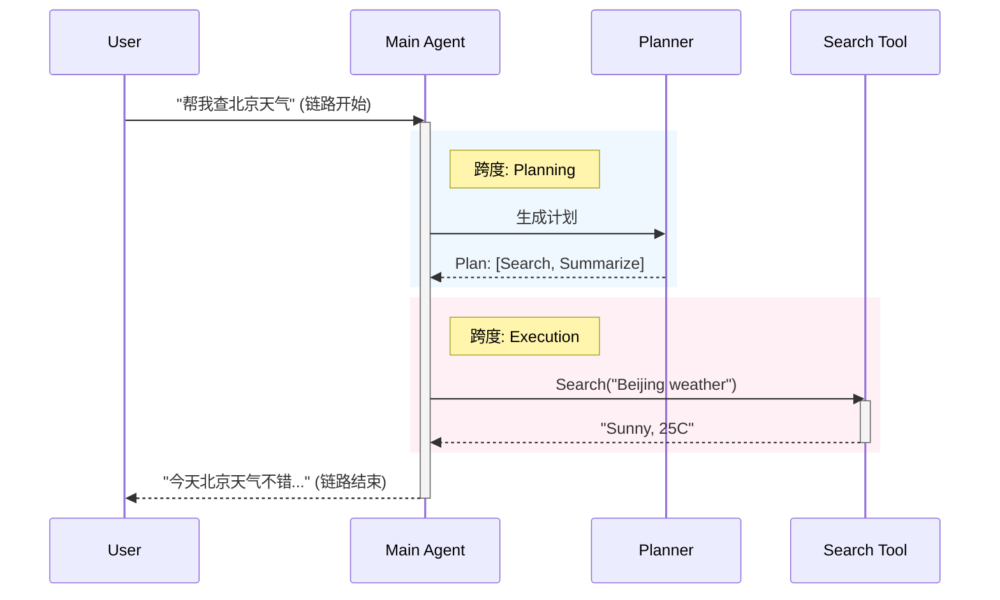
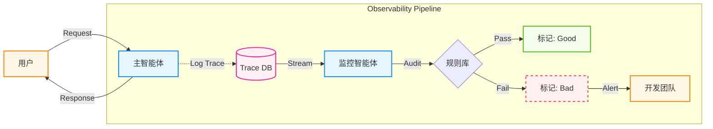

## 9.2 可观测性与调试

在传统的软件开发中，通常使用 **调用栈** 报错堆栈。但在智能体开发中，"Bug" 往往不是代码崩溃（Crash），而是智能体 "一本正经地胡说八道" 或者 "陷入了无意义的死循环"。

当智能体出错时，你不能只看最后一行输出。你需要像黑匣子一样，记录下它每一次思考、每一次工具调用和每一次状态更新。这就是智能体的 **可观测性**。

### 9.2.1 为什么智能体难以调试

1.  **非确定性**：同样的提示词，上午跑是通的，下午跑就挂了。这使得复现 Bug 变得极其困难。
2.  **黑盒推理**：LLM 为什么决定调用 Search 而不是 Calculator？这种决策过程不可见。
3.  **多步级联**：第 5 步的错误可能是第 1 步的一个微小偏差导致的蝴蝶效应。
4.  **成本隐患**：一个死循环的智能体可能在一夜之间烧掉几千美元。

### 9.2.2 核心指标：链路与跨度

借鉴 **分布式追踪** 的概念，可以构建智能体的监控数据模型：

*   **链路**：代表用户的一次请求（Request）处理全过程。
*   **跨度**：链路中的执行片段（Execution Step）。它既可以指代一次简单的工具调用，也可以包含多个子步骤，共同构成树状结构。

#### 可视化结构

在实际的链路追踪平台（如 LangSmith）中，你不仅能看到这个时序图，还能点击每个跨度查看具体的 **输入**, **输出**, **延迟** 和 **成本**。

### 9.2.3 评估体系：从离线到在线

仅仅记录链路是不够的，需要识别哪些链路是“好”的，哪些是“坏”的。这通常分为两个阶段：

#### 1. 离线评估
在开发阶段，使用固定数据集（Dataset）进行测试。
*   **方法**: 运行一组 **黄金标准问题**，计算准确率或相似度。
*   **工具**: Pytest, LangSmith Dataset。

#### 2. 在线评估
这是生产环境的关键。既然无法人工检查每一条日志，可以部署 **监控智能体** 来实时打分。

*   **原理**: 
    *   主智能体处理用户请求。
    *   监控智能体异步读取主智能体的 Input/Output，进行审计。
*   **检测项**:
    *   **幻觉检测**: "回答中是否包含未在参考文档中出现的事实？"
    *   **毒性检测**: "回答是否包含攻击性语言？"
    *   **格式检查**: "是否输出了符合规范的 JSON？"

### 9.2.4 多智能体系统的失败诊断 (MAST)

当多智能体系统（MAS）出现问题时，如何系统性地定位根因？研究论文《[Why Do Multi-Agent LLM Systems Fail?](https://arxiv.org/abs/2503.13657)》提出了 **MAST** 分类法。

MAST 将 14 种失败模式归纳为 3 大类别。当你面对一个错误的链路时，可以按此表检索：

| 类别 | 失败模式 | 典型表现 | 修复策略 |
| :--- | :--- | :--- | :--- |
| **FC1: 系统设计**   (System Design) | **FM-1.1 违反任务规范** | 忽略了"只能使用 JSON 格式"的硬性要求 | 将关键约束移至 System Prompt 开头 |
| | **FM-1.2 违反角色规范** | 客服智能体突然开始写代码 | 强化角色设定 (Role Prompting) |
| | **FM-1.3 步骤重复** | 智能体反复调用同一个工具，参数也不变 | 增加 `max_retries` 和去重逻辑 |
| | **FM-1.4 上下文丢失** | 多轮对话后智能体忘了初始目标 | 检查记忆截断策略 |
| | **FM-1.5 无法停止** | 任务完成了但智能体继续闲聊 | 明确系统提示词中的停止条件 |
| **FC2: 协调问题**   (Coordination) | **FM-2.1 对话重置** | 莫名其妙地重新打招呼，上下文丢失 | 检查消息历史拼接逻辑 |
| | **FM-2.2 未请求澄清** | 信息不足时强行猜测，而不是提问 | 增加"不确定时请追问"的指令 |
| | **FM-2.3 任务脱轨** | 聊着聊着跑题到了无关话题 | 增加专门的监督智能体 (Supervisor) |
| | **FM-2.4 信息扣留** | 知道关键信息但没传给下游智能体 | 优化智能体间的消息传递协议 |
| | **FM-2.5 忽略输入** | 智能体 B 忽略了智能体 A 的关键输出 | 结构化智能体间的消息传递格式 |
| | **FM-2.6 言行不一** | 思考里说"我要查天气"，手里调了"计算器" | 优化提示词或更换指令遵循能力更强的模型 |
| **FC3: 验证问题**   (Verification) | **FM-3.1 过早终止** | 任务没做完就自信地说"完成了" | 增加评审智能体进行结果校验 |
| | **FM-3.2 缺失验证** | 从不检查工具执行结果是否正确 | 引入“双重检查”步骤 (Double Check) |
| | **FM-3.3 错误验证** | 检查了但把对的判成错的 | 提升验证者模型的能力 (如使用 o1) |

### 9.2.5 持续改进

可观测性的终极价值，在于打通 **"线上监控"** 与 **"模型优化"** 的闭环。这是一个持续的改进循环：

1.  **捕获**:
    *   全量记录线上链路。
2.  **筛选**:
    *   利用 **在线评估** 自动筛选出得分低的 `Bad Cases`。
    *   这是最高价值的数据，因为它们代表了当前系统的短板。
3.  **修正**:
    *   人工介入，修正这些 Bad Cases 的预期输出（Expected Output）。
    *   将它们加入到 **离线评估数据集** 中。
4.  **改进**:
    *   利用新数据集进行提示词优化或微调 (Fine-tuning)。
    *   运行回归测试，确保新版本解决了旧问题且未引入新 Bug。

> [!IMPORTANT]
> **数据即代码 (Data is the new Code)**
> 你的智能体代码可能只有 500 行，但你的 Dataset 应该有 5000 个 Case。随着 Dataset 的增长，你的智能体将变得不可战胜。

### 9.2.6 主流工具生态

*   **LangSmith**:
    *   目前体验最好的 AgentOps 平台。深度集成 LangChain，但也支持其它框架。
    *   核心优势：Playground 功能极强，可以直接修改链路中的提示词并重跑。
*   **Arize Phoenix (开源)**:
    *   专注于 RAG 的评估与可视化。
    *   核心优势：开源，支持本地部署，对 Embedding 检索的可视化分析非常深入。
*   **Weights & Biases**:
    *   从 ML 训练领域切入。
    *   核心优势：强大的提示词注册表，适合大规模团队协作管理提示词版本。

有了[设计模式](9.1_design_patterns.md) 和 [可观测性](9.2_observability.md)，目前已经构建了一个可靠的系统。接下来将探讨如何优化系统性能和成本。

---

**下一节**: [性能优化与成本控制](9.3_optimization.md)
