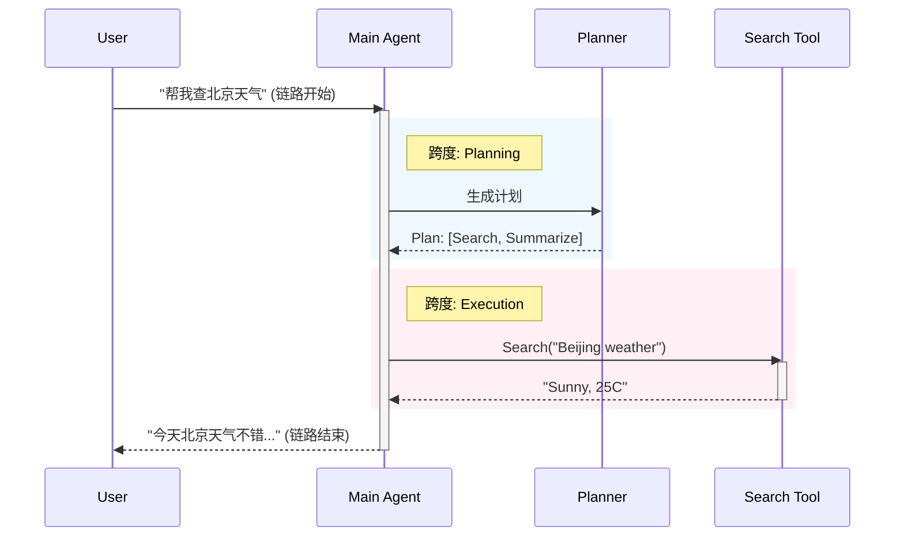
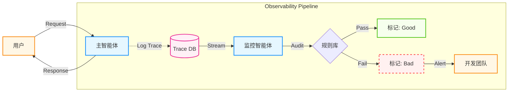

## 9.3 可观测性与调试

在传统的软件开发中，通常通过查看 **调用栈** (Call Stack) 来调试报错。但在智能体开发中，“Bug” 往往不是代码崩溃（Crash），而是智能体 “一本正经地胡说八道” 或者 “陷入了无意义的死循环”。

当智能体出错时，你不能只看最后一行输出。你需要像黑匣子一样，记录下它每一次思考、每一次工具调用和每一次状态更新。这就是智能体的 **可观测性**。

### 9.3.1 为什么智能体难以调试

传统软件的行为由预先编写的代码决定，出了问题可以回溯代码逻辑。但智能体的行为路径是 LLM 在运行时动态生成的——这些"暗码（Dark Code）"执行完毕后即消散，无法像源代码一样被事先审查或精确复现。这一根本性差异使得可观测性从"有则更好"升级为"没有就是黑盒"。

1. **非确定性**：同样的提示词，上午跑是通的，下午跑就挂了。这使得复现 Bug 变得极其困难。
2. **黑盒推理**：LLM 为什么决定调用 Search 而不是 Calculator？这种决策过程不可见。
3. **多步级联**：第 5 步的错误可能是第 1 步的一个微小偏差导致的蝴蝶效应。
4. **成本隐患**：一个死循环的智能体可能在一夜之间烧掉几千美元。
5. **行为即逝**：Agent 的决策链在运行时生成、运行后消散，缺乏追踪机制就无法事后审计（参见 [9.7.7 暗码反模式](9.7_pitfalls_antipatterns.md)）。

### 9.3.2 核心指标：链路与跨度

借鉴 **分布式追踪** 的概念，可以构建智能体的监控数据模型：

* **链路**：代表用户的一次请求（Request）处理全过程。
* **跨度**：链路中的执行片段（Execution Step）。它既可以指代一次简单的工具调用，也可以包含多个子步骤，共同构成树状结构。

#### 可视化结构



图 9-9：智能体链路追踪示例

在实际的链路追踪平台中，你不仅能看到这个时序图，还能点击每个跨度查看具体的 **输入**、**输出**、**延迟** 和 **成本**。

#### 指标命名与采样

为了让追踪数据在高并发下仍然可用，建议从一开始就统一命名与采样策略：

- **命名一致**：对工具调用、规划、检索、摘要等跨度使用固定命名，便于聚合分析。
- **采样分层**：成功链路低采样，失败链路高采样；高风险动作全量记录。
- **脱敏与权限**：对日志做脱敏，并按角色控制可见范围，避免追踪系统成为数据泄露入口。

#### OpenTelemetry：跨框架可观测性的统一标准

到 2026 年，智能体可观测性已经越来越像传统分布式系统：**追踪的关键不再是你用了哪个框架，而是是否使用统一的语义标准**。在工程上，最值得优先对齐的是 **OpenTelemetry (OTel)** 及其 OTLP 传输协议。

它的重要性在于：

1. **跨供应商互通**：链路数据可以在不同追踪后端之间迁移，而不被某个框架或厂商锁死。
2. **跨进程贯通**：Agent 编排层、工具服务、检索层、评估器与业务 API 可以共享同一个 `trace_id`。
3. **统一语义字段**：例如 `gen_ai.request.model`、`tool.name`、`input_tokens`、`output_tokens`、`user_id` 等，可被统一聚合分析。
4. **便于混合系统接入**：一个链路里即使同时有 LangGraph、应用服务、数据库和自定义工具，也能在同一张 trace 中串起来。

实践上，建议把 OTel 视为“底层数据面”，再把 Langfuse、LangSmith 或内部平台视为“上层分析面”。这样即使追踪产品调整，也不需要重写全部埋点。

#### 跨节点上下文透传

在复杂的系统或者多智能体场景中，链路可能会跨越不同的编排引擎或微服务节点。为了防范“断链”，必须在所有的服务之间传递统一的标识符。

正如 [第 3.6 章 上下文工程](../03_memory/3.6_context_engineering.md) 中所强调的，工程上我们强烈建议引入标准化的 `ContextPack` 作为智能体间的记忆与请求载荷，并强制将其 `trace_id` 作为全局追踪主键：
1. **注入**：每次收到新的外部（人类或系统）请求，网关生成全局唯一的 `trace_id` 并初始化首个 `ContextPack`。
2. **透传**：在后续的工具调用（Tool Use）、RAG 检索、以及智能体间任务委派（[第 6.5 章](../06_communication/6.5_a2a.md)）时，强制携带该 `trace_id` 并衍生 `span_id`。
3. **聚合**：当在可观测平台查询该 `trace_id` 时，即可拼装出围绕该请求发生的所有内部状态流转、子模型调用和网络请求截面，彻底消除黑盒排障瓶颈。

### 9.3.3 评估体系：从离线到在线

仅仅记录链路是不够的，你还需要回答两个问题：

1. 这条链路最后有没有完成任务？
2. 它完成任务的过程是否健康、可复用、可扩展？

这正对应了 2026 年生产系统中越来越常见的两类评估：

* **Outcome Evaluation**：看最终结果对不对，任务是否完成。
* **Trajectory Evaluation**：看执行轨迹是否合理，是否存在多余步骤、错误路由、违规动作、重复工具调用等。

#### 1. 离线评估

离线评估的目标是为系统建立一个稳定基线。最低配置通常包括：

* **Golden Dataset**：覆盖核心任务、长尾场景、高风险边界与历史事故样本。
* **Outcome Eval**：例如准确率、完成率、引用覆盖率、格式合规率。
* **Trajectory Eval**：例如平均步数、无效工具调用率、重复调用率、人工接管率。

一个典型的黄金数据集可以包含三类样本：

1. **主路径样本**：最常见、最有业务价值的任务。
2. **对抗样本**：歧义输入、噪声文档、冲突事实、异常工具返回。
3. **事故回流样本**：线上 Bad Cases，经修正后重新纳入回归集。

#### LLM-as-a-Judge 的正确用法

在开放式任务里，仅靠字符串匹配往往无法评估真实质量，因此很多团队会使用 **LLM-as-a-Judge**。这很有用，但必须注意边界：

* 它适合比较“版本 A 是否优于版本 B”，不适合完全替代人工。
* 它擅长评估结构、完整性、论证质量，较弱于极细粒度事实核查。
* 它应当被抽样人工校准，否则评审器本身也会漂移。

**评估范围的局限**：在多智能体系统评估中需要注意一个重要挑战：**创意解决方案可能超越预设的评估范围**。当多智能体系统面对开放式问题时，智能体可能探索出设计者未曾预见但同样有效的路径。此时，单纯的固定答案评分可能无法捕捉真实价值。

解决方案包括：

- 采用混合评估：在定量评分之外加入人工抽检。
- 定期审视评估标准：把新的高价值输出纳入黄金数据集。
- 记录轨迹而不只记录答案：让评审者能够判断“为什么它有效”。

#### 2. 在线评估

离线评估用于“发布前把关”，在线评估用于“发布后守门”。既然无法人工检查每一条日志，就需要部署异步审计流水线，对生产 trace 做实时打分。

* **原理**：
    * 主智能体处理用户请求。
    * 监控智能体或规则引擎异步读取 trace、输入输出和工具结果。
    * 评估器给出分数、标签和是否告警的判断。
* **常见检测项**：
    * **幻觉检测**：回答中的关键事实是否可被检索证据支持。
    * **轨迹健康度**：是否存在异常步数、重复工具调用、错误路由。
    * **毒性与安全**：是否包含攻击性内容、越权动作、潜在泄露。
    * **格式与协议**：是否输出符合规范的 JSON、Schema 或工具参数。
    * **业务指标**：是否真正完成任务，而不是只生成一段看起来很像答案的文本。



图 9-10：在线评估与可观测性管道

#### 把评估接入 CI/CD

成熟团队会把评估直接接入发布流程，而不是作为“上线后再看”的可选项：

1. **Prompt 变更**：触发黄金集回归。
2. **模型切换**：同时比较成本、延迟、Outcome 和 Trajectory。
3. **工具或检索逻辑变更**：重点检查事实性错误、空结果处理和回退逻辑。
4. **编排策略变更**：重点检查平均步数、循环率、人工接管率。

如果没有这层自动评估，任何“优化”都只是主观感觉。

### 9.3.4 多智能体系统的失败诊断

当多智能体系统（MAS）出现问题时，系统性地定位根因往往比“盯着最后一句回复”更有效。一种常见做法是把失败归因拆成三类：系统设计、协调问题、验证问题。当你面对一个错误的链路时，可以按此表检索：

| 类别 | 失败模式 | 典型表现 | 修复策略 |
| :--- | :--- | :--- | :--- |
| **FC1：系统设计**|**FM-1.1 违反任务规范** | 忽略了“只能使用 JSON 格式”的硬性要求 | 将关键约束移至系统提示词开头 |
| | **FM-1.2 违反角色规范** | 客服智能体突然开始写代码 | 强化角色设定 |
| | **FM-1.3 步骤重复** | 智能体反复调用同一个工具，参数也不变 | 增加 `max_retries` 和去重逻辑 |
| | **FM-1.4 上下文丢失** | 多轮对话后智能体忘了初始目标 | 检查记忆截断策略 |
| | **FM-1.5 无法停止** | 任务完成了但智能体继续闲聊 | 明确系统提示词中的停止条件 |
| **FC2：协调问题**|**FM-2.1 对话重置** | 莫名其妙地重新打招呼，上下文丢失 | 检查消息历史拼接逻辑 |
| | **FM-2.2 未请求澄清** | 信息不足时强行猜测，而不是提问 | 增加“不确定时请追问”的指令 |
| | **FM-2.3 任务脱轨** | 聊着聊着跑题到了无关话题 | 增加专门的监督智能体 (Supervisor) |
| | **FM-2.4 信息扣留** | 知道关键信息但没传给下游智能体 | 优化智能体间的消息传递协议 |
| | **FM-2.5 忽略输入** | 智能体 B 忽略了智能体 A 的关键输出 | 结构化智能体间的消息传递格式 |
| | **FM-2.6 言行不一** | 思考里说“我要查天气”，手里调了“计算器” | 优化提示词或更换指令遵循能力更强的模型 |
| **FC3：验证问题**|**FM-3.1 过早终止** | 任务没做完就自信地说“完成了” | 增加评审智能体进行结果校验 |
| | **FM-3.2 缺失验证** | 从不检查工具执行结果是否正确 | 引入“双重检查”步骤 (Double Check) |
| | **FM-3.3 错误验证** | 检查了但把对的判成错的 | 提升验证者的能力或增加冗余校验 |


上表用于人工排查，而在高吞吐的生产环境中还需要 **机器可聚合** 的失败标签。建议为每条失败链路打上结构化标签，使日志系统能自动统计 Top-K 失败模式：

```json
{
  "trace_id": "trace-abc-123",
  "failure": {
    "category": "FC1_system_design",
    "code": "FM-1.3",
    "label": "step_repetition",
    "root_cause": "工具连续 5 次使用相同参数调用 search API",
    "severity": "medium",
    "recovery_action": "injected_intervention_prompt"
  }
}
```

**字段说明**：

| 字段 | 类型 | 说明 |
|------|------|------|
| `category` | enum | `FC1_system_design` / `FC2_coordination` / `FC3_validation` |
| `code` | string | 对应上表的失败模式编号 |
| `label` | string | 机器可检索的短标签 |
| `root_cause` | string | 自动或人工归因的根因描述 |
| `severity` | enum | `low` / `medium` / `high` / `critical` |
| `recovery_action` | string | 系统采取的恢复动作 |

### 9.3.5 持续改进

可观测性的终极价值，在于打通 **“线上监控”** 与 **“模型优化”** 的闭环。这是一个持续的改进循环：

1. **捕获**:
    *   全量记录线上链路。
2. **筛选**:
    *   利用 **在线评估** 自动筛选出得分低的 `Bad Cases`。
    *   这是最高价值的数据，因为它们代表了当前系统的短板。
3. **修正**:
    *   人工介入，修正这些 Bad Cases 的预期输出（Expected Output）。
    *   将它们加入到 **离线评估数据集** 中。
4. **改进**:
    *   利用新数据集进行提示词优化或微调 (Fine-tuning)。
    *   运行回归测试，确保新版本解决了旧问题且未引入新 Bug。

> **重要**：
> **数据即代码 (Data is the new Code)**
> 你的智能体代码可能只有 500 行，但你的 Dataset 应该有 5000 个 Case。随着 Dataset 的增长，你的智能体将变得不可战胜。

### 9.3.6 实证指标：智能体自主性的演进

基于百万级用户-智能体交互的实证研究，2026 年观察到了几个明确的自主性指标趋势，这些指标对理解生产智能体的可靠性至关重要。

#### 自主运行时长的增长

过去半年中，99.9 百分位的对话轮次持续时长从 25 分钟以下增长至 45 分钟以上。这反映了两个现象：(1) 模型能力的提升，使得复杂任务能进行更深的推理；(2) 用户信任的建立，导致更多人尝试更长的自主任务。但这种增长并非线性，而是伴随模型迭代和产品改进的阶跃式上升。

#### 人机协作模式的转变

经验用户的行为呈现两个看似矛盾的趋势：自动审批率从 20% 上升到 40%，但同时主动中断频率也在增加。根本原因是用户的监督策略从"逐步批准"转变为"全局监控"——他们相信智能体能自主执行大多数步骤，只在整体进度偏离预期时才介入。

#### 自主性的标志：主动澄清

数据显示，Claude Code 在复杂任务上请求用户澄清的频率是简单任务的两倍以上。更重要的是，Agent 提出澄清的频率超过人类主动中断的频率。这表明模型已学会"知之为知之"——在不确定时主动请求帮助，而非强行猜测。

#### 可逆性与风险数据

在所有工具调用中，约 80% 涉及安全防护（检查点、权限验证、可回滚操作），只有 0.8% 是真正不可逆的操作（如最终删除、生产发布）。这说明现有的 Harness 设计有效地控制了风险表面。

#### 建议的监控指标集

对于生产部署，建议追踪的核心指标包括：
- **自主持续时长**：99 百分位、平均值
- **人工干预率**：主动请求澄清 vs 被用户中断
- **操作安全覆盖率**：可逆操作占比 vs 不可逆操作占比
- **适应性**：模型在异常情况下的澄清请求数量

### 9.3.7 工具生态

不同团队会选择不同的可观测性产品形态，但能力结构大体一致：

* **追踪与回放**：按链路与跨度回放一次请求的全流程，支持查看每一步输入输出与中间状态。
* **指标与告警**：延迟、错误率、工具调用失败率、超时率、成本与吞吐。
* **评估与标注**：离线数据集评测、线上抽样评测、人工标注与回归。
* **提示词与配置管理**：提示词模板、版本管理、灰度发布与回滚。

到 2026 年，主流产品的差异越来越集中在“分析体验”和“协作能力”，而底层追踪模型则越来越向 OTel 语义靠拢。无论使用 Langfuse、LangSmith 还是内部平台，都建议优先保证以下几点：

* trace/span 命名和字段语义一致；
* 可以导出或接收 OTLP；
* 评估结果能回写到 trace；
* 可以把线上 Bad Cases 直接沉淀为离线回归集。

有了[设计模式](9.1_design_patterns.md)、[执行治理](9.2_harness.md) 和 [可观测性](9.3_observability.md)，目前已经构建了一个可靠的系统。接下来将探讨如何优化系统性能和成本。

---

**下一节**: [性能优化与成本控制](9.4_optimization.md)
