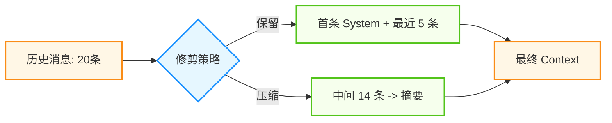
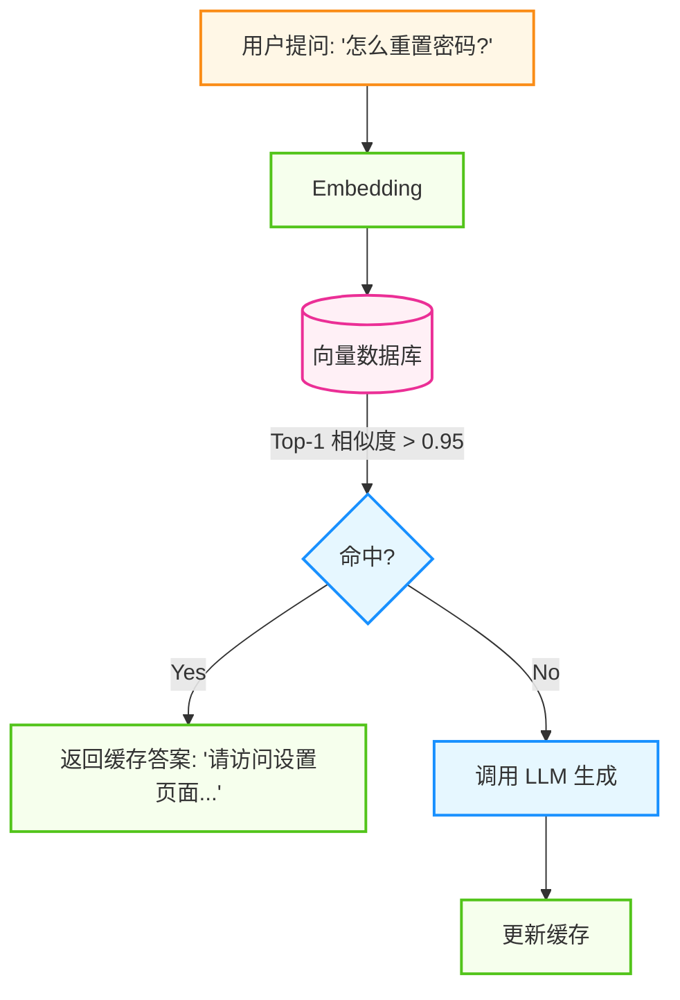

## 9.3 性能优化与成本控制

智能体系统的运营成本主要来自 LLM API 调用。一个设计不当的智能体可能每个任务消耗数万 Token，导致成本失控。本节探讨如何在保证质量的前提下优化性能和控制成本。

### 9.3.1 成本构成与分析

#### 大语言模型调用成本

以 **GPT-5** 为例分析成本构成：
*   **输入**: $1.25 / 1M tokens
*   **输出**: $10.00 / 1M tokens
*   **缓存命中**: $0.125 / 1M tokens (90% off)

**典型智能体任务的 Token 消耗**：
一个复杂的思维链规划循环（含 3 次工具调用）可能消耗 50k Tokens（输入 40k + 输出 10k）。如果每天有 1000 次调用，日成本约 $150，月成本约 $4500。

#### 基础设施成本
智能体系统的配套设施成本通常占总成本的 15-30%：
*   **向量数据库**: 长期记忆存储和索引查询费用。
*   **网络传输**: 跨区域/跨洋调用的流量与延迟成本。

#### 自建推理决策
随着规模扩大，需评估从 API 转为自建的盈亏平衡点：
*   **成本临界点**: 当日均 Token 消耗超过 **100M** (1亿) 时，租用 H100/A100 使用 vLLM / SGLang 自建推理服务的综合成本通常低于调用商业 API。这需要详细计算 TCO。

### 9.3.2 提示词与上下文优化

#### 1. 提示词压缩
减少系统提示词的冗余。

```python
# ❌ 冗余 (150 tokens)
system_prompt = "你好！你是一个非常友好和乐于助人的 AI 助手。你的主要职责是..."

# ✅ 精简 (30 tokens)
system_prompt = "角色: 专家助手. 规则: 1) 简洁. 2) 不确定时使用工具."
```

#### 2. 上下文窗口管理
除了压缩，还需要避免无限累积历史消息。使用 **滑动窗口** + **摘要** 策略。



图 9-1：上下文滑动窗口与摘要策略

### 9.3.3 缓存策略

缓存是计算机科学领域最有效的优化手段之一，在智能体体系中也不例外。

#### 1. 提示词缓存
对于长文档分析或多轮对话，上下文的前缀往往是不变的。传统的 LLM 每次都要重新处理这些 Token。**提示词缓存** 允许将这部分计算结果缓存在 KV Cache 中，供下次请求复用。

*   **工作原理**: 如果新请求的前 10k Tokens 与缓存中的一致，则直接跳过 Prefill 阶段。
*   **显式控制**: 像 Anthropic 或 DeepSeek 等模型支持通过 `cache_control` 标记来显式缓存某些段落（如系统提示词或知识库文档）。
*   **收益分析**: 缓存命中部分的 Token 价格通常只有未命中的 **10%**（甚至更低）；首字延迟 (TTFT) 显著降低。

```python
# Anthropic Claude 4.6 示例
messages = [
    {
        "role": "system",
        "content": [
            {
                "type": "text",
                "text": very_long_system_prompt,
                "cache_control": {"type": "ephemeral"} # ✅ 标记缓存
            }
        ]
    },
    ...
]
```

#### 2. 语义缓存
对相似查询返回缓存结果，无需调用 LLM。



图 9-2：语义缓存工作流程

*   **适用场景**: FAQ、重复性高的查询。
*   **收益**: 成本降低 30-60%，延迟降低 90%。

#### 3. 预加载
结合提示词缓存，在用户打开页面的瞬间，将相关的知识库上下文预加载到 KV 缓存中。

### 9.3.4 模型选择与蒸馏

**"大模型教小模型"** 是降低常态化运营成本的终极手段。

#### 1. 模型蒸馏
如果不加控制，Agent 系统为了保证效果会倾向于一直调用最贵的模型（如 o3 或 Opus）。但对于固定场景（如“SQL生成”或“格式化输出”），小模型经过微调完全可以胜任。

**蒸馏流水线**:
1.  **收集数据**: 使用最强模型 (Teacher, e.g., GPT-5) 运行一段时间，收集 Input/Output 对。
2.  **筛选黄金数据**: 利用 Monitor Agent 筛选出高质量的 (Input, Output, CoT)。
3.  **微调 (Fine-tune)**: 使用这些数据微调一个小模型 (Student, e.g., Llama-4-Scout 或 GPT-5-mini)。
4.  **替换上线**: 将小模型部署上线，成本可降低 **95%** 以上。

#### 2. 混合路由
即使有了微调模型，也可保留一个“兜底”机制：

```mermaid
graph LR
    %% Agentic Design System
    classDef agent fill:#e6f7ff,stroke:#1890ff,stroke-width:2px;
    classDef tool fill:#f6ffed,stroke:#52c41a,stroke-width:2px;

    Input --> Router{置信度评估}
    Router -->|高置信度| Student[微调小模型]
    Router -->|低置信度| Teacher[大模型 (o3/Opus)]
    
    class Router agent;
    class Student tool;
    class Teacher agent;
```

图 9-3：大小模型混合路由策略

### 9.3.5 延迟优化

要降低延迟，架构层面的优化往往比代码层面的微调更有效。

#### 1. 预处理-解码分离
对于自建模型或私有化部署，**预处理-解码分离**是解决高并发延迟的关键架构。
*   **问题**:  预处理（处理长提示词）是计算密集型的，解码（逐字生成）是内存带宽密集型的。混合部署会导致预处理阻塞解码，造成首字延迟极高。
*   **解法**: 将计算节点拆分为 **预处理实例** 和 **解码实例**，通过 KV Cache 传输状态。
    *   **预处理实例**: 吞吐优先，快速处理长提示词。
    *   **解码实例**: 延迟优先，快速生成 token。

#### 2. 并行推测
当智能体还在思考 "我是否需要查询天气" 时，后台已经并发启动了 `get_weather(city)`。
*   **猜中了**: 用户感到零延迟。
*   **猜错了**: 浪费了一次 API 调用的钱。
*   **权衡**: 用 **成本** 换 **延迟降低**。

#### 3. 网络优化
*   **跨洋延迟**: 使用边缘节点 (Edge Functions) 或多区域部署来减少跨洋联网的 RTT。
*   **协议优化**: 使用 HTTP/2 或 WebSocket 减少连接建立开销。

### 9.3.6 成本监控

FinOps 是一种将财务问责制引入云和 AI 支出的文化与实践。在智能体体系中，它意味着工程团队需要对每一次 Token 消耗的 ROI 负责。

1.  **预算告警**: 设置每日/每月硬性预算。
2.  **归因分析**: 给每个 Trace 打上 `User_ID`, `Feature_ID` 标签，分析哪个功能最烧钱。
3.  **异常检测**: 监控 `Cost / Request` 指标，发现异常突增（通常意味着死循环）。

---

**下一节**: [9.4 企业级安全与合规部署](9.4_enterprise.md)
