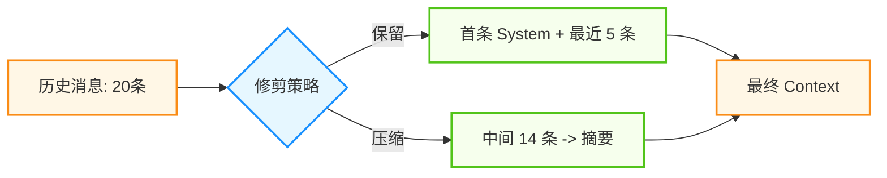
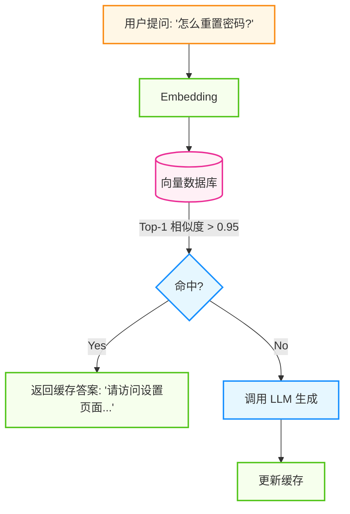
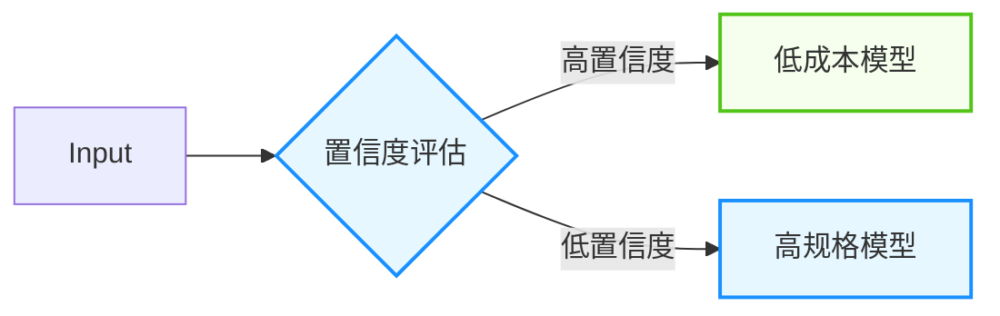

## 9.3 性能优化与成本控制

智能体系统的运营成本主要来自 LLM API 调用。一个设计不当的智能体可能每个任务消耗数万 Token，导致成本失控。本节探讨如何在保证质量的前提下优化性能和控制成本。

### 9.3.1 成本构成与分析

本节将依次介绍“大语言模型调用成本”与“基础设施成本”等内容。

#### 大语言模型调用成本

以“托管式大模型 API”的常见计费方式为例，成本通常由以下部分组成：
* **输入词元**：请求中提示词与上下文的计费。
* **输出词元**：模型生成内容的计费。
* **缓存/折扣机制**：部分平台对缓存命中或重复前缀提供优惠。

**典型智能体任务的词元消耗**：
一个包含多轮规划与多次工具调用的任务，词元消耗会显著高于“单次问答”。因此，成本分析应基于真实链路的采样统计，而不是只看单次调用。

#### 基础设施成本

智能体系统的配套设施成本通常不容忽视：
* **向量数据库**: 长期记忆存储和索引查询费用。
* **网络传输**: 跨区域/跨洋调用的流量与延迟成本。

#### 自建推理决策

随着规模扩大，可能需要评估从 API 转为自建推理的盈亏平衡点。建议按 TCO（算力、运维、弹性、可用性、合规、峰谷负载）做详细核算，而不是用单一阈值一刀切。

### 9.3.2 提示词与上下文优化

本节将依次介绍“提示词压缩”与“上下文窗口管理”等内容。

#### 1. 提示词压缩

减少系统提示词的冗余。

```python
# ❌ 冗余 (150 tokens)
system_prompt = "你好！你是一个非常友好和乐于助人的 AI 助手。你的主要职责是..."

# ✅ 精简 (30 tokens)
system_prompt = "角色: 专家助手. 规则: 1) 简洁. 2) 不确定时使用工具."
```

#### 2. 上下文窗口管理

除了压缩，还需要避免无限累积历史消息。使用 **滑动窗口**+**摘要** 策略。



图 9-1：上下文滑动窗口与摘要策略

### 9.3.3 缓存策略

缓存是计算机科学领域最有效的优化手段之一，在智能体体系中也不例外。

#### 1. 提示词缓存

对于长文档分析或多轮对话，上下文的前缀往往是不变的。传统的 LLM 每次都要重新处理这些 Token。**提示词缓存** 允许将这部分计算结果缓存在 KV Cache 中，供下次请求复用。

* **工作原理**: 如果新请求的前 10k Tokens 与缓存中的一致，则直接跳过 Prefill 阶段。
* **显式控制**：部分平台支持通过请求参数显式标记可缓存段落（例如系统提示词或知识库文档）。
* **收益分析**：缓存命中通常能同时降低成本与首字延迟（TTFT），但收益取决于命中率、前缀稳定性与平台实现。

```python
# 伪代码示例：显式标记“可缓存前缀”
request = {
    "system": {
        "text": very_long_system_prompt,
        "cache_control": {"type": "ephemeral"}
    },
    "messages": [...]
}
```

#### 2. 语义缓存

对相似查询返回缓存结果，无需调用 LLM。



图 9-2：语义缓存工作流程

* **适用场景**: FAQ、重复性高的查询。
* **收益**：在高重复场景下，可能显著降低成本并改善延迟。

#### 3. 预加载

结合提示词缓存，在用户打开页面的瞬间，将相关的知识库上下文预加载到 KV 缓存中。

### 9.3.4 模型选择与蒸馏

**"大模型教小模型"** 是降低常态化运营成本的终极手段。

#### 1. 模型蒸馏

如果不加控制，系统为了保证效果可能会倾向于长期使用高规格模型。但对于固定场景（如“SQL 生成”或“格式化输出”），通过微调或蒸馏得到的小模型往往也能胜任。

**蒸馏流水线**:
1. **收集数据**：使用高规格模型作为“教师”运行一段时间，收集输入输出对。
2. **筛选黄金数据**：结合人工抽检与自动规则筛选出高质量样本。
3. **微调**：使用这些数据微调一个更小、更便宜的“学生”模型。
4. **替换上线**：灰度替换并回归评测，观察质量与成本的变化。

#### 2. 混合路由

即使有了微调模型，也可保留一个“兜底”机制：



图 9-3：大小模型混合路由策略

### 9.3.5 延迟优化

要降低延迟，架构层面的优化往往比代码层面的微调更有效。

#### 1. 预处理-解码分离

对于自建模型或私有化部署，**预处理-解码分离**是解决高并发延迟的关键架构。
* **问题**:  预处理（处理长提示词）是计算密集型的，解码（逐字生成）是内存带宽密集型的。混合部署会导致预处理阻塞解码，造成首字延迟极高。
* **解法**: 将计算节点拆分为 **预处理实例**和**解码实例**，通过 KV Cache 传输状态。
    * **预处理实例**: 吞吐优先，快速处理长提示词。
    * **解码实例**: 延迟优先，快速生成 token。

#### 2. 并行推测

当智能体还在思考 "我是否需要查询天气" 时，后台已经并发启动了 `get_weather(city)`。
* **猜中了**: 用户感到零延迟。
* **猜错了**: 浪费了一次 API 调用的钱。
* **权衡**: 用 **成本**换**延迟降低**。

#### 3. 网络优化

* **跨地域延迟**：使用边缘节点或多区域部署来减少跨地域联网的 RTT。
* **协议优化**: 使用 HTTP/2 或 WebSocket 减少连接建立开销。

### 9.3.6 成本监控

FinOps 是一种将财务问责制引入云和 AI 支出的文化与实践。在智能体体系中，它意味着工程团队需要对每一次 Token 消耗的 ROI 负责。

1. **预算告警**: 设置每日/每月硬性预算。
2. **归因分析**: 给每个 Trace 打上 `User_ID`, `Feature_ID` 标签，分析哪个功能最烧钱。
3. **异常检测**: 监控 `Cost / Request` 指标，发现异常突增（通常意味着死循环）。

---

**下一节**: [9.4 企业级安全与合规部署](9.4_enterprise.md)
