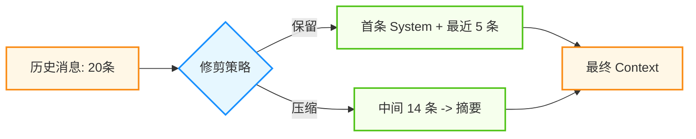
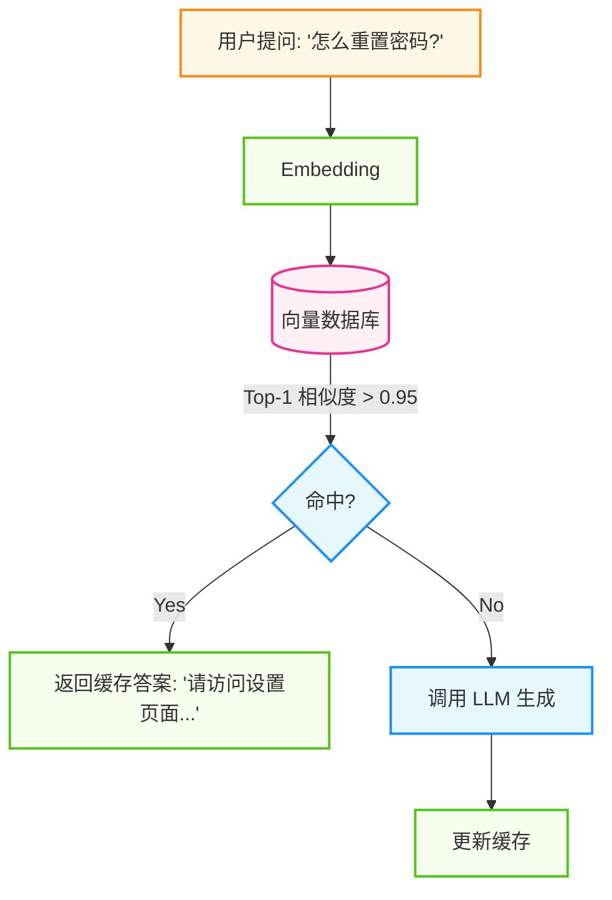
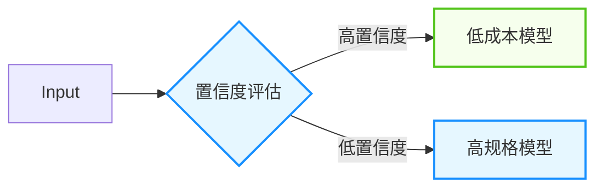

## 9.3 性能优化与成本控制

智能体系统的运营成本主要来自 LLM API 调用。一个设计不当的智能体可能每个任务消耗数万 Token，导致成本失控。本节探讨如何在保证质量的前提下优化性能和控制成本。

### 9.3.1 成本构成与分析

#### 大语言模型调用成本

以“托管式大模型 API”的常见计费方式为例，成本通常由以下部分组成：
* **输入词元**：请求中提示词与上下文的计费。
* **输出词元**：模型生成内容的计费。
* **缓存/折扣机制**：部分平台对缓存命中或重复前缀提供优惠。

**典型智能体任务的词元消耗**：
一个包含多轮规划与多次工具调用的任务，词元消耗会显著高于“单次问答”。因此，成本分析应基于真实链路的采样统计，而不是只看单次调用。

#### 基础设施成本

智能体系统的配套设施成本通常不容忽视：
* **向量数据库**: 长期记忆存储和索引查询费用。
* **网络传输**: 跨区域/跨洋调用的流量与延迟成本。

#### 自建推理决策

随着规模扩大，可能需要评估从 API 转为自建推理的盈亏平衡点。建议按 TCO（算力、运维、弹性、可用性、合规、峰谷负载）做详细核算，而不是用单一阈值一刀切。

### 9.3.2 提示词与上下文优化

#### 1. 提示词压缩

减少系统提示词的冗余。

```python
# ❌ 冗余 (150 tokens)
system_prompt = "你好！你是一个非常友好和乐于助人的 AI 助手。你的主要职责是..."

# ✅ 精简 (30 tokens)
system_prompt = "角色: 专家助手. 规则: 1) 简洁. 2) 不确定时使用工具."
```

#### 2. 上下文窗口管理

除了压缩，还需要避免无限累积历史消息。使用 **滑动窗口**+**摘要** 策略。


```mermaid
graph LR
    %% Agentic Design System
    classDef user fill:#fff7e6,stroke:#fa8c16,stroke-width:2px;
    classDef agent fill:#e6f7ff,stroke:#1890ff,stroke-width:2px;
    classDef tool fill:#f6ffed,stroke:#52c41a,stroke-width:2px;

    History[历史消息: 20条] --> Trim{修剪策略}
    Trim -->|保留| Keep[首条 System + 最近 5 条]
    Trim -->|压缩| Summary[中间 14 条 -> 摘要]
    Keep & Summary --> Context[最终 Context]
    
    class History user;
    class Trim agent;
    class Keep,Summary tool;
    class Context user;
```

图 9-9：上下文滑动窗口与摘要策略

### 9.3.3 缓存策略

缓存是计算机科学领域最有效的优化手段之一，在智能体体系中也不例外。

#### 1. 提示词缓存

对于长文档分析或多轮对话，上下文的前缀往往是不变的。传统的 LLM 每次都要重新处理这些 Token。**提示词缓存** 允许将这部分计算结果缓存在 KV Cache 中，供下次请求复用。这不仅能极大地降低多轮会话成本（可节省高达 90% 的输入词元费用），还能显著降低首字延迟（TTFT）。

**示例：文档分析智能体的缓存效果**

```text
无缓存场景：
  系统提示 + 工具定义 + 文档模板 = 5,000 tokens（每次都发送）
  100 次查询 × (5,000 + 500 用户输入) = 550,000 tokens

启用缓存后：
  缓存命中：100 次 × 500 用户输入 = 50,000 tokens
  缓存写入：1 次 × 5,000 = 5,000 tokens
  总计：55,000 tokens
  节省：(550,000 - 55,000) / 550,000 ≈ 90%
```

**核心工程挑战与架构经验**：

* **前缀匹配的脆弱性**：KV Cache 的复用必须从头开始严格匹配。如果前缀区哪怕只发生了一个字母的大小写变化，或者插入了一个动态的时间戳，都会导致从该修改点起的所有缓存计算全部作废。
* **分离静态前缀与动态消息**：千万不要通过“修改并重发 System Prompt”来更新诸如“当前日期”或“最新 git 状态”等信息。正确的架构是将所有绝对静态的资产（如 System、工具说明、常驻文档）锁定在起始前缀，而将动态的环境变量通过伪装成普通“用户消息”的形式（比如 `<system-reminder>` 标签）在每一轮对话结束处追加。
* **工具能力的全局声明与按需加载**：智能体的工具列表也是缓存前缀的一部分。如果在对话中途动态增加或移除工具（例如在计划模式与执行模式间切换工具集），会导致前缀改变并发生高昂的缓存未命中。推荐方案是 **始终在系统级声明所有可用工具**，通过工具自身的 `defer_loading`（仅声明接口不做详细描述，需要时再去获取）或辅以用户消息约束（如“现在是计划模式，请停止调用修改文件的工具”）来实现功能的切换。
* **保持模型缓存的一致性**：提示词缓存与具体的模型架构深度绑定。如果一个主控智能体（如由于沉浸式编码任务积累了 100K 语境），想要“为了省钱”而临时切换到小模型去执行一次简单的网络搜索，那么这个小模型首先要为这 100K 上下文重新建立一次全新的 KV Cache。这时的冷启动写入成本往往远大于直接使用主模型处理请求。推荐对于此类杂项任务，启动一个独立的子智能体（具有更短私有上下文）来处理。
* **利用前缀复用进行上下文压缩**：当会话太长不得不执行“压缩（Compaction）”操作时，如果截断前缀，同样会引发灾难性的重建开销。最优的设计是：利用完全一致的静态前缀，将历史对话列表直接替换为“压缩结果摘要 + 最新的系统压缩指令”这条新的信息集合。这样重组后的对话不仅保留了原有的上下文逻辑，还顺便无缝继承了厚重的系统级前缀缓存。

```python
# 伪代码示例：显式标记”可缓存前缀”
request = {
    "system": {
        "text": very_long_system_prompt_with_tools_and_docs,
        "cache_control": {"type": "ephemeral"}  # 明确声明这部分为缓存断点
    },
    "messages": [...]  # 动态的状态与历史信息放在此处
}
```

**”上下文税”：量化你的冗余成本**

在智能体系统中，每个步骤都需要重新处理完整的上下文前缀——系统指令、工具定义和项目文档。这种重复计算可以被量化为 **上下文税（Context Tax）**：

```text
上下文税 = 静态前缀长度 × 执行回合数 × 全价输入单价

示例：20,000 token 前缀 × 50 回合 = 100 万 token 的冗余计算
```

从计算复杂度角度看，无缓存时每轮推理的 Prefill 阶段需要对完整前缀重新计算 KV 向量，其 Attention 计算复杂度随前缀长度呈 $O(n^2)$ 增长；而有了前缀缓存，后续请求跳过已缓存部分，只需从新增 Token 开始计算，有效降低为 $O(n)$。对于长路径智能体工作流来说，这往往是整个 AI 基础设施中最大的支出项。

**生产环境的缓存效率监控**

部署提示词缓存后，必须像监控系统 uptime 一样持续追踪缓存效率。关注 API 响应中的三个关键字段：

| 指标 | 含义 | 健康目标 |
|------|------|---------|
| `cache_creation_input_tokens` | 本次请求写入缓存的 Token 数 | 仅首次请求较高 |
| `cache_read_input_tokens` | 从缓存读取的 Token 数 | 占总输入 >80% |
| `input_tokens` | 正常处理的新增 Token 数 | 仅为动态尾部 |

缓存效率得分 = `cache_read / (cache_read + cache_creation + input_tokens)`。在实际的长会话编程智能体中（如 Claude Code），这个比率可以稳定维持在 92% 以上，实现 81% 的总成本削减。如果效率持续低于 80%，应排查是否存在前缀顺序变化、中途增删工具或切换模型等反模式。

#### 2. 语义缓存

对相似查询返回缓存结果，无需调用 LLM。


```mermaid
graph TD
    %% Agentic Design System
    classDef user fill:#fff7e6,stroke:#fa8c16,stroke-width:2px;
    classDef agent fill:#e6f7ff,stroke:#1890ff,stroke-width:2px;
    classDef tool fill:#f6ffed,stroke:#52c41a,stroke-width:2px;
    classDef memory fill:#fff0f6,stroke:#eb2f96,stroke-width:2px;

    Query["用户提问: '怎么重置密码?'"] --> Embed[Embedding]
    Embed --> VectorDB[(向量数据库)]
    VectorDB -->|Top-1 相似度 > 0.95| Hit{命中?}
    Hit -->|Yes| Cache["返回缓存答案: '请访问设置页面...'"]
    Hit -->|No| LLM[调用 LLM 生成]
    LLM --> CacheUpdate[更新缓存]
    
    class Query user;
    class Embed tool;
    class VectorDB memory;
    class Hit agent;
    class Cache,CacheUpdate tool;
    class LLM agent;
```

图 9-10：语义缓存工作流程

* **适用场景**: FAQ、重复性高的查询。
* **收益**：在高重复场景下，可能显著降低成本并改善延迟。

#### 3. 预加载

结合提示词缓存，在用户打开页面的瞬间，将相关的知识库上下文预加载到 KV 缓存中。

### 9.3.4 模型选择与蒸馏

**“大模型教小模型”** 是降低常态化运营成本的终极手段。

#### 1. 模型蒸馏

如果不加控制，系统为了保证效果可能会倾向于长期使用高规格模型。但对于固定场景（如“SQL 生成”或“格式化输出”），通过微调或蒸馏得到的小模型往往也能胜任。

**蒸馏流水线**:
1. **收集数据**：使用高规格模型作为“教师”运行一段时间，收集输入输出对。
2. **筛选黄金数据**：结合人工抽检与自动规则筛选出高质量样本。
3. **微调**：使用这些数据微调一个更小、更便宜的“学生”模型。
4. **替换上线**：灰度替换并回归评测，观察质量与成本的变化。

#### 2. 混合路由

即使有了微调模型，也可保留一个“兜底”机制：


```mermaid
graph LR
    %% Agentic Design System
    classDef agent fill:#e6f7ff,stroke:#1890ff,stroke-width:2px;
    classDef tool fill:#f6ffed,stroke:#52c41a,stroke-width:2px;

    Input --> Router{置信度评估}
    Router -->|高置信度| Student[低成本模型]
    Router -->|低置信度| Teacher[高规格模型]
    
    class Router agent;
    class Student tool;
    class Teacher agent;
```

图 9-11：大小模型混合路由策略

### 9.3.5 延迟优化

要降低延迟，架构层面的优化往往比代码层面的微调更有效。

#### 1. 分离式架构

对于自建模型或私有化部署，**预填充（Prefill）与解码（Decode）的分离** 是解决高并发延迟的关键架构。
* **物理瓶颈互斥**: 计算处理极长的输入提示词（Prefill 阶段）对 GPU 是计算密集型的；而逐字生成答案（Decode 阶段）则因为参数搬运缓慢而属于访存密集型。混合部署会导致突发长 Prompt 请求瞬间霸占所有算力，引发其他并发对话被严重卡顿（队头阻塞）。
* **解耦方案**: 领军系统将机器拆分为独立的 **Prefill 集群**（主打算力）和 **Decode 集群**（主打显存带宽），两者通过超敏捷的高速 RDMA 网络在微秒级实现海量 KV Cache 状态的跨节点传输，彻底抚平算力与显存毛刺。

#### 2. 投机解码

打破自回归模型必须“串行龟速生成”的宿命，尤其适合消除智能体冗长思维链过程的时间消耗。
* **机制**: 引入一个极其小巧且飞快的“草稿模型”（或并行的辅助预测头），它先快速猜想出后续的 5 个候选 Token，接着交由庞大的“目标模型”在一个并行批次中同时验证。
* **收益**: 因为大模型在 Decode 时其实多数算力处于闲置，并行验证多个 Token 的耗时与生成 1 个 Token 基本相同。只要目标模型接受了草稿输出，就等于在零时间成本下“免费”生成了多个字。在完全不损失生成智商的前提下，能将整个任务时延降低几倍。

#### 3. 并行推测

在智能体的应用层，可以预判工具调用结果并提前触发下游操作：
* **预判分支**: 如果 Agent 大概率会调用某个 API，可以在等待 LLM 生成最终决策的同时，提前异步发起该 API 请求。
* **并行工具调用**: 当多个工具调用之间无依赖关系时，并行执行而非串行等待。

#### 4. 网络优化

* **跨地域延迟**：使用边缘节点或多区域部署来减少跨地域联网的 RTT。
* **协议优化**: 使用 HTTP/2 或 WebSocket 减少连接建立开销。

### 9.3.6 成本监控

FinOps 是一种将财务问责制引入云和 AI 支出的文化与实践。在智能体体系中，它意味着工程团队需要对每一次 Token 消耗的 ROI 负责。

1. **预算告警**: 设置每日/每月硬性预算。
2. **归因分析**: 给每个 Trace 打上 `User_ID`, `Feature_ID` 标签，分析哪个功能最烧钱。
3. **异常检测**: 监控 `Cost / Request` 指标，发现异常突增（通常意味着死循环）。

### 9.3.7 智能体系统 TCO 分析框架

一个完整的智能体系统 TCO（Total Cost of Ownership）分析应覆盖以下维度：

| 成本维度 | 组成项 | 典型占比 | 优化杠杆 |
|---------|-------|---------|---------|
| 模型推理 | Token 消耗、模型选择、推理次数 | 40-60% | 缓存、模型路由、提示词压缩 |
| 基础设施 | 向量数据库、消息队列、存储 | 15-25% | 按需扩缩容、冷热分层 |
| 开发维护 | 提示词迭代、框架升级、调试 | 10-20% | 自动化测试、CI/CD |
| 人工干预 | HITL 审核、异常处理、标注 | 5-15% | 提升自动化率、优化触发阈值 |
| 监控运维 | 日志存储、告警系统、可观测性 | 5-10% | 采样策略、日志分级 |

**关键决策公式**：

```text
单任务成本 = Σ(每步 Token 数 × 模型单价) + 工具调用成本 + 人工干预概率 × 人工成本
```

**单智能体 vs 多智能体成本对比**：

多智能体架构通常带来 2-5 倍的 Token 消耗增长（因智能体间通信开销），但可能在以下场景中实现净成本下降：
- **任务并行度高**：多智能体并行处理，总延迟降低，间接节省人力等待成本
- **专业化路由**：简单子任务用小模型，复杂子任务用大模型，平均成本反而更低
- **失败隔离**：单个子智能体失败不影响整体，减少全量重试的浪费

**实践建议**：在系统设计阶段就建立成本模型，将 Token 预算作为架构约束之一。参考[第 7.5 节推理预算分配](../07_evolution/7.5_reasoning.md)中的分级策略。建议按月对 TCO 各维度进行回溯分析，识别成本热点，并驱动优化循环。同时要警惕”假优化”陷阱：盲目削减监控成本可能导致生产故障成本翻倍；过度压缩模型规格可能引发质量严重下滑和人工补救成本激增。

#### 成本建模实战：从估算到决策

在架构设计阶段，以下模板可帮助团队快速建立定量的成本预期，避免上线后才发现账单失控。

**Step 1: 单任务成本采样**

对典型任务进行 50-100 次采样，统计 Token 消耗的分布：

```python
# 成本采样分析模板
import statistics

sample_costs = []  # 收集 N 次真实任务的 Token 消耗

for task in sample_tasks:
    result = run_agent(task)
    sample_costs.append({
        "input_tokens": result.input_tokens,
        "output_tokens": result.output_tokens,
        "tool_calls": result.tool_call_count,
        "steps": result.total_steps,
        "latency_ms": result.latency_ms,
    })

input_tokens = [c["input_tokens"] for c in sample_costs]
output_tokens = [c["output_tokens"] for c in sample_costs]

print(f"输入 Token - P50: {statistics.median(input_tokens)}, "
      f"P95: {sorted(input_tokens)[int(len(input_tokens)*0.95)]}, "
      f"Max: {max(input_tokens)}")
print(f"输出 Token - P50: {statistics.median(output_tokens)}, "
      f"P95: {sorted(output_tokens)[int(len(output_tokens)*0.95)]}, "
      f"Max: {max(output_tokens)}")
```

**Step 2: 月度成本预测公式**

```text
月度推理成本 = 日均任务数 × 30 × (P95_输入Token × 输入单价 + P95_输出Token × 输出单价)
              × (1 - 缓存命中率 × 缓存折扣率)
              × 安全系数(1.2~1.5)

总月度成本 = 月度推理成本 + 基础设施固定成本 + 人工干预率 × 人工单价 × 日均任务数 × 30
```

> **提示**：
> 使用 **P95**（而非平均值）做成本预测，因为智能体任务的 Token 消耗往往呈长尾分布——少量复杂任务的消耗可能是平均值的 5-10 倍。

**Step 3: ROI 评估框架**

智能体系统的 ROI 不应简单地用”省了多少人力”来衡量。建议采用四象限评估：

| ROI 维度 | 衡量指标 | 计算方法 |
|---------|---------|---------|
| **直接成本节约** | 替代人工的工时价值 | (原人工耗时 - 人机协作耗时) × 人力时薪 |
| **质量提升价值** | 错误率下降带来的损失减少 | 历史错误率 × 单次错误成本 × 错误率下降比例 |
| **速度红利** | 交付周期缩短的商业价值 | 缩短的天数 × 每日延误的机会成本 |
| **规模弹性** | 业务量波动时的边际成本 | 峰值人力成本 vs 峰值推理成本 |

**ROI 计算公式**：

```text
净 ROI = (直接成本节约 + 质量提升价值 + 速度红利 + 规模弹性收益)
         / (推理成本 + 基础设施成本 + 开发维护成本 + 人工干预成本)
         - 1
```

**典型陷阱**：

- **只算推理成本，忽略集成成本**：提示词迭代、评测体系搭建、故障排查的工程投入通常占总成本的 15-25%。
- **用 Demo 效果预测生产 ROI**：生产环境的长尾任务、边缘情况和并发压力会显著改变成本结构。
- **忽视人工干预的隐性成本**：即使自动化率达到 95%，剩余 5% 的人工兜底可能需要更高技能的员工，单位成本反而更高。

### 9.3.8 B2B 定价模式的演进

代理经济的到来正在动摇 B2B 软件行业长期依赖的“按席位订阅”（Seat-based subscription）模式。随着智能体逐步取代人类执行常规知识工作，企业对软件操作账户的需求将大幅缩减——调查显示高达 40% 的 IT 买家将削减软件席位视为降低支出的首要手段。所有 SaaS 供应商必须重新思考货币化战略，转向更能反映智能体实际创造价值的定价模型。

#### 三种新型定价模式

| 模式 | 逻辑 | 核心挑战 |
|------|------|----------|
| 基于使用（Usage-Based） | 按完成的任务数、API 调用次数等实际消耗计费，约 45% 的 AI 初创公司已采用 | 客户难以预测规模化后的成本，需要预算上限与防透支熔断 |
| 基于智能体（Agent-Based） | 为单个智能体支付订阅费，类似雇佣“数字员工” | 大多数工作流仍需人机协作，客户对完全替代人类的智能体持保留态度 |
| 基于结果（Outcome-Based） | 仅为可衡量的业务成果买单（如合格线索、成功拦截的欺诈交易） | 47% 的买家难以定义清晰的结果，25% 难以就价值归因达成一致 |

#### 成本结构的根本不同

与传统 SaaS 极低的边际成本不同，智能体产品的成本包含了随使用量线性甚至超线性增长的模型推理成本、持续改进的数据训练成本、向量存储（RAG）费用以及人工在环（HITL）监督成本。因此，能够精确追踪每个终端用户的底层 API 消耗，并自动动态调整前端定价以保护利润率的“计费与利润优化引擎”，正在成为 AI 基础设施中不可或缺的一环。

---

**下一节**: [9.4 企业级安全与合规部署](9.4_enterprise.md)
