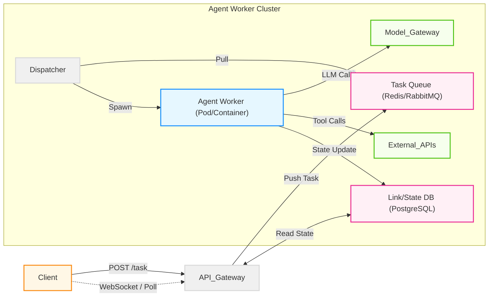
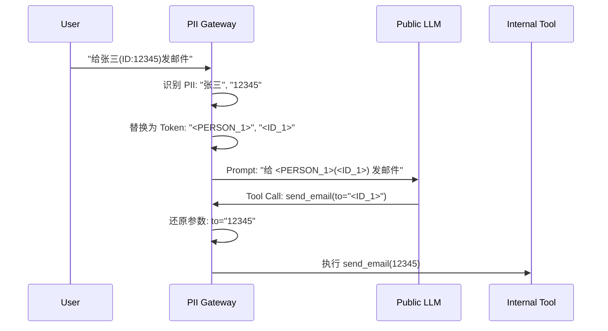

## 9.4 企业级智能体平台：架构、安全与治理

在本地 Notebook 里跑通一个智能体只是第一步，将其转化为可扩展、安全且合规的企业级服务则面临着完全不同的挑战。

企业级部署不仅关注**高可用性**，更核心的是**安全性**、**多租户隔离**和**治理**。本节将深入探讨如何构建一个生产就绪的智能体平台。

### 9.4.1 多租户与隔离架构

智能体应用通常是**有状态**且**长运行**的，这决定了其架构必须能够处理复杂的资源隔离和状态管理。

#### 1. 异步任务队列与状态管理

由于智能体执行可能持续数分钟甚至更久，同步 HTTP 请求不可行。推荐使用 **异步事件驱动架构**，如下图所示。

图 9-4：异步事件驱动架构

* **提交**: 返回 `TaskID`，状态 `Accepted`。
* **执行**: Worker 异步执行，状态持久化到数据库。
* **流式**: 通过 WebSocket 推送思考过程和增量结果，缓解用户焦虑。

#### 2. 多租户工作池

在企业内部或者 SaaS 平台，不同部门（如财务部与研发部）的智能体需要严格隔离。

* **计算隔离**: 使用 Kubernetes Namespaces 或不同的 Node Pools 隔离不同租户的 Worker。
* **网络隔离**:
    * **Egress Control**: 财务部的 Agent 只能访问 ERP 系统，严禁访问外网。
    * **Service Mesh**: 使用 Istio/Cilium 实施细粒度的网络策略。

### 9.4.2 深度防御体系

安全不仅仅是 Prompt 上的约束，必须构建多层防御体系。随着工具连接协议与工具服务的普及，Agent 可调用的工具范围大幅扩展，安全防御的重要性也随之倍增。

#### Layer 1: 提示词工程
* **System Prompt**: 设定基准行为准则（"你是一个有用的助手，但不能..."）。
* **局限性**: 容易被越狱（Jailbreak）绕过，不能作为唯一防线。

#### Layer 2: 护栏与过滤器
* **输入/输出过滤**：使用内容安全模型或规则引擎检查输入指令和输出内容。
* **PII 扫描**: 在发送给 LLM 前脱敏敏感数据。

#### Layer 3: 应用程序逻辑
* **工具鉴权**: 在 Agent 调用 `get_salary_info(user_id)` 工具时，代码层必须校验当前操作者是否有权访问该 `user_id`。
* **人类介入（HITL）**: 高风险操作（如 `delete_db`）必须暂停并等待人工审批。

#### Layer 4: 基础设施沙箱
这是最后一道防线，防止 Agent 执行恶意代码。

* **MicroVM 沙箱**：可选用轻量虚拟化或容器隔离方案来运行不可信代码。
    * **托管式沙箱**：也可以使用第三方沙箱服务，按需启动受控执行环境。
* **文件系统隔离**: 沙箱内只能访问临时 `/tmp`，任务结束后立即销毁，不留任何痕迹。

### 9.4.3 治理与合规

随着 Agent 自主性增强，“谁运行了什么？做了什么？”变得至关重要。工程上需要把互操作协议、鉴权模型、审计事件与可追溯的数据结构统一起来，才能让跨团队的协作与治理真正落地。

#### 1. 角色访问控制（RBAC）

* **Agent 定义权限**: 谁可以创建/修改 Agent 的 Prompt 和工具集？
* **Agent 执行权限**: 谁可以向 Agent 下达指令？
* **工具调用权限**：
    * **静态授权**：管理员为智能体绑定可调用的工具与资源范围。
    * **动态授权**：智能体代表用户执行操作时，以用户身份的访问令牌进行代理调用，确保不越权。
* **跨智能体通信授权**：智能体之间通信时，需验证双方身份与权限范围，防止冒充或越权请求。

#### 2. 审计日志

所有操作必须**不可篡改**地记录：
1. **输入**: 用户的原始 Prompt。
2. **思考**: Agent 的中间推理步骤。
3. **工具**: 调用的函数名、参数、以及**返回结果**（这是取证的关键）。
4. **输出**: 最终响应。

#### 3. 法规合规

不同司法辖区对 AI 系统的合规要求差异较大。面向强监管行业与市场的企业级智能体系统，通常需要重点关注：
* **风险分级与技术文档**：哪些场景属于高风险，需要更严格的验证与记录。
* **透明度义务**：用户是否被明确告知正在与 AI 系统交互。
* **人类监督**：高风险操作是否保留有效的人工介入机制。

#### 4. 成本治理

企业级 Agent 平台还需从组织治理角度管控 Token 消耗（详见 9.3 节的成本优化策略）：按团队/部门设定 Agent 调用预算上限，并将成本归因到具体 Agent 实例，配合异常熔断机制防止成本失控。

### 9.4.4 PII 网关与数据隐私

在金融和医疗场景，严禁将客户 PII（个人可识别信息）发送给公有 LLM 模型商。

**架构模式：PII Sidecar / Gateway**

图 9-5：PII 网关脱敏流程

* **PII 识别组件**：可选用开源或商用的 PII 识别与脱敏工具。
* **核心思想**: LLM 只处理逻辑，不接触真实敏感数据。

### 9.4.5 部署策略与可观测性集成

#### 蓝绿部署与影子测试
Agent 的行为难以预测，V2 版本的 Prompt 微调可能导致回归。
* **影子模式**: 将线上流量复制一份给 V2 Agent，记录其响应但不返回给用户。后台运行 **Evaluator Agent** 对比 V1 和 V2 的结果质量。

#### SIEM 集成
将 Agent 的审计日志对接企业 SIEM 系统。
* **异常检测**: 监控 "工具调用失败率骤增" 或 "Token 消耗异常暴涨"（可能遭受 DoS 攻击或陷入死循环）。

### 9.4.6 企业采用现状

企业落地智能体通常会经历从“试点”到“有限生产”再到“规模化”的过程。可以用权限与自动化程度来粗略划分阶段：

| 阶段 | 特征 |
| :--- | :--- |
| **实验期** | 在非生产环境尝试，无严格 SLA |
| **辅助型** | 多为只读权限，辅助检索与总结 |
| **行动型** | 开始引入写权限与自动执行，但有明确的审批与边界 |
| **自治型** | 跨系统自动执行为主，人类介入较少，治理成本高 |

阶段越靠后，越需要把“权限、审计、回滚、成本与故障恢复”做成平台能力，而不是靠应用侧临时补丁。

---

**下一节**: [9.5 生产事故与案例复盘](9.5_failures.md)
