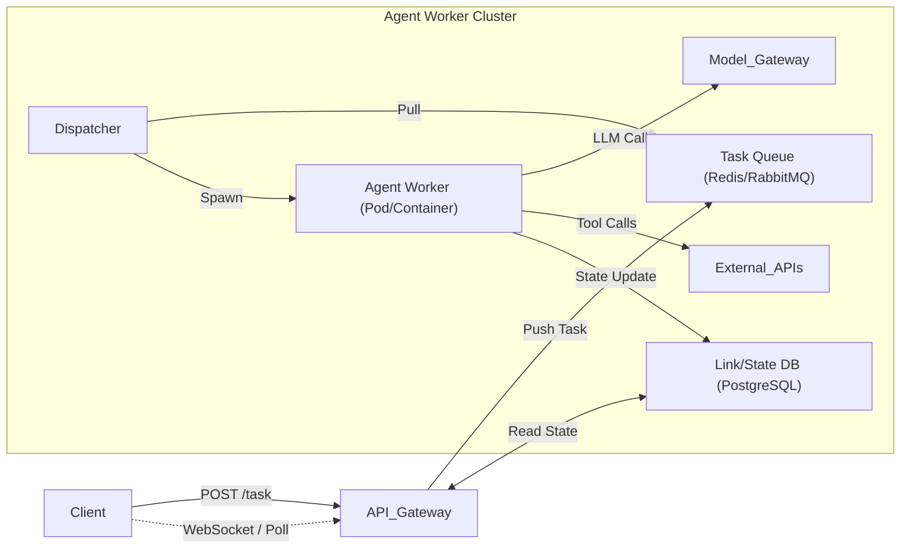
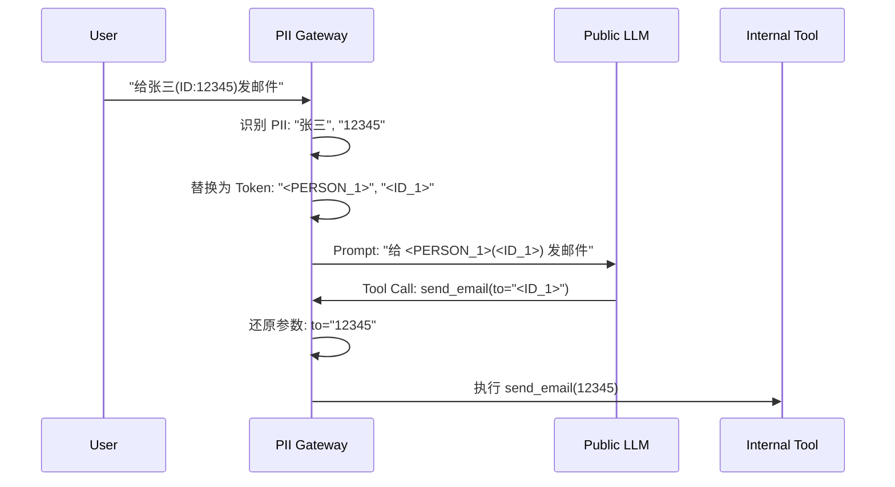

## 9.4 企业级智能体平台：架构、安全与治理

在本地 Notebook 里跑通一个智能体只是第一步，将其转化为可扩展、安全且合规的企业级服务则面临着完全不同的挑战。

企业级部署不仅关注**高可用性**，更核心的是**安全性**、**多租户隔离**和**治理**。本节将深入探讨如何构建一个生产就绪的智能体平台。

### 9.4.1 多租户与隔离架构

智能体应用通常是**有状态**且**长运行**的，这决定了其架构必须能够处理复杂的资源隔离和状态管理。

#### 1. 异步任务队列与状态管理

由于智能体执行可能持续数分钟甚至更久，同步 HTTP 请求不可行。推荐使用 **异步事件驱动架构**，如下图所示。

图 9-4：异步事件驱动架构

*   **提交**: 返回 `TaskID`，状态 `Accepted`。
*   **执行**: Worker 异步执行，状态持久化到数据库。
*   **流式**: 通过 WebSocket 推送思考过程和增量结果，缓解用户焦虑。

#### 2. 多租户工作池

在企业内部或者 SaaS 平台，不同部门（如财务部 vs 研发部）的 Agent 需要严格隔离。

*   **计算隔离**: 使用 Kubernetes Namespaces 或不同的 Node Pools 隔离不同租户的 Worker。
*   **网络隔离**:
    *   **Egress Control**: 财务部的 Agent 只能访问 ERP 系统，严禁访问外网。
    *   **Service Mesh**: 使用 Istio/Cilium 实施细粒度的网络策略。

### 9.4.2 深度防御体系

安全不仅仅是 Prompt 上的约束，必须构建多层防御体系。随着 **MCP（Model Context Protocol）** 等工具连接标准的普及，Agent 可调用的工具范围大幅扩展，安全防御的重要性也随之倍增。

#### Layer 1: 提示词工程
*   **System Prompt**: 设定基准行为准则（"你是一个有用的助手，但不能..."）。
*   **局限性**: 容易被越狱（Jailbreak）绕过，不能作为唯一防线。

#### Layer 2: 护栏与过滤器
*   **输入/输出过滤**: 使用 **NVIDIA NeMo Guardrails** 或 **Llama Guard** 检查输入指令和输出内容。
*   **PII 扫描**: 在发送给 LLM 前脱敏敏感数据。

#### Layer 3: 应用程序逻辑
*   **工具鉴权**: 在 Agent 调用 `get_salary_info(user_id)` 工具时，代码层必须校验当前操作者是否有权访问该 `user_id`。
*   **人类介入（HITL）**: 高风险操作（如 `delete_db`）必须暂停并等待人工审批。

#### Layer 4: 基础设施沙箱
这是最后一道防线，防止 Agent 执行恶意代码。

*   **MicroVM 沙箱**: 推荐使用 **Firecracker** (AWS Lambda 背后的技术) 或 **gVisor**。
    *   **E2B / Modal**: 专为 AI Agent 设计的沙箱服务，并在毫秒级启动 Python 解释器。
*   **文件系统隔离**: 沙箱内只能访问临时 `/tmp`，任务结束后立即销毁，不留任何痕迹。

### 9.4.3 治理与合规

随着 Agent 自主性增强，"谁运行了什么？做了什么？" 变得至关重要。2025 年底成立的 **Agentic AI Foundation（AAIF，隶属 Linux Foundation）** 正在推动 Agent 互操作性和治理标准的统一，包括 MCP、**A2A（Agent-to-Agent Protocol）** 等协议，使得跨组织的 Agent 协作和审计有了规范基础。

#### 1. 角色访问控制（RBAC）

*   **Agent 定义权限**: 谁可以创建/修改 Agent 的 Prompt 和工具集？
*   **Agent 执行权限**: 谁可以向 Agent 下达指令？
*   **工具调用权限**:
    *   **静态授权**: Admin 授予 Agent A 使用 "AWS S3 Read" 的权限。
    *   **动态授权 (OAuth 2.0 On-Behalf-Of)**: Agent 代表 User 执行操作时，使用 User 的 Token，确保 Agent 不会越权访问 User 本身无法访问的资源。
*   **跨 Agent 通信授权**: 当 Agent 之间通过 A2A 协议交互时，需验证双方的身份和权限范围，防止恶意 Agent 的冒充或越权请求。

#### 2. 审计日志

所有操作必须**不可篡改**地记录：
1.  **输入**: 用户的原始 Prompt。
2.  **思考**: Agent 的中间推理步骤。
3.  **工具**: 调用的函数名、参数、以及**返回结果**（这是取证的关键）。
4.  **输出**: 最终响应。

#### 3. 法规合规

2026 年，**EU AI Act**（欧盟人工智能法案）已进入正式执行阶段。面向欧洲市场的企业 Agent 系统需特别关注：
*   **高风险分类**: 金融决策、医疗诊断、人力资源筛选等场景中的 Agent 可能被归为高风险 AI 系统，须满足风险管理与技术文档要求。
*   **透明度义务**: 用户必须被明确告知正在与 AI 系统交互（与 9.4.2 中 HITL 设计相呼应）。
*   **人类监督**: 高风险系统须确保人类能够有效干预 Agent 的自主决策。

#### 4. 成本治理

企业级 Agent 平台还需从组织治理角度管控 Token 消耗（详见 9.3 节的成本优化策略）：按团队/部门设定 Agent 调用预算上限，并将成本归因到具体 Agent 实例，配合异常熔断机制防止成本失控。

### 9.4.4 PII 网关与数据隐私

在金融和医疗场景，严禁将客户 PII（个人可识别信息）发送给公有 LLM 模型商。

**架构模式：PII Sidecar / Gateway**

图 9-5：PII 网关脱敏流程

*   **Microsoft Presidio**: 优秀的开源 PII 识别与脱敏工具。
*   **核心思想**: LLM 只处理逻辑，不接触真实敏感数据。

### 9.4.5 部署策略与可观测性集成

#### 蓝绿部署与影子测试
Agent 的行为难以预测，V2 版本的 Prompt 微调可能导致回归。
*   **影子模式**: 将线上流量复制一份给 V2 Agent，记录其响应但不返回给用户。后台运行 **Evaluator Agent** 对比 V1 和 V2 的结果质量。

#### SIEM 集成
将 Agent 的审计日志对接企业 SIEM 系统（如 Splunk、Datadog Security）。
*   **异常检测**: 监控 "工具调用失败率骤增" 或 "Token 消耗异常暴涨"（可能遭受 DoS 攻击或陷入死循环）。

### 9.4.6 2026 企业采用现状

综合 Gartner、McKinsey 及 a16z 等机构的调研数据，企业级 Agent 的落地大致呈现以下阶段分布：

| 阶段 | 特征 | 占比（估） |
| :--- | :--- | :--- |
| **实验期 (Pilot)** | 仅在非生产环境尝试，无 SLA 要求 | ~15% |
| **辅助型 (Copilot)** | 只有读权限，辅助员工检索文档 | ~45% |
| **行动型 (Agentic)** | 拥有写权限，可自主执行任务 (RPA 2.0) | ~35% |
| **自治型 (Autonomous)** | 跨部门协作，极少人工干预，仅限头部科技企业试点 | ~5% |

**标杆案例**:
*   **Klarna**: 早在 2024 年，其 AI 客服便已处理约 2/3 的客户咨询，相当于 700 名全职客服的工作量。到 2025 年，Klarna 进一步将 Agent 扩展到退款审核和商户对账等后台流程，并在 IPO 招股书中将 AI 驱动的运营效率提升列为核心竞争优势。
*   **Salesforce Agentforce**: 2025 年推出的企业级 Agent 平台，支持在 CRM 场景中部署自主销售、客服和分析 Agent，是大规模企业 Agent 落地的典型代表。
*   **GitLab Duo**: Agent 不仅写代码，还能根据 Issue 描述自动修改 CI/CD 管道配置，实现了 DevOps 的自动化。

---

**下一节**: [9.5 生产事故与案例复盘](9.5_failures.md)
