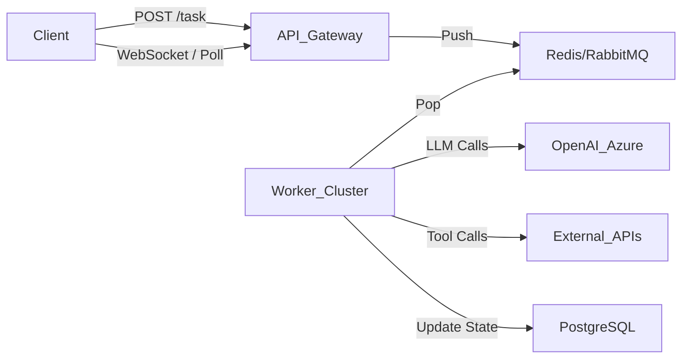

## 9.4 企业级部署：架构、沙箱与安全性

在本地 Notebook 里跑通一个智能体和把它作为企业级服务（Production Service）发布，中间隔着巨大的鸿沟。

企业级部署关注三个核心指标：**高可用性 (Availability)**、**安全性 (Security)** 和 **低延迟 (Latency)**。所有的架构设计都围绕这三点展开。

### 9.4.1 部署架构模式

智能体应用通常是 **有状态（Stateful）** 的，这与传统的无状态 REST API 服务有很大不同。

### 9.4.2 异步任务队列架构

由于智能体执行一次任务可能需要 30 秒甚至数分钟（经历了多轮思考和工具调用），HTTP 同步等待是不可接受的。

**推荐架构**：

1. **Frontend**: 发起请求，获得 `TaskID`。
2. **Worker**: 后台异步执行 Agent 逻辑。
3. **Stream**: 通过 WebSocket 将智能体的每一步思考 (Thought) 和流式文字实时推送到前端，缓解用户的等待焦虑。

### 9.4.3 数据库选型

智能体系统需要存储两类截然不同的数据：

1. **关系型数据**：用户、Session、权限、任务状态。
2. **向量数据**：知识库 Embedding、长期记忆。

**推荐方案**：

- **PostgreSQL + pgvector**：一个数据库搞定所有。既能存 JSON 聊天记录，又能做向量检索，运维成本最低。
- **Redis**：用于存储短期对话上下文 (Context Window) 和语义缓存。

### 9.4.4 安全沙箱

这是 AgentOps 中最独特的环节。编程智能体 (Coding Agent) 往往需要生成并运行 Python 代码。直接在生产服务器上运行 `exec(code)` 是绝对的自杀行为（远程代码执行 Remote Code Execution 漏洞）。

### 9.4.5 安全风险

- `import os; os.system('rm -rf /')`：删除服务器文件。
- `import socket; socket.connect(...)`：扫描内网端口，发起攻击。
- `while True: pass`：死循环耗尽 CPU 资源。

#### 解决方案

#### Docker 容器隔离（基础版）

为每个 Session 启动一个临时的 Docker 容器。
- 优点：由 OS 保证隔离。
- 缺点：启动慢（秒级），资源消耗大。

#### E2B / Modal (云原生沙箱)

使用专门为 AI 代码执行设计的云服务（如 [E2B](https://e2b.dev/)）。
- 它们使用 Firecracker MicroVM 技术，启动速度极快（毫秒级）。
- 提供了预装好常用数据科学库（Pandas, Matplotlib）的环境。

#### 端侧沙箱

如果代码不涉及联网，可以编译成 WASM 在浏览器端或受限的 V8 引擎中运行。
- 优点：零服务器成本，绝对安全。
- 缺点：无法访问互联网和大型预训练模型。

### 9.4.6 敏感数据保护

在金融和医疗场景，不能把客户的真实姓名、卡号发给 OpenAI。

### 9.4.7 微软 PII 识别方案

使用 Microsoft Presidio：
1. **识别 (Analyze)**：在 Prompt 发送前，扫描文本中的 PII。
2. **替换 (Anonymize)**：`"Call John at 555-0123"` -> `"Call <PERSON_1> at <PHONE_1>"`。
3. **处理**：智能体基于脱敏数据进行逻辑处理（"将 <PERSON_1> 添加到 CRM"）。
4. **还原 (Deanonymize)**：在执行工具调用（如发邮件）时，将真实数据填回。

### 9.4.8 延迟优化

智能体很慢。如何让用户感觉"变快了"？

1. **流式输出 (Streaming)**：
   这是必须的。不要等整个表格生成完，而是生成一行显示一行。
   
2. **推测性执行（Speculative Execution）**：
   如果智能体有 80% 的概率会调用搜索工具，可以在它还在"思考"的时候，后台先并发启动搜索。如果没猜中，只是浪费了一点 Token；猜中了，用户体验提升 3 秒。

3. **预加载（Prefetching）**：
   在用户打开页面的瞬间，就把相关的知识库 context 加载到 Redis 缓存中。

### 9.4.9 蓝绿部署与灰度发布

智能体的行为很难预测。V2 版本的 Prompt 改动可能会导致 V1 能解决的问题现在解决不了了（Regression）。

- **影子测试（Shadow Testing）**：
  将线上流量同时发给 V1 和 V2，但只给用户返回 V1 的结果。后台记录 V2 的表现并评分。
  
- **金丝雀发布（Canary Release）**：
  先对 1% 的内部用户开放新版本智能体，通过观察 "Thumbs Down"（点踩）率的变化来决定是否全量推广。

### 9.4.10 2026 企业智能体采用现状

根据 Anthropic 2026 年企业调研（500+ 技术领袖），AI 智能体已从实验阶段进入规模化落地：

#### 行业采用数据

| 指标 | 数值 |
|------|------|
| 使用 AI 辅助开发的企业 | **90%** |
| 部署智能体生成生产代码 | **86%** |
| 报告可衡量经济回报 | **80%** |
| 部署跨阶段工作流智能体 | **57%** |
| 部署跨职能流程智能体 | **16%** |

#### 关键挑战

企业扩展智能体部署时面临的主要障碍：

| 挑战 | 占比 |
|------|------|
| 与现有系统集成 | 46% |
| 数据访问与质量 | 42% |
| 变革管理 | 39% |

#### 标杆案例

| 企业 | 应用场景 | 成效 |
|------|---------|------|
| **Thomson Reuters** | CoCounsel 法律平台 | 法律文档搜索从小时级降至分钟，覆盖 150 年案例库 |
| **eSentire** | 网络安全威胁分析 | 分析时间从 5 小时压缩到 7 分钟，与专家一致率 95% |
| **Doctolib** | 全员推广 Claude Code | 遗留系统测试从周缩短到小时，交付速度提升 40% |
| **L'Oréal** | 对话式数据分析 | 99.9% 准确率，月活 44,000 用户直接查询数据 |

> [!TIP]
> **完整报告**：[2026 State of AI Agents Report](https://cdn.sanity.io/files/4zrzovbb/website/cd77281ebc251e6b860543d8943ede8d06c4ef50.pdf)

---

### 9.4.11 小结

部署智能体不仅仅是写个 `Dockerfile` 那么简单。它涉及到异构计算资源的调度（GPU vs CPU）、独特的安全边界（代码解释器沙箱）以及全新的交互模式（流式推流）。

构建一个 **稳健** 的智能体架构，往往比调优 Prompt 需要投入更多的工程精力。

下一章我们将展望未来，探讨智能体 AI 的技术边界与伦理挑战。

---

**下一节**: [本章小结](summary.md)
