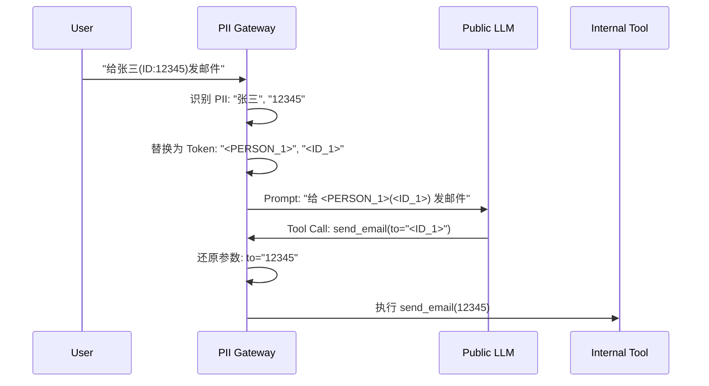

## 9.4 企业级智能体平台：架构、安全与治理

在本地 Notebook 里跑通一个智能体只是第一步，将其转化为可扩展、安全且合规的企业级服务（Production Agent Platform）则面临着完全不同的挑战。

企业级部署不仅关注 **高可用性 (Availability)**，更核心的是 **安全性 (Security)**、**多租户隔离 (Isolation)** 和 **治理 (Governance)**。本节将深入探讨如何构建一个生产就绪的智能体平台。

### 9.4.1 多租户与隔离架构

智能体应用通常是 **有状态 (Stateful)** 且 **长运行 (Long-running)** 的，这决定了其架构必须能够处理复杂的资源隔离和状态管理。

#### 1. 异步任务队列与状态管理 (Async Task Queue & State Management)

由于智能体执行可能持续数分钟甚至更久，同步 HTTP 请求不可行。推荐使用 **异步事件驱动架构**。

**推荐架构**：

*   **提交 (Submit)**: 返回 `TaskID`，状态 `Accepted`。
*   **执行 (Execute)**: Worker 异步执行，状态持久化到数据库。
*   **流式 (Stream)**: 通过 WebSocket 推送思考过程 (Thought) 和增量结果，缓解用户焦虑。

#### 2. 多租户工作池 (Multi-Tenant Worker Pools)

在企业内部或者 SaaS 平台，不同部门（如财务部 vs 研发部）的 Agent 需要严格隔离。

*   **计算隔离**: 使用 Kubernetes Namespaces 或不同的 Node Pools 隔离不同租户的 Worker。
*   **网络隔离**:
    *   **Egress Control**: 财务部的 Agent 只能访问 ERP 系统，严禁访问外网。
    *   **Service Mesh**: 使用 Istio/Cilium 实施细粒度的网络策略 (Network Policies)。

### 9.4.2 深度防御体系 (Defense in Depth)

安全不仅仅是 Prompt 上的约束，必须构建多层防御体系。

#### Layer 1: 提示词工程 (Prompt Engineering)
*   **System Prompt**: 设定基准行为准则（"你是一个有用的助手，但不能..."）。
*   **局限性**: 容易被 "Jailbreak"（越狱）绕过，不能作为唯一防线。

#### Layer 2: 护栏与过滤器 (Guardrails)
*   **输入/输出过滤**: 使用 **NVIDIA NeMo Guardrails** 或 **Llama Guard** 检查输入指令和输出内容。
*   **PII 扫描**: 在发送给 LLM 前脱敏敏感数据。

#### Layer 3: 应用程序逻辑 (Application Logic)
*   **工具鉴权**: 在 Agent 调用 `get_salary_info(user_id)` 工具时，代码层必须校验当前操作者是否有权访问该 `user_id`。
*   **人类介入 (HITL)**: 高风险操作（如 `delete_db`）必须暂停并等待人工审批。

#### Layer 4: 基础设施沙箱 (Infrastructure Sandbox)
这是最后一道防线，防止 Agent 执行恶意代码 (RCE)。

*   **MicroVM 沙箱**: 推荐使用 **Firecracker** (AWS Lambda 背后的技术) 或 **gVisor**。
    *   **E2B / Modal**: 专为 AI Agent 设计的沙箱服务，并在毫秒级启动 Python 解释器。
*   **文件系统隔离**: 沙箱内只能访问临时 `/tmp`，任务结束后立即销毁，不留任何痕迹。

### 9.4.3 治理与合规 (Governance & Compliance)

随着 Agent 自主性增强，"谁运行了什么？做了什么？" 变得至关重要。

#### 1. 角色访问控制 (RBAC)

*   **Agent 定义权限**: 谁可以创建/修改 Agent 的 Prompt 和工具集？
*   **Agent 执行权限**: 谁可以向 Agent 下达指令？
*   **工具调用权限**:
    *   **静态授权**: Admin 授予 Agent A 使用 "AWS S3 Read" 的权限。
    *   **动态授权 (OAuth 2.0 On-Behalf-Of)**: Agent 代表 User 执行操作时，使用 User 的 Token，确保 Agent 不会越权访问 User 本身无法访问的资源。

#### 2. 审计日志 (Audit Trails)

所有操作必须**不可篡改**地记录：
1.  **输入**: 用户的原始 Prompt。
2.  **思考**: Agent 的中间推理步骤 (Reasoning Trace)。
3.  **工具**: 调用的函数名、参数、以及**返回结果**（这是取证的关键）。
4.  **输出**: 最终响应。

### 9.4.4 PII 网关与数据隐私

在金融和医疗场景，严禁将客户 PII (Personally Identifiable Information) 发送给公有 LLM 模型商。

**架构模式：PII Sidecar / Gateway**

*   **Microsoft Presidio**: 优秀的开源 PII 识别与脱敏工具。
*   **核心思想**: LLM 只处理逻辑，不接触真实敏感数据。

### 9.4.5 部署策略与可观测性集成

#### 蓝绿部署与影子测试 (Shadow Testing)
Agent 的行为难以预测，V2 版本的 Prompt 微调可能导致回归。
*   **影子模式**: 将线上流量复制一份给 V2 Agent，记录其响应但不返回给用户。后台运行 **Evaluator Agent** 对比 V1 和 V2 的结果质量。

#### SIEM 集成
将 Agent 的审计日志对接企业 SIEM (Security Information and Event Management) 系统（如 Splunk, Datadog Security）。
*   **异常检测**: 监控 "工具调用失败率骤增" 或 "Token 消耗异常暴涨"（可能遭受 DoS 攻击或陷入死循环）。

### 9.4.6 2026 企业采用现状

根据最新的行业调研，企业级 Agent 的落地呈现以下趋势：

| 阶段 | 特征 | 占比 |
| :--- | :--- | :--- |
| **实验期 (Pilot)** | 仅在非生产环境尝试，无 SLA 要求 | 15% |
| **辅助型 (Copilot)** | 只有读权限，辅助员工检索文档 | 45% |
| **行动型 (Agentic)** | 拥有写权限，可自主执行任务 (RPA 2.0) | 30% |
| **自治型 (Autonomous)** | 跨部门协作，极少人工干预 | 10% |

**标杆案例**:
*   **Klarna**: AI 客服处理了 2/3 的客户咨询，相当于 700 名全职客服的工作量，且客户满意度持平。
*   **GitLab Duo**: 这里的 Agent 不仅写代码，还能根据 Issue 描述自动修改 CI/CD 管道配置，实现了 DevOps 的自动化。

---

**下一节**: [9.5 生产事故与案例复盘](9.5_failures.md)
