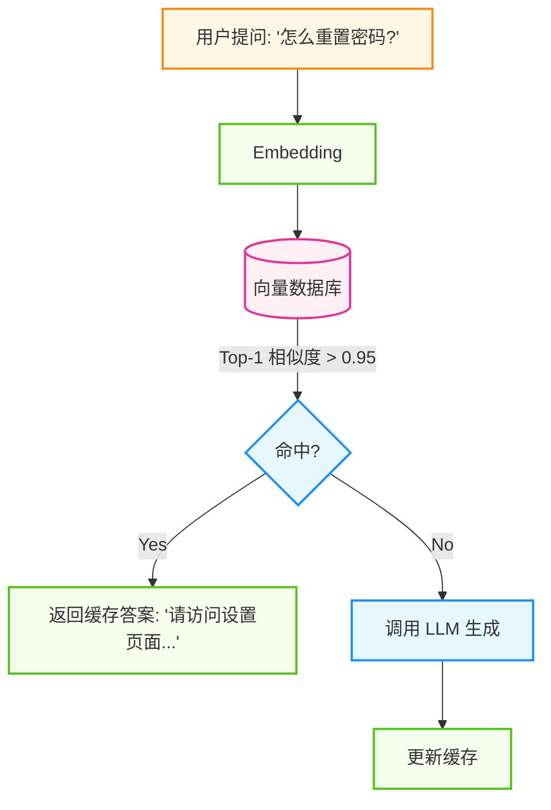
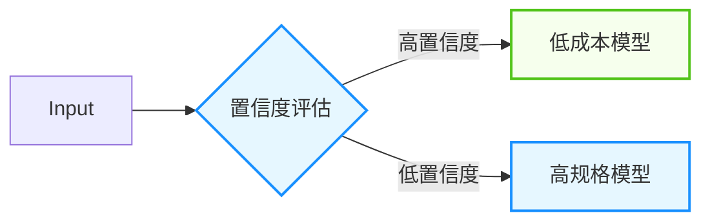

## 9.4 性能优化与成本控制

智能体系统的运营成本主要来自 LLM API 调用。一个设计不当的智能体可能每个任务消耗数万 Token，导致成本失控。本节探讨如何在保证质量的前提下优化性能和控制成本。

### 9.4.1 成本构成与分析

#### 大语言模型调用成本

以“托管式大模型 API”的常见计费方式为例，成本通常由以下部分组成：
* **输入词元**：请求中提示词与上下文的计费。
* **输出词元**：模型生成内容的计费。
* **缓存/折扣机制**：部分平台对缓存命中或重复前缀提供优惠。

**典型智能体任务的词元消耗**：
一个包含多轮规划与多次工具调用的任务，词元消耗会显著高于“单次问答”。因此，成本分析应基于真实链路的采样统计，而不是只看单次调用。

#### 基础设施成本

智能体系统的配套设施成本通常不容忽视：
* **向量数据库**: 长期记忆存储和索引查询费用。
* **网络传输**: 跨区域/跨洋调用的流量与延迟成本。

#### 自建推理决策

随着规模扩大，可能需要评估从 API 转为自建推理的盈亏平衡点。建议按 TCO（算力、运维、弹性、可用性、合规、峰谷负载）做详细核算，而不是用单一阈值一刀切。

### 9.4.2 提示词与上下文优化

提示词压缩的核心原则：消除冗余描述，保留指令本质（目标缩减 50-80% Token）。上下文管理应采用滑动窗口+摘要策略，避免无限累积历史。详细指导见《提示词工程指南》；本章重点关注智能体系统整体成本优化。

### 9.4.3 缓存策略

缓存是计算机科学领域最有效的优化手段之一，在智能体体系中也不例外。

#### 1. 提示词缓存

提示词缓存将静态上下文前缀（系统提示、工具定义、文档）缓存在 KV Cache 中复用，可显著降低输入成本；在支持原生 Prompt Caching 的 API 中，合理使用 `cache_control` 一类的前缀缓存能力，常能把重复前缀的输入成本压缩一个数量级。

核心原则：

* **稳定前缀**：把系统提示、工具定义、固定政策文档锁定在前缀。
* **动态信息后置**：把用户输入、会话状态、临时参数放在缓存断点之后。
* **避免前缀抖动**：中途增删工具、插入动态日期、切换模型，都会导致缓存失效。
* **监控命中率**：命中率低于 80%，通常说明前缀设计不稳定。

一个常见反模式是在系统提示里拼接动态变量，例如“今天是 2026-03-28”或“用户位于北京”。这会让几乎每次请求都变成不同前缀，缓存价值接近归零。

#### 2. 语义缓存

对相似查询返回缓存结果，无需调用 LLM。



图 9-11：语义缓存工作流程

* **适用场景**: FAQ、重复性高的查询。
* **收益**：在高重复场景下，可能显著降低成本并改善延迟。
* **注意事项**：语义缓存不是“只要相似就复用”。对价格、库存、政策、实时数据等时效性强的任务，必须设置 TTL、版本戳或来源校验，否则缓存会把旧答案稳定放大。

#### 3. 预加载

结合提示词缓存，在用户打开页面的瞬间，将相关的知识库上下文预加载到 KV 缓存中。

#### 4. Agentic Plan Caching

很多智能体任务真正昂贵的并不是最终生成，而是前置的“先想一遍怎么做”。如果你的业务里存在大量结构相似的任务，可以缓存的就不仅是 Prompt，还包括**计划**。

所谓 **Agentic Plan Caching**，就是把成功链路中的高质量执行计划抽取出来，供相似任务直接复用：

```text
用户任务 -> 相似任务匹配 -> 命中历史计划
       -> 复用计划骨架 -> 仅重算必要步骤
```

它尤其适合：

* 工单处理、报表生成、固定研究流程；
* 工具链稳定、步骤相对固定的任务；
* 多轮任务中“规划成本高于执行成本”的场景。

实践时应注意三点：

1. **缓存的是计划骨架，不是盲目复用全部中间结果**。
2. **计划要带版本信息**，避免工具或业务流程变更后使用旧计划。
3. **仍需运行验证器**，确认计划适配当前输入，而不是照抄历史轨迹。

### 9.4.4 模型选择与蒸馏

**“大模型教小模型”** 是降低常态化运营成本的终极手段。

#### 1. 模型蒸馏

如果不加控制，系统为了保证效果可能会倾向于长期使用高规格模型。但对于固定场景（如“SQL 生成”或“格式化输出”），通过微调或蒸馏得到的小模型往往也能胜任。

**蒸馏流水线**:
1. **收集数据**：使用高规格模型作为“教师”运行一段时间，收集输入输出对。
2. **筛选黄金数据**：结合人工抽检与自动规则筛选出高质量样本。
3. **微调**：使用这些数据微调一个更小、更便宜的“学生”模型。
4. **替换上线**：灰度替换并回归评测，观察质量与成本的变化。

#### 2. 混合路由

即使有了微调模型，也可保留一个“兜底”机制：



图 9-12：大小模型混合路由策略

### 9.4.5 延迟优化

要降低延迟，架构层面的优化往往比代码层面的微调更有效。

#### 1. 分离式架构

对于自建模型或私有化部署，**预填充（Prefill）与解码（Decode）的分离** 是解决高并发延迟的关键架构。
* **物理瓶颈互斥**: 计算处理极长的输入提示词（Prefill 阶段）对 GPU 是计算密集型的；而逐字生成答案（Decode 阶段）则因为参数搬运缓慢而属于访存密集型。混合部署会导致突发长 Prompt 请求瞬间霸占所有算力，引发其他并发对话被严重卡顿（队头阻塞）。
* **解耦方案**: 领军系统将机器拆分为独立的 **Prefill 集群**（主打算力）和 **Decode 集群**（主打显存带宽），两者通过超敏捷的高速 RDMA 网络在微秒级实现海量 KV Cache 状态的跨节点传输，彻底抚平算力与显存毛刺。

#### 2. 投机解码

打破自回归模型必须“串行龟速生成”的宿命，尤其适合消除智能体冗长思维链过程的时间消耗。
* **机制**: 引入一个极其小巧且飞快的“草稿模型”（或并行的辅助预测头），它先快速猜想出后续的 5 个候选 Token，接着交由庞大的“目标模型”在一个并行批次中同时验证。
* **收益**: 因为大模型在 Decode 时其实多数算力处于闲置，并行验证多个 Token 的耗时与生成 1 个 Token 基本相同。只要目标模型接受了草稿输出，就等于在零时间成本下“免费”生成了多个字。在完全不损失生成智商的前提下，能将整个任务时延降低几倍。

#### 3. 并行推测

在智能体的应用层，可以预判工具调用结果并提前触发下游操作：
* **预判分支**: 如果 Agent 大概率会调用某个 API，可以在等待 LLM 生成最终决策的同时，提前异步发起该 API 请求。
* **并行工具调用**: 当多个工具调用之间无依赖关系时，并行执行而非串行等待。

#### 4. 网络优化

* **跨地域延迟**：使用边缘节点或多区域部署来减少跨地域联网的 RTT。
* **协议优化**: 使用 HTTP/2 或 WebSocket 减少连接建立开销。

### 9.4.6 成本监控

FinOps 是一种将财务问责制引入云和 AI 支出的文化与实践。在智能体体系中，它意味着工程团队需要对每一次 Token 消耗的 ROI 负责。

1. **预算告警**: 设置每日/每月硬性预算。
2. **归因分析**: 给每个 Trace 打上 `User_ID`, `Feature_ID` 标签，分析哪个功能最烧钱。
3. **异常检测**: 监控 `Cost / Request` 指标，发现异常突增（通常意味着死循环）。

### 9.4.7 智能体系统 TCO 分析框架

一个完整的智能体系统 TCO（Total Cost of Ownership）分析应覆盖以下维度：

| 成本维度 | 组成项 | 典型占比 | 优化杠杆 |
|---------|-------|---------|---------|
| 模型推理 | Token 消耗、模型选择、推理次数 | 40-60% | 缓存、模型路由、提示词压缩 |
| 基础设施 | 向量数据库、消息队列、存储 | 15-25% | 按需扩缩容、冷热分层 |
| 开发维护 | 提示词迭代、框架升级、调试 | 10-20% | 自动化测试、CI/CD |
| 人工干预 | HITL 审核、异常处理、标注 | 5-15% | 提升自动化率、优化触发阈值 |
| 监控运维 | 日志存储、告警系统、可观测性 | 5-10% | 采样策略、日志分级 |

**关键决策公式**：

```text
单任务成本 = Σ(每步 Token 数 × 模型单价) + 工具调用成本 + 人工干预概率 × 人工成本
```

**单智能体 vs 多智能体成本对比**：

多智能体架构通常带来 2-5 倍的 Token 消耗增长（因智能体间通信开销），但可能在以下场景中实现净成本下降：
- **任务并行度高**：多智能体并行处理，总延迟降低，间接节省人力等待成本
- **专业化路由**：简单子任务用小模型，复杂子任务用大模型，平均成本反而更低
- **失败隔离**：单个子智能体失败不影响整体，减少全量重试的浪费

**不要忽略通信成本**：

```text
多智能体额外成本
= Σ(Agent 间消息 Token × 单价)
+ 协调器额外推理
+ 中间摘要与状态同步
+ 额外验证与重试
```

当系统从“一个 Agent + 三个工具”演化为“一个协调器 + 四个专家 + 一个评审器”时，真正增加的往往不是最终答案长度，而是这些中间沟通消息。设计阶段应单独监控 `coordination_tokens / total_tokens`，否则很容易误判成本来源。

**实践建议**：在系统设计阶段就建立成本模型，将 Token 预算作为架构约束之一。参考[第 7.5 节推理预算分配](../07_evolution/7.5_reasoning.md)中的分级策略。建议按月对 TCO 各维度进行回溯分析，识别成本热点，并驱动优化循环。同时要警惕”假优化”陷阱：盲目削减监控成本可能导致生产故障成本翻倍；过度压缩模型规格可能引发质量严重下滑和人工补救成本激增。


在架构设计阶段，以下模板可帮助团队快速建立定量的成本预期，避免上线后才发现账单失控。

**Step 1: 单任务成本采样**

对典型任务进行 50-100 次采样，统计 Token 消耗的分布：

```python

# 成本采样分析模板

import statistics

sample_costs = []  # 收集 N 次真实任务的 Token 消耗

for task in sample_tasks:
    result = run_agent(task)
    sample_costs.append({
        "input_tokens": result.input_tokens,
        "output_tokens": result.output_tokens,
        "tool_calls": result.tool_call_count,
        "steps": result.total_steps,
        "latency_ms": result.latency_ms,
    })

input_tokens = [c["input_tokens"] for c in sample_costs]
output_tokens = [c["output_tokens"] for c in sample_costs]

print(f"输入 Token - P50: {statistics.median(input_tokens)}, "
      f"P95: {sorted(input_tokens)[int(len(input_tokens)*0.95)]}, "
      f"Max: {max(input_tokens)}")
print(f"输出 Token - P50: {statistics.median(output_tokens)}, "
      f"P95: {sorted(output_tokens)[int(len(output_tokens)*0.95)]}, "
      f"Max: {max(output_tokens)}")
```

**Step 2: 月度成本预测公式**

```text
月度推理成本 = 日均任务数 × 30 × (P95_输入Token × 输入单价 + P95_输出Token × 输出单价)
              × (1 - 缓存命中率 × 缓存折扣率)
              × 安全系数(1.2~1.5)

总月度成本 = 月度推理成本 + 基础设施固定成本 + 人工干预率 × 人工单价 × 日均任务数 × 30
```

> **提示**：
> 使用 **P95**（而非平均值）做成本预测，因为智能体任务的 Token 消耗往往呈长尾分布——少量复杂任务的消耗可能是平均值的 5-10 倍。

**Step 3: ROI 评估框架**

智能体系统的 ROI 不应简单地用”省了多少人力”来衡量。建议采用四象限评估：

| ROI 维度 | 衡量指标 | 计算方法 |
|---------|---------|---------|
| **直接成本节约** | 替代人工的工时价值 | (原人工耗时 - 人机协作耗时) × 人力时薪 |
| **质量提升价值** | 错误率下降带来的损失减少 | 历史错误率 × 单次错误成本 × 错误率下降比例 |
| **速度红利** | 交付周期缩短的商业价值 | 缩短的天数 × 每日延误的机会成本 |
| **规模弹性** | 业务量波动时的边际成本 | 峰值人力成本 vs 峰值推理成本 |

**ROI 计算公式**：

```text
净 ROI = (直接成本节约 + 质量提升价值 + 速度红利 + 规模弹性收益)
         / (推理成本 + 基础设施成本 + 开发维护成本 + 人工干预成本)
         - 1
```

**典型陷阱**：

- **只算推理成本，忽略集成成本**：提示词迭代、评测体系搭建、故障排查的工程投入通常占总成本的 15-25%。
- **用 Demo 效果预测生产 ROI**：生产环境的长尾任务、边缘情况和并发压力会显著改变成本结构。
- **忽视人工干预的隐性成本**：即使自动化率达到 95%，剩余 5% 的人工兜底可能需要更高技能的员工，单位成本反而更高。

---

**下一节**: [9.5 企业级智能体平台：架构、安全与治理](9.5_enterprise.md)
