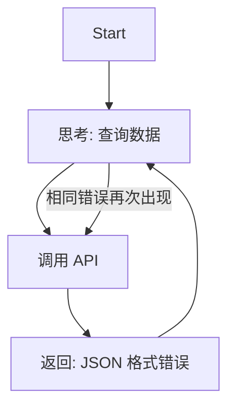
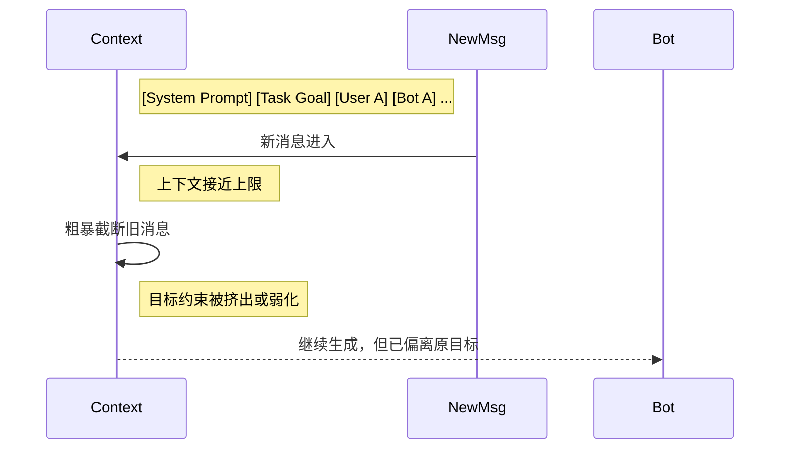

## 9.6 故障模式与韧性设计

本节只讨论一类问题：**系统已经进入运行态之后，如何发现故障、诊断故障并恢复服务**。这与下一节的“架构陷阱与反模式”不同。9.5 关注的是运行时症状、告警、熔断与修复；9.6 关注的是设计阶段就埋下的错误决策。

对智能体系统而言，真正昂贵的事故通常不是进程崩溃，而是系统继续“正常运行”，却在错误方向上稳定放大：死循环烧钱、幻觉触发错误动作、上游异常被下游当成事实继续传播。因此，韧性设计的核心不是“尽量不报错”，而是**在错误不可避免时，尽快发现、限制爆炸半径并恢复到安全状态**。

### 9.6.1 运行时故障的四种类型

从排障视角看，生产环境中的智能体故障通常可归为四类：

1. **控制流故障**：陷入死循环、异常重试、过早终止、长时间卡住。
2. **认知故障**：上下文漂移、目标遗忘、幻觉、错误的工具选择。
3. **依赖与执行故障**：外部 API 超时、Schema 变更、工具返回不完整数据、权限异常。
4. **级联故障**：一个智能体或一个步骤的错误输出，被下游链路当成可信输入继续放大。

这四类问题并不互斥。实际事故往往是“依赖故障 + 认知故障 + 级联传播”的组合：例如上游工具返回半截 JSON，主智能体误判任务未完成，随后反复重试并触发成本雪崩。

### 9.6.2 故障诊断的标准流程

面对异常链路，建议按下面的顺序排查，而不是直接改 Prompt：

1. **先止血**：暂停高风险动作，必要时触发 `kill switch`、熔断器或只读降级。
2. **再定位症状**：确认是成本激增、延迟异常、成功率下降、格式错误，还是事实性错误。
3. **回放链路**：查看完整 trace，确认错误发生在规划、检索、工具执行、评审还是输出阶段。
4. **识别首个异常点**：不是看“最后一句错在哪”，而是找出第一个偏离预期的跨度。
5. **分类根因**：归入控制流、认知、依赖或级联问题，避免把所有问题都归咎为“模型不稳定”。
6. **验证恢复策略**：确认重试、回滚、人工接管、降级路由是否真的生效。

一个成熟团队的目标不是“完全没有事故”，而是把平均诊断时间（MTTD）和平均恢复时间（MTTR）压到足够低。

### 9.6.3 案例一：死循环与成本雪崩

> **类型**：控制流故障

**事故描述**：
某金融智能体在夜间批处理窗口中突然发起数万次 API 调用，短时间内打满数据库连接并触发异常账单。

**故障还原**：



图 9-16：死循环故障模式

根因并不复杂：工具返回了格式错误，但系统没有把它标记成“不可恢复错误”。主智能体把它误解为“尚未完成”，于是继续重复同一动作。

**运行时修复策略**：

* **步数预算**：设置 `MAX_ITERATIONS`、`MAX_TOOL_CALLS`、`MAX_WALL_CLOCK_TIME` 三种硬限制，而不只是一种。
* **错误去重**：连续出现相同工具、相同参数、相同报错时，立即判定为循环。
* **成本熔断**：一旦单条链路成本超过预算阈值，自动终止并标记为 `budget_exceeded`。
* **策略降级**：从“自主重试”切换到“结构化错误返回”或“人工接管”。

```python
# 死循环检测与成本熔断

consecutive_same_errors = 0
last_signature = None

for step in range(MAX_ITERATIONS):
    result = agent.execute(task)

    if result.cost_usd > TASK_BUDGET_USD:
        return fail("budget_exceeded")

    signature = (result.tool_name, result.tool_args, result.error)

    if result.error:
        if signature == last_signature:
            consecutive_same_errors += 1
        else:
            consecutive_same_errors = 1
            last_signature = signature

        if consecutive_same_errors >= 3:
            return fallback_strategy(task)
    else:
        return result

return fail("max_iterations_exceeded")
```

### 9.6.4 案例二：上下文漂移与目标遗忘

> **类型**：认知故障

**事故描述**：
客服机器人在长对话后逐渐偏离“客服”角色，开始闲聊、编造政策，甚至暴露内部指令摘要。

**故障还原**：



图 9-17：上下文遗忘与目标漂移

这类故障常被误判为“模型胡说八道”，但更常见的根因是上下文管理策略错误：系统提示、任务目标、已确认事实与用户历史被同等看待，导致关键约束被冲掉。

**运行时修复策略**：

* **系统提示与任务目标固定置顶**：不参与 FIFO 轮转。
* **状态分层**：把“系统约束、任务目标、事实摘要、最近对话”拆成不同槽位，而不是放进一条消息流。
* **记忆摘要而非硬截断**：上下文接近上限时，先压缩旧对话为结构化摘要。
* **目标心跳检查**：每经过若干步，让评审器检查“当前动作是否仍服务于初始目标”。

### 9.6.5 案例三：幻觉输出与错误执行

> **类型**：认知故障

**事故描述**：
运维辅助智能体在“清理无用文件”任务中，把关键配置目录误判为垃圾目录并执行删除。

这里最危险的不是“答错一道题”，而是**幻觉进入执行面**。一旦模型把未验证的判断当成事实，再配合写权限，事故就从内容错误升级为系统破坏。

#### 最新的幻觉检测与抑制方法

在 2026 年的生产实践中，仅靠“让模型更谨慎一些”已经不够。更可靠的做法通常是多层组合：

1. **证据绑定输出**：要求结论显式引用检索证据，而不是自由生成。
2. **Graph-RAG**：对实体、关系和来源做图结构约束，降低跨文档拼接时的事实漂移。
3. **实时信任评分**：综合检索覆盖率、来源一致性、工具成功率、校验器得分，计算 `trust_score`。
4. **多智能体交叉验证**：生成器、验证器、事实核查器彼此独立，避免单点幻觉直接落地。
5. **不确定时拒答或升级**：当证据不足、冲突过高或置信度过低时，优先返回“不足以执行”。

#### 一个可执行的信任评分思路

```python
def compute_trust_score(result) -> float:
    evidence_coverage = result.supported_claims / max(result.total_claims, 1)
    source_agreement = result.consistent_sources / max(result.total_sources, 1)
    tool_success = 1.0 if result.tool_errors == 0 else 0.5
    verifier_score = result.verifier_score  # 0~1

    return (
        0.35 * evidence_coverage +
        0.25 * source_agreement +
        0.15 * tool_success +
        0.25 * verifier_score
    )


trust_score = compute_trust_score(result)
if trust_score < 0.7:
    return escalate_to_human(result)
```

**运行时修复策略**：

* **默认只读**：高风险工具默认不可写。
* **高风险动作双重确认**：`rm`、`drop`、`delete`、`transfer`、`publish` 等动作必须经过 HITL。
* **先校验后执行**：把“生成计划”和“真正执行”拆成两个阶段。
* **执行后验证**：不仅校验输出文本，也校验环境状态是否符合预期。

### 9.6.6 案例四：多智能体级联故障

> **类型**：级联故障

**事故描述**：
一个数据分析流水线由数据采集智能体、分析智能体、报告智能体组成。采集智能体因 API 超时返回了不完整数据，但未显式标记异常；后续两个智能体都把不完整结果视为事实，最终生成并发送错误报告。

这类事故说明，多智能体系统的核心风险不是“每个 Agent 单独出错”，而是**错误被包装成结构化结果后更容易被信任**。

**运行时修复策略**：

* **输出必须带元数据**：如 `completeness`、`confidence`、`source_count`、`requires_review`。
* **下游设置前置断言**：不满足条件时拒绝继续，而不是“勉强生成”。
* **链路级熔断**：上游异常时暂停整条流水线。
* **检查点与可恢复重放**：允许从最近的稳定节点重跑，而不是全链路重试。

### 9.6.7 韧性设计清单

如果只保留一页运行手册，建议至少覆盖下面这些机制：

| 机制 | 作用 | 建议做法 |
| :--- | :--- | :--- |
| **预算限制** | 防止成本与时长失控 | 限制步数、时间、工具调用次数、单请求预算 |
| **结构化错误** | 避免模型误解异常 | 工具层返回标准错误码与可读错误信息 |
| **幂等与补偿** | 避免重复写入和半成功状态 | 写操作带幂等键，失败后有补偿事务 |
| **熔断与降级** | 快速止血 | 失败率超阈值时切换只读模式或规则模式 |
| **检查点** | 提升恢复效率 | 关键状态可快照，可从中间节点恢复 |
| **人工接管** | 防止高风险误操作 | 低信任分数或高风险动作自动升级 |
| **回放能力** | 支持复盘与再现 | 保留 trace、输入输出、工具结果和版本号 |

### 9.6.8 事故响应与复盘

当事故已经发生时，目标不是“解释为什么模型这么笨”，而是把事故转化为新的工程约束。一个可执行的 SOP 通常包括：

1. **熔断止损**：暂停写操作、限制预算、冻结异常版本。
2. **影响面评估**：确认受影响用户、数据范围、下游系统与时间窗口。
3. **恢复服务**：切换到降级路径、回滚版本或启用人工流程。
4. **根因归档**：记录首个异常点，而不是只记录最终症状。
5. **测试固化**：把事故样本沉淀为数据集、回归测试和告警规则。

```markdown
# 智能体事故复盘报告

## 1. 事故摘要

- 现象：成本在 15 分钟内增长 18 倍。
- 影响：订单查询链路失败率从 1.2% 升至 17.6%。
- 触发时间：2026-03-17 02:15 UTC

## 2. 首个异常点

- Trace ID: trace-abc-123
- Span: tool.search_orders
- 异常：上游返回 schema 变更，字段 `status_code` 缺失

## 3. 根因分析

- 为什么会循环重试？ -> 智能体把结构化错误当成"可重试的未完成状态"
- 为什么没有被熔断？ -> 单请求没有预算上限
- 为什么没有提前发现？ -> 未对"重复相同工具 + 相同参数"建立告警

## 4. 改进措施

- [ ] [P0] 增加单请求成本预算与步数预算
- [ ] [P0] 工具错误统一返回标准错误码
- [ ] [P1] 新增循环检测规则与告警
- [ ] [P1] 将该事故样本加入回归评测集
```

本节的关键结论是：**运行时韧性不是某一个 Prompt 技巧，而是一组强制性的系统护栏**。下一节将进一步讨论，如果在架构设计阶段就做错了决策，会如何把这些运行时故障系统性地放大。

---

**下一节**: [9.7 架构陷阱与反模式](9.7_pitfalls_antipatterns.md)
