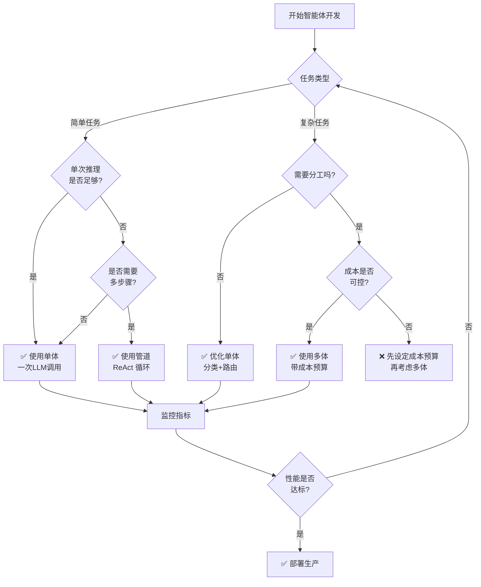

## 9.6 架构陷阱与反模式

在智能体系统的开发过程中，开发者往往会陷入几个关键的架构陷阱。这些陷阱看似是“特性”，实际上却在生产环境中导致成本爆炸、延迟激增和可靠性下降。本节系统性地分析这些反模式，并提供明确的避免策略。

### 9.6.1 反模式一：过度依赖单一LLM调用

#### 陷阱描述

许多早期的智能体实现都采用以下架构：

```python
# ❌ 反模式
def execute_complex_task(user_request):
    # 将所有问题、上下文、工具列表一股脑塞给模型
    prompt = f"""
    你现在有以下工具：
    {serialize_all_100_tools()}

    你的任务是：{user_request}

    用户背景信息：
    {user_profile}

    系统规则：
    {all_system_rules}
    """

    response = model.generate(prompt)
    return response
```

这种方法的问题在于：
1. **模型过载**：一次性输入数百个工具描述、数千行规则和数百万 Token 的上下文，模型必须在这片“信息泥潭”中找到信号。
2. **推理崩解**：模型的注意力机制被淹没，无法形成清晰的推理链路，容易产生幻觉和错误的工具选择。
3. **Token 成本爆炸**：每次推理的上下文长度翻倍，导致成本成线性增长。

#### 反模式案例

一个客服智能体需要处理“退货请求”。单一LLM调用方案会：
- 加载所有可用工具（订单系统、支付系统、库存系统等）
- 传入完整的用户历史（过去一年的对话）
- 附加所有业务规则

结果模型花了30步才完成一个本应3步的任务，成本是最优方案的10倍。

### 最佳实践：分层架构与路由

```python
# ✅ 推荐方案：分层路由
class StratifiedAgent:
    def __init__(self):
        self.classifier = LLM(model="lightweight")  # 分类器
        self.specialists = {
            "refund": RefundAgent(),
            "replacement": ReplacementAgent(),
            "complaint": ComplaintAgent()
        }

    def execute(self, request: str):
        # 第一层：快速分类
        task_type = self.classifier.classify(request)

        # 第二层：调用专家智能体
        if task_type == "refund":
            # 只加载必要的工具和上下文
            tools = ["payment_api", "order_api", "return_policy"]
            specialist = self.specialists["refund"]
            return specialist.solve(request, tools)

        # ... 其他任务类型
```

**关键要点**：
- 用“分类-分发”替代“万能模型”
- 每个专家智能体只维护3-5个核心工具
- 上下文大小限制在2000 Token以内

## 9.6.2 反模式二：上下文窗口滥用

### 陷阱描述

随着长上下文模型（100K+Token）的出现，开发者陷入了新的陷阱：

```python
# ❌ 反模式：无节制地塞入历史
def chat_with_memory(user_message):
    # 加载用户过去一年的完整对话历史
    history = load_all_messages(user_id, days=365)

    # 加载整个知识库
    kb = load_entire_knowledge_base()

    # 加载相关的所有文档
    docs = retrieve_all_related_documents(user_message)

    # 构造超大提示词
    prompt = f"""
    用户历史：{history}
    知识库：{kb}
    相关文档：{docs}
    当前问题：{user_message}
    """

    response = model.generate(prompt)
    return response
```

这种方案的问题：
1. **注意力分散**：模型必须在数十万 Token 中找到最相关的信息，这超出了 Transformer 架构的最优注意力范围。
2. **噪声污染**：充斥着的无关信息会导致模型的判断被干扰。实际上，模型对第一个和最后一个位置的Token注意力最高（位置偏差）。
3. **成本线性增长**：使用100K Token窗口意味着推理成本是使用4K窗口的25倍。
4. **延迟增加**：长上下文的处理速度更慢。

#### 反模式案例

一个企业问答系统加载了100页的用户历史和1000页的公司知识库，结果：
- 推理延迟从200ms增加到2000ms
- 成本从$0.001增加到$0.025（25倍）
- 错误率反而增加（模型注意力分散）

### 最佳实践：检索与渐进加载

```python
# ✅ 推荐方案：按需检索与上下文预算
class ContextBudgetAgent:
    def __init__(self, context_budget=4000):
        self.context_budget = context_budget
        self.retriever = HybridRetriever()  # BM25 + 语义检索

    def execute(self, query: str, user_history: List[Message]):
        # 第一步：用预算的 20% 加载最近对话
        recent_messages = user_history[-10:]  # 最近10条
        recent_tokens = estimate_tokens(recent_messages)
        remaining_budget = self.context_budget - recent_tokens

        # 第二步：用预算的 50% 检索最相关的知识库片段
        kb_chunks = self.retriever.retrieve_top_k(
            query,
            k=3,  # 只取top-3，不是全部
            max_tokens=int(remaining_budget * 0.5)
        )
        remaining_budget -= estimate_tokens(kb_chunks)

        # 第三步：用剩余预算检索相关历史
        # 例如：用户上周问过类似的问题
        historical_context = self.retriever.retrieve_similar_history(
            query,
            max_tokens=int(remaining_budget * 0.8)
        )

        # 构造经过精心选择的提示词
        prompt = self._construct_prompt(
            query,
            recent_messages,
            kb_chunks,
            historical_context
        )

        return self.llm.generate(prompt)

    def _construct_prompt(self, query, recent, kb, history):
        """确保总 Token 数不超过预算"""
        sections = [
            ("最近对话", recent),
            ("相关知识", kb),
            ("历史参考", history),
        ]

        prompt_parts = []
        for section_name, content in sections:
            if estimate_tokens(prompt_parts + [content]) <= self.context_budget:
                prompt_parts.append(f"## {section_name}\n{content}")

        return "\n\n".join(prompt_parts) + f"\n\n用户当前问题：{query}"
```

**关键要点**：
- 设置上下文预算（Context Budget）
- 使用多阶段检索（Staged Retrieval）
- 监控每个版本的Token消耗与延迟

## 9.6.3 反模式三：缺乏错误恢复机制的脆弱管道

### 陷阱描述

早期智能体系统通常缺乏完整的错误恢复策略：

```python
# ❌ 反模式：无错误处理的管道
def process_order(order_id):
    # 第一步：调用支付API
    payment = payment_api.process(order_id)

    # 第二步：调用库存系统
    inventory = inventory_api.reduce_stock(order_id)

    # 第三步：调用发货系统
    shipping = shipping_api.create_label(order_id)

    return {"payment": payment, "inventory": inventory, "shipping": shipping}
```

问题：
1. **任何一步失败都会导致级联崩溃**：支付成功了，但库存减不了，系统就crash了。
2. **无法回滚**：已经执行的操作无法撤销。
3. **无重试策略**：临时故障（网络超时）无法自动恢复。

#### 反模式案例

某电商智能体处理订单：支付成功→库存系统超时→系统中断。结果是顾客被扣款但订单没创建。

### 最佳实践：分段式事务与兜底机制

```python
# ✅ 推荐方案：完整的错误恢复与补偿机制
class ResilientAgent:
    def __init__(self):
        self.event_log = EventLog()  # 记录所有操作
        self.retry_policy = ExponentialBackoffRetry(
            max_attempts=3,
            initial_delay=0.5
        )

    def execute_with_recovery(self, task):
        """带完整恢复机制的执行"""
        result = {
            "status": "pending",
            "steps": [],
            "compensations": []
        }

        try:
            # 分段执行，每一步都有检查点
            result["steps"].append(self._step_payment(task))
            self.event_log.record("payment_success", task.id)

            result["steps"].append(self._step_inventory(task))
            self.event_log.record("inventory_success", task.id)

            result["steps"].append(self._step_shipping(task))
            self.event_log.record("shipping_success", task.id)

            result["status"] = "success"
            return result

        except Exception as e:
            result["status"] = "failed"
            result["error"] = str(e)

            # 触发补偿操作
            self._compensate(result, task)

            return result

    def _step_payment(self, task):
        """支付步骤，带重试"""
        for attempt in range(self.retry_policy.max_attempts):
            try:
                response = payment_api.process(task.order_id)
                return {
                    "step": "payment",
                    "status": "success",
                    "result": response,
                    "attempts": attempt + 1
                }
            except TransientError as e:
                if attempt < self.retry_policy.max_attempts - 1:
                    delay = self.retry_policy.get_delay(attempt)
                    time.sleep(delay)
                else:
                    raise

        raise RuntimeError("Payment failed after all retries")

    def _step_inventory(self, task):
        """库存步骤，带降级策略"""
        try:
            return inventory_api.reduce_stock(task.order_id)
        except InventoryUnavailableError:
            # 降级：不是所有库存系统都可用，但订单可以继续
            # 标记为"待库存确认"状态
            return {
                "step": "inventory",
                "status": "degraded",
                "fallback_action": "manual_review_required"
            }

    def _compensate(self, result, task):
        """执行补偿操作"""
        # 如果已经支付，就回退支付
        if any(s["step"] == "payment" and s["status"] == "success"
               for s in result["steps"]):
            try:
                refund_response = payment_api.refund(task.order_id)
                result["compensations"].append({
                    "type": "refund",
                    "status": "success",
                    "result": refund_response
                })
            except Exception as e:
                # 即使补偿失败，也要记录日志，供人工介入
                result["compensations"].append({
                    "type": "refund",
                    "status": "failed",
                    "error": str(e),
                    "requires_manual_intervention": True
                })
```

**关键要点**：
- 分段执行 + 检查点
- 指数退避重试（Exponential Backoff）
- 补偿机制（Compensating Transactions）
- 降级策略（Graceful Degradation）

## 9.6.4 反模式四：忽略成本控制的无限循环风险

### 陷阱描述

开发者往往忽视智能体系统的成本控制，导致生产环境中出现“成本炸弹”：

```python
# ❌ 反模式：无成本上限的循环
def solve_task(task):
    for attempt in range(1000):  # 无限重试！
        response = large_llm.generate(huge_prompt)  # 每次都是大模型

        if check_solution(response):
            return response

        # 失败了，继续重试（没有任何成本控制）
```

这种方案的问题：
1. **成本爆炸**：一次失败的智能体运行可能消耗$10（大模型×1000次调用）。
2. **级联成本**：多个智能体运行导致成本呈指数增长。
3. **无法预算**：公司无法预测月度成本。

#### 反模式案例

某创业公司部署了一个“自我改进”的编码智能体，它会不断尝试不同的方案直到代码能通过测试。结果：一个简单的Bug修复最终花费了$200（1000次API调用）。

### 最佳实践：分层成本预算

```python
# ✅ 推荐方案：成本预算与模型分层
class CostAwareAgent:
    def __init__(self):
        # 定义成本等级
        self.models = {
            "cheap": ("gpt-4o-mini", 0.00015),  # 输入 $0.15/1M tokens
            "medium": ("claude-sonnet", 0.003),  # 输入 $3/1M tokens
            "expensive": ("claude-opus", 0.005)  # 输入 $5/1M tokens
        }
        self.cost_budget = 1.0  # 每个任务最多花 $1
        self.spent = 0.0

    def execute_task(self, task):
        # 第一轮：用廉价模型快速尝试
        self.spent = 0
        result = self._try_with_model(task, "cheap", max_attempts=3)

        if result["success"]:
            print(f"Solved with cheap model, cost: ${self.spent:.4f}")
            return result

        # 第二轮：升级到中等成本模型
        if self.spent < self.cost_budget * 0.3:
            result = self._try_with_model(task, "medium", max_attempts=2)
            if result["success"]:
                return result

        # 第三轮：最后的手段是最强模型
        if self.spent < self.cost_budget * 0.8:
            result = self._try_with_model(task, "expensive", max_attempts=1)
            if result["success"]:
                return result

        # 如果还是失败，降级到人工处理
        return {
            "success": False,
            "fallback": "manual_review",
            "cost_spent": self.spent
        }

    def _try_with_model(self, task, model_tier, max_attempts):
        model_name, cost_per_1k = self.models[model_tier]

        for attempt in range(max_attempts):
            if self.spent >= self.cost_budget:
                return {"success": False, "reason": "budget_exceeded"}

            prompt = self._construct_prompt(task)
            tokens_estimate = len(prompt.split()) * 1.3  # 粗略估算
            estimated_cost = (tokens_estimate / 1000) * cost_per_1k

            if self.spent + estimated_cost > self.cost_budget:
                return {"success": False, "reason": "budget_would_exceed"}

            result = self._call_model(model_name, prompt)
            self.spent += estimated_cost

            if self._validate_result(result):
                return {"success": True, "result": result}

        return {"success": False, "reason": f"failed_with_{model_tier}"}
```

**关键要点**：
- 设定每个任务的成本预算
- 按成本分层模型（便宜的先试）
- 监控累计成本与总体支出
- 设置绝对的成本硬上限

## 9.6.5 反模式五：过早引入多智能体而非优化单体

### 陷阱描述

许多团队在单体智能体还没优化好的情况下，就急忙引入多智能体系统：

```python
# ❌ 反模式：未经优化就多体化
def solve_complex_task(task):
    # 创建10个智能体，期望"分工合作"能解决一切
    agents = [
        ResearchAgent(),
        WritingAgent(),
        EditingAgent(),
        FactCheckingAgent(),
        FormattingAgent(),
        # ... 还有5个其他Agent
    ]

    # 它们各自行动，彼此沟通效率低下
    results = [agent.run(task) for agent in agents]
    return aggregate_results(results)
```

问题：
1. **协调开销**：多个智能体之间的协调需要额外的LLM调用，反而增加了成本。
2. **延迟增加**：从1次调用→5次调用，延迟必然增加。
3. **错误倍增**：每个智能体都可能出错，多个智能体意味着多倍的故障可能性。
4. **上下文碎片化**：没有统一的状态管理，不同智能体之间的信息可能不一致。

#### 反模式案例

一个内容生成系统启用了“分工”多智能体方案：Research→Write→Edit→Publish。结果发现：
- 原来1秒的任务现在要5秒（多智能体协调开销）
- 成本增加了3倍（每个智能体都需要调用LLM）
- 质量反而下降（某个智能体的错误会被传递到后续智能体）

### 最佳实践：优化优先，再考虑扩展

```python
# ✅ 推荐方案：单体优先，按需多体
class ScalableArchitecture:
    """渐进式扩展：单体→管道→多体"""

    def __init__(self):
        self.mode = "monolithic"  # 默认单体
        self.metrics = {
            "latency": [],
            "cost": [],
            "error_rate": []
        }

    # 第一阶段：优化单体智能体
    def monolithic_mode(self, task):
        """
        所有逻辑都在一个智能体里。
        优点：延迟低（1次LLM调用），成本低，协调简单
        """
        prompt = f"""
        你是一个全能助手。
        请完成以下任务，并遵循这些步骤：
        1. 研究相关信息
        2. 编写高质量内容
        3. 自我检查和改进
        4. 格式化输出

        任务：{task}
        """

        result = self.llm.generate(prompt)
        return result

    # 第二阶段：管道化（Pipeline）
    def pipeline_mode(self, task):
        """
        使用顺序管道：Research → Write → Edit
        只在单体模式达到性能瓶颈时启用
        """
        # 检查是否应该升级到管道模式
        if not self._should_use_pipeline(task):
            return self.monolithic_mode(task)

        # 使用管道
        research_output = self._step_research(task)
        writing_output = self._step_write(task, research_output)
        final_output = self._step_edit(writing_output)

        return final_output

    # 第三阶段：多智能体（仅在必要时）
    def multi_agent_mode(self, task):
        """
        使用多个并行智能体
        只在管道模式出现性能问题时启用
        """
        if not self._should_use_multi_agent(task):
            return self.pipeline_mode(task)

        # 使用协调者智能体
        coordinator = CoordinatorAgent()
        return coordinator.orchestrate([
            ResearchAgent(),
            WritingAgent(),
            EditingAgent()
        ], task)

    def _should_use_pipeline(self, task):
        """决策：是否应该从单体升级到管道"""
        # 检查平均延迟
        avg_latency = sum(self.metrics["latency"][-100:]) / 100

        # 如果单体模式已经超过2秒，考虑升级
        if avg_latency > 2.0:
            return True

        # 检查错误率
        error_rate = sum(self.metrics["error_rate"][-100:]) / 100

        # 如果错误率超过5%，考虑用分工来降低单点风险
        if error_rate > 0.05:
            return True

        return False

    def _should_use_multi_agent(self, task):
        """决策：是否应该从管道升级到多体"""
        # 只有当任务复杂度极高（例如：包含超过5个不同的子任务）
        if self._estimate_task_complexity(task) > 5:
            return True

        # 或者当管道模式的延迟已经超过10秒
        return False
```

**关键要点**：
- 从单体开始，逐步优化
- 只有当单体达到性能天花板时，才考虑多体
- 多体不是“更好”，只是“在特定场景下有必要”
- 每次升级前必须测量成本与延迟的影响

## 9.6.6 陷阱总结与决策树

以下决策树可以帮助团队避免这些陷阱：



图 9-16：智能体架构决策树

---

**下一节**: [9.7 从实验到生产：决策路线图与检查清单](9.7_experiment_to_production.md)
