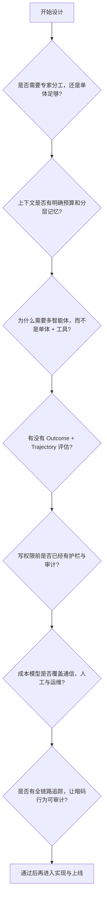

## 9.7 架构陷阱与反模式

如果说上一节讨论的是“系统跑起来之后怎么出故障”，那么本节讨论的是**系统为什么会从一开始就朝着容易出故障的方向被设计出来**。反模式不是某次偶发事故，而是那些在设计阶段看起来省事、上线后却持续放大成本、延迟、风险与复杂度的决策。

一个实用的区分方法是：

* **9.5 故障模式**：运行时如何诊断、止血、恢复。
* **9.6 反模式**：设计阶段哪些决策会系统性制造更多运行时事故。


许多早期智能体实现采用“一个大 Prompt 解决一切”的思路：

```python
# ❌ 反模式

def execute_complex_task(user_request):
    prompt = f"""
    你有以下全部工具：
    {serialize_all_100_tools()}

    所有系统规则如下：
    {all_system_rules}

    用户历史：
    {full_user_history}

    请完成任务：{user_request}
    """

    return model.generate(prompt)
```

这种方案的问题不是”它绝对不能工作”，而是**一旦任务复杂度稍微上升，系统会进入不可控区间**：

1. **工具选择噪声过高**：模型必须在大量无关工具中做选择。
2. **推理链条混乱**：角色、约束、业务规则混杂在一起，注意力分散。
3. **成本线性放大**：每次调用都在重复发送大体量上下文。
4. **调试几乎无从下手**：出了问题，你不知道是路由错、上下文错，还是工具定义错。

### 反模式案例

一个客服系统把退款、换货、投诉、物流、会员、营销等能力全部交给同一个 Agent。结果一个”退货请求”需要加载所有工具和全部历史，原本 3 步能完成的任务变成 20 多步，平均成本上涨近一个数量级。

**最佳实践：分层路由与职责隔离**

```python
# ✅ 推荐方案：分类 + 专家子系统

class StratifiedAgent:
    def __init__(self):
        self.classifier = LLM(model="lightweight")
        self.specialists = {
            "refund": RefundAgent(),
            "replacement": ReplacementAgent(),
            "complaint": ComplaintAgent(),
        }

    def execute(self, request: str):
        task_type = self.classifier.classify(request)
        specialist = self.specialists[task_type]
        return specialist.solve(request)
```

**关键原则**：

* 用“分类-分发”代替“万能大脑”。
* 每个专家 Agent 只携带完成当前任务必需的工具和上下文。
* 让失败边界清晰可见，便于追踪和回放。

### 9.7.2 反模式二：把长上下文当作记忆系统

长上下文模型并不等于”可以把所有历史都丢进去”。常见错误做法如下：

```python
# ❌ 反模式：长上下文滥用

def chat_with_memory(user_message):
    history = load_all_messages(user_id, days=365)
    kb = load_entire_knowledge_base()
    docs = retrieve_all_related_documents(user_message)

    prompt = f"""
    用户历史：{history}
    知识库：{kb}
    文档：{docs}
    当前问题：{user_message}
    """

    return model.generate(prompt)
```

问题在于：

1. **检索精度下降**：相关信息被大量噪声淹没。
2. **注意力偏差更明显**：模型更容易高估首尾信息、忽略中间关键事实。
3. **成本与延迟同步膨胀**：上下文越大，输入成本与 Prefill 延迟越高。
4. **错误更隐蔽**：系统表面上“什么都带上了”，实际上没有真正管理记忆。

#### 最佳实践：预算化上下文与分层记忆

* **短期工作记忆**：最近 5 到 20 条交互。
* **任务状态记忆**：结构化目标、已确认事实、待办步骤。
* **长期知识记忆**：通过检索按需加载，而不是常驻上下文。
* **摘要快照**：对旧对话做压缩摘要，而不是保留完整日志。

换句话说，长上下文应被视为一种**带预算的资源**，而不是懒惰的默认方案。

### 9.7.3 反模式三：在没有证明单体不够之前，过早引入多智能体

多智能体系统不是”更高级的默认选项”，它只是某些场景下更合适的架构。很多团队在单体智能体还没有建立可靠基线时，就急于引入 5 到 10 个角色：

```python
# ❌ 反模式：未经验证就多体化

def solve_complex_task(task):
    agents = [
        ResearchAgent(),
        WritingAgent(),
        EditingAgent(),
        FactCheckingAgent(),
        FormattingAgent(),
    ]

    results = [agent.run(task) for agent in agents]
    return aggregate_results(results)
```

这种做法的代价通常被低估了：

1. **通信成本**：每增加一个 Agent，就增加消息传递、状态同步和额外推理开销。
2. **延迟开销**：哪怕每个子任务很快，协调与等待也会叠加。
3. **故障放大**：一个错误输出会被后续多个 Agent 重复相信。
4. **状态一致性问题**：不同 Agent 持有不同版本的事实和目标。

#### 多智能体通信成本的简单估算

在系统设计阶段，应显式把 Agent 间通信成本纳入 TCO：

```text
总成本 ≈ 主任务推理成本
      + Σ(Agent 间消息 token × 模型单价)
      + 协调器额外推理次数
      + 重试与验证开销
```

如果一条链路需要 4 个 Agent，每个 Agent 之间都要交换 2 轮上下文摘要，那么真正烧钱的往往不是最终答案，而是中间协调消息。

#### 最佳实践：渐进式扩展

* 先证明单体 Agent 的基线质量、成本和延迟。
* 当任务天然可并行、需要明确角色隔离或需要失败隔离时，再引入多体。
* 先从“单体 + 工具”升级到“管道 + 检查点”，最后才是“协调者 + 多专家”。

### 9.7.4 反模式四：没有评估体系就开始优化，甚至直接上线

#### 陷阱描述

这是 2026 年最常见、也最昂贵的错误之一。团队往往会说：

* “我们看了十几个 Demo，感觉效果不错。”
* “Prompt A 比 Prompt B 看起来更聪明。”
* “用户好像没有明显投诉，先上线再说。”

问题在于，没有评估体系，你根本不知道自己在优化什么，更不知道某次改动是修复了问题还是制造了新的回归。

#### 反模式案例

一个内部知识问答 Agent 在演示环境里表现优秀，于是团队直接接入生产文档库。上线两周后才发现：

* 回答更长了，但事实性错误也变多了。
* 新 Prompt 提升了“写作流畅度”，却降低了工具调用成功率。
* 某次模型切换让成本下降了 30%，但完成任务的成功率也下降了 12%。

之所以迟迟没有发现，是因为系统只记录了用户点赞率，没有记录轨迹质量、证据覆盖率和任务完成率。

#### 最佳实践：评估先行

至少建立四层评估：

1. **Outcome Eval**：最终答案是否正确、任务是否完成。
2. **Trajectory Eval**：中间步骤是否合理，是否有多余调用、错误路由或违规动作。
3. **Golden Dataset**：沉淀一组代表性任务，覆盖核心路径与高风险边界。
4. **CI/CD 回归评测**：每次 Prompt、模型、工具或编排逻辑变更后自动回归。

对于开放式任务，可以进一步加入：

* **LLM-as-a-Judge**：自动审阅输出质量，但必须做抽样人工校准。
* **Pairwise Eval**：对比版本 A/B，而不是只看单个版本绝对分数。
* **线上审计样本**：从生产 trace 中回流坏例子，持续扩展黄金集。

### 9.7.5 反模式五：在没有安全边界时开放写权限

#### 陷阱描述

另一类高危决策是：系统还没有建立护栏、权限边界与审计能力，就给智能体开放数据库写入、文件删除、工单提交、消息发送等执行权限。

这种架构往往有一个危险假设：**“只要 Prompt 写得够清楚，模型就不会乱来。”**

这是错误的。运行时出现幻觉、提示词注入、工具误调用、上下文漂移时，最终承担后果的是权限系统，而不是 Prompt 本身。

#### 最佳实践：先建护栏，再给动作能力

设计阶段至少要有以下约束：

* **最小权限**：默认只读。
* **动作分级**：读、写、破坏性动作、对外发送分开建模。
* **护栏分层**：输入过滤、策略引擎、Schema 校验、执行网关、审计日志。
* **人工确认**：高风险动作强制 HITL。
* **沙箱与代理**：真实密钥、真实写权限、真实网络出口不直接暴露给模型。

如果这些能力还没建好，正确做法不是“先把功能做完”，而是先把系统限制在安全的只读模式。

### 9.7.6 反模式六：只看模型单价，不看总拥有成本

#### 陷阱描述

很多团队讨论成本时，只盯着“这个模型每百万 Token 多少钱”，却忽略了更大的成本项：

* 失败重试
* 人工兜底
* 监控与日志
* 向量库与缓存
* 多智能体协调
* 事故恢复与支持成本

这会带来两种常见误判：

1. **假节省**：换了更便宜的模型，单次调用成本下降，但错误率上升，人工复核成本更高。
2. **假优化**：为了省日志与评测费用，减少追踪和标注，结果故障定位更慢，停机损失更大。

#### 最佳实践：用 TCO 做架构决策

把成本模型写进设计文档，而不是事后对账：

```text
TCO = 推理成本
    + 基础设施成本
    + 监控与评估成本
    + 人工干预成本
    + 事故与回滚成本
```

对生产系统而言，真正应该优化的是**单位业务价值成本**，而不是表面上的“单次 API 单价”。

### 9.7.7 反模式七：忽视暗码（Dark Code）——运行时行为的不可审计性

前面六个反模式都假设了一个前提：**出了问题，至少可以回头看代码找原因**。但智能体系统存在一种更根本的困境——Agent 的执行路径不是预先编写的代码，而是 LLM 在运行时动态生成的行为序列。这些行为”跑完即逝”，无法像传统代码一样被事先审查或精确复现。

这种“即生即灭”的运行时行为，被称为**暗码（Dark Code）**。

如果说传统软件像建筑图纸——提前画好、可反复检查，那么 Agent 的运行时行为更像爵士乐即兴演奏——每次都不同、无法提前审批、只有录音才能事后回顾。

```python
# ❌ 反模式：假设 Agent 行为可以通过审查 Prompt 来保证

def deploy_agent(task):
    # "Prompt 写得够清楚，不会出问题"
    response = model.generate(carefully_written_prompt + task)
    execute_actions(response)  # 直接执行，没有行为记录
```

问题在于：

1. **不可复现**：同样的 Prompt，不同时间运行可能产生完全不同的工具调用序列。
2. **不可审查**：出了问题，你只有最终输出，没有中间决策过程的完整记录。
3. **权限失配**：Agent 每次运行需要的权限组合都不同，静态分配要么过宽要么过窄。
4. **责任模糊**：数据泄露后，无法确定是 Prompt 的错、模型的错、工具的错还是编排的错。

#### 最佳实践：让暗码“可见”

```python
# ✅ 推荐方案：全链路追踪 + 意图声明 + 临时权限

class ObservableAgent:
    def execute(self, task: str):
        trace = Trace.start(task)

        for step in self.plan(task):
            # 1. 记录意图声明
            intent = step.declare_intent()
            trace.log_intent(intent)

            # 2. 动态申请最小权限
            with temporary_permission(step.required_scope) as perm:
                # 3. 在沙箱中执行，记录全部输入输出
                result = trace.span(step.name)(
                    lambda: step.execute(perm)
                )

            # 4. 验证结果是否符合预期
            trace.log_result(result)

        trace.finalize()
        return trace.summary()
```

**核心原则**：

* **全链路追踪**是底线，不是可选项。没有 Trace 的 Agent 等于黑盒执行。
* **权限应跟随行为**，而不是预先分配给角色。每个工具调用前申请、调用后回收。
* **意图声明**为审计提供“行为签名”——Agent 在执行关键操作前必须输出结构化的意图，作为事后追责的依据。
* 传统安全审查“代码”，Agent 安全必须审查“行为”。

### 9.7.8 反模式总结：设计阶段的七个必答问题

在进入实现之前，团队至少应该回答下面七个问题：



图 9-18：架构设计前的七个检查点

如果这些问题没有明确答案，继续堆 Prompt、加 Agent、扩上下文，通常只会让问题更难排查。

---

**下一节**: [9.8 从实验到生产：决策路线图与检查清单](9.8_experiment_to_production.md)
