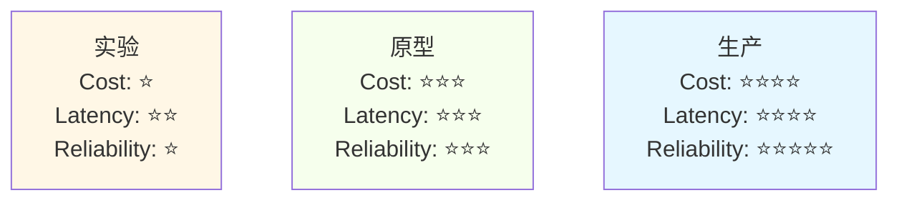
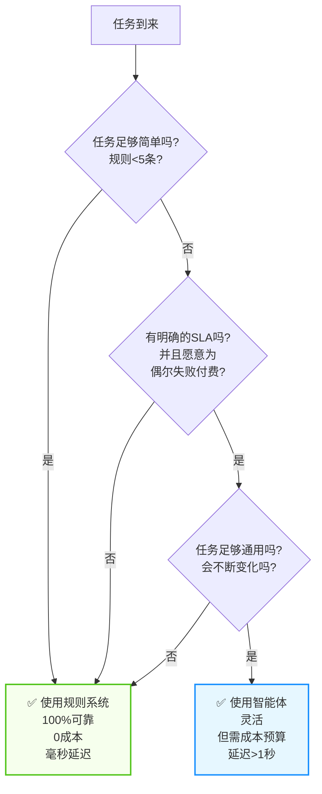

## 9.8 从实验到生产：决策路线图与检查清单

在AI开发中，最常见的陷阱不是技术本身，而是在错误的时机做出错误的决策。一个在实验室中表现完美的智能体可能在生产环境中崩溃，而一个“看起来简单”的规则引擎反而能稳定运行三年。

本节提供一份清晰的决策路线图，帮助团队在实验、原型和生产三个阶段之间做出正确的抽象和工程决策。


图 9-19：实验-原型-生产三阶段流程


**定义**：
- **目标**：快速迭代，验证“这个想法是否可行”
- **用户**：内部团队
- **规模**：<=100 个测试用例
- **质量标准**：概念证明，70% 的成功率可以接受
- **时间框架**：1-2 周

**特点**：
- 代码不需要整洁（只要能运行）
- 可以硬编码参数和阈值
- 错误日志与可观测性不是优先级
- 可以使用任意技术栈
- 目标是快速反馈

**典型问题与答案**：

```text
Q: 是否应该写单元测试？
A: 不需要。用手工测试验证想法更快。

Q: 是否应该处理错误情况？
A: 最小化处理。只处理会导致任务完全失败的错误。

Q: 是否需要监控成本？
A: 不需要。重点是验证可行性。

Q: 数据来源应该是真实数据吗？
A: 可以用样本或合成数据。速度更重要。
```

**实验阶段的脚本示例**：

```python
# ❌ 这样可以，虽然很丑陋

def simple_agent_experiment(user_query):
    # 硬编码的配置
    MODEL = "gpt-4"
    TOOLS = ["search", "calculator"]

    # 直接调用，不考虑错误处理
    result = llm.generate(f"""
    User query: {user_query}
    Available tools: {TOOLS}
    Please solve this step by step.
    """)

    return result

# 快速测试

print(simple_agent_experiment("What is 2+2?"))
```

#### 9.7.1.2 原型阶段：验证架构的有效性

**定义**：
- **目标**：验证”我们选择的架构能否扩展到生产”
- **用户**：内部团队 + 早期用户/测试用户
- **规模**：100-10,000 个测试用例
- **质量标准**：85% 的成功率
- **时间框架**：2-4 周

**特点**：
- 代码结构开始重要（便于后续扩展）
- 开始考虑错误处理和日志
- 建立评估框架
- 开始区分 **Outcome Eval**（结果是否完成任务）与 **Trajectory Eval**（过程是否合理）
- 建立首版 **Golden Dataset**，把主路径、长尾样本和已知坏例子沉淀下来
- 准备把评估接入 CI/CD，而不是只靠人工体验
- 不同模块可以被替换
- 准备做 A/B 测试

**原型阶段的决策清单**：

```text
[ ] 是否定义了清晰的模块化结构？
[ ] 错误处理覆盖了主要失败场景吗？
[ ] 是否有基础的日志和可观测性？
[ ] 是否定义了 Outcome Eval 与 Trajectory Eval？
[ ] 是否建立了 Golden Dataset，并覆盖核心坏例子？
[ ] Prompt/模型变更后，是否能自动回归评测？
[ ] 成本在可控范围内吗（<$100/天）？
[ ] 是否可以轻松替换模型或工具？
[ ] 是否有自动化测试？
[ ] 是否定义了生产的关键指标？
[ ] 团队是否都理解了设计决策？
```

**原型阶段的代码示例**：

```python
class AgentPrototype:
    """原型版本：更结构化，但仍然简化"""

    def __init__(self, model_name="gpt-4"):
        self.model = LLMFactory.create(model_name)
        self.tools = ToolRegistry()
        self.logger = logging.getLogger(__name__)

    def run(self, task: str) -> dict:
        """执行任务，带基础错误处理"""
        try:
            self.logger.info(f"Starting task: {task}")

            # 结构化执行
            for step in range(10):  # 最多10步
                thought, action = self._generate_next_action(task, step)

                if action.type == "finish":
                    self.logger.info(f"Task completed: {action.result}")
                    return {"success": True, "result": action.result}

                try:
                    observation = self.tools.execute(action)
                except ToolError as e:
                    self.logger.warning(f"Tool error on step {step}: {e}")
                    # 工具失败，让Agent知道并重试
                    observation = f"Error: {e}"

            # 超过最大步数
            self.logger.error("Max steps exceeded")
            return {"success": False, "error": "max_steps"}

        except Exception as e:
            self.logger.error(f"Unexpected error: {e}", exc_info=True)
            return {"success": False, "error": str(e)}

    def _generate_next_action(self, task: str, step: int):
        """生成下一步操作"""
        # 实现细节
        pass
```

#### 9.7.1.3 生产阶段：保证稳定性与可维护性

**定义**：
- **目标**：稳定运行，满足SLA，可维护性高
- **用户**：真实用户（数万到数百万）
- **规模**：任意规模
- **质量标准**：99.5% 可用性，<2% 错误率
- **时间框架**：持续运营

**特点**：
- 完整的错误处理与降级策略
- 详细的可观测性（日志、指标、追踪）
- 自动化评估门禁（上线前必须通过 Golden Dataset 回归）
- 同时监控结果质量与轨迹质量，而不是只看用户点赞
- 自动化测试覆盖率 >80%
- 明确的运维手册和应急预案
- 成本预算与监控
- 安全与权限管理
- 多层安全护栏：输入检测、PII 处理、越狱/注入防护、执行网关、审计日志
- 明确的合规控制：数据保留、用户删除、审计可追溯、区域与供应商约束
- 版本管理与灰度部署

详细的生产部署检查清单见 9.7.5 节。

### 9.8.2 阶段转移的触发条件

#### 从实验到原型：何时进行

**绿灯信号**（应该进入原型）：
- 在20个不同的测试用例上，成功率稳定 >70%
- 团队对解决方案的架构有共识
- 成本在预期范围内
- 有明确的“为什么这个方法可行”的理由

**红灯信号**（继续实验）：
- 成功率波动剧烈（差异 >30%）
- 团队对架构有分歧
- 已尝试多个方向但都效果不佳
- 成本远超预期

#### 从原型到生产：何时进行

**绿灯信号**（可以上生产）：
```text
成功率 > 85%（在有代表性的测试集上）
AND
自动化测试通过率 > 80%
AND
Outcome Eval 与 Trajectory Eval 均达到预设阈值
AND
平均成本/请求 < 预算的 50%
AND
平均延迟 < SLA 的 80%
AND
团队对运维有信心（至少进行过一次压力测试）
AND
已有清晰的降级与应急方案
AND
关键安全护栏已经实装并做过红队或对抗测试
```

**黄灯信号**（有条件地上生产）：
```text
成功率 > 80% 但 < 85%
→ 可以上生产，但需要：
   1. 灰度部署（先给5%用户）
   2. 24/7 监控
   3. 快速回滚计划

OR

成本/请求接近预算
→ 可以上生产，但需要：
   1. 实时成本预警
   2. 自动降级策略
   3. 定期成本优化
```

**红灯信号**（不应该上生产）：
- 成功率 < 80%
- 错误类型复杂且难以诊断
- 没有有效的降级方案
- 团队对运维没有把握
- 没有明确的SLA承诺

### 9.8.3 成本-延迟-可靠性三角权衡

在不同阶段，这三个指标的优先级不同：



图 9-20：成本-延迟-可靠性三阶段权衡


| 维度 | 实验阶段 | 原型阶段 | 生产阶段 |
|------|---------|---------|---------|
| 模型 | 最强模型（不计成本） | 主模型 + 降级备选 | 主模型 + 降级 + 规则兜底 |
| 重试 | 100 次（尽情试） | 5 次 | 受 SLA 约束 |
| 超时 | 60s | 10s | P99 < 2s |
| 错误处理 | 最小化 | 全面 | 全面 + 熔断 + 自动回滚 |
| 成本预期 | $10-100/天（不在乎） | $100-1000/天（监控） | 严格预算，80% 告警 |
| 可靠性 | 70% | 85% | 99.5% SLA |

### 9.8.4 何时选择简单规则 vs 智能体

这是最常被忽视的决策，但也是最重要的。



图 9-21：规则系统与智能体决策树


**案例一：订单分类**

```text
任务：根据订单类型（退货/换货/投诉）进行分类

规则方案：
if "退货" in message or "return" in message:
    category = "return"
elif "换货" in message or "exchange" in message:
    category = "exchange"
...
→ 准确率：95%，成本：$0，延迟：1ms

智能体方案：
使用LLM分类
→ 准确率：98%，成本：$0.01/次，延迟：2s

推荐：规则方案。5%的差异不值得付代价。
```

**案例二：复杂查询应答**

```text
任务：用户问一个关于公司政策的复杂问题
"如果我在第一年就升职了，是否仍然可以享受离职补偿?"

规则方案：
维护1000条规则，维护成本极高
→ 准确率：50%（很多问题覆盖不了）

智能体方案：
使用RAG + LLM从文档中检索并回答
→ 准确率：90%，成本：$0.05/次，延迟：5s

推荐：智能体方案。规则无法覆盖。
```

### 9.8.5 生产部署检查清单

在部署到生产前，确保以下清单全部完成：

```markdown

### 生产部署清单

### 功能完整性

- [ ] 核心功能实现完毕
- [ ] 所有主要用例都有测试
- [ ] A/B测试已完成，有明确的赢家
- [ ] 文档已更新

### 性能与成本

- [ ] 延迟P95 < SLA限制
- [ ] 成本/请求 < 预算
- [ ] 缓存策略已实施
- [ ] 成本监控告警已配置

### 可靠性

- [ ] 故障处理覆盖所有主要错误
- [ ] 降级策略已实现并测试
- [ ] 自动重试逻辑已验证
- [ ] 熔断机制已配置

### 可观测性

- [ ] 关键路径的日志已添加
- [ ] 错误追踪已配置（Sentry/ELK等）
- [ ] 性能指标已收集
- [ ] 仪表板已创建

### 评估门禁

- [ ] Golden Dataset 已建立并持续维护
- [ ] Outcome Eval 达到上线阈值
- [ ] Trajectory Eval 达到上线阈值
- [ ] 历史事故样本已加入回归集
- [ ] Prompt/模型/工具变更会自动触发评测
- [ ] LLM-as-a-Judge 已做人工抽检校准

### 安全性

- [ ] 敏感数据加密
- [ ] 权限管理已实施
- [ ] API速率限制已配置
- [ ] PII 检测与脱敏已配置
- [ ] 提示词注入/越狱检测已配置
- [ ] 高风险动作具备人工确认或执行网关
- [ ] 安全审计已通过

### 合规与治理

- [ ] 数据保留与删除策略已定义
- [ ] 审计日志可追溯到用户、版本、trace
- [ ] 模型供应商与数据流向已完成登记
- [ ] 适用的 GDPR/EU AI Act/行业监管要求已完成评估
- [ ] 法务、隐私和安全团队已完成上线评审

### 运维准备

- [ ] 运维手册已编写
- [ ] 常见问题与解决方案已文档化
- [ ] 应急流程已定义
- [ ] On-call安排已确认

### 用户准备

- [ ] 用户文档已准备
- [ ] FAQ已更新
- [ ] 支持团队已培训
- [ ] 反馈渠道已开通

### 部署策略

- [ ] 部署步骤已规划
- [ ] 回滚流程已测试
- [ ] 灰度部署时间表已制定
- [ ] 成功指标已定义
```

### 9.8.6 关键决策点的重新审视机制

部署到生产后，需要定期重新审视关键决策。

| 时间节点 | 关注重点 | 关键动作 |
|---------|---------|---------|
| 第 1 周 | 应急观察 | 成功率 <85% 立即回滚；用户投诉 >10 立即排查 |
| 第 1 月 | 优化调整 | 评估是否降级为混合方案；错误率 >5% 考虑更强模型 |
| 每季度 | 战略审视 | 对标行业最佳实践；决定是否继续维护 |

### 9.8.7 小结：路线图速查表

| 阶段 | 主要目标 | 成功标准 | 典型时间 | 关键决策 |
|------|--------|--------|--------|--------|
| **实验** | 验证想法 | >70% 成功率 | 1-2周 | 该想法值得继续吗？|
| **原型** | 验证架构 | >85% 成功率 | 2-4周 | 架构能扩展到生产吗？|
| **生产** | 稳定运营 | >99% 可用性 | 持续 | 是否需要优化？|

**永远记得**：
- 🔴 不要跳过原型阶段直接上生产
- 🟡 不要因为“技术上可行”就做不必要的复杂化
- 🟢 最简单的解决方案往往是最好的

### 9.8.8 框架选型与互操作检查清单

框架选型的详细指南见[第 8 章](../08_frameworks/README.md)。在此仅强调互操作性要点：工具定义统一为 MCP 格式、Agent 间通信标准化、日志格式统一、全链路追踪覆盖。确保每个框架选型都经过[第 8 章](../08_frameworks/README.md)的完整评估后再做决策。

### 9.8.9 长期运行 Agent 的有效设计模式

在跨越多个 context window 的复杂、长时间运行任务中，Agent 需要克服一个关键挑战：**如何在持续的多轮迭代中保持生产力、防止过早宣布完成，并确保增量工作具有可合并性**。本节基于 Anthropic 工程博客的研究总结了这一关键模式。

#### 9.7.9.1 双层 Agent 架构

对于需要跨越多个 session 和 context window 完成的复杂任务（如大规模代码重构、知识系统构建等），推荐采用 **双层 Agent 架构**：

**第一层：Initializer Agent**
- 在项目首次运行时负责环境搭建和初始化
- 职责：
  - 创建标准的 `init.sh` 启动脚本，用于后续 session 快速恢复环境
  - 初始化 `claude-progress.txt` 进度文件，记录已完成的里程碑
  - 执行首个 git commit，确保版本控制从一个清晰的基线开始
  - 建立项目的目录结构和配置文件
  - 编写或收集初始文档

**第二层：Coding Agent**
- 在每个后续 session 中负责增量工作和迭代开发
- 职责：
  - 通过执行 `init.sh` 快速恢复上个 session 的环境
  - 读取 `claude-progress.txt` 了解历史进度和已知的设计决策
  - 在前人工作的基础上做增量改进
  - 确保每一段代码都是可以正确合并的（mergeable）
  - 主动运行测试验证，保持向前的动力

这种设计的核心优势是：**打破了单个 session 的限制，让多轮 Agent 工作可以有机地累积而不是相互覆盖**。Initializer Agent 需要编写 `init.sh` 启动脚本（用于后续恢复环境）、初始化 `claude-progress.txt` 进度文件、执行首个 git commit，从而为后续 Coding Agent 奠定基础。

#### 9.7.9.2 结构化功能清单：防止过早宣布完成

长期运行的 Agent 最常见的问题是 **对"完成"的定义过于乐观**。一个 Agent 在改进了几个功能后就宣布项目完毕，但实际上有数十个边界情况和细节需要处理。

**解决方案：使用 JSON 格式的结构化功能清单**

与其依赖 Markdown 来追踪功能状态（容易被 Agent 随意修改），不如使用 JSON 格式的功能清单。模型对 JSON 结构有更强的"敬畏感"，不容易随意删除或编辑测试条目。

```json
{
  "features": [
    {"id": "func_001", "description": "用户可以打开新对话并看到 AI 回复", "passes": false, "priority": "critical"},
    {"id": "func_002", "description": "Agent 可以调用自定义工具", "passes": false, "priority": "critical"},
    {"id": "edge_001", "description": "工具超时时正确处理", "passes": false, "priority": "high"}
  ]
}
```

**为什么用 JSON？**
1. **结构强制**：JSON 的格式严格，Agent 不能随意添加/删除字段
2. **可编程验证**：可以写脚本检查是否有新增功能未标记为 `"passes": false`
3. **防止幻觉**：Markdown 清单很容易让 Agent 编造已完成的功能；JSON 的严格性能降低这种风险
4. **易于统计**：自动计算完成率、按分类统计、识别高风险的未完成功能

**功能清单的使用规则**：
- Agent **只能修改** `"passes"` 字段（从 `false` 改为 `true`）
- Agent **不能删除** 或 **编辑** 任何测试条目
- 每次提交前，验证通过的功能数 ≤ 前一个 session 的数 + 新增合理数量
- 定期审视高优先级但未通过的功能，评估是否需要调整实现策略

#### 9.7.9.3 强制单功能增量开发

在每个 session 中，Agent 应该遵循严格的优先级并 **每次只处理一个功能**：

```bash
1. 执行 init.sh，恢复环境
2. 读取 features.json，选择优先级最高的失败功能
3. 实现该功能并运行测试直到全部通过
4. 将结果更新到 features.json，执行 git commit
5. 保存 claude-progress.txt 和状态文件
```

这种方法的好处：
- **可追踪性强**：每个 commit 对应一个已验证的功能
- **容易回滚**：如果发现某个功能有问题，可以轻松找到相关 commit 并回滚
- **防止功能蔓延**：限制每个 session 的范围，防止 Agent"跑题"
- **透明的进度**：通过 git 历史和功能清单，实时知道完成百分比

#### 9.7.9.4 Git Commit 状态追踪

每一步增量进展都应该用描述性的 commit message 记录在 git 中：

```bash
# 初始化 commit（由 Initializer Agent 创建）
git commit -m "Initial project setup: environment, structure, and baselines"

# 功能完成 commit（由 Coding Agent 创建，每次 session）
git commit -m "Feature func_001: Add user-facing conversation interface (e2e tested)"
git commit -m "Feature func_002: Implement tool call parsing and execution"
git commit -m "Edge case edge_001: Handle tool timeout gracefully"

# 优化 commit
git commit -m "Perf optimization: Cache tool responses to reduce latency"
```

通过 git 历史，下一个 session 的 Agent 可以：
1. 查看 `git log` 了解项目演进
2. 用 `git diff` 对比版本，检查哪些功能可能引入了新问题
3. 用 `git blame` 追踪特定功能的实现细节
4. 快速 rollback 到稳定版本

#### 9.7.9.5 浏览器自动化端到端测试

为了验证功能的真实可用性（不仅仅是单元测试通过），应该集成浏览器自动化框架进行 E2E 测试：使用 Playwright 或 Selenium 等浏览器自动化框架进行 E2E 测试，验证功能的真实可用性。

#### 9.7.9.6 Session 开头的恢复与基线测试

每个新 session 开始时，Agent 应该遵循标准的恢复流程：

1. **环境恢复**：执行 `init.sh` 脚本，安装依赖，验证环境就绪
2. **上下文读取**：读取 `claude-progress.txt` 理解历史决策，读取 `features.json` 查看当前进度百分比
3. **基线测试**：运行关键单元测试确保前一个 session 的工作未被破坏

#### 9.7.9.7 实践检查清单

在采用长期 Agent 模式时，确保以下要点得到满足：

```markdown
### 长期 Agent 实施检查清单

#### 架构与初始化
- [ ] Initializer Agent 已创建 init.sh 和 claude-progress.txt
- [ ] 首个 git commit 包含完整的初始项目结构

#### 功能追踪
- [ ] features.json 已创建，包含详细的功能描述
- [ ] 优先级标注正确，critical 功能明确

#### 开发流程
- [ ] 每个 session 只处理一个功能
- [ ] 定义了"通过"的明确标准（单元测试 + E2E 验证）
- [ ] 每个 commit 对应一个已验证的功能

#### 测试与验证
- [ ] E2E 测试覆盖了所有 critical 功能
- [ ] 基线测试脚本 <30 秒执行完毕
- [ ] CI/CD 流程配置完毕，每次 commit 自动运行测试

#### 文档与通信
- [ ] Git 历史是项目进展的"黄金记录"
- [ ] 月度审查机制已建立，评估进度和调整策略
```

#### 9.7.9.8 小结

长期运行 Agent 的成功取决于 **结构化设计与强制纪律**：

| 组件 | 目的 | 关键实施点 |
|------|------|--------|
| **Initializer Agent** | 一次性环境搭建 | init.sh、初始 git commit |
| **Coding Agent** | 增量迭代开发 | 单功能 per session，E2E 验证 |
| **功能清单** | 防止过早完成宣言 | JSON 格式，200+ 条详细描述 |
| **Git 历史** | 状态追踪与审计 | 每功能一个 commit，clear message |
| **E2E 测试** | 真实可用性验证 | Playwright/浏览器自动化 |
| **Session 流程** | 恢复与持续性 | 固定的启动序列和基线测试 |

这种模式已被证明能够有效支持跨越数十个 context window 的复杂工程任务，显著提高了多轮 AI 协作的生产力和可维护性。

> **参考**：Anthropic 工程博客 *Effective Harnesses for Long-Running Agents*（2026）

---

**下一节**: [本章小结](summary.md)
