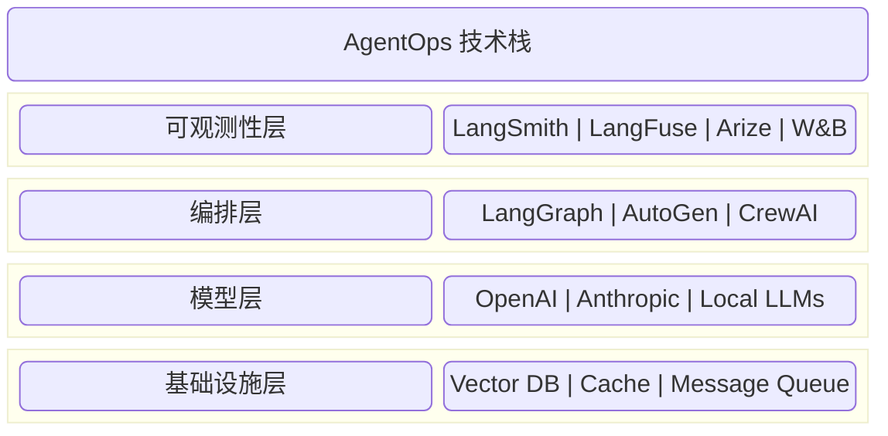

# 第九章：AgentOps 与生产化落地

写好智能体的提示词只是万里长征第一步。将智能体作为一个软件系统发布到生产环境，面临着并发、延迟、成本、错误处理等一系列工程挑战。

本章是写给软件架构师和 SRE 工程师的，探讨如何构建 **健壮 (Robust)**、**可观测 (Observable)**、**可扩展 (Scalable)** 的 Agentic 系统。这一新兴领域被称为 **AgentOps**。

## 章节导读

- **[9.1 架构设计模式与最佳实践](9.1_design_patterns.md)**
  - 总结和对比常见的架构模式。什么时候该用简单的 **单体智能体 (Single Agent)**？什么时候该用复杂的 **编排者-工作者 (Orchestrator-Workers)**？从 ReAct 到 Planner-Executor 的演进。

- **[9.2 可观测性：追踪、监控与调试](9.2_observability.md)**
  - 智能体是概率性的，容易出错。如何实现全链路追踪？如何使用 LangSmith、LangFuse、Arize 等工具进行监控和调试？

- **[9.3 性能优化与成本控制](9.3_optimization.md)**
  - 词元 (Token) 成本控制 (缓存 Caching、提示词 Prompt 压缩)、延迟优化 (流式传输 Streaming、并行化)、以及如何平衡质量与成本。

- **[9.4 企业级安全与合规部署](9.4_enterprise.md)**
  - 探讨生产环境的安全需求：API 密钥管理、数据脱敏、审计日志、容器化部署、以及如何满足 SOC2/GDPR 等合规要求。

- **[9.5 故障模式与韧性设计](9.5_failures.md)**
  - 失败是成功之母。分析真实的智能体生产事故案例，从死循环、幻觉到安全漏洞，总结宝贵的经验教训。

- **[本章小结](summary.md)**

## 核心概念预览

具体示例如下：

图 9-0：AgentOps 技术栈概览 (AgentOps Tech Stack Overview)

下一章将探讨智能体编程实践，介绍主流工具与开发工作流。

---

**下一节**: [9.1 设计模式：从 Workflow 到 Agent](9.1_design_patterns.md)
