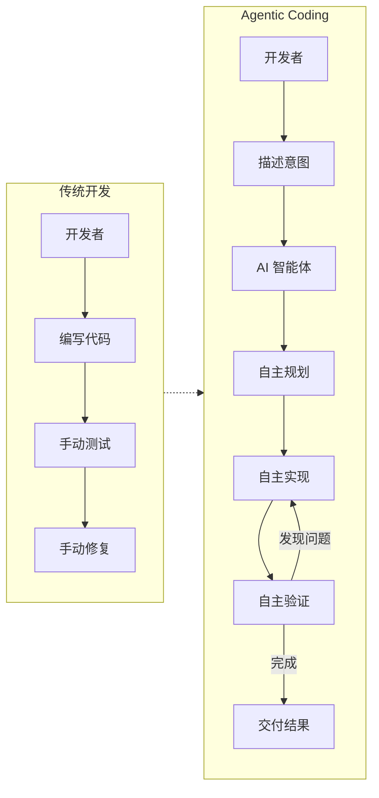

## 10.1 编程范式转移

2025 年，软件开发领域正经历一场由 AI 智能体驱动的范式转变。从 **Vibe Coding** 到 **Agentic Coding**，开发者的角色正在从"写代码的人"转变为"编排 AI 的人"。

### 10.1.1 什么是 Vibe Coding

**Vibe Coding** 是 AI 专家 Andrej Karpathy 在 2025 年初提出的概念，描述了一种全新的编程风格：

> "完全沉浸在'氛围'中，拥抱指数级增长，忘掉代码的存在。"
> — Andrej Karpathy

#### 核心理念

具体示例如下：

```
传统编程                      Vibe Coding
    │                             │
    ▼                             ▼
┌─────────────┐            ┌─────────────┐
│ 思考算法     │            │ 描述意图     │
│ 设计结构     │            │ "我想要..."  │
│ 编写代码     │            │             │
│ 调试错误     │      ──→   │ AI 生成代码  │
│ 优化性能     │            │ AI 调试修复  │
│ 编写测试     │            │ AI 编写测试  │
└─────────────┘            └─────────────┘
```

#### Vibe Coding 的特点

| 特点 | 描述 | 典型场景 |
|------|------|---------|
| 自然语言驱动 | 用口语化的方式描述需求 | "帮我写一个登录页面" |
| 快速原型 | 分钟级别生成可运行代码 | 黑客马拉松、概念验证 |
| 迭代对话 | 通过对话不断调整优化 | "把按钮改成蓝色" |
| 低门槛 | 非程序员也能"编程" | 产品经理生成原型 |

#### Vibe Coding 的局限

尽管 Vibe Coding 降低了编程门槛，但它也存在明显的局限性：

1. **技术债务累积**：AI 生成的代码可能包含隐藏的设计缺陷
2. **调试困难**：当 AI 生成的代码出错时，不理解代码的用户难以定位问题
3. **安全风险**：未经审查的 AI 代码可能包含安全漏洞
4. **可维护性差**：缺乏系统设计的代码难以长期维护

> [!WARNING]
> **Vibe Coding 适合原型验证，但生产级系统需要更系统化的方法。**

### 10.1.2 什么是 Agentic Coding

**Agentic Coding** 是 Vibe Coding 的进化版——AI 不仅仅生成代码，而是作为一个 **自主智能体**，能够：

1. **理解**：深度分析整个代码库的结构和上下文
2. **规划**：制定实现方案并分解为可执行任务
3. **执行**：自主编写、修改、重构代码
4. **验证**：运行测试、分析错误、修复 Bug
5. **迭代**：根据反馈自我改进



图 10-1：Vibe Coding 与 Agentic Coding 的工作流演进对比

#### Agentic Coding 的关键特征

| 特征 | Vibe Coding | Agentic Coding |
|------|-------------|----------------|
| **代码库理解** | 单文件/片段 | 全项目索引 |
| **任务分解** | 用户手动分解 | 智能体自主分解 |
| **错误修复** | 用户描述问题 | 智能体自主发现和修复 |
| **测试** | 用户请求生成 | 智能体主动验证 |
| **上下文管理** | 用户手动提供 | 智能体动态检索 |
| **多文件操作** | 逐文件进行 | 跨文件协调 |

#### 真实案例：API 迁移任务

假设需要将一个 Flask API 迁移到 FastAPI：

**Vibe Coding 方式**：
```
用户：帮我把这个 Flask 路由改成 FastAPI
AI：[生成一个文件的代码]
用户：还有这个文件...
AI：[生成另一个文件]
用户：依赖也要改...
AI：[生成 requirements.txt]
（重复多次，容易遗漏）
```

**Agentic Coding 方式**：
```
用户：帮我把这个项目从 Flask 迁移到 FastAPI

智能体：
[1] 分析项目结构... 发现 12 个路由文件，3 个中间件
[2] 制定迁移计划：
    - 更新依赖
    - 迁移路由定义
    - 转换中间件
    - 更新测试
    - 验证功能
[3] 执行迁移...
[4] 运行测试... 发现 2 个失败
[5] 修复问题...
[6] 所有测试通过，迁移完成

生成变更摘要：修改 15 个文件，新增 3 个文件
```

### 10.1.3 编程范式演进历程

具体示例如下：

#### 演进时间线

```
┌─────────────────────────────────────────────────────────────────────────┐
│                        编程范式演进时间线                                 │
├──────────┬──────────┬────────────┬──────────────┬─────────────────────┤
│  1950s   │  1970s   │   2000s    │    2022      │       2025+         │
│  机器码   │  高级语言  │   IDE 智能  │   AI 辅助     │    Agentic Coding   │
│          │          │            │              │                      │
│ 纸带打孔  │  C/Pascal │  自动补全   │   Copilot    │   自主智能体         │
│ 手动地址  │  结构化    │  重构工具   │   代码建议    │   理解-规划-执行     │
│ 无抽象    │  函数/类   │  静态分析   │   Chat 补全   │   全生命周期参与     │
└──────────┴──────────┴────────────┴──────────────┴─────────────────────┘
```

图 10-2：编程范式演进时间线

#### 范式转移的驱动力

1. **模型能力突破**：长上下文窗口（200K+ tokens）使整个代码库可被理解
2. **工具使用能力**：模型能调用 shell、编辑器、浏览器等工具
3. **推理能力提升**：o1/o3 等推理模型能处理复杂的多步骤任务
4. **标准化协议**：MCP、AGENTS.md 等标准让智能体更易集成

### 10.1.4 开发者角色的转变

#### 从"写代码"到"编排 AI"

随着编程范式的转移，开发者的角色也发生了根本性的变化。本节将从技能栈的转变、新型开发者画像以及职业发展三个方面进行探讨。

具体示例如下：

```
传统技能栈                           智能体时代技能栈
├── 语法精通                  ──→    ├── 系统设计思维
├── 算法背诵                  ──→    ├── 需求拆解能力
├── 调试技巧                  ──→    ├── 问题定义能力
├── 框架熟练                  ──→    ├── AI 工具链整合
├── 手速快                    ──→    ├── 验收与质量把控
│                                    ├── 上下文工程
│                                    └── 安全审计意识
```

图 10-3：开发者技能栈的转变

#### 新型开发者画像

| 能力维度 | 传统开发者 | 智能体时代开发者 |
|---------|-----------|----------------|
| 核心竞争力 | 编码速度和技巧 | 问题定义和系统思维 |
| 日常工作 | 写代码、调试 | 需求拆解、审查 AI 输出 |
| 学习重点 | 新框架、新语言 | 提示词工程、上下文工程 |
| 质量保证 | 代码审查、单元测试 | AI 输出验证、护栏设计 |
| 团队协作 | 人-人协作 | 人-AI-人协作 |

#### 职业发展影响

> [!IMPORTANT]
> **智能体编程不会取代开发者，而是改变开发者的工作方式。**> 
> 重复性编码工作将被自动化，但以下能力将更加重要：
> - 理解业务需求并转化为技术方案
> - 设计可维护、可扩展的系统架构
> - 审查 AI 生成代码的质量和安全性
> - 处理 AI 无法解决的复杂边缘情况

### 10.1.5 Agentic Coding 的工程挑战

尽管前景广阔，Agentic Coding 在工程实践中仍面临挑战：

#### 确定性与可重复性

智能体的行为具有一定的随机性，同样的输入可能产生不同的输出。

**应对策略**：
- 使用低温度（temperature）参数
- 建立测试套件验证输出
- 版本控制智能体配置

#### 上下文管理

大型代码库可能超出上下文窗口限制。

**应对策略**：
- 动态上下文检索
- 代码库索引和语义搜索
- 分层上下文注入

#### 安全性

智能体可能执行危险操作或生成不安全代码。

**应对策略**：
- 沙箱执行环境
- 敏感操作审批机制
- 代码安全扫描

#### 调试困难

当智能体的输出不符合预期时，很难追踪问题根源。

**应对策略**：
- 详细的执行日志
- 思维链可视化
- 分步执行模式

### 10.1.6 小结

| 范式 | 核心理念 | 适用场景 | 局限性 |
|------|---------|---------|--------|
| **Vibe Coding** | 自然语言生成代码 | 原型验证、学习 | 技术债务、可维护性 |
| **Agentic Coding** | AI 作为自主开发伙伴 | 生产级开发 | 需要工程化实践 |

**关键认知转变**：
1. 从"我写代码"到"我指导 AI 写代码"
2. 从"掌握语法"到"掌握意图表达"
3. 从"手动调试"到"设计验证流程"
4. 从"个人技能"到"人机协作效率"

---

**下一节**: [智能体编程原理](10.2_loop.md)
