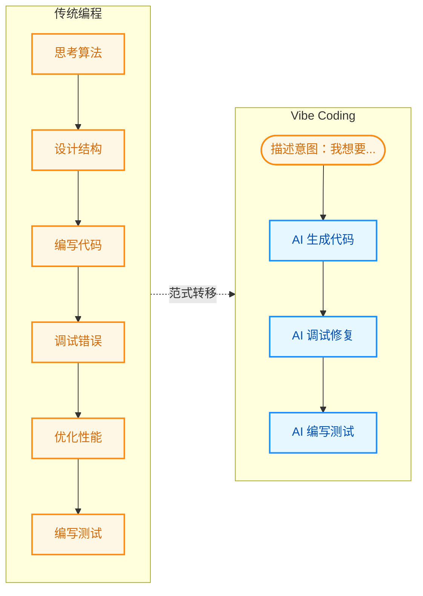
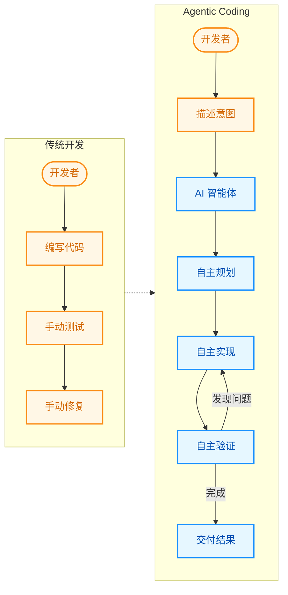
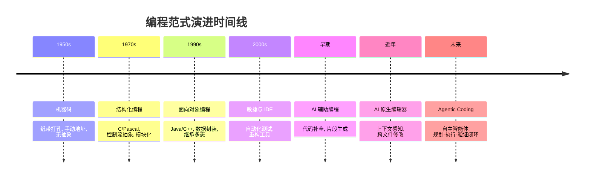
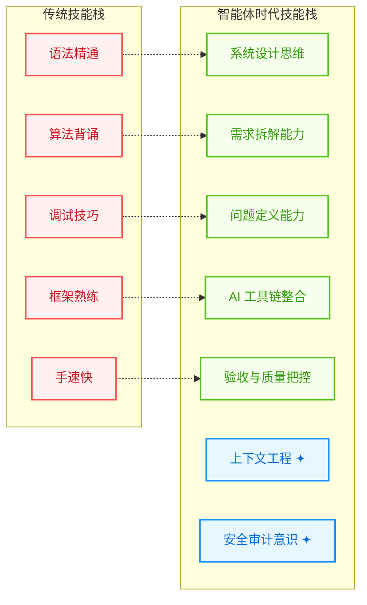
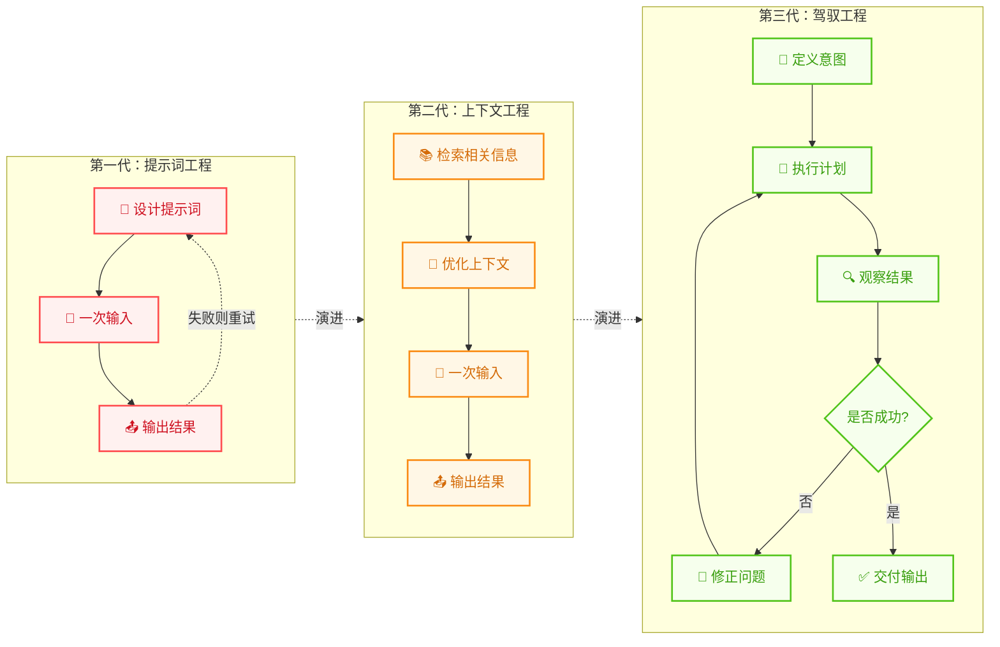

## 10.1 编程范式转移

软件开发正在经历一场由智能体驱动的范式转变。工具的角色从“代码补全”演进到“端到端交付的协作者”，开发者也从“写代码的人”逐步转型为“编排 AI 的人”。

### 10.1.1 什么是 Vibe Coding

**Vibe Coding** 用来描述一种“以自然语言驱动、快速迭代”的编程风格：

> 完全沉浸在“氛围”中，拥抱快速迭代，暂时忘掉代码细节。

#### 10.1.1.1 核心理念

下图对比了传统编程与 Vibe Coding 的区别：


```mermaid
flowchart LR
    %% Style Definitions
    classDef user fill:#fff7e6,stroke:#fa8c16,stroke-width:2px,color:#d46b08;
    classDef agent fill:#e6f7ff,stroke:#1890ff,stroke-width:2px,color:#0050b3;

    subgraph Traditional ["传统编程"]
        direction TB
        T1[思考算法] --> T2[设计结构]
        T2 --> T3[编写代码]
        T3 --> T4[调试错误]
        T4 --> T5[优化性能]
        T5 --> T6[编写测试]
    end

    subgraph Vibe ["Vibe Coding"]
        direction TB
        V1(["描述意图：我想要..."])
        V1 --> V3[AI 生成代码]
        V3 --> V4[AI 调试修复]
        V4 --> V5[AI 编写测试]
    end

    Traditional -."范式转移".-> Vibe

    %% Apply Styles
    class T1,T2,T3,T4,T5,T6 user;
    class V1 user;
    class V3,V4,V5 agent;
```

#### 10.1.1.2 Vibe Coding 的特点

| 特点 | 描述 | 典型场景 |
|------|------|---------|
| 自然语言驱动 | 用口语化的方式描述需求 | “帮我写一个登录页面” |
| 快速原型 | 分钟级别生成可运行代码 | 黑客马拉松、概念验证 |
| 迭代对话 | 通过对话不断调整优化 | “把按钮改成蓝色” |
| 低门槛 | 非程序员也能“编程” | 产品经理生成原型 |

#### 10.1.1.3 Vibe Coding 的局限

尽管 Vibe Coding 降低了编程门槛，但它也存在明显的局限性：

1. **技术债务累积**：AI 生成的代码可能包含隐藏的设计缺陷
2. **调试困难**：当 AI 生成的代码出错时，不理解代码的用户难以定位问题
3. **安全风险**：未经审查的 AI 代码可能包含安全漏洞
4. **幻觉污染**：AI 可能编造不存在的 API 或逻辑，导致难以排查的隐蔽 Bug
5. **可维护性差**：缺乏系统设计的代码难以长期维护

> **警告**：
> **Vibe Coding 的生产边界 (The Production Boundary)**：
> Vibe Coding 极其适合黑客马拉松、概念验证 (PoC) 或个人玩具项目，但 **绝不能以此方式将未经严谨审查的代码直接推向生产环境**。一旦进入到需要考虑高可用、安全审查与性能调优的深水区，开发者必须切换回系统化的 Agentic Coding 或传统工程控制流，并对生成的每一行逻辑负责。

### 10.1.2 什么是 Agentic Coding

**Agentic Coding** 是 Vibe Coding 的进化版：AI 不仅仅生成代码，而是作为一个自主智能体，通过”执行-观察-修正”的反馈闭环，能够：

1. **理解**：深度分析整个代码库的结构和上下文
2. **规划**：制定实现方案并分解为可执行任务
3. **执行**：自主编写、修改、重构代码
4. **验证**：运行测试、分析错误、修复 Bug
5. **迭代**：根据反馈自我改进

> **详细机制**：这个反馈闭环的完整内部机制——思考→行动→观察的三个阶段、循环何时终止、并发控制等实现细节，详见[第 10.2 节](10.2_loop.md)。


```mermaid
flowchart LR
    %% Style Definitions
    classDef user fill:#fff7e6,stroke:#fa8c16,stroke-width:2px,color:#d46b08;
    classDef agent fill:#e6f7ff,stroke:#1890ff,stroke-width:2px,color:#0050b3;

    subgraph A_Traditional["传统开发"]
        direction TB
        Dev(["开发者"]) --> Code["编写代码"]
        Code --> Test["手动测试"]
        Test --> Fix["手动修复"]
    end

    subgraph B_Agentic["Agentic Coding"]
        direction TB
        User(["开发者"]) --> Intent["描述意图"]
        Intent --> Agent["AI 智能体"]
        Agent --> Plan["自主规划"]
        Plan --> Impl["自主实现"]
        Impl --> Verify["自主验证"]
        Verify --> |"发现问题"| Impl
        Verify --> |"完成"| Result["交付结果"]
    end

    %% 演进路径
    A_Traditional -.-> B_Agentic

    %% Apply Styles
    class Dev,Code,Test,Fix user;
    class User,Intent user;
    class Agent,Plan,Impl,Verify,Result agent;
```

图 10-1：传统开发与 Agentic Coding 的工作流演进对比

#### 10.1.2.1 Agentic Coding 的关键特征

| 特征 | Vibe Coding | Agentic Coding |
|------|-------------|----------------|
| **代码库理解** | 单文件/片段 | 全项目索引 |
| **任务分解** | 用户手动分解 | 智能体自主分解 |
| **错误修复** | 用户描述问题 | 智能体自主发现和修复 |
| **测试** | 用户请求生成 | 智能体主动验证 |
| **上下文管理** | 用户手动提供 | 智能体动态检索 |
| **多文件操作** | 逐文件进行 | 跨文件协调 |

#### 10.1.2.2 真实案例：API 迁移任务

假设需要将一个 Flask API 迁移到 FastAPI：

**Vibe Coding 方式**：
```text
用户：帮我把这个 Flask 路由改成 FastAPI
AI：[生成一个文件的代码]
用户：还有这个文件...
AI：[生成另一个文件]
用户：依赖也要改...
AI：[生成 requirements.txt]
（重复多次，容易遗漏）
```

**Agentic Coding 方式**：
```text
用户：帮我把这个项目从 Flask 迁移到 FastAPI

智能体：
[1] 分析项目结构... 发现 12 个路由文件，3 个中间件
[2] 制定迁移计划：
    - 更新依赖
    - 迁移路由定义
    - 转换中间件
    - 更新测试
    - 验证功能
[3] 执行迁移...
[4] 运行测试... 发现 2 个失败
[5] 修复问题...
[6] 所有测试通过，迁移完成

生成变更摘要：修改 15 个文件，新增 3 个文件
```

### 10.1.3 编程范式演进历程

编程范式随着抽象层级的提升不断演进，先后经历了机器码、结构化编程、面向对象编程、敏捷与 IDE、AI 辅助编程、AI 原生编辑器、Agentic Coding 等阶段。


```mermaid
timeline
    title 编程范式演进时间线
    1950s : 机器码
          : 纸带打孔, 手动地址, 无抽象
    1970s : 结构化编程
          : C/Pascal, 控制流抽象, 模块化
    1990s : 面向对象编程
          : Java/C++, 数据封装, 继承多态
    2000s : 敏捷与 IDE
          : 自动化测试, 重构工具
    早期 : AI 辅助编程
          : 代码补全, 片段生成
    近年 : AI 原生编辑器
          : 上下文感知, 跨文件修改
    未来 : Agentic Coding
          : 自主智能体, 规划-执行-验证闭环
```

图 10-2：编程范式演进时间线

这一演进的底层驱动力——模型推理能力提升、标准化交互协议与记忆扩展——已在[第 1.1 节](../01_paradigm/1.1_shift.md#为什么现在爆发)中详细论述。从编程视角看，这些驱动力具体映射为：

1. **模型能力进步**：更强的代码理解、规划与生成能力（对应 1.1 节”推理能力的临界点”）。
2. **工具使用能力**：模型能调用 shell、编辑器、测试框架等工具形成闭环（对应 1.1 节”标准化的交互协议”）。
3. **工程化基础设施**：可观测性、权限控制、沙箱与评测体系逐步成熟。
4. **标准化与可移植性**：工具描述、上下文传递、轨迹事件等逐步走向标准化。

#### 10.1.3.1 个体层面的能力迁移

在个人层面，Agentic Coding 要求开发者把注意力从”语法与 API 细节”迁移到”目标表达与验证闭环”：

- 把需求拆解为可验收的子任务与检查点
- 用最小上下文驱动智能体工作，并能快速定位缺失信息
- 以测试、运行与审查清单作为质量护栏，而不是依赖一次性生成

#### 10.1.3.2 组织级演进与效能陷阱

在企业级落地过程中，单纯推广 AI 编程工具往往会遭遇 **”AI 提效陷阱”**——这与[第 1.1.6 节](../01_paradigm/1.1_shift.md#116-核心演进总结)中”从点状提效到系统性提效”的趋势一脉相承：

> **用 AI 开发工具 ≠ 个人提效 ≠ 组织提效**。实践中常见的现象是：个人编码环节变快了，但如果需求澄清、评审、测试、发布与治理不升级，组织整体交付速度不一定同步提升。

关于智能体研发成熟度模型的三个等级（L1 辅助 → L2 协同 → L3 自主），已在[术语表](../12_appendix/12.1_glossary.md)中的 “Agentic Development Maturity Model” 条目给出定义。下面从编程实践角度补充各等级的具体协作方式：

| 等级 | 模式 | 编程协作方式 | 典型工具形态 |
| :--- | :--- | :--- | :--- |
| **L1**|**AI 辅助** | AI 在编码环节提供片段补全，开发流程基本不变 | GitHub Copilot 式内联补全 |
| **L2**|**AI 协同** | AI 参与设计/编码/测试多环节，人负责审查与集成 | Cursor、Windsurf 等 AI 原生编辑器 |
| **L3**|**AI 自主** | 人定义需求与验收标准，AI 端到端推进交付 | Claude Code、Codex 等终端智能体 |

这一演进路径说明：真正的增益来自”流程 + 治理”的升级，而不只是”更强的代码生成”。关于安全控制从”Prompt 约束”到”独立策略引擎”的演进，参见[第 1.1.6 节](../01_paradigm/1.1_shift.md#116-核心演进总结)。

### 10.1.4 范式溯源：从“文学编程”到 Agentic Coding

如果寻找 Agentic Coding 这种 **“自然语言优先 (Natural Language First)”** 的开发方式，其思想渊源可以追溯到 1984 年。

当年，著名计算机科学家、图灵奖得主 **高德纳（Donald Knuth）** 提出了 **“文学编程”（Literate Programming）** 的概念。他在同名论文中写道：

> “让我们改变编写程序的态度，不要把主要精力放在指导计算机做什么，而是放在向人类解释我们要让计算机做什么。”

在文学编程范式下，程序员并不直接编写供编译器阅读的源代码，而是编写一篇包含代码片段的“文章（Document）”。这篇文章主要用自然语言解释代码的逻辑、设计意图和数据结构。随后，通过两种工具处理这篇文章：
- **Weave（编排）**：将文档渲染为适合人类阅读的精美排版（如 TeX）。
- **Tangle（编织）**：将文档中的代码片段提取、重组为供机器编译的源代码。

#### 10.1.4.1 AI 时代的复兴与超越

尽管思想超前，但受限于当时的工具链和人类在两个上下文间切换的认知负担，文学编程一直属于相对小众的极客实践。

然而在 40 年后大语言模型（LLM）的催化下，这一理念在 Agentic Coding 乃至 Vibe Coding 中迎来了真正意义上的复兴与超越：

1. **缺失的“Tangle”工具被补齐**：在过去，Tangle 只是简单的文本提取拼接工具，程序员仍需逐行编写出精确的代码片段。而在智能体时代，最强大的 Tangle 工具正是 LLM 本身。
2. **意图驱动生成**：如今，开发者所维护的系统设计文档、API 规约、需求拆解 Markdown 与项目说明文件（Rules），本质上就是一篇篇的“文学编程”文档。开发者只需用自然语言解释好“我们要让计算机做什么”，Agent 就能自动将其转化为可执行代码。
3. **从解释代码到生成代码**：高德纳的初衷是用自然语言解释代码以利于人类维护；而在当下的范式中，自然语言本身已经成为了最高级的编程语言。

Agentic Coding 本质上就是高度自动化闭环时代的 **终极文学编程**。

### 10.1.5 开发者角色的转变

#### 10.1.5.1 从“写代码”到“编排 AI”

随着编程范式的转移，开发者的角色也发生了根本性的变化。下面从技能栈的转变、新型开发者画像以及职业发展三个方面进行探讨。


```mermaid
graph LR
    %% Style Definitions
    classDef old fill:#fff1f0,stroke:#ff4d4f,stroke-width:2px,color:#cf1322;
    classDef new fill:#f6ffed,stroke:#52c41a,stroke-width:2px,color:#389e0d;
    classDef emerging fill:#e6f7ff,stroke:#1890ff,stroke-width:2px,color:#096dd9;

    subgraph Traditional [传统技能栈]
        direction TB
        S1[语法精通]
        S2[算法背诵]
        S3[调试技巧]
        S4[框架熟练]
        S5[手速快]
    end

    subgraph Agentic [智能体时代技能栈]
        direction TB
        N1[系统设计思维]
        N2[需求拆解能力]
        N3[问题定义能力]
        N4[AI 工具链整合]
        N5[验收与质量把控]
        N6[上下文工程 ✦]
        N7[安全审计意识 ✦]
    end

    S1 -.-> N1
    S2 -.-> N2
    S3 -.-> N3
    S4 -.-> N4
    S5 -.-> N5

    %% Apply Styles
    class S1,S2,S3,S4,S5 old;
    class N1,N2,N3,N4,N5 new;
    class N6,N7 emerging;
```

图 10-3：开发者技能栈的转变

#### 10.1.5.2 新型开发者画像

| 能力维度 | 传统开发者 | 智能体时代开发者 |
|---------|-----------|----------------|
| 核心竞争力 | 编码速度和技巧 | 问题定义和系统思维 |
| 日常工作 | 写代码、调试 | 需求拆解、审查 AI 输出 |
| 学习重点 | 新框架、新语言 | 提示词工程、上下文工程 |
| 质量保证 | 代码审查、单元测试 | AI 输出验证、护栏设计 |
| 团队协作 | 人-人协作 | 人-AI-人协作 |

#### 10.1.5.3 职业发展影响

> **重要**：
> **智能体编程不会取代开发者，而是改变开发者的工作方式。**
> 重复性编码工作将被自动化，但以下能力将更加重要：
> - 理解业务需求并转化为技术方案
> - 设计可维护、可扩展的系统架构
> - 审查 AI 生成代码的质量和安全性
> - 处理 AI 无法解决的复杂边缘情况

### 10.1.6 三代范式演进：从提示词到驾驭工程

#### 10.1.6.1 三代范式的定义与演进

自 2023 年以来，在如何有效驱动大语言模型方面，工程实践经历了三个递进的范式演变。它们分别关注"我们说什么"、"模型看见什么"和"整个系统怎么运转"：

**提示词工程（Prompt Engineering）**

关注：*"我对模型说什么"*

这是最初的范式。开发者通过精心设计提示词、调整 temperature 和 top-k 等参数，试图在一次请求中获得完美输出。这本质上是一种 **开环控制** 思路——把指令塞进去，期待模型一次做对。

| 特点 | 描述 |
|------|------|
| 控制方式 | 开环（输入→输出） |
| 关键技术 | 思维链、少样本提示、角色扮演 |
| 失败模式 | 随机失败、无纠错机制 |
| 应用范围 | 单步任务、结构化输出 |

**上下文工程（Context Engineering）**

关注：*"模型此刻看见什么"*

随着应用复杂化，开发者发现输出质量往往受限于"模型能看见什么"。上下文工程通过 RAG（检索增强生成）、记忆管理、上下文压缩等动态策划信息环境，让模型在最优信息基础上做决策。这是一种 **改进的输入**，但仍缺少 **纠错机制**。详见[第 3.6 节](../03_memory/3.6_context_engineering.md)。

| 特点 | 描述 |
|------|------|
| 控制方式 | 开环（优化的输入→输出） |
| 关键技术 | RAG、向量检索、信息检索、记忆蒸馏 |
| 改进点 | 提高信噪比、减少幻觉 |
| 局限 | 仍无反馈修正能力 |

**驾驭工程（Harness Engineering）**

关注：*"整个系统如何运转"*

真正的突破来自将智能体嵌入完整的 **闭环控制系统**。驾驭工程不只关注提示词或信息，而是设计包裹在模型外围的整套运行环境架构——**沙箱、反馈回路、权限治理、状态管理、可观测性、断路器**。这使得智能体能够自动发现错误、修正错误并根据反馈调整策略。

核心洞察是：***智能在模型里，可靠性在 Harness 里。***LLM 的能力强大但不确定，Harness 将这种不确定性转化为可控的风险——允许系统犯错、发现错、修正错。与"人在回路中"的逐件审批不同，驾驭工程倡导"人在回路之上"：人负责 **设计规则和环境**，AI 自主运行并在遇到例外情况才需人工介入。

驾驭系统的详细架构与实现见[第 10.2.5 节](10.2_loop.md#1025-智能体驾驭系统)。

下图展示了三代范式的演进：


```mermaid
flowchart LR
    %% Style Definitions
    classDef gen1 fill:#fff1f0,stroke:#ff4d4f,stroke-width:2px,color:#cf1322;
    classDef gen2 fill:#fff7e6,stroke:#fa8c16,stroke-width:2px,color:#d46b08;
    classDef gen3 fill:#f6ffed,stroke:#52c41a,stroke-width:2px,color:#389e0d;

    subgraph Gen1 ["第一代：提示词工程"]
        direction TB
        P1["🎯 设计提示词"] --> P2["🔄 一次输入"]
        P2 --> P3["📤 输出结果"]
        P3 -.->|"失败则重试"| P1
    end

    subgraph Gen2 ["第二代：上下文工程"]
        direction TB
        C1["📚 检索相关信息"] --> C2["🧠 优化上下文"]
        C2 --> C3["🔄 一次输入"]
        C3 --> C4["📤 输出结果"]
    end

    subgraph Gen3 ["第三代：驾驭工程"]
        direction TB
        H1["🎯 定义意图"] --> H2["🏃 执行计划"]
        H2 --> H3["🔍 观察结果"]
        H3 --> H4{是否成功?}
        H4 -->|"否"| H5["🔧 修正问题"]
        H5 --> H2
        H4 -->|"是"| H6["✅ 交付输出"]
    end

    Gen1 -.->|"演进"| Gen2
    Gen2 -.->|"演进"| Gen3

    %% Apply Styles
    class P1,P2,P3 gen1;
    class C1,C2,C3,C4 gen2;
    class H1,H2,H3,H4,H5,H6 gen3;
```

图 10-4：三代范式的演进路径

#### 10.1.6.2 控制论的复兴

驾驭工程的理论基础来自控制论（Cybernetics），这门学科由约翰·冯·诺依曼与 **诺伯特·维纳（Norbert Wiener）** 在 1948 年著作《控制论》中正式奠基。维纳的核心洞察是：通过 **误差反馈**——监测系统状态与目标的偏差，据此调整控制参数，周而复始使偏差趋近于零——可以构建可靠的控制系统。

这个原理早已渗透现代工程的每个角落（TCP 拥塞控制、Kubernetes 自动扩缩容、智能手机自动亮度等），但 LLM 是人类构建的最大的 **非线性黑盒系统**，让控制论迎来了最严苛的试验场。同一提示词在不同时刻可能产生完全不同的结果，微小的幻觉在多步推理中被指数放大。因此，没有闭环反馈机制的智能体如同"没有陀螺仪的火箭"。

关于可观测性与反馈回路的详细工程实现，参见[第 9.2 节](../09_agentops/9.2_observability.md)；关于故障韧性与断路器设计，参见[第 9.5 节](../09_agentops/9.5_failures.md)；关于上下文工程的详细策略，参见[第 3.6 节](../03_memory/3.6_context_engineering.md)。

### 10.1.7 Agentic Coding 的工程挑战

尽管前景广阔，Agentic Coding 在工程实践中仍面临挑战：

#### 10.1.7.1 确定性与可重复性

智能体的行为具有一定的随机性，同样的输入可能产生不同的输出。

**应对策略**：
- 使用低温度（temperature）参数
- 建立测试套件验证输出
- 版本控制智能体配置

#### 10.1.7.2 上下文管理

大型代码库可能超出上下文窗口限制。

**应对策略**：
- 动态上下文检索
- 代码库索引和语义搜索
- 分层上下文注入

#### 10.1.7.3 安全性

智能体可能执行危险操作或生成不安全代码。

**应对策略**：
- 沙箱执行环境
- 敏感操作审批机制
- 代码安全扫描

#### 10.1.7.4 调试困难

当智能体的输出不符合预期时，很难追踪问题根源。

**应对策略**：
- 详细的执行日志
- 思维链可视化
- 分步执行模式

---

**下一节**: [10.2 智能体编程原理](10.2_loop.md)
