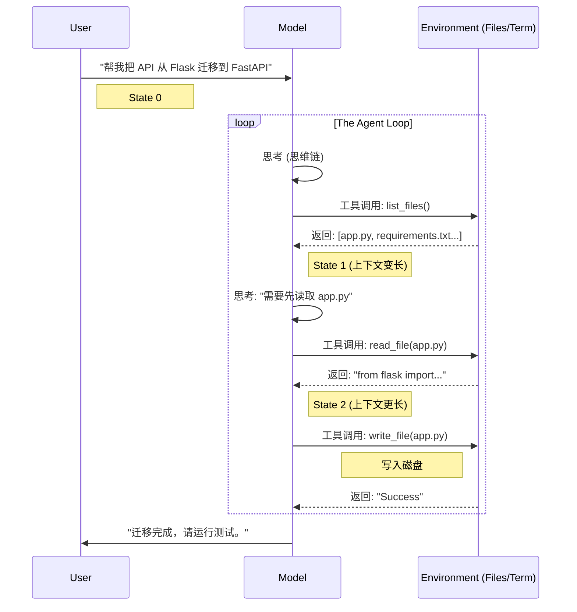
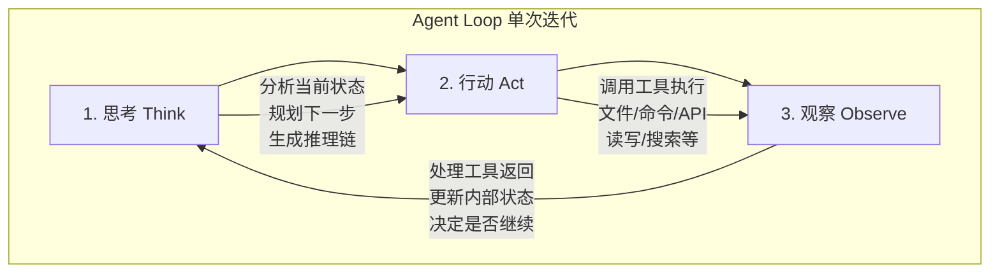
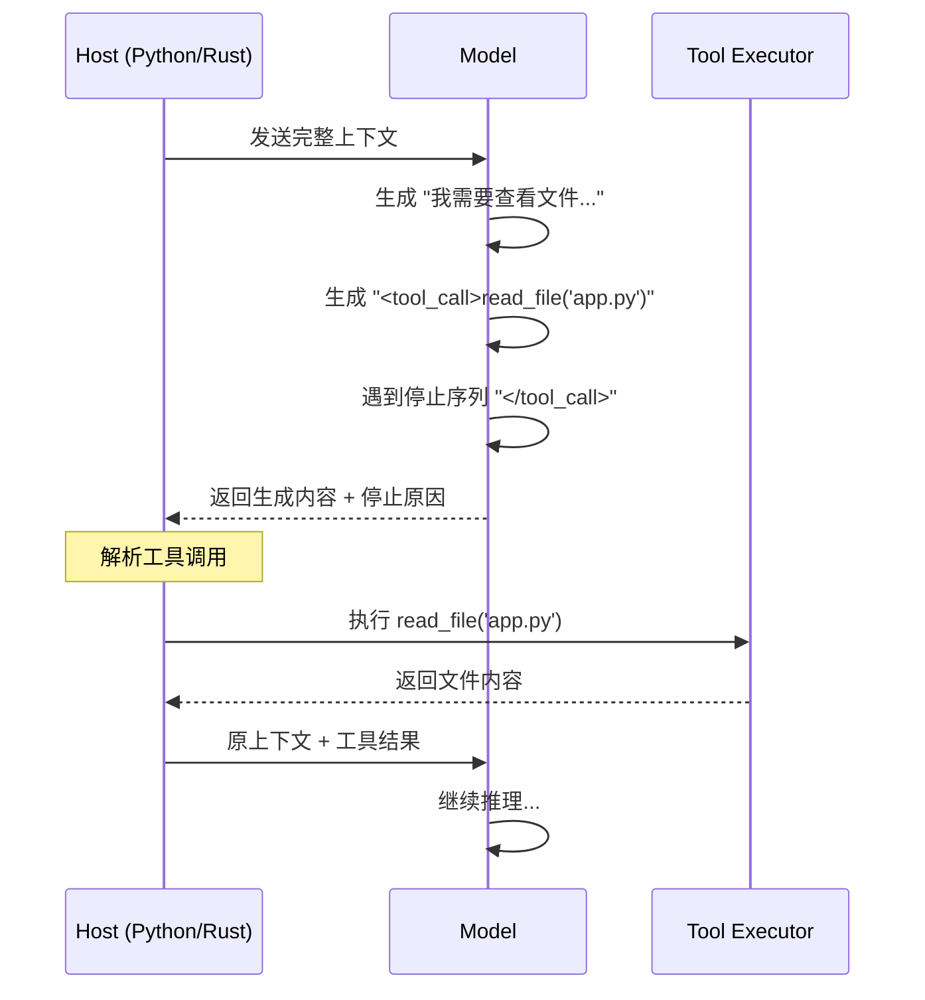
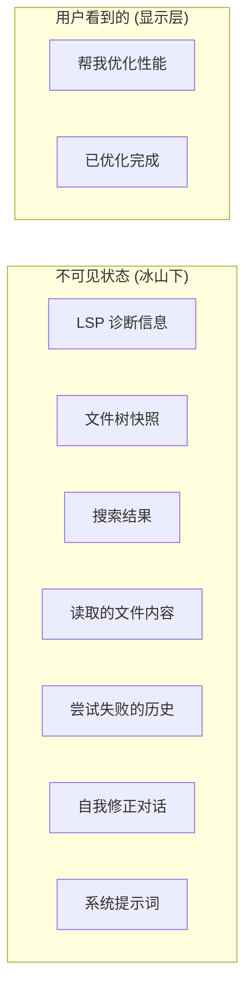
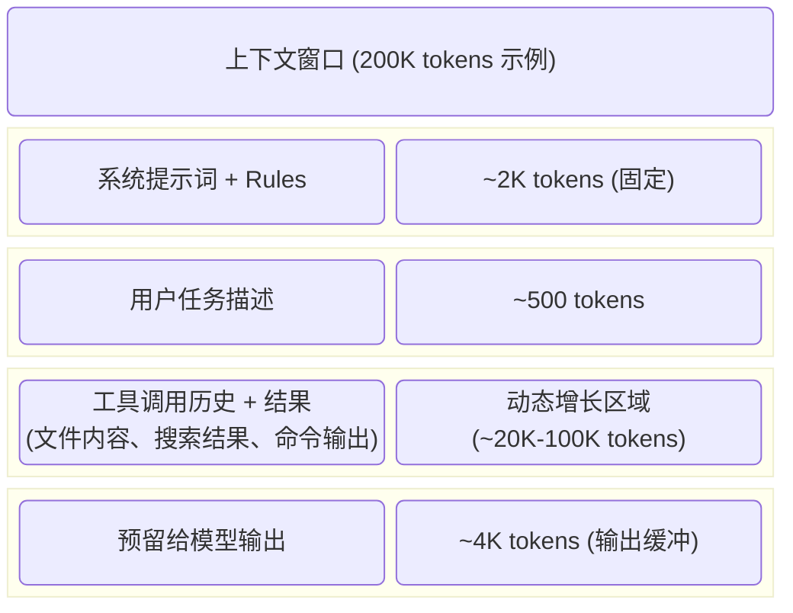
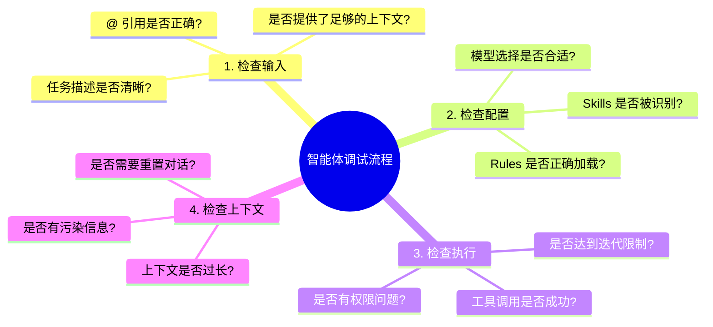

## 10.2 智能体编程原理

要真正掌握 Agentic Coding，必须打开 AI 的"黑盒"，看看它是如何工作的。本节深入解析智能体的核心工作机制，帮助你从原理层面理解智能体编程。

### 10.2.1 核心循环

智能体并不是一次性生成完整代码的神谕，而是一个 **状态机**。它的工作流程是一个被"展开"的循环：



图 10-4：智能体循环序列图


#### Agent Loop 的三个阶段

每次循环都包含以下三个阶段：



图 10-5：智能体循环的三个阶段


#### 循环何时终止？

Agent Loop 在以下情况下终止：

1. **任务完成**：智能体判断目标已达成
2. **达到最大迭代次数**：防止无限循环
3. **遇到错误**：无法恢复的错误导致终止
4. **用户中断**：用户手动停止执行
5. **Token 预算耗尽**：上下文窗口接近限制

### 10.2.2 停止序列的魔法

模型本质上是一个"文本补全机"。如果没有约束，它会在生成 `tool_call()` 后继续幻想出工具的返回结果。

智能体工作的关键在于 **停止序列（Stop Sequence）**。

#### 工作原理

具体示例如下：



图 10-6：停止序列工作原理


#### 关键机制

*   当模型生成特定的停止符（如 `\nObservation:` 或 `</tool_call>`）时，推理 **强制暂停**
*   控制权交还给 Python/Rust 宿主程序
*   宿主程序执行真正的 Shell 命令或文件读写
*   宿主将结果拼接到上下文后面，**再次调用模型**

这就是为什么有时候你会感觉到智能体"卡顿"了一下——那正是它停止生成、等待工具执行完并返回结果的时刻。

#### 不同框架的停止序列设计

| 框架/平台 | 停止序列格式 | 工具调用格式 |
|----------|------------|-------------|
| OpenAI | 内置 function calling | JSON Schema |
| Anthropic | `</tool_use>` | XML-like |
| LangChain/ReAct | `\nObservation:` | 自然语言 + JSON |
| Cursor | 内部协议 | 专有格式 |

### 10.2.3 不可见的状态

在 Chat 界面上，你只看到了"你好"和"结果"。但在冰山之下，上下文窗口里堆积了成千上万行你没看见的内容：

#### 冰山图

具体示例如下：



图 10-7：智能体不可见状态（冰山模型）


#### 隐藏状态的类型

1. **LSP 诊断信息**：你没运行代码，但智能体已在后台运行了 Linter 并看到了报错
2. **文件树快照**：智能体默默看了一眼目录结构
3. **当前打开的文件（Active Tabs）**：这是最容易被忽视的隐形杀手。IDE 往往会将你当前打开的所有文件的摘要甚至全文自动注入上下文。打开太多无关文件会让智能体"分心"。
4. **搜索结果**：智能体执行了多次代码搜索
5. **自我修正历史**：智能体可能尝试了 3 次修改失败，第 4 次才成功，但只展示了最后的结果
6. **系统提示词**：框架注入的规则和约束

#### 为什么这很重要？

理解这一点，你就会明白：

> **当智能体表现不佳时，往往不是它"笨"，而是不可见的状态（上下文）被污染了。**

**常见污染场景**：
- 早期对话中的错误假设被保留
- 无关文件的内容占用了上下文空间
- 失败尝试的堆积导致智能体"困惑"

**解决方案**：
- 重置对话（New Chat）——清空不可见噪音的最有效手段
- 使用 @ 引用精确控制上下文
- 定期检查智能体"看到了什么"

### 10.2.4 智能体驾驭系统 (Agent Harness)

根据 Cursor 团队的定义，一个完整的 **Agent Harness** 由三个核心组件构成：

```mermaid
graph TD
    subgraph Harness [Agent Harness]
        
        subgraph Instructions [1. 指令 Instructions]
            System[系统提示词]
            Rules[Rules (.cursor/)]
            Skills[Skills (动态加载)]
        end

        subgraph Tools [2. 工具 Tools]
            Edit[文件编辑]
            Search[代码搜索]
            Term[终端执行]
            Browser[浏览器]
            MCP[MCP 服务]
            Custom[自定义工具]
        end

        subgraph Messages [3. 用户消息 User Messages]
            Init[初始提示词]
            Follow[后续指令]
            Context["@ 引用上下文"]
        end

    end
```

图 10-8：智能体驾驭系统组件架构

#### 三大组件详解

Agent Harness 由指令、工具和用户消息三个核心部分组成，它们共同协作来驾驭智能体。

##### 指令

控制智能体的行为和风格：

| 类型 | 位置 | 作用 | 加载时机 |
|------|------|------|---------|
| 系统提示词 | 框架内置 | 定义基本行为 | 始终加载 |
| Rules | `.cursor/rules/` | 项目特定约定 | 始终加载 |
| Skills | 技能目录 | 领域知识 | 按需加载 |
| AGENTS.md | 项目根目录 | 项目说明 | 始终加载 |

##### 工具

赋予智能体执行能力：

```python
# 典型工具集

tools = [
    "file_read",      # 读取文件
    "file_write",     # 写入文件
    "file_search",    # 语义搜索
    "grep_search",    # 正则搜索
    "run_command",    # 终端命令
    "browser_action", # 浏览器操作
    "mcp_tool",       # MCP 服务调用
]
```

##### 用户消息

驱动智能体行动的输入：

- **初始提示词**：描述任务目标
- **后续指令**：提供反馈和调整
- **@ 引用**：精确注入上下文

#### 模型差异

不同的模型对同一套 Harness 的反应不同：

| 模型 | 指令遵循 | 工具使用 | 长期任务 |
|------|---------|---------|----------|
| Claude Sonnet 4 | 优秀 | 优秀 | 良好 |
| GPT-5.3 | 良好 | 优秀 | 良好 |
| Claude Opus 4.6 | 优秀 | 优秀 | 卓越 |
| OpenAI o3-pro | 卓越 | 优秀 | 卓越 |

> [!TIP]
> 高效的 Agentic Coding 需要学会通过 Rules 和 Skills 来调整 Harness，以适配不同模型的特点。

### 10.2.5 上下文工程与窗口管理

**上下文工程（Context Engineering）** 正在成为与提示词工程并列的核心技能。如果说提示词工程关注"如何向模型提问"，上下文工程则关注"让模型看到什么"。它涵盖了上下文的组装、过滤、压缩和动态检索，目标是在有限的窗口中放入最相关的信息，使智能体做出最优决策。

上下文窗口是智能体的"工作记忆"，管理不当会导致性能下降。

#### 上下文组成

以 200K tokens 窗口为例（实际模型可能支持更大窗口）：



图 10-9：上下文窗口组成结构


#### 上下文管理策略

| 策略 | 描述 | 适用场景 |
|------|------|---------|
| **精确引用** | 只引入必要的文件和行 | 大型代码库 |
| **摘要压缩** | 对早期对话进行摘要 | 长对话 |
| **滑动窗口** | 保留最近 N 轮 | 实时交互 |
| **分层加载** | 先索引后详情 | 复杂任务 |

#### 上下文污染的信号

当你观察到以下现象时，说明上下文可能已被污染：

- 智能体重复相同的错误
- 智能体提到了不相关的文件
- 智能体忘记了早期的约定
- 响应速度明显变慢

1. **重置对话（New Chat）**：这是清空不可见噪音的最有效手段。
2. **"上下文恢复"技巧**：很多用户不愿重置对话是因为怕丢失进度。
    > [!TIP]
    > **最佳实践**：在开启新对话前，让智能体将当前进度（Completed）、下一步计划（Next Steps）和关键决策（Key Decisions）总结到一个 `implementation_plan.md` 或 `handoff_note.md` 文件中。
    >
    > 在新对话中，只需 `@` 引用这个文件，智能体就能瞬间恢复"工作记忆"，而无需背负之前几百轮对话的垃圾信息（Token 债务）。

### 10.2.6 调试智能体行为

当智能体表现异常时，如何定位问题？

#### 调试清单

具体示例如下：



图 10-10：智能体调试流程


#### 常见问题及解决方案

| 问题 | 可能原因 | 解决方案 |
|------|---------|---------|
| 智能体不调用工具 | 任务描述不明确 | 明确说"请修改文件" |
| 智能体修改错误文件 | 上下文中有多个相似文件 | 使用 @ 精确引用 |
| 智能体重复失败尝试 | 上下文污染 | 重置对话 |
| 智能体响应变慢 | 上下文过长 | 精简引用内容 |
| 智能体忽略 Rules | Rules 格式错误 | 检查 Markdown 格式 |

### 10.2.7 小结

| 概念 | 核心要点 |
|------|---------|
| **智能体循环** | 思考→行动→观察的循环执行 |
| **停止序列** | 控制模型暂停、等待工具结果 |
| **不可见状态** | 上下文中大量用户看不到的信息 |
| **智能体驾驭系统** | 指令+工具+消息的组合 |
| **上下文管理** | 智能体工作记忆的优化 |

**关键认知**：
1. 智能体不是魔法，是可解释的状态机
2. 上下文窗口是稀缺资源，需要精心管理
3. 当智能体"笨"的时候，先检查不可见状态
4. 重置对话是最简单有效的调试手段

---

**下一节**: [主流工具详解](10.3_tools.md)
