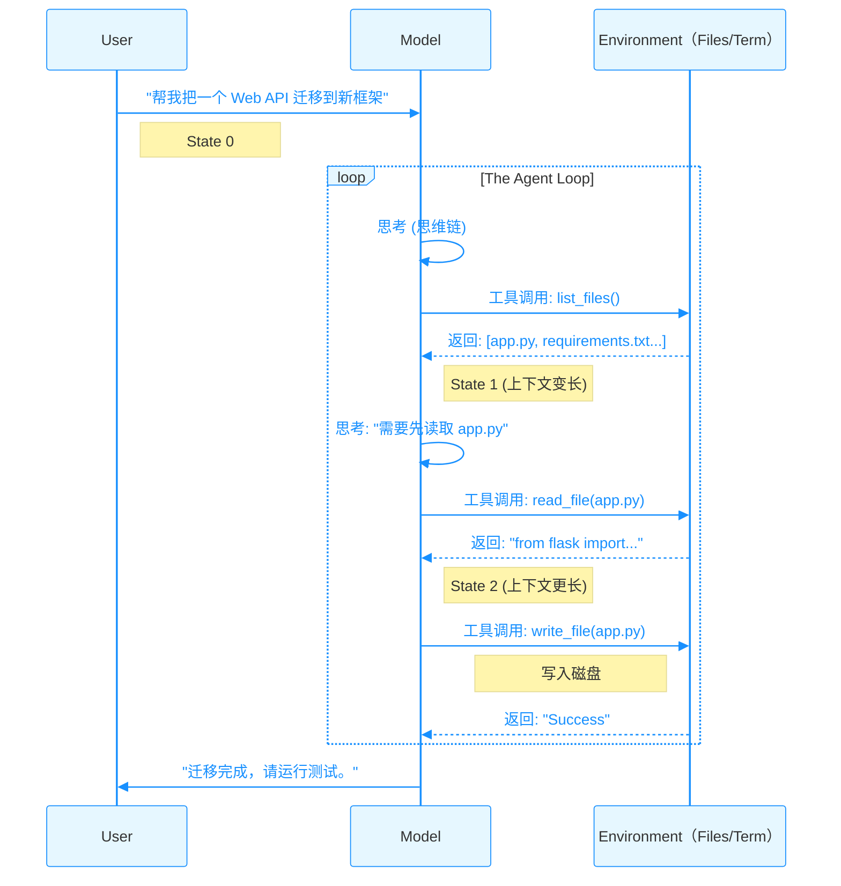
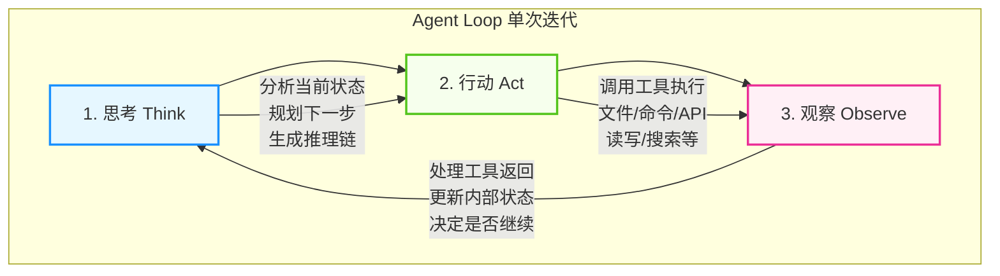
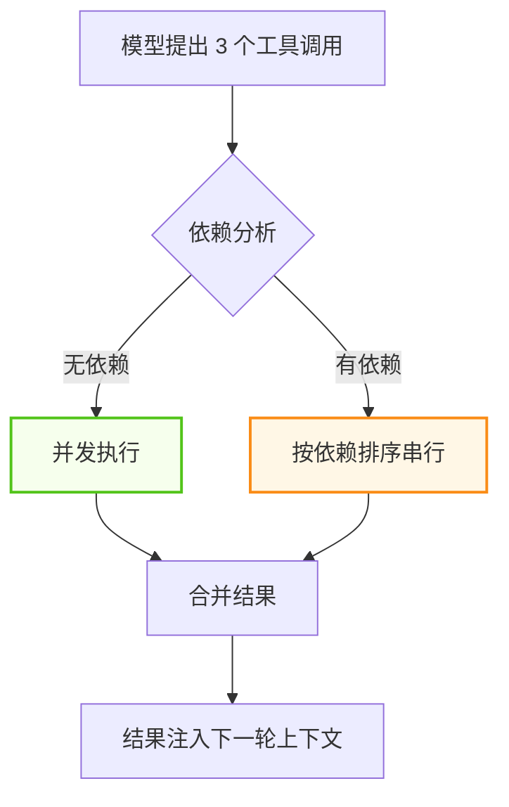
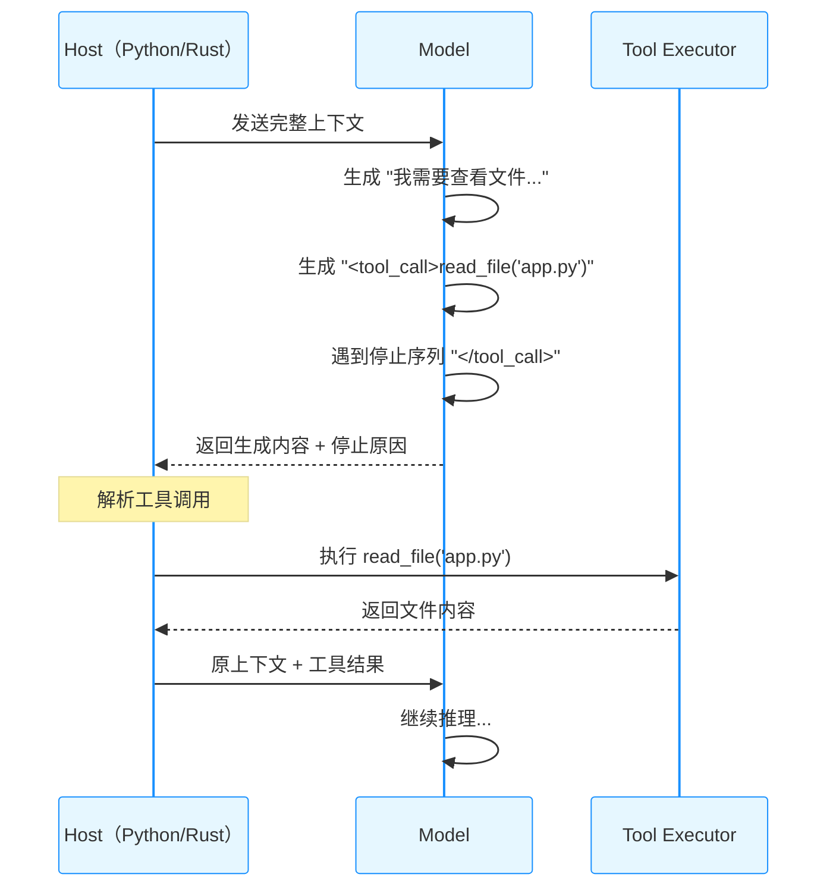
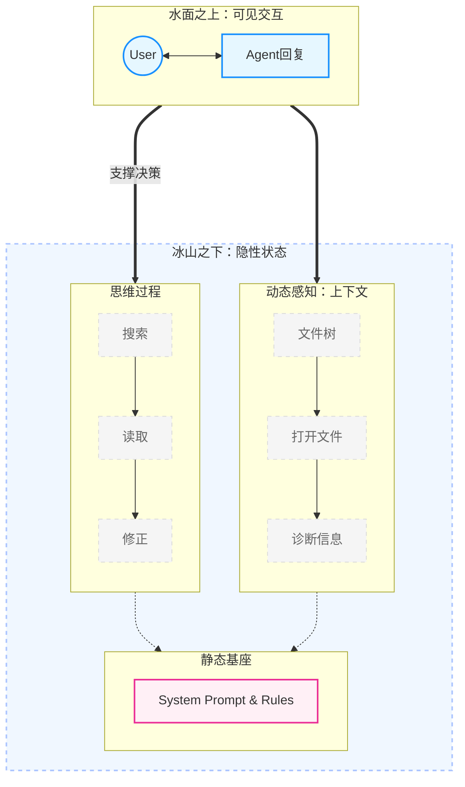
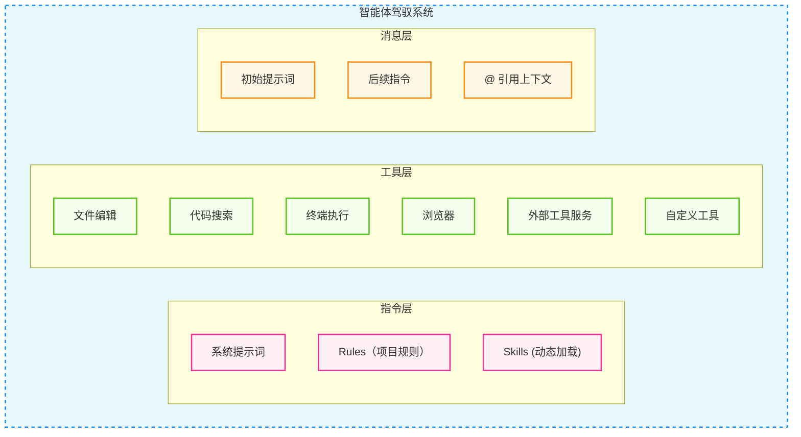
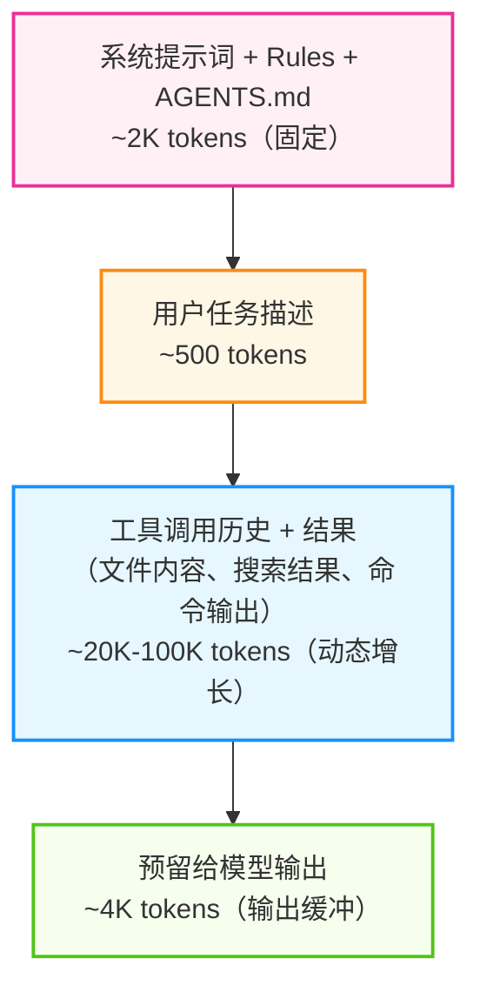
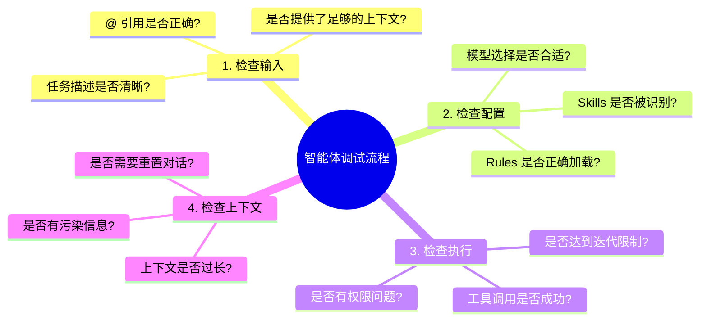

## 10.2 智能体编程原理

要真正掌握 Agentic Coding，必须打开 AI 的“黑盒”，看看它是如何工作的。本节深入解析智能体的核心工作机制，帮助你从原理层面理解智能体编程。


智能体并不是能一次性生成完整代码的魔术师，而是一个 **状态机**。它的工作流程是一个被“展开”的循环：


```mermaid
%%{init: {'theme': 'base', 'themeVariables': { 'primaryColor': '#e6f7ff', 'actorBorder': '#1890ff', 'actorBkg': '#e6f7ff', 'signalColor': '#1890ff', 'signalTextColor': '#1890ff'}}}%%
sequenceDiagram
    participant U as User
    participant M as Model
    participant E as Environment（Files/Term）

    U->>M: "帮我把一个 Web API 迁移到新框架"
    note right of U: State 0

    loop The Agent Loop
        M->>M: 思考 (思维链)
        M->>E: 工具调用: list_files()
        E-->>M: 返回: [app.py, requirements.txt...]
        note right of M: State 1 (上下文变长)

        M->>M: 思考: "需要先读取 app.py"
        M->>E: 工具调用: read_file(app.py)
        E-->>M: 返回: "from flask import..."
        note right of M: State 2 (上下文更长)

        M->>E: 工具调用: write_file(app.py)
        note left of E: 写入磁盘
        E-->>M: 返回: "Success"
    end

    M->>U: "迁移完成，请运行测试。"
```

图 10-6：智能体循环序列图

### 10.2.1 微观循环：智能体循环的三个阶段

这里说的 **Agent Loop** 是执行器内部的微观闭环，回答的是“这一轮下一步做什么”。它和后文 [10.4 节](10.4_workflow.md)讨论的任务级 workflow 不是两套互斥概念，而是嵌套关系：

- **Think → Act → Observe**：单次迭代的微观闭环
- **Gather → Action → Verify**：把多轮微观迭代折叠后的执行策略视角
- **Plan → Decompose → Execute → Review**：开发者与智能体协作的任务级工作流闭环

换句话说，workflow 包裹多个 agent loop；agent loop 则是 workflow 真正落地执行时反复转动的引擎。

#### 10.2.1.1 Think-Act-Observe：单次迭代

每次循环都包含以下三个阶段：


```mermaid
graph TD
    %% Style Definitions
    classDef step fill:#e6f7ff,stroke:#1890ff,stroke-width:2px;
    classDef action fill:#f6ffed,stroke:#52c41a,stroke-width:2px;
    classDef observe fill:#fff0f6,stroke:#eb2f96,stroke-width:2px;

    subgraph Iteration ["Agent Loop 单次迭代"]
        Think[1. 思考 Think] --> Act[2. 行动 Act]
        Act --> Observe[3. 观察 Observe]
    end

    Think -->|分析当前状态<br>规划下一步<br>生成推理链| Act
    Act -->|调用工具执行<br>文件/命令/API<br>读写/搜索等| Observe
    Observe -->|处理工具返回<br>更新内部状态<br>决定是否继续| Think

    %% Apply Styles
    class Think step;
    class Act action;
    class Observe observe;
```

图 10-7：智能体循环的三个阶段

#### 10.2.1.2 Gather-Action-Verify：执行阶段的中观视角

前面的 **Think → Act → Observe** 描述了单次迭代内的微观流程：模型如何思考、执行和接收反馈。而从更宏观的工程视角看，一个完整任务在执行阶段又可以抽象为 **Gather（收集） → Action（行动） → Verify（验证）**。它关注的不是某一轮循环内部发生了什么，而是多轮迭代合在一起时，这个阶段采用了哪些工程策略。

因此，Gather-Action-Verify 不是对 Think-Act-Observe 的替代，而是更粗粒度的“折叠视图”：Gather 往往对应若干轮搜索/读取 loop，Action 往往对应若干轮编辑/执行 loop，Verify 则往往对应若干轮测试/审查 loop。到 [10.4 节](10.4_workflow.md) 再往上一层，就会进入任务级的 P-D-E-R 闭环。

**Gather 阶段**（收集上下文）有四种主要策略：

1. **Agentic 搜索**：智能体像开发者一样，使用 `ls`、`grep` 等工具主动探索文件系统，动态发现所需文件而非预加载全部内容
2. **语义搜索（Semantic Search）**：通过向量化和相似度计算快速定位相关文档片段；比 agentic 搜索快但精度较低
3. **子智能体（Subagents）**：派遣专门的子智能体去并行收集信息，返回摘要结果来减轻主智能体的上下文压力
4. **上下文压缩（Compaction）**：当上下文接近窗口限制时，自动总结历史对话并重启新的上下文窗口，保持连贯性

**Action 阶段**（执行行动）支持五种主要的行动方式：

1. **工具调用（Tools）**：如文件读写、数据库查询等；是智能体最基本的行动单位
2. **Bash 命令与脚本**：通过 Shell 执行系统级操作，适合复杂的环境交互
3. **代码生成**：生成 Python、JavaScript 等代码来执行复杂的计算或数据处理任务
4. **模型上下文协议（MCP）**：标准化的集成接口，连接 Slack、GitHub、Asana 等第三方服务而无需手动编写 OAuth 流程
5. **复合行动**：在单个迭代中并发执行多个独立的工具调用，充分利用并发能力

**Verify 阶段**（验证结果）有三种常见的验证方法：

1. **规则与检查清单**：定义明确的成功标准。例如代码生成后运行 linter，或在文件写入后验证格式
2. **视觉反馈**：对 UI 生成或渲染类任务，通过截图让智能体直观确认结果是否符合预期
3. **LLM-as-Judge**：由另一个 LLM 实例来审核第一个智能体的输出，评分是否满足质量标准

#### 10.2.1.3 循环何时终止？

Agent Loop 在以下情况下终止：

1. **任务完成**：智能体判断目标已达成
2. **达到最大迭代次数**：防止无限循环
3. **遇到错误**：无法恢复的错误导致终止
4. **用户中断**：用户手动停止执行
5. **Token 预算耗尽**：上下文窗口接近限制

> **重要**：当多个终止条件同时满足时，应遵循以下优先级：
> 1. **用户中断** （最高优先级，立即停止）
> 2. **Token 预算耗尽** （防止上下文溢出）
> 3. **最大迭代次数** （防止死循环）
> 4. **无法恢复的错误** （记录状态并退出）
> 5. **任务完成** （正常终止，生成总结）

#### 10.2.1.4 从零构建：最小可运行智能体

前面几节用图和文字描述了 Agent Loop 的原理。下面用约 50 行 Python 将其落地为一个 **完整可运行的最小智能体**，帮助读者从代码层面理解循环、工具调用、停止判断和错误处理是如何协作的。

```python
import anthropic, json

# 1. 定义工具——描述越详细，模型的工具选择越准确
tools = [
    {
        "name": "read_file",
        "description": "读取本地文件系统中指定路径的文件，返回其完整文本内容。"
                       "适用于需要查看文件当前状态的场景。路径为相对或绝对路径。",
        "input_schema": {
            "type": "object",
            "properties": {"path": {"type": "string", "description": "文件路径"}},
            "required": ["path"],
        },
    },
    {
        "name": "write_file",
        "description": "将指定内容写入本地文件。如果文件已存在则覆盖，不存在则创建。"
                       "写入前请先用 read_file 确认当前内容，避免意外覆盖。",
        "input_schema": {
            "type": "object",
            "properties": {
                "path": {"type": "string", "description": "目标文件路径"},
                "content": {"type": "string", "description": "要写入的完整文件内容"},
            },
            "required": ["path", "content"],
        },
    },
]

# 2. 工具执行器：将模型的工具调用映射到真实操作
def execute_tool(name: str, args: dict) -> str:
    if name == "read_file":
        return open(args["path"]).read()
    elif name == "write_file":
        open(args["path"], "w").write(args["content"])
        return f"已写入 {args['path']}"
    return f"未知工具: {name}"

# 3. Agent Loop：核心循环
def agent_loop(task: str, max_turns: int = 10):
    client = anthropic.Anthropic()
    system = (
        "你是一个文件编辑助手。仅操作用户指定的文件，不要访问其他路径。"
        "修改文件前必须先读取当前内容，确认变更范围后再写入。"
        "如果操作失败，向用户说明原因，不要自行重试超过 2 次。"
    )
    messages = [{"role": "user", "content": task}]

    for turn in range(max_turns):
        # Think: 模型基于当前上下文生成响应
        response = client.messages.create(
            model="claude-sonnet-4-6",
            max_tokens=4096,
            system=system,
            tools=tools,
            messages=messages,
        )

        # 将模型响应追加到消息历史
        messages.append({"role": "assistant", "content": response.content})

        # 终止条件：模型不再请求工具调用
        if response.stop_reason == "end_turn":
            final = [b.text for b in response.content if b.type == "text"]
            print(f"✅ 完成: {final[0] if final else '(无文本)'}")
            return

        # Act + Observe: 模型请求了工具调用，逐一执行
        if response.stop_reason == "tool_use":
            tool_results = []
            for block in response.content:
                if block.type == "tool_use":
                    print(f"🔧 调用 {block.name}({json.dumps(block.input, ensure_ascii=False)})")
                    try:
                        result = execute_tool(block.name, block.input)
                        is_error = False
                    except Exception as e:
                        result = f"错误: {e}"
                        is_error = True
                    tool_results.append({
                        "type": "tool_result",
                        "tool_use_id": block.id,
                        "content": result,
                        "is_error": is_error,
                    })
            # 工具结果以 user 消息形式回注（tool_result 必须紧跟对应的 tool_use）
            messages.append({"role": "user", "content": tool_results})

    print("⚠️ 达到最大迭代次数，终止")

# 运行
agent_loop("读取 config.yaml，将其中的 debug: true 改为 debug: false 后写回")
```

这段代码完整实现了前述的三个阶段：**Think**（模型推理）→ **Act**（执行工具）→ **Observe**（结果回注）。几个值得注意的设计决策：

- **`stop_reason` 驱动控制流**：API 返回 `"tool_use"` 表示模型请求调用工具，返回 `"end_turn"` 表示任务完成。这是 Anthropic Messages API 的标准模式。
- **工具描述的详细度**：官方文档指出，工具描述是影响工具调用准确性的最重要因素。即使在最小示例中，也应提供清晰的使用场景和注意事项。
- **`system` 参数**：系统提示词通过 API 的顶层 `system` 参数传入（而非作为消息），用于设定智能体的角色和行为边界。
- **消息顺序**：`assistant` 消息（含 `tool_use` 块）必须紧接 `user` 消息（含对应的 `tool_result` 块），这是 API 的格式要求。
- **上下文增长**：每轮循环后 `messages` 列表都在变长——模型响应和工具结果不断追加。这就是 10.2.4 节“冰山之下”的不可见状态。
- **错误容忍**：工具执行失败时，错误信息格式化后回传给模型，并通过 `is_error: true` 标志明确告知模型这是一次失败的调用（而非正常返回），模型据此决定重试或换一种方式——这正是闭环反馈的力量。
- **护栏**：`max_turns` 防止无限循环，对应 10.2.1.3 的终止条件。

> **提示**：生产环境不会直接使用这段代码，但它展示了所有智能体框架的核心骨架。无论是 LangGraph、CrewAI 还是 Claude Code，底层都是这个“循环 + 工具调用 + 结果回注”的模式，只是在此基础上增加了并发、状态持久化、权限控制和可观测性等工程层。

### 10.2.2 并发执行与输出控制

在单步循环中，模型有时需要同时执行多个独立的操作——例如同时搜索文件、获取 API 数据和验证中间结果。现代智能体平台支持在一轮迭代中提出多个工具调用，并发执行以缩短总延迟。

#### 10.2.2.1 并发调度

当模型在一次响应中提出多个工具调用时，编排器需要判断这些调用之间是否存在依赖关系：


```mermaid
graph TD
    classDef parallel fill:#f6ffed,stroke:#52c41a,stroke-width:2px;
    classDef sequential fill:#fff7e6,stroke:#fa8c16,stroke-width:2px;

    Model["模型提出 3 个工具调用"] --> Analyzer{依赖分析}
    Analyzer -->|无依赖| Parallel["并发执行"]
    Analyzer -->|有依赖| Sequential["按依赖排序串行"]
    Parallel --> Merge["合并结果"]
    Sequential --> Merge
    Merge --> Model2["结果注入下一轮上下文"]

    class Parallel parallel;
    class Sequential sequential;
```

无依赖的调用可以通过多个容器会话并发执行，每个会话独立流式返回输出。编排器将这些输出整合为结构化的工具结果，再统一提供给模型作为上下文。

#### 10.2.2.2 输出截断策略

当工具调用涉及文件操作或数据处理时（如 `npm install` 的安装日志、大型 CSV 的查询结果），输出可能非常庞大。如果这些内容全部进入上下文窗口，会迅速消耗 Token 预算却未必提供有效信息。

解决方案是为每个工具调用设置 **输出上限**。编排器强制执行这个限制，返回被截断但保留首尾的结果：

```text
命令输出（原始 50,000 字符）：
前 1,500 字符完整保留
... [47,000 chars truncated] ...
后 1,500 字符完整保留
```

这种“保留首尾、截断中间”的策略，让模型既能看到命令的初始状态（如安装开始）又能看到最终结果（如成功/失败），而不会被中间的冗长日志淹没。

并发执行与输出截断结合在一起，使智能体循环既快速又节省上下文空间。

### 10.2.3 停止序列的魔法

模型本质上是一个“文本补全机”。如果没有约束，它会在生成 `tool_call()` 后继续幻想出工具的返回结果。

智能体工作的关键在于 **停止序列（Stop Sequence）**。

#### 10.2.3.1 工作原理


```mermaid
%%{init: {'theme': 'base', 'themeVariables': { 'primaryColor': '#e6f7ff', 'actorBorder': '#1890ff', 'actorBkg': '#e6f7ff'}}}%%
sequenceDiagram
    participant H as Host（Python/Rust）
    participant M as Model
    participant T as Tool Executor

    H->>M: 发送完整上下文
    M->>M: 生成 "我需要查看文件..."
    M->>M: 生成 "<tool_call>read_file('app.py')"
    M->>M: 遇到停止序列 "</tool_call>"
    M-->>H: 返回生成内容 + 停止原因

    Note over H: 解析工具调用
    H->>T: 执行 read_file('app.py')
    T-->>H: 返回文件内容

    H->>M: 原上下文 + 工具结果
    M->>M: 继续推理...
```

图 10-8：停止序列工作原理

#### 10.2.3.2 关键机制

*   当模型生成特定的停止符（如 `\nObservation:` 或 `</tool_call>`）时，推理 **强制暂停**
*   控制权交还给 Python/Rust 宿主程序
*   宿主程序执行真正的 Shell 命令或文件读写
*   宿主将结果拼接到上下文后面，**再次调用模型**

这就是为什么有时候你会感觉到智能体“卡顿”了一下——那正是它停止生成、等待工具执行完并返回结果的时刻。

#### 10.2.3.3 不同接口的停止序列设计

| 接口形态 | 停止序列格式 | 工具调用格式 | 典型代表 |
|----------|------------|-------------|---------|
| 函数调用接口 | 内置 function calling | JSON Schema | OpenAI / Anthropic Messages API |
| XML 标签风格 | `</tool_use>` | XML-like | 早期 Claude XML 模式 |
| 文本标记风格 | `\nObservation:` | 自然语言 + JSON | LangChain ReAct |
| 端侧工具协议 | 模型内部标记 | 专有格式 | 端侧推理引擎 |

> **注意**：现代主流 API（如 Anthropic Messages API、OpenAI Chat Completions）已将停止序列机制封装到结构化的响应中——开发者无需手动解析 XML 标签或文本标记，只需检查 `stop_reason`（Anthropic）或 `finish_reason`（OpenAI）字段即可判断模型是否请求了工具调用。10.2.1.4 的代码示例正是使用了这种封装后的接口。

### 10.2.4 不可见的状态

在 Chat 界面上，你只看到了“你好”和“结果”。但在冰山之下，上下文窗口里堆积了成千上万行你没看见的内容：

#### 10.2.4.1 冰山图


```mermaid
graph TD
    %% === 样式定义 ===
    classDef visible fill:#e6f7ff,stroke:#1890ff,stroke-width:2px;
    classDef submerged fill:#f5f5f5,stroke:#d9d9d9,stroke-width:1px,color:#666,stroke-dasharray: 5 5;
    classDef core fill:#fff0f6,stroke:#eb2f96,stroke-width:2px;
    classDef container fill:#fafafa,stroke:#ccc,stroke-width:1px;

    %% 定义一个深海背景样式
    classDef deepSea fill:#f0f7ff,stroke:#adc6ff,stroke-width:2px,stroke-dasharray: 5 5;

    %% === 水面之上 ===
    subgraph Surface ["水面之上：可见交互"]
        direction LR
        User((User)):::visible <--> Agent[Agent回复]:::visible
    end

    %% === 冰山之下 ===
    subgraph Underwater ["冰山之下：隐性状态"]
        direction TB

        %% 第一层：动态过程（左右并列）
        subgraph ProcessLayer [" "]
            direction LR
            %% 隐藏边框让布局更紧凑
            style ProcessLayer fill:none,stroke:none

            subgraph CoT ["思维过程"]
                direction TB
                Search[搜索]:::submerged --> Read[读取]:::submerged --> Failed[修正]:::submerged
            end

            subgraph Ctx ["动态感知：上下文"]
                direction TB
                Tree[文件树]:::submerged --> Tabs[打开文件]:::submerged --> LSP[诊断信息]:::submerged
            end
        end

        %% 第二层：静态约束
        subgraph Rules ["静态基座"]
            SysPrompt["System Prompt & Rules"]:::core
        end
    end

    %% === 连接关系 ===
    %% 使用 invisible line (~~~) 辅助布局，或者直接连接
    Surface ====>|支撑决策| CoT
    Surface ====> Ctx

    %% 内部逻辑关联
    CoT -.-> Rules
    Ctx -.-> Rules

    %% === 应用样式 ===
    class Underwater deepSea
```

图 10-9：智能体不可见状态：冰山模型

#### 10.2.4.2 隐藏状态的类型

1. **LSP 诊断信息**：你没运行代码，但智能体已在后台运行了 Linter 并看到了报错
2. **文件树快照**：智能体默默看了一眼目录结构
3. **当前打开的文件（Active Tabs）**：这是最容易被忽视的隐形杀手。IDE 往往会将你当前打开的所有文件的摘要甚至全文自动注入上下文。打开太多无关文件会让智能体“分心”。
4. **搜索结果**：智能体执行了多次代码搜索
5. **自我修正历史**：智能体可能尝试了 3 次修改失败，第 4 次才成功，但只展示了最后的结果
6. **系统提示词**：框架注入的规则和约束

#### 10.2.4.3 为什么这很重要？

理解这一点，你就会明白：

> **当智能体表现不佳时，往往不是它“笨”，而是不可见的状态（上下文）被污染了。**

**常见污染场景**：
- 早期对话中的错误假设被保留
- 无关文件的内容占用了上下文空间
- 失败尝试的堆积导致智能体“困惑”

**解决方案**：
- 重置对话（New Chat）——清空不可见噪音的最有效手段
- 使用 @ 引用精确控制上下文
- 定期检查智能体“看到了什么”

### 10.2.5 智能体驾驭系统

[10.1.6 节](10.1_paradigm.md#1016-三代范式演进从提示词到驾驭工程)介绍了驾驭工程（Harness Engineering）的理论基础——通过闭环控制系统让智能体自主运行并自我纠错。本节聚焦于**具体的组件实现**：在实际的智能体编程产品中，驾驭系统是如何通过消息、工具和指令三层结构落地的。

一个完整的智能体驾驭系统通常由三层核心组件构成：消息、工具和指令。


```mermaid
graph TD
    %% --- 样式定义 ---
    classDef instruction fill:#fff0f6,stroke:#eb2f96,stroke-width:2px;
    classDef tool fill:#f6ffed,stroke:#52c41a,stroke-width:2px;
    classDef msg fill:#fff7e6,stroke:#fa8c16,stroke-width:2px;
    classDef container fill:#e6f7ff,stroke:#1890ff,stroke-width:2px,stroke-dasharray: 5 5;

    %% --- 图表结构 ---

    subgraph 智能体驾驭系统

        subgraph 指令层
            System[系统提示词]
            Rules["Rules（项目规则）"]
            Skills["Skills (动态加载)"]
        end

        subgraph 工具层
            Edit[文件编辑]
            Search[代码搜索]
            Term[终端执行]
            Browser[浏览器]
            Tools["外部工具服务"]
            Custom[自定义工具]
        end

        subgraph 消息层
            Init[初始提示词]
            Follow[后续指令]
            Context["@ 引用上下文"]
        end

    end

    %% --- 应用样式 ---
    class 智能体驾驭系统 container;
    class System,Rules,Skills instruction;
    class Edit,Search,Term,Browser,Tools,Custom tool;
    class Init,Follow,Context msg;
```

图 10-10：智能体驾驭系统组件架构

**三大组件详解**

#### 10.2.5.1 用户消息

驱动智能体行动的输入：

- **初始提示词**：描述任务目标
- **后续指令**：提供反馈和调整
- **@ 引用**：精确注入上下文

#### 10.2.5.2 工具

赋予智能体执行能力。典型的编程智能体工具集包括：

| 工具 | 能力 | 说明 |
|------|------|------|
| `file_read` | 读取文件 | 查看源码、配置文件等的当前内容 |
| `file_write` / `file_edit` | 写入/编辑文件 | 创建新文件或修改已有文件 |
| `file_search` | 语义搜索 | 基于向量相似度定位相关代码片段 |
| `grep_search` | 正则搜索 | 精确匹配符号名、字符串等 |
| `run_command` | 终端命令 | 执行构建、测试、Git 等 Shell 操作 |
| `browser_action` | 浏览器操作 | 预览 UI、截图、抓取文档 |
| `tool_service` | 外部工具服务 | 通过 MCP 等协议调用第三方 API |

#### 10.2.5.3 指令

控制智能体的行为和风格：

| 类型 | 位置 | 作用 | 加载时机 |
|------|------|------|---------|
| 系统提示词 | 框架内置 | 定义基本行为 | 始终加载 |
| Rules | 项目规则目录 | 项目特定约定 | 始终加载 |
| Skills | 技能目录 | 领域知识 | 按需加载 |
| 项目说明文件 | 项目根目录 | 约定与说明 | 始终加载 |

#### 10.2.5.4 模型差异

不同模型对同一套驾驭机制的反应可能不同，例如指令遵循、工具调用鲁棒性、长任务稳定性等。实践中应通过小规模评测与回归测试来选择模型组合。

> **提示**：高效的 Agentic Coding 需要学会通过 Rules 和 Skills 来调整驾驭机制，以适配不同模型的特点。

### 10.2.6 编程场景下的上下文管理

上下文工程的通用原理——持久化、筛选、压缩、隔离——已在[第 3.6 节](../03_memory/3.6_context_engineering.md)中详细讨论。本节聚焦于 **编程场景下的特殊挑战**：代码库的上下文远比普通对话复杂，文件数量多、依赖关系深、中间产物（编译日志、测试输出）体量大。

#### 10.2.6.1 编程上下文的组成

与一般对话不同，编程智能体的上下文窗口有独特的组成结构：


```mermaid
graph TD
    classDef fixed fill:#fff0f6,stroke:#eb2f96,stroke-width:2px;
    classDef user fill:#fff7e6,stroke:#fa8c16,stroke-width:2px;
    classDef dynamic fill:#e6f7ff,stroke:#1890ff,stroke-width:2px;
    classDef output fill:#f6ffed,stroke:#52c41a,stroke-width:2px;

    A[系统提示词 + Rules + AGENTS.md<br/>~2K tokens（固定）] --> B
    B[用户任务描述<br/>~500 tokens] --> C
    C[工具调用历史 + 结果<br/>（文件内容、搜索结果、命令输出）<br/>~20K-100K tokens（动态增长）] --> D
    D[预留给模型输出<br/>~4K tokens（输出缓冲）]

    class A fixed;
    class B user;
    class C dynamic;
    class D output;
```

图 10-11：上下文窗口组成结构

其中“动态增长区域”是编程场景的最大变量——一次 `grep` 搜索可能返回数千行匹配，一次 `npm install` 日志可能占用数万 Token。10.2.2 节讨论的输出截断策略正是为了控制这部分增长。

#### 10.2.6.2 编程场景的四个特有陷阱

| 陷阱 | 表现 | 应对 |
|------|------|------|
| **IDE 隐式注入** | 编辑器将所有打开文件的摘要自动注入上下文，无关文件占用大量空间 | 关闭无关标签页，只保留当前任务相关文件 |
| **失败尝试堆积** | 智能体连续 3 次修改失败，失败代码和报错信息全部留在上下文中 | 及时重置对话（New Chat），用 `@` 引用只保留成功路径 |
| **大型工具输出** | 编译日志、测试报告、搜索结果等体量巨大 | 依赖编排器的输出截断（保留首尾，截断中间） |
| **跨文件依赖链** | 修改 A 文件需要理解 B、C、D 的接口，上下文迅速膨胀 | 用类型定义和接口文件代替完整源码，优先注入 `.d.ts`、`__init__.py` 等摘要性文件 |

#### 10.2.6.3 上下文恢复技巧

当上下文被污染（智能体重复犯错、提到无关文件、忘记约定、响应变慢）时，**重置对话是最有效的手段**。但很多开发者不愿重置，因为怕丢失进度。

解决方案是 **“交接文档”模式**：在重置前，将当前进度总结到一个文件中：

```markdown
<!-- handoff_note.md -->
## 已完成
- 用户认证模块迁移完成（src/auth/）
- 数据库 Schema 已更新

## 下一步
- 迁移支付模块（src/payment/）
- 关键决策：使用 Stripe SDK v3，不用 v2

## 注意事项
- payment_service.py 第 45 行有一个已知的竞态条件，暂不处理
```

在新对话中只需 `@handoff_note.md`，智能体即可恢复”工作记忆”，而不必背负之前几百轮对话的 Token 债务。

### 10.2.7 智能体调试与问题定位

当智能体表现异常时，如何定位问题？

#### 10.2.7.1 调试清单


```mermaid
mindmap
    root((智能体调试流程))
        1. 检查输入
            任务描述是否清晰?
            是否提供了足够的上下文?
            @ 引用是否正确?
        2. 检查配置
            Rules 是否正确加载?
            Skills 是否被识别?
            模型选择是否合适?
        3. 检查执行
            工具调用是否成功?
            是否有权限问题?
            是否达到迭代限制?
        4. 检查上下文
            上下文是否过长?
            是否有污染信息?
            是否需要重置对话?
```

图 10-12：智能体调试流程

#### 10.2.7.2 常见问题及解决方案

| 问题 | 可能原因 | 解决方案 |
|------|---------|---------|
| 智能体不调用工具 | 任务描述不明确 | 明确说“请修改文件” |
| 智能体修改错误文件 | 上下文中有多个相似文件 | 使用 @ 精确引用 |
| 智能体重复失败尝试 | 上下文污染 | 重置对话 |
| 智能体响应变慢 | 上下文过长 | 精简引用内容 |
| 智能体忽略 Rules | Rules 格式错误 | 检查 Markdown 格式 |

---

**下一节**: [10.3 常见工具](10.3_tools.md)
