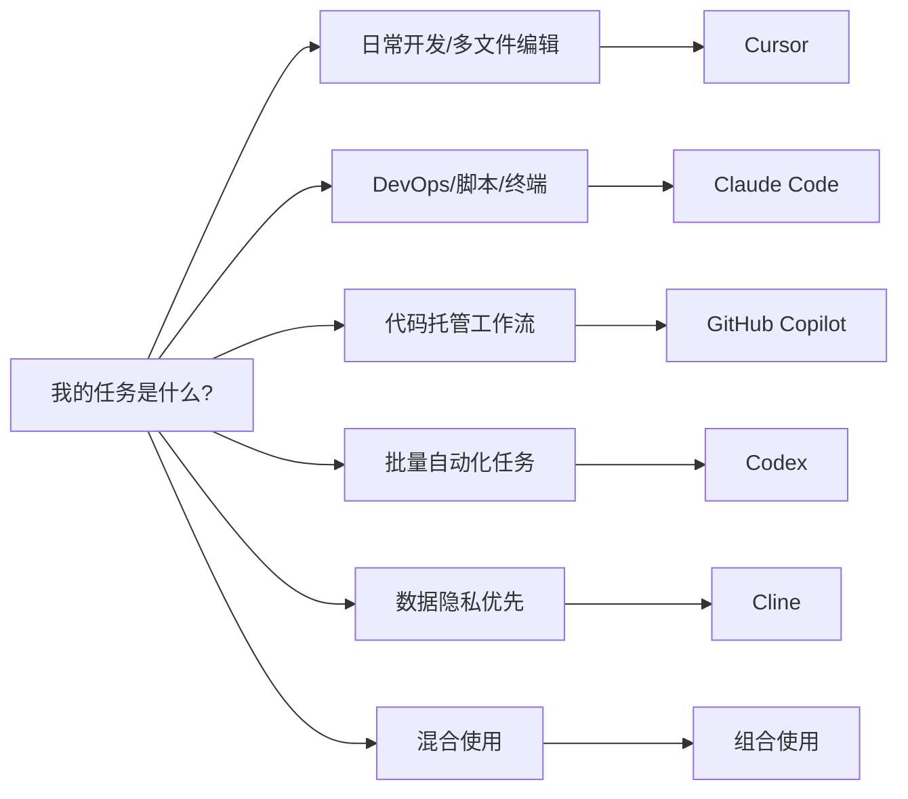
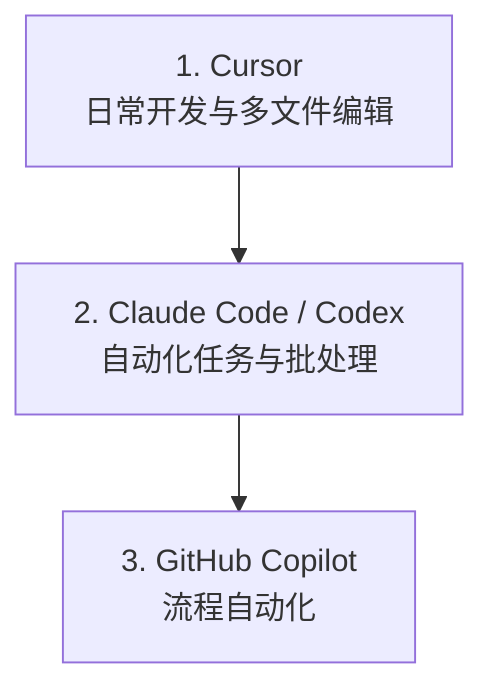

## 10.3 常见工具

本节用“工具类型与能力结构”的方式，介绍常见的智能体编程工具与工作流形态，帮助你建立选型与组合的视角。

### 10.3.1 GitHub Copilot

Github Copilot 是平台内置智能体，这类工具通常深度集成到代码托管与协作平台中，以“事件驱动”的方式运行：Issue、PR、代码推送、定时任务等都可以触发执行。

#### 核心场景

| 场景 | 描述 | 触发方式 |
|------|------|---------|
| **Issue → PR** | 自动根据 Issue 生成代码 | 添加 label |
| **代码审查** | 自动审查 PR 并提供建议 | PR 打开时 |
| **安全扫描** | 自动检测和修复漏洞 | 推送代码时 |
| **文档生成** | 自动生成/更新文档 | 代码变更时 |

#### 配置示例


> **注意**：以下为示意配置。不同平台/产品的配置格式与能力边界差异很大。

```yaml
# .github/agent-bot.yml

name: Agent Bot

on:
  issues:
    types: [labeled]

jobs:
  implement:
    if: contains(github.event.label.name, 'copilot-implement')
    runs-on: ubuntu-latest
    steps:
      - uses: vendor/agent-bot@v1
        with:
          task: implement-issue
          auto-pr: true
          review-required: true
          
  code-review:
    if: github.event_name == 'pull_request'
    runs-on: ubuntu-latest
    steps:
      - uses: vendor/agent-bot@v1
        with:
          task: review-pr
          security-scan: true
          style-check: true
```

#### 平台机器人与交互式环境

需要区分两个概念：
* **平台机器人**：运行在 CI/CD 或平台自动化环境中的机器人，处理异步任务。
* **交互式环境**：IDE 或 Web 端的对话式/多文件编辑体验，用于人机协作完成开发。

Workspace 示例：
```
@workspace /explain 解释这个项目的架构
@workspace /fix 修复当前文件的所有警告
@workspace /tests 为选中的代码生成测试
@workspace /doc 更新这个函数的文档
```

### 10.3.2 Cursor

Cursor 是首个 AI 原生 IDE。这类工具通常基于成熟编辑器内核扩展而来，核心能力是：索引代码库、跨文件修改、把“对话”变成“可控的编辑与执行”。

#### 核心能力

| 能力 | 描述 | 快捷键 |
|------|------|-------|
| **全代码库理解** | 索引整个项目，理解文件关系和代码逻辑 | 自动 |
| **智能体模式** | 自主完成复杂任务，跨文件修改 | `Cmd+I` |
| **外部工具连接** | 连接工具与数据源 | 自动 |
| **Composer** | 多文件编辑的对话界面 | `Cmd+Shift+I` |
| **@ 引用** | 精确指定上下文 | `@` |
| **规划模式** | 先规划后执行 | `Shift+Tab` |

#### @ 引用系统

这类 IDE 的“@ 引用”能力常用于精确控制上下文：

```
@file          引用单个文件
@folder        引用整个文件夹
@code          引用代码片段
@docs          引用项目文档
@git           引用 Git 历史
@web           搜索网络
@past_chats    引用历史对话
@definitions   引用符号定义
```

**使用示例**：

```markdown
用户：@src/api/users.py 这个函数有性能问题，用户量大时会很慢。
      参考 @src/api/orders.py 中的缓存模式帮我优化。

IDE 智能体：
1. 分析 users.py 中的函数...
2. 识别性能瓶颈：N+1 查询问题
3. 参考 orders.py 的缓存实现
4. 规划优化方案：
   - 添加 Redis 缓存层
   - 批量查询优化
   - 添加缓存失效逻辑
5. 修改 users.py...
6. 创建 cache.py 缓存模块...
7. 更新 requirements.txt 添加 redis 依赖...
8. 运行测试验证...

完成！已优化函数并添加缓存，并提供了回归测试与验证方式。
```

#### 上下文管理

AI IDE 通常有强大的搜索工具，能按需自动拉取 [上下文](../03_memory/3.6_context_engineering.md)，无需手动标记每个文件。关于上下文管理的详细策略（何时开新对话、引用过去工作等），见 [开发方法论](10.4_workflow.md)。

#### Rules 配置

许多工具支持通过“项目规则文件”来约束智能体行为，例如放在项目内的规则目录中：

```markdown
# rules/project.md

## 代码风格

- 使用 ES modules (import/export)，不用 CommonJS (require)
- 尽可能解构导入：`import { foo } from 'bar'`
- 参见 `components/Button.tsx` 作为规范组件结构

## 命令

- `npm run build`: 构建项目
- `npm run typecheck`: 运行类型检查
- `npm run test`: 运行测试

## 工作流

- 做完一系列代码更改后总是运行类型检查
- API 路由放在 `app/api/` 并遵循现有模式
- 不要修改 `generated/` 目录下的文件

## 禁止操作

- 不要删除任何测试文件
- 不要修改 .env 文件
- 不要直接操作数据库
```

**Skills（动态能力）**：

与 Rules (静态上下文) 不同，Skills 在智能体判断相关时才动态加载。Skills 可以包含：
- 自定义命令：可复用的工作流，通过 `/` 触发
- Hooks：在智能体动作前后运行的脚本
- 领域知识：智能体可按需拉取的特定任务指令
- **外部工具**：挂载标准化的工具服务（例如数据库、工单、聊天工具）

关于 Skills 和 Hooks 的详细设计模式，见 [工程化实践](10.5_best_practices.md)。

#### 高级特性

AI IDE 往往还提供以下高级特性：

- **规划模式**：按 `Shift+Tab` 激活，先研代码库后制定计划再执行
- **并行智能体**：利用 Git Worktree 运行多个独立智能体
- **TDD 工作流**：先写测试再让智能体实现，提供明确迭代目标
- **调试模式**：假设驱动的 Bug 定位方法

### 10.3.3 Cline

Cline (原 Claude Dev) 是一个优秀的开源 VS Code 自主智能体扩展。它不仅支持连接云端模型，也完美支持本地模型（如 Ollama），是“本地化与自托管”场景的最佳代表。如果对数据隐私有严格要求，或希望更强的可控性与成本边界，可以选择 Cline 配合本地模型运行时。

#### 核心组合

典型的本地化开源组合方案如下：

**Cline (VS Code 扩展)** + **本地模型运行时** + **代码模型**

* **编辑器侧扩展**：读取文件、执行终端命令和编辑代码。
* **本地模型运行时**：在本机或内网部署模型推理。
* **代码模型**：用于补全、重构与解释。

#### 配置指南

1. **安装工具**：
   ```bash
   # 1. 安装本地运行时

   # 以某本地运行时为例
   brew install <local-llm-runtime>
   
   # 2. 拉取模型 (推荐 32b 或 70b 版本以获得足够智商)

   <local-llm-runtime> run <code-model>
   ```

2. **配置编辑器扩展**：
   * 在 VS Code 中安装对应插件。
   * Provider 指向本地/内网模型服务。
   * 选择合适的模型与上下文窗口。

#### 优势与局限

| 维度 | 本地化方案（本地模型） | 云端方案（托管模型） |
|------|-------------------------------|------------------------|
| **隐私**| ✅**数据不出域**，绝对安全 | ❌ 代码需上传云端 |
| **成本**| ✅**API 成本可控**（通常转为算力与运维成本） | ❌ 按词元计费 |
| **能力** | ⚠️ 取决于模型与算力 | ✅ 通常更强 |
| **速度** | ⚠️ 取决于本地算力 | ✅ 极快 |
| **体验** | 🛠️ 需要折腾配置 | ✅ 开箱即用 |

#### 最佳实践

* **混合模式**：日常补全使用本地模型实现低延迟；复杂的架构设计和重构任务切换到高规格托管模型或更强的内网模型。
* **企业私有化部署**：企业可以在内网部署统一的推理网关与审计层，编辑器侧只需指向内网地址即可。

### 10.3.4 Claude Code

Claude Code 是一款强大的 CLI 工具，擅长与终端工作流融合：批量修改、运行脚本、分析 Git 历史、生成变更摘要等。目前也已支持 IDE 插件和桌面版本。

#### 安装与配置


```bash
# 安装

npm install -g <agent-cli>

# 配置 API Key

export API_KEY="<your-key>"

# 验证安装

agent --version
```

#### 基本使用


```bash
# 单次任务

agent "重构这个目录下的测试文件，使用 pytest 风格"

# 多文件分析

agent "分析 src/ 目录，找出所有未使用的导入"

# Git 集成

agent "分析最近 10 个 commit，生成 CHANGELOG"

# 代码审查

agent "审查 @src/api/auth.py 的安全性"
```

#### 交互模式

以下是一个交互示例：


```bash
# 启动交互模式

claude

> 帮我理解这个代码库的架构
[分析中...]

架构概览：
- 前端：Next.js + TypeScript
- 后端：FastAPI + SQLAlchemy
- 数据库：PostgreSQL
- 缓存：Redis

> 找出所有硬编码的配置值
[搜索中...]

发现 15 处硬编码配置：
1. src/config.py:23 - 数据库连接串
2. src/api/email.py:45 - SMTP 服务器地址
...

> 帮我把它们迁移到环境变量
[执行中...]
```

#### 项目记忆文件

在项目根目录创建一个“项目记忆文件”作为持久化记忆，例如：

```markdown
# PROJECT.md

## 项目概述

这是一个 B2B SaaS 平台的后端服务。

## 技术栈

- Python 3.12 + FastAPI
- PostgreSQL + Redis
- Docker + Kubernetes

## 代码约定

- 使用 Black 格式化
- 测试覆盖率 > 80%
- 所有 API 必须有 OpenAPI 文档

## 当前任务

- [ ] 优化数据库查询性能
- [ ] 实现多租户隔离

## 已知问题

- 用户表缺少索引，大量查询时性能差
- 缓存失效策略不一致
```

#### 技能系统

不少 CLI 工具支持加载自定义技能：

```
.claude/skills/
├── sql-analysis/
│   ├── SKILL.md
│   └── references/
│       ├── schema.md
│       └── queries.md
├── code-review/
│   ├── SKILL.md
```

> **工具协议兼容**：一些工具的技能系统可以兼容标准化的“工具服务协议”，让智能体安全地操作数据库、聊天工具或代码托管平台，而无需编写大量胶水代码。

#### 钩子系统

钩子允许在智能体生命周期中注入自定义逻辑：

```typescript
// .claude/hooks/pre-commit.ts
export default async function(context: HookContext) {
  // 在每次提交前运行
  const result = await context.runCommand('npm run lint');
  
  if (!result.success) {
    return {
      block: true,
      message: 'Lint 检查未通过，请修复后再提交'
    };
  }
  
  return { block: false };
}
```

### 10.3.5 Codex

Codex 提供终端内智能体，通常提供“计划-审批-执行”的闭环，擅长跨文件改动、自动化重构与批量任务。目前也已支持 IDE 插件和桌面版本。

#### 安装与配置

```bash
# 安装

npm install -g <terminal-agent>

# 使用交互式登录

terminal-agent --login

# 或配置 API Key

export API_KEY="<your-key>"
```

#### 三种审批模式

Codex CLI 的核心设计理念是**分级自主权**，提供三种审批模式：

| 模式 | 行为 | 适用场景 |
|------|------|---------|
| **Suggest** | 所有操作需人工审批 | 敏感代码、学习阶段 |
| **Auto Edit** | 自动编辑文件，执行命令需审批 | 日常开发 |
| **Full Auto** | 在沙箱中完全自主执行 | 批量任务、CI/CD |

```bash
# 建议模式（默认）

terminal-agent "优化这个函数的性能"

# 全自动模式（在沙箱中运行）

terminal-agent --full-auto "为所有 API 端点添加输入验证"
```

#### 基本使用

```bash
# 分析代码库

terminal-agent "解释这个项目的架构"

# 修复 Bug

terminal-agent "修复 issue #42 中描述的内存泄漏"

# 生成 PR

terminal-agent "实现这个 feature request 并创建 Pull Request"

# 多模态输入（支持截图）

terminal-agent "按照这个设计稿实现页面" --image design.png
```

#### 交互模式与对话管理

Codex CLI 支持全屏终端 UI 和本地对话存档：

```bash
# 启动交互模式

terminal-agent

> 帮我理解 src/auth/ 的认证流程
[分析中...展示执行计划，等待审批]

> 批量重命名所有测试文件为 *_test.py 格式
[执行计划: 修改 23 个文件，是否继续？]

# 恢复上次对话

terminal-agent --resume
```

#### 项目配置

通过项目级指令文件提供约束与说明：

```markdown
# PROJECT.md

## 项目信息

- 名称: MyProject
- 语言: TypeScript + Python

## 代码规范

- 使用 ESLint + Prettier
- 测试使用 Vitest
- 提交遵循 Conventional Commits

## 安全限制

- 禁止修改生产配置
- 禁止直接操作数据库
```

### 10.3.6 工具对比

#### 功能对比

图 10-11：智能体编程工具功能对比

| 功能 | GitHub Copilot | Cursor | Claude Code | Codex | Cline |
|------|--------------|--------|-------------|-------|-------|
| 交互方式 | 平台事件驱动 | IDE 原生 | CLI / IDE 插件 | CLI / IDE 插件 | IDE 插件 |
| 全代码库理解 | ✅ | ✅ | ✅ | ✅ | ✅ |
| 规划模式 | ❌ | ✅ | ✅ | ✅ | ✅ |
| 工具协议支持 | ✅ | ✅ | ✅ | ✅ | ✅ |
| Git 集成 | ✅ 深度 | ✅ | ✅ | ✅ | ✅ |
| 自定义规则 | ✅ | ✅ | ✅ | ✅ | ✅ |
| 技能系统 | ❌ | ✅ Skills | ✅ Skills | ✅ Skills | ✅ Skills |
| 多模型支持 | ✅ | ✅ | 视工具而定 | ✅ | ✅ |
| 审批分级 | ❌ | ❌ | ✅ 三级 | ✅ 三级 | ✅ 可配置 |
| 多模态输入 | ✅ | ✅ | ✅ | ✅ | ✅ |
| 离线使用 | ❌ | ❌ | ❌ | ❌ | ✅ |

> **其它工具**：除了上述主流类型，还有一些值得关注的创新形态：
> * **Aider**：CLI 工具的杰出代表，以其稳健的代码编辑能力和 Git 集成著称，常被视为“流式编辑”的标杆。
> * **Windsurf**：主打“Flow”（心流）体验的 IDE，通过 Cascade 引擎实现深度的上下文感知。
> * **Augment**：专注于极速的代码库索引与补全，强调对大型单体仓库（Monorepo）的即时感知能力。
> * **OpenHands**：开源社区的自主智能体平台（原 OpenDevin），探索多智能体协作与完全自主开发的未来形态。

#### 场景选择指南

根据不同任务选择合适的工具：




图 10-12：智能体编程工具选择决策树

### 10.3.7 工具组合策略

在实际项目中，可以组合使用多个工具：



图 10-13：多工具组合协作策略

#### 配置统一

通过项目级指令文件统一各工具的行为：

```markdown
# PROJECT.md

## 项目信息

- 名称: MyProject
- 语言: TypeScript, Python

## 代码约定

- 全部工具遵循此规范

## 安全限制

- 禁止修改 .env 文件
- 禁止直接操作生产数据库
```

---

**下一节**: [开发方法论](10.4_workflow.md)
