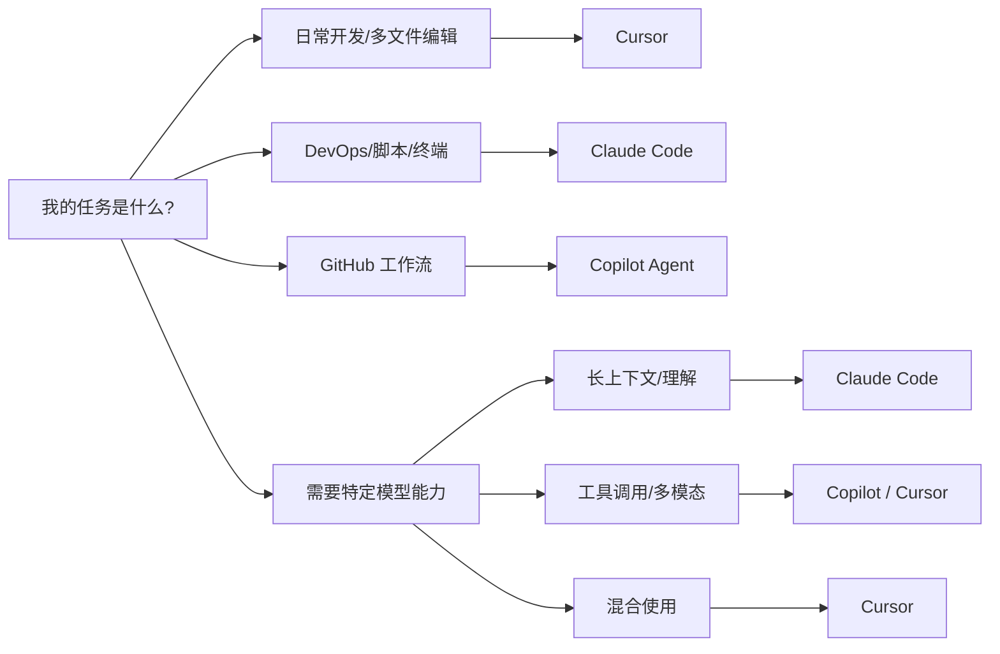
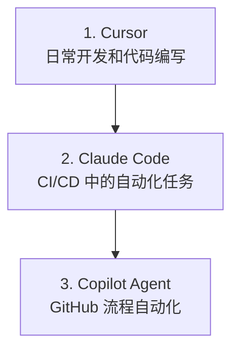

## 10.3 主流 Agentic Coding 工具

本节详细介绍当前最主流的智能体编程工具，包括它们的核心能力、使用技巧和最佳实践。

### 10.3.1 Cursor

Cursor 是 2026 年最流行的 AI 原生 IDE，基于 VS Code 构建，专为智能体编程设计。

#### 核心能力

| 能力 | 描述 | 快捷键 |
|------|------|-------|
| **全代码库理解** | 索引整个项目，理解文件关系和代码逻辑 | 自动 |
| **智能体模式** | 自主完成复杂任务，跨文件修改 | `Cmd+I` |
| **MCP 支持** | 连接外部工具和数据源 | 自动 |
| **Composer** | 多文件编辑的对话界面 | `Cmd+Shift+I` |
| **@ 引用** | 精确指定上下文 | `@` |
| **规划模式** | 先规划后执行 | `Shift+Tab` |

#### @ 引用系统

Cursor 的 @ 引用是精确控制上下文的关键：

```
@file          引用单个文件
@folder        引用整个文件夹
@code          引用代码片段
@docs          引用项目文档
@git           引用 Git 历史
@web           搜索网络
@past_chats    引用历史对话
@definitions   引用符号定义
```

**使用示例**：

```markdown
用户：@src/api/users.py 这个函数有性能问题，用户量大时会很慢。
      参考 @src/api/orders.py 中的缓存模式帮我优化。

Cursor 智能体：
1. 分析 users.py 中的函数...
2. 识别性能瓶颈：N+1 查询问题
3. 参考 orders.py 的缓存实现
4. 规划优化方案：
   - 添加 Redis 缓存层
   - 批量查询优化
   - 添加缓存失效逻辑
5. 修改 users.py...
6. 创建 cache.py 缓存模块...
7. 更新 requirements.txt 添加 redis 依赖...
8. 运行测试验证...

完成！已优化函数并添加缓存，响应时间从 2.3s 降至 45ms。
```

#### 上下文管理

Cursor 智能体有强大的搜索工具，能按需自动拉取上下文，无需手动标记每个文件。关于上下文管理的详细策略（何时开新对话、引用过去工作、AGENTS.md 等），见 [10.4 智能体开发工作流](10.4_workflow.md)。

#### Rules 配置

在 `.cursor/rules/` 目录下创建 Markdown 文件来配置项目规则：

```markdown
# .cursor/rules/project.md

## 代码风格

- 使用 ES modules (import/export)，不用 CommonJS (require)
- 尽可能解构导入：`import { foo } from 'bar'`
- 参见 `components/Button.tsx` 作为规范组件结构

## 命令

- `npm run build`: 构建项目
- `npm run typecheck`: 运行类型检查
- `npm run test`: 运行测试

## 工作流

- 做完一系列代码更改后总是运行类型检查
- API 路由放在 `app/api/` 并遵循现有模式
- 不要修改 `generated/` 目录下的文件

## 禁止操作

- 不要删除任何测试文件
- 不要修改 .env 文件
- 不要直接操作数据库
```

**Skills（动态能力）**：

与 Rules (静态上下文) 不同，Skills 在智能体判断相关时才动态加载。Skills 可以包含：
- 自定义命令：可复用的工作流，通过 `/` 触发
- Hooks：在智能体动作前后运行的脚本
- 领域知识：智能体可按需拉取的特定任务指令
- **MCP 工具**：挂载标准化的 MCP 服务（如 Postgres, Stripe 等）

关于 Skills 和 Hooks 的详细设计模式，见 [10.5 最佳实践](10.5_best_practices.md)。

#### 高级特性

Cursor 还提供以下高级特性，详见 [10.4 智能体开发工作流](10.4_workflow.md)：

- **规划模式**：按 `Shift+Tab` 激活，先研代码库后制定计划再执行（见 [10.4.3](10.4_workflow.md)）
- **并行智能体**：利用 Git Worktree 运行多个独立智能体（见 [10.4.3](10.4_workflow.md)）
- **TDD 工作流**：先写测试再让智能体实现，提供明确迭代目标（见 [10.4.4](10.4_workflow.md)）
- **调试模式**：假设驱动的 Bug 定位方法（见 [10.4.7](10.4_workflow.md)）

### 10.3.2 Claude Code

Claude Code 是 Anthropic 的 CLI 智能体工具，专为终端工作流设计。

#### 安装与配置


```bash
# 安装

npm install -g @anthropic-ai/claude-code

# 配置 API Key

export ANTHROPIC_API_KEY="sk-ant-xxx"

# 验证安装

claude --version
```

#### 基本使用


```bash
# 单次任务

claude "重构这个目录下的测试文件，使用 pytest 风格"

# 多文件分析

claude "分析 src/ 目录，找出所有未使用的导入"

# Git 集成

claude "分析最近 10 个 commit，生成 CHANGELOG"

# 代码审查

claude "审查 @src/api/auth.py 的安全性"
```

#### 交互模式

以下是一个交互示例：


```bash
# 启动交互模式

claude

> 帮我理解这个代码库的架构
[分析中...]

架构概览：
- 前端：Next.js + TypeScript
- 后端：FastAPI + SQLAlchemy
- 数据库：PostgreSQL
- 缓存：Redis

> 找出所有硬编码的配置值
[搜索中...]

发现 15 处硬编码配置：
1. src/config.py:23 - 数据库连接串
2. src/api/email.py:45 - SMTP 服务器地址
...

> 帮我把它们迁移到环境变量
[执行中...]
```

#### CLAUDE.md 项目记忆

在项目根目录创建 `CLAUDE.md` 作为持久化记忆：

```markdown
# CLAUDE.md

## 项目概述

这是一个 B2B SaaS 平台的后端服务。

## 技术栈

- Python 3.12 + FastAPI
- PostgreSQL + Redis
- Docker + Kubernetes

## 代码约定

- 使用 Black 格式化
- 测试覆盖率 > 80%
- 所有 API 必须有 OpenAPI 文档

## 当前任务

- [ ] 优化数据库查询性能
- [ ] 实现多租户隔离

## 已知问题

- 用户表缺少索引，大量查询时性能差
- 缓存失效策略不一致
```

#### 技能系统

Claude Code 支持加载自定义技能：

```
.claude/skills/
├── sql-analysis/
│   ├── SKILL.md
│   └── references/
│       ├── schema.md
│       └── queries.md
├── code-review/
│   ├── SKILL.md
```

> **MCP 一等公民**：Claude Code 的技能系统底层完全兼容 **MCP (Model Context Protocol)**。你可以直接挂载任何 MCP Server，让 Agent 安全地操作数据库、Slack 或 GitHub，而无需编写自定义胶水代码。

#### 钩子系统

钩子允许在智能体生命周期中注入自定义逻辑：

```typescript
// .claude/hooks/pre-commit.ts
export default async function(context: HookContext) {
  // 在每次提交前运行
  const result = await context.runCommand('npm run lint');
  
  if (!result.success) {
    return {
      block: true,
      message: 'Lint 检查未通过，请修复后再提交'
    };
  }
  
  return { block: false };
}
```

### 10.3.3 GitHub Copilot Agent

GitHub Copilot 的智能体模式深度集成 GitHub 生态。

#### 核心场景

| 场景 | 描述 | 触发方式 |
|------|------|---------|
| **Issue → PR** | 自动根据 Issue 生成代码 | 添加 label |
| **代码审查** | 自动审查 PR 并提供建议 | PR 打开时 |
| **安全扫描** | 自动检测和修复漏洞 | 推送代码时 |
| **文档生成** | 自动生成/更新文档 | 代码变更时 |

#### 配置示例


> **注意**：以下为示意配置，GitHub Copilot Agent 的实际配置格式可能有所不同，请参考官方文档。

```yaml
# .github/copilot-agent.yml

name: Copilot Agent

on:
  issues:
    types: [labeled]

jobs:
  implement:
    if: contains(github.event.label.name, 'copilot-implement')
    runs-on: ubuntu-latest
    steps:
      - uses: github/copilot-agent@v1
        with:
          task: implement-issue
          auto-pr: true
          review-required: true
          
  code-review:
    if: github.event_name == 'pull_request'
    runs-on: ubuntu-latest
    steps:
      - uses: github/copilot-agent@v1
        with:
          task: review-pr
          security-scan: true
          style-check: true
```

#### Copilot Workspace vs Copilot Agent

需要区分两个概念：
*   **Copilot Agent** (本节重点)：运行在 GitHub Action 中的自动化机器人，处理异步任务。
*   **Copilot Workspace**：VS Code/Web 端的交互式环境，用于辅助编写代码。

Workspace 示例：
```
@workspace /explain 解释这个项目的架构
@workspace /fix 修复当前文件的所有警告
@workspace /tests 为选中的代码生成测试
@workspace /doc 更新这个函数的文档
```

### 10.3.4 本地化方案：Cline + DeepSeek

对于对数据隐私有严格要求（如金融、军工）或希望降低 Token 成本的开发者，**本地化智能体编程**是一个快速崛起的选择。

#### 核心组合

**Cline（原 Roo Code）** + **Ollama** + **DeepSeek-V3/R1**

*   **Cline**：一个开源的 VS Code 扩展，能够像 Cursor 一样读取文件、执行终端命令和编辑代码。
*   **Ollama**：本地大模型运行时。
*   **DeepSeek-R1**：2026 年表现最出色的开源推理模型，在编程任务上媲美 GPT-5。

#### 配置指南

1. **安装工具**：
   ```bash
   # 1. 安装 Ollama

   brew install ollama
   
   # 2. 拉取模型 (推荐 32b 或 70b 版本以获得足够智商)

   ollama run deepseek-r1:32b
   ```

2. **配置 Cline**：
   *   在 VS Code 中安装 "Cline" 插件。
   *   API Provider 选择 "Ollama"。
   *   Model ID 输入 `deepseek-r1:32b`。

#### 优势与局限

| 维度 | 本地化方案（Cline + Local LLM） | 云端方案（Cursor/Claude） |
|------|-------------------------------|------------------------|
| **隐私** | ✅ **数据不出域**，绝对安全 | ❌ 代码需上传云端 |
| **成本** | ✅ **零 API 费用** (需自备 GPU) | ❌ 按 Token 计费 |
| **智力** | ⚠️ 取决于显存大小 (32B/70B) | ✅ SOTA 模型 (Claude 4.6 / GPT-5.3) |
| **速度** | ⚠️ 取决于本地算力 | ✅ 极快 |
| **体验** | 🛠️ 需要折腾配置 | ✅ 开箱即用 |

#### 最佳实践

*   **混合模式**：日常代码补全使用本地小模型 (如 Qwen-2.5-Coder-7B) 实现低延迟；复杂的架构设计和重构任务切换到云端 DeepSeek API 或本地高参数模型。
*   **企业私有化部署**：企业可以在内网部署 vLLM 提供 OpenAI 兼容接口，Cline 指向内网地址，既保证安全又利用集中算力。

### 10.3.5 工具对比

#### 功能对比

图 10-11：主流智能体编程工具功能对比

| 功能 | Cursor | Claude Code | Copilot Agent |
|------|--------|------------|---------------|
| IDE 集成 | ✅ 原生 | ❌ CLI | ✅ VS Code |
| 全代码库理解 | ✅ | ✅ | ✅ |
| 规划模式 | ✅ | ❌ | ❌ |
| MCP 协议支持 | ✅ | ✅ | 🚧 部分 |
| Git 集成 | ✅ | ✅ | ✅ 深度 |
| 自定义规则 | ✅ Rules | ✅ CLAUDE.md | ❌ |
| 技能系统 | ✅ Skills | ✅ Skills | ❌ |
| 多模型支持 | ✅ | ❌ Claude only | ❌ GPT only |
| 离线使用 | ❌ | ❌ | ❌ |

> **Flow 模式竞品**：除了 Cursor，2026 年还涌现了如 **Windsurf** 和 **Trae** (字节跳动) 等采用 "Cascade/Flow" 流式范式的 IDE，强调实时上下文感知而非单纯的对话交互，也是值得关注的选择。

#### 场景选择指南

根据不同任务选择合适的工具：




图 10-12：智能体编程工具选择决策树

### 10.3.6 工具组合策略

在实际项目中，可以组合使用多个工具：



图 10-13：多工具组合协作策略

#### 配置统一

通过 AGENTS.md 统一各工具的行为：

```markdown
# AGENTS.md

## 项目信息

- 名称: MyProject
- 语言: TypeScript, Python

## 代码约定

- 全部工具遵循此规范

## 安全限制

- 禁止修改 .env 文件
- 禁止直接操作生产数据库
```

---

**下一节**: [智能体开发工作流](10.4_workflow.md)
