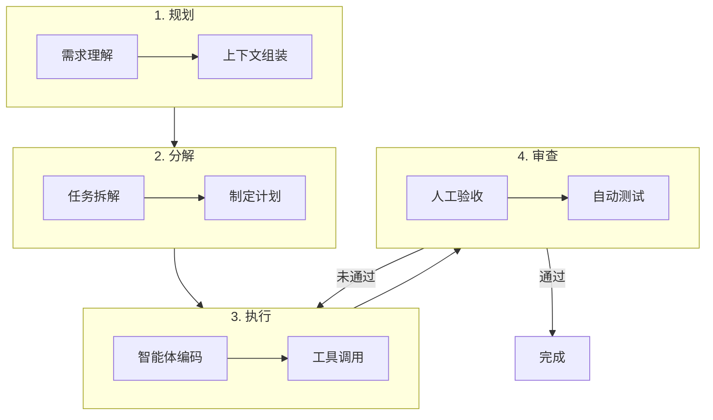
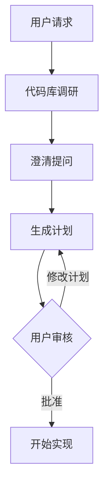
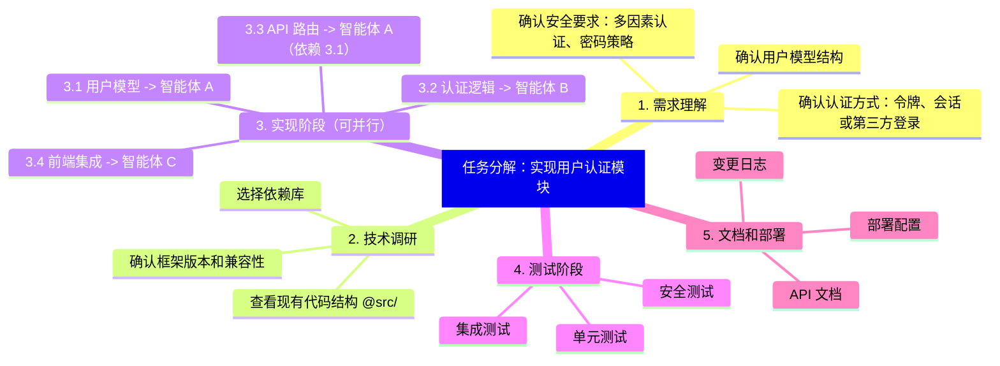
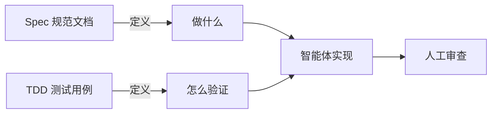
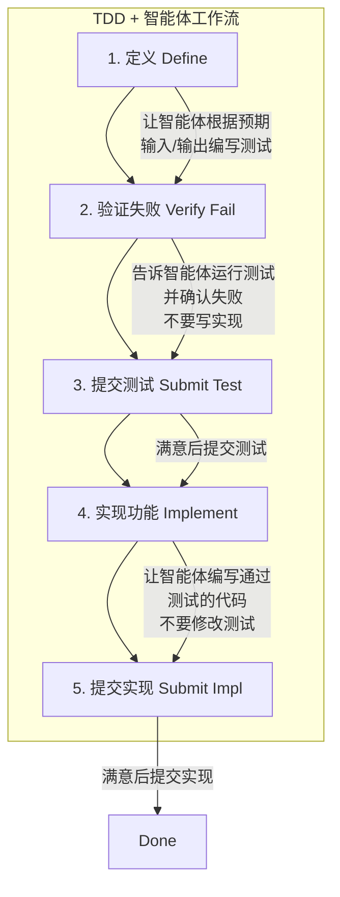
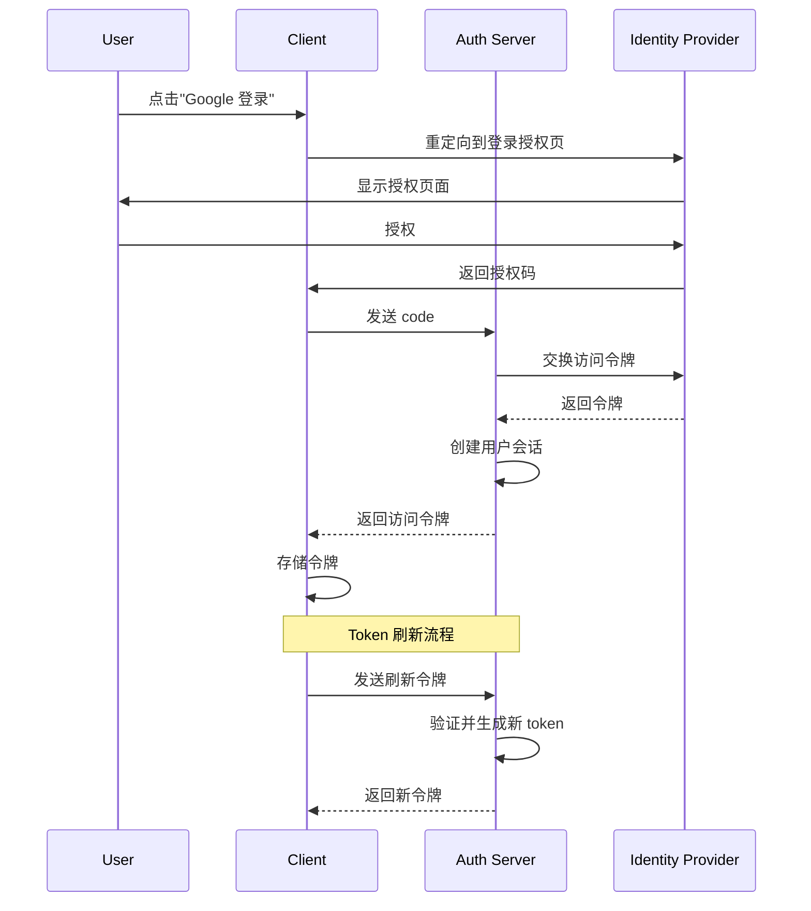

## 10.4 开发方法论

本节聚焦智能体编程的核心方法论，探讨如何将智能体融入日常开发工作流，实现从"写代码"到"编排 AI"的角色转变。

### 10.4.1 智能体开发闭环

在传统的开发流中，开发者亲自执行每一个循环。而在 Agentic Workflow 中，开发者上升为 **循环的管理者**。

#### 核心工作流：P-D-E-R 循环

我们将智能体开发工作流概括为 **P-D-E-R** 四步循环：

* **Plan** - 规划任务目标
* **Decompose** - 拆解任务为原子任务
* **Execute** - 执行原子任务
* **Review** - 审查结果并迭代



图 10-14：P-D-E-R 智能体开发循环

#### 代码化描述

如果我们把这个新工作流写成伪代码，它看起来是这样的：

```python
class AgenticWorkflow:
    """智能体时代的开发循环"""
    
    def develop_feature(self, requirement: str):
        # 1. Prepare: 准备上下文
        context = self.context_engineer.gather(requirement)
        
        # 2. Decompose: 拆解为原子任务
        plan = self.planner.break_down(requirement, context)
        
        # 3. Execute: 智能体执行
        for task in plan.tasks:
            while True:
                # 让智能体写代码
                result = self.agent.code(task)
                
                # 4. Review: 验收与反馈
                feedback = self.reviewer.evaluate(result)
                
                if feedback.passed:
                    break
                else:
                    # 带着反馈重试
                    self.agent.fix(feedback)
        
        # 集成与交付
        self.system.integrate()
```

#### 规划先于执行

在现代智能体工具中，**规划模式**是提升开发质量的核心功能。进入规划模式后，智能体不会立即编写代码，而是：

1. **调研代码库**：搜索相关文件，理解现有结构
2. **提出澄清问题**：确认需求边界和约束条件
3. **创建实施计划**：生成可编辑的 Markdown 计划文档
4. **等待批准**：用户确认后才开始实现



图 10-15：规划优先的开发流程

#### 时间分配的重构

这种工作流的变化导致了开发者时间分配的显著转移：

| 活动 | 传统开发 | 智能体开发（典型变化） |
|------|---------|------------------------|
| **需求与架构** | 相对较少 | 占比上升，需要更精确地定义问题 |
| **编写代码** | 占比较高 | 占比下降，更多变成“审查与整合” |
| **调试与测试** | 稳定投入 | 更依赖自动化与回归测试 |
| **审查与验收** | 相对较少 | 占比上升，为 AI 产出把关 |

### 10.4.2 任务分解与提示词设计

好的任务分解和精准的提示词是智能体编程的两大基础能力。本节将 DECOMPOSE 任务分解框架与 CLEAR 提示词框架结合，形成**"需求→分解→表达"**的完整方法论。

#### DECOMPOSE 框架

```
D - Define     定义：明确任务目标和边界
E - Explore    探索：了解现有代码和约束
C - Chunk      切分：将大任务分解为小任务
O - Order      排序：确定执行顺序和依赖
M - Map        映射：为每个任务分配工具/智能体
P - Prompt     提示：为每个任务设计清晰的提示词
O - Observe    观察：监控执行过程
S - Synthesize 综合：整合结果并验证
E - Evolve     进化：总结经验更新规则
```

#### 任务分解示例

**原始需求**："实现一个用户认证模块"



图 10-16：用户认证模块任务分解思维导图

#### CLEAR 提示词框架

分解完任务后，需要用精准的提示词向智能体表达每个子任务。CLEAR 框架提供了结构化的表达方式：

```
C - Context    上下文：提供相关背景信息
L - Location   位置：指明具体的文件和位置
E - Expected   预期：描述期望的行为或结果
A - Actual     实际：描述当前的问题或行为
R - Reference  参考：提供相关的参考实现
```

**示例应用**：

```markdown
C：API 使用某 Web 框架，认证采用令牌方案
L：@src/api/auth.py 的 verify_token 函数
E：Token 过期时应返回 401 并提示刷新
A：目前返回 500 错误，没有有意义的错误信息
R：参考 @src/api/middleware.py 中的错误处理模式
```

#### 提示词实践技巧

**提供充足上下文**：

```markdown
❌ 不好的提示词：
"修复这个 bug"

✅ 好的提示词：
"@src/api/users.py 的 get_user 函数在用户 ID 为空时抛出 500 错误。
预期行为：返回 400 Bad Request 并给出清晰的错误信息。
参考 @src/api/orders.py 中类似的错误处理模式。"
```

**分步骤执行复杂任务**：

与其试图让智能体"一步登天"，不如引导它分而治之：

```markdown
❌ 不好的做法：
"帮我从头开始写一个完整的电商后端"

✅ 好的做法：
1. "先设计数据库 Schema，参考 @docs/requirements.md"
2. "基于 Schema 生成 ORM 模型"
3. "实现用户认证模块，使用令牌"
4. "实现商品 CRUD API"
5. "实现订单处理逻辑"
6. "编写集成测试"
```

**验证和测试一起请求**：

在请求代码生成时，同时要求生成验证逻辑：

```markdown
"实现一个 LRU 缓存类，要求：
1. 支持 get 和 put 操作
2. 容量超限时淘汰最久未使用的项
3. 时间复杂度尽量接近常数级

同时编写完整的单元测试覆盖：
- 基本功能测试
- 边界情况测试
- 并发安全测试"
```

### 10.4.3 规范驱动开发（Spec-Driven Development）

规范驱动开发（Spec-Driven Development，SDD）是软件开发的一种方法论，它强调先编写**规范文档**（Specification），再让智能体按规范实现。它特别适合智能体编程场景：规范文档既是给人的设计文档，也是给智能体的高精度指令。

#### 为什么需要 Spec？

在传统开发中，开发者脑中有隐含的设计意图，边写代码边细化。但对智能体而言，**没有写下来的东西等于不存在**。规范文档解决了这个根本问题：

| 方式 | 问题 |
|------|------|
| 直接告诉智能体"实现一个缓存" | 缺少约束，结果不可预测 |
| 口头描述 + 多轮对话修正 | 效率低，上下文积累不可控 |
| **先写 Spec，再交给智能体** | 一次性传达完整意图 |

#### Spec 文档的结构

一个有效的 Spec 通常包含以下要素：

```markdown
# 功能规范：[功能名称]

### 目标
简要描述这个功能要解决什么问题。

### 约束条件
- 技术栈、框架、性能要求
- 必须遵循的现有模式或接口

### 接口定义
具体的输入/输出、API 签名、数据结构。

### 行为规则
- 正常流程的预期行为
- 边界情况的处理方式
- 错误场景的响应

### 验收标准
- 功能通过的具体条件
- 必须覆盖的测试场景

### 参考
- 相关代码文件（使用 @ 引用）
- 类似功能的现有实现
```

#### 示例：用 SDD 开发一个速率限制器

```markdown
# 功能规范：API 速率限制器

### 目标
为 API 网关实现请求速率限制，防止滥用。

### 约束条件
- 使用一个高速 KV 存储作为计数后端
- 与现有中间件链兼容（@src/middleware/chain.py）
- 单个请求增加延迟应尽量小

### 接口定义
class RateLimiter:
    def check(self, client_id: str) -> RateLimitResult
    def configure(self, policy: RateLimitPolicy) -> None

RateLimitResult: { allowed: bool, remaining: int, retry_after: int | None }
RateLimitPolicy: { requests_per_window: int, window_seconds: int }

### 行为规则
- 未超限：返回 allowed=True，更新计数
- 超限：返回 allowed=False，附带 retry_after 秒数
- 计数后端不可用时：降级放行，记录告警日志

### 验收标准
- 正常限流行为符合策略
- 后端故障时不阻塞请求
- 并发安全（多实例部署场景）
```

将这份 Spec 交给智能体后，它能清晰地理解：要做什么、不能违反什么、怎样算完成。相比模糊的口头描述，开发效率和产出质量都会大幅提升。

#### SDD 与 TDD 的关系

SDD 和 TDD 是互补而非替代关系：



图 10-17：Spec 与 TDD 的互补关系

推荐的工作流是：**先写 Spec 定义边界，再写测试固化预期，最后让智能体实现**。这样智能体既有"目的地"（Spec），又有"导航仪"（测试），产出质量最高。

### 10.4.4 测试驱动开发

智能体在有明确目标可迭代时表现最佳。测试允许智能体做出更改、评估结果、逐步改进直到成功。

#### TDD 工作流



图 10-18：TDD 驱动的智能体工作流

#### TDD 提示词示例

```markdown
第一步（定义测试）：
"为 LRU 缓存类编写测试，测试以下场景：
 - 基本 get/put 操作
 - 容量超限时淘汰最久未使用的项
 - 并发安全
 不要实现功能，只写测试。"

第二步（验证失败）：
"运行测试确认它们失败（因为还没有实现）"

第三步（实现）：
"现在实现 LRU 缓存类让所有测试通过，不要修改测试文件"
```

### 10.4.5 架构可视化优先

在编写任何复杂功能之前，先让智能体画图。

#### 为什么先画图？

1. **验证理解**：确认智能体脑子里的架构和你想要的一致
2. **文档化**：生成的图表直接存入 `docs/architecture/`，成为永久文档
3. **发现缺陷**：在写代码之前，通过看图往往能一眼发现逻辑漏洞

#### 架构图提示词示例

```markdown
"为认证系统创建一个 Mermaid 序列图，包括：
 - 第三方登录提供商交互
 - 会话管理
 - Token 刷新流程
 - 错误处理分支"
```

**智能体输出**：



图 10-19：认证系统序列图示例

### 10.4.6 调试方法

当标准智能体交互难以解决 bug 时，Debug Mode 提供不同的方法：

```
Debug Mode 工作流程：
1. 生成多个关于可能出错的假设
2. 用日志语句检测代码
3. 要求重现 bug 同时收集运行时数据
4. 分析实际行为以定位根因
5. 基于证据进行定向修复
```

**适用场景**：
- 可重现但无法弄清的 bug
- 竞态条件和时序问题
- 性能问题和内存泄漏
- 曾经正常的回归问题

**提示词示例**：

```markdown
"这个函数有时会返回 null，但我不知道什么条件下会发生。
 请帮我：
 1. 列出可能导致返回 null 的所有情况
 2. 添加日志语句来追踪执行路径
 3. 建议如何重现这个问题"
```

---

**下一节**: [工程化实践](10.5_best_practices.md)
