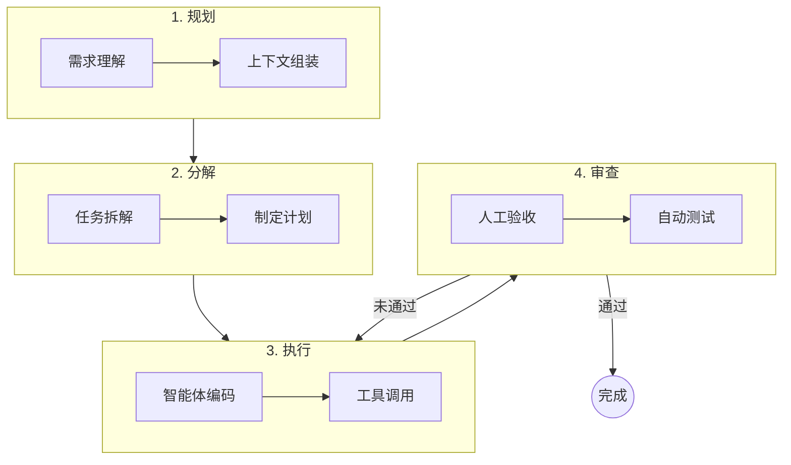
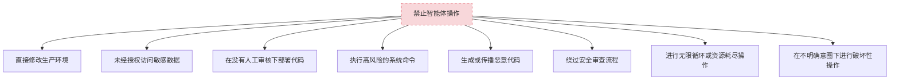
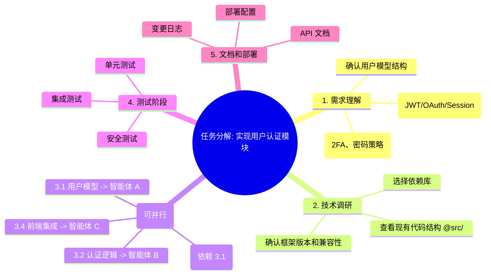
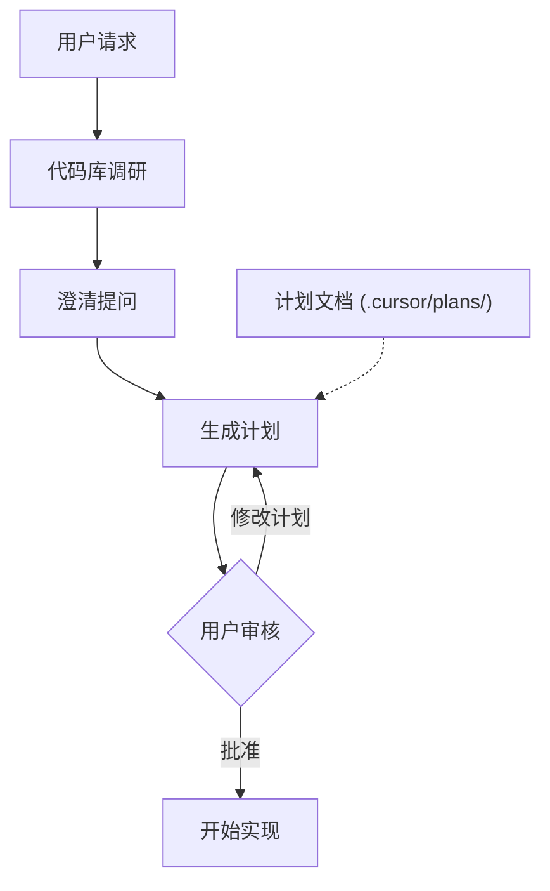
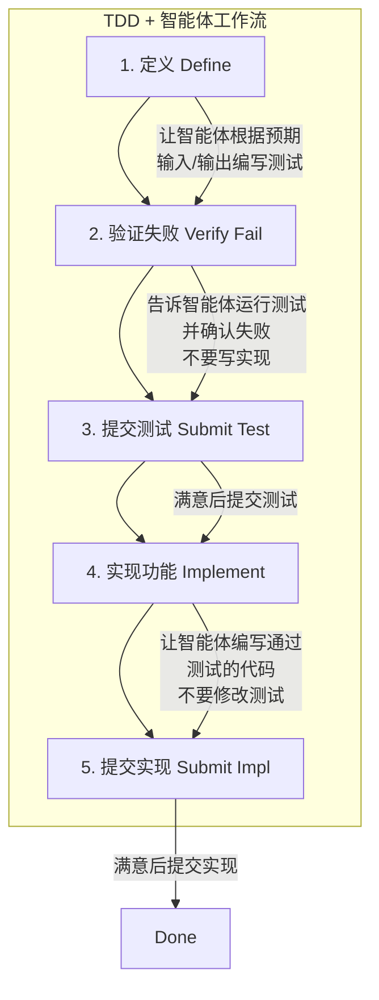
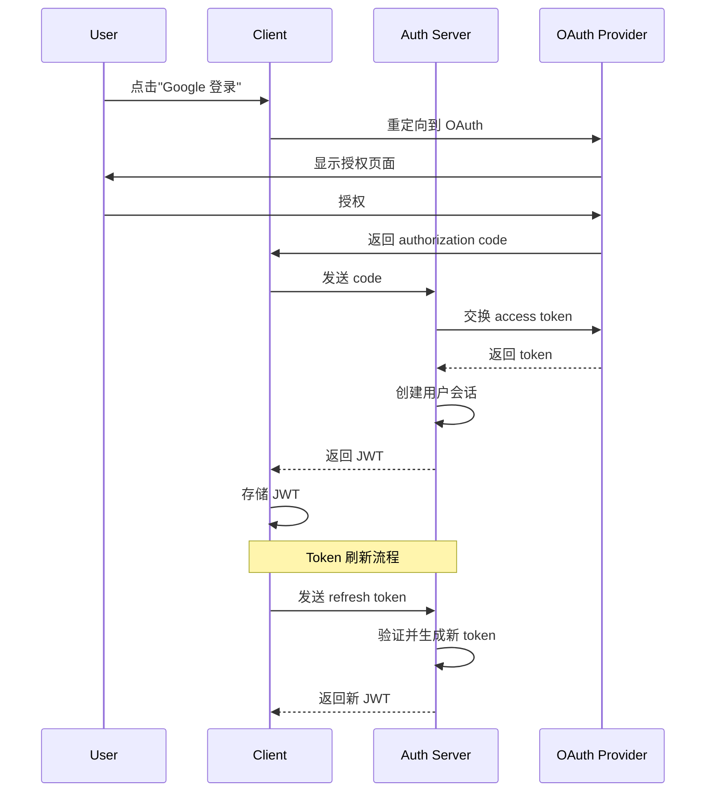

## 10.4 智能体开发工作流

本节探讨如何将智能体编程融入日常开发工作流，实现从"写代码"到"编排 AI"的角色转变。

### 10.4.1 智能体开发闭环

在传统的开发流中，开发者亲自执行每一个循环。而在 Agentic Workflow 中，开发者上升为 **循环的管理者**。

#### 核心工作流：P-D-E-R 循环

我们将智能体开发工作流概括为 **P-D-E-R** 四步循环：



图 10-14：P-D-E-R 智能体开发循环

#### 代码化描述

如果我们把这个新工作流写成伪代码，它看起来是这样的：

```python
class AgenticWorkflow:
    """智能体时代的开发循环"""
    
    def develop_feature(self, requirement: str):
        # 1. Prepare: 准备上下文
        context = self.context_engineer.gather(requirement)
        
        # 2. Decompose: 拆解为原子任务
        plan = self.planner.break_down(requirement, context)
        
        # 3. Execute: 智能体执行
        for task in plan.tasks:
            while True:
                # 让智能体写代码
                result = self.agent.code(task)
                
                # 4. Review: 验收与反馈
                feedback = self.reviewer.evaluate(result)
                
                if feedback.passed:
                    break
                else:
                    # 带着反馈重试
                    self.agent.fix(feedback)
        
        # 集成与交付
        self.system.integrate()
```



图 10-15：智能体操作禁止清单

#### 时间分配的重构

这种工作流的变化导致了开发者时间分配的显著转移：

| 活动 | 传统开发 | 智能体开发 | 变化 |
|------|---------|-----------|------|
| **需求与架构** | 20% | **40%** | ⬆️ 需更精确地定义问题 |
| **编写代码** | 50% | **10%** | ⬇️ 只有核心逻辑需手写 |
| **调试与测试** | 20% | **15%** | ⬇️ AI 辅助定位问题 |
| **审查与验收** | 10% | **35%** | ⬆️ 为 AI 的产出把关 |

### 10.4.2 任务分解方法论

#### DECOMPOSE 框架

具体示例如下：

```
D - Define     定义：明确任务目标和边界
E - Explore    探索：了解现有代码和约束
C - Chunk      切分：将大任务分解为小任务
O - Order      排序：确定执行顺序和依赖
M - Map        映射：为每个任务分配工具/智能体
P - Prompt     提示：为每个任务设计清晰的提示词
O - Observe    观察：监控执行过程
S - Synthesize 综合：整合结果并验证
E - Evolve     进化：总结经验更新规则
```

#### 任务分解示例

**原始需求**："实现一个用户认证模块"



图 10-16：用户认证模块任务分解思维导图

### 10.4.3 Cursor 智能体进阶实践

根据 Cursor 团队的官方最佳实践，以下技术能显著提升智能体的工作效率。

#### 规划模式：规划先于执行

在 Cursor 中按 `Shift+Tab` 可激活 **规划模式**。进入该模式后，智能体不会立即编写代码，而是：

1. **调研代码库**：搜索相关文件，理解现有结构
2. **提出澄清问题**：确认需求边界和约束条件
3. **创建实施计划**：生成可编辑的 Markdown 计划文档
4. **等待批准**：用户确认后才开始实现



图 10-17：规划优先的开发流程

#### 回退优于修补

> [!TIP]
> **智能体编程黄金法则**：如果智能体的实现偏离了轨道，**不要试图通过后续对话来"修补"它**——这通常会导致代码越来越乱。
> 
> **正确的做法是**：
> 1. 如果你在 Git 环境中，`git reset --hard` 或 `git stash` 回滚更改
> 2. 如果使用 Cursor 规划模式，点击"Previous Plan"或修改现有计划
> 3. 澄清需求，细化步骤，重新运行
> 
> **记住：一次正确的全新生成，永远优于十次修补。**

#### 上下文管理策略

##### 让智能体自己找上下文

不需要手动标记每个文件。现代智能体有强大的搜索工具，按需拉取上下文：

```markdown
不好的做法：
"请看 @src/api/users.py @src/models/user.py @src/services/user_service.py 
 @src/repositories/user_repo.py @tests/test_users.py 帮我修改用户验证逻辑"

好的做法：
"帮我修改用户验证逻辑，登录时需要检查用户是否被禁用"
（让智能体自己搜索相关文件）
```

##### 标准化上下文：AGENTS.md

虽然智能体擅长搜索，但通过 `AGENTS.md`（见 [附录 12.5](../12_appendix/12.5_agents_md.md)）提供项目级的"机器可读说明书"，能显著减少智能体的幻觉和上下文检索时间。这是智能体编程的"地图"。

##### 何时开启新对话 vs 继续对话

| 开启新对话 | 继续对话 |
|-----------|---------|
| 切换到不同任务或功能 | 迭代同一功能 |
| 智能体看起来困惑或重复犯错 | 智能体需要早期对话的上下文 |
| 完成一个逻辑工作单元 | 调试它刚构建的东西 |
| 对话超过 20 轮 | 对话仍然聚焦 |

> **长对话会导致智能体失去焦点**。经过多轮对话和摘要后，上下文积累噪声，智能体可能分心或切换到无关任务。

##### 引用过去的工作

开始新对话时，使用 `@Past Chats` 引用之前的工作，而不是复制粘贴整个对话：

```markdown
"继续上次 @Past Chats 关于认证模块的工作，现在需要添加 2FA 支持"
```

#### 并行智能体与 Git 工作树

Cursor 原生支持 Git 工作树，可让多个智能体同时工作而互不干扰：

```
主分支 ─────────────────────────────────────────→
         │ worktree-1              │ worktree-2
         │ 智能体 A: 实现功能 X     │ 智能体 B: 重构模块 Y
         │                         │
         └─────── 合并 ────────────┴────→ 主分支
```

**创建并行工作环境**：

```bash
# 创建工作树

git worktree add ../project-feature-auth -b feature/auth
git worktree add ../project-refactor-api -b refactor/api

# 在不同 Cursor 窗口打开

cursor ../project-feature-auth
cursor ../project-refactor-api

# 两个智能体同时工作

# 完成后合并

git merge feature/auth
git merge refactor/api
```

### 10.4.4 测试驱动开发 (TDD) 与智能体

智能体在有明确目标可迭代时表现最佳。测试允许智能体做出更改、评估结果、逐步改进直到成功。

#### TDD 工作流

具体示例如下：



图 10-18：TDD 驱动的智能体工作流

#### TDD 提示词示例

具体示例如下：

```markdown
第一步（定义测试）：
"为 LRU 缓存类编写测试，测试以下场景：
 - 基本 get/put 操作
 - 容量超限时淘汰最久未使用的项
 - 并发安全
 不要实现功能，只写测试。"

第二步（验证失败）：
"运行测试确认它们失败（因为还没有实现）"

第三步（实现）：
"现在实现 LRU 缓存类让所有测试通过，不要修改测试文件"
```

### 10.4.5 架构可视化优先

在编写任何复杂功能之前，先让智能体画图。

#### 为什么先画图？

1. **验证理解**：确认智能体脑子里的架构和你想要的一致
2. **文档化**：生成的图表直接存入 `docs/architecture/`，成为永久文档
3. **发现缺陷**：在写代码之前，通过看图往往能一眼发现逻辑漏洞

#### 架构图提示词示例

具体示例如下：

```markdown
"为认证系统创建一个 Mermaid 序列图，包括：
 - OAuth 提供商交互
 - 会话管理
 - Token 刷新流程
 - 错误处理分支"
```

**智能体输出**：



图 10-19：认证系统序列图示例

### 10.4.6 代码审查工作流

#### AI 生成代码的审查清单

具体示例如下：

```markdown
## 功能正确性

- [ ] 代码实现了预期功能
- [ ] 边界情况被正确处理
- [ ] 错误处理完善

## 代码质量

- [ ] 遵循项目代码规范
- [ ] 无明显的性能问题
- [ ] 无重复代码
- [ ] 命名清晰合理

## 安全性

- [ ] 无硬编码的密钥/密码
- [ ] 输入已正确验证
- [ ] 无 SQL 注入风险
- [ ] 无 XSS 风险

## 可维护性

- [ ] 有必要的注释
- [ ] 逻辑清晰易懂
- [ ] 依赖合理

## 测试

- [ ] 有对应的测试用例
- [ ] 测试覆盖关键路径
- [ ] 测试可以通过
```

#### 让智能体自审

具体示例如下：

```markdown
"审查你刚才生成的代码，检查：
 1. 是否有安全漏洞
 2. 是否遵循了项目的代码规范
 3. 是否有性能问题
 4. 是否需要添加更多测试"
```

### 10.4.7 调试模式

当标准智能体交互难以解决 bug 时，Debug Mode 提供不同的方法：

```
Debug Mode 工作流程：
1. 生成多个关于可能出错的假设
2. 用日志语句检测代码
3. 要求重现 bug 同时收集运行时数据
4. 分析实际行为以定位根因
5. 基于证据进行定向修复
```

**适用场景**：
- 可重现但无法弄清的 bug
- 竞态条件和时序问题
- 性能问题和内存泄漏
- 曾经正常的回归问题

**提示词示例**：

```markdown
"这个函数有时会返回 null，但我不知道什么条件下会发生。
 请帮我：
 1. 列出可能导致返回 null 的所有情况
 2. 添加日志语句来追踪执行路径
 3. 建议如何重现这个问题"
```

### 10.4.8 小结

| 工作流阶段 | 关键实践 |
|-----------|---------|
| 任务分解 | 使用 DECOMPOSE 框架 |
| 规划 | 规划模式先行，回退优于修补 |
| 上下文 | 让智能体自己找，适时开新对话 |
| 并行 | 利用 Git 工作树并行开发 |
| 测试 | TDD 工作流驱动智能体 |
| 架构 | 先画图再写码 |
| 审查 | 执行清单 + 让智能体自审 |
| 调试 | 假设驱动的 Debug Mode |

---

**下一节**: [最佳实践与复盘](10.5_best_practices.md)
