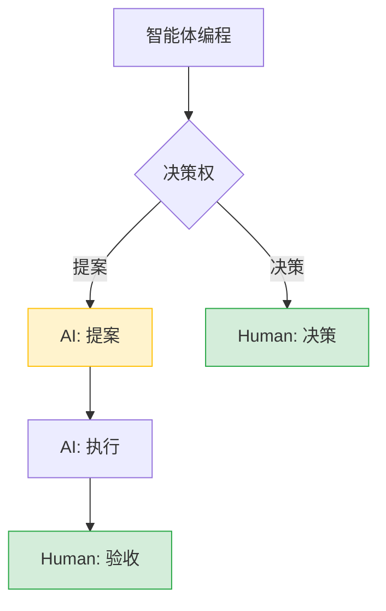
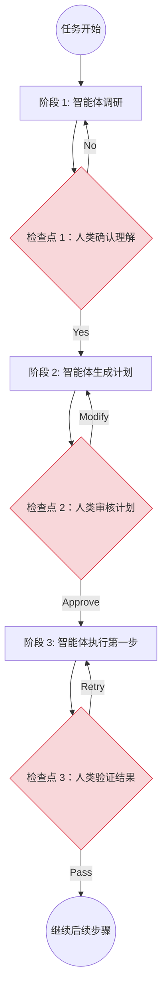
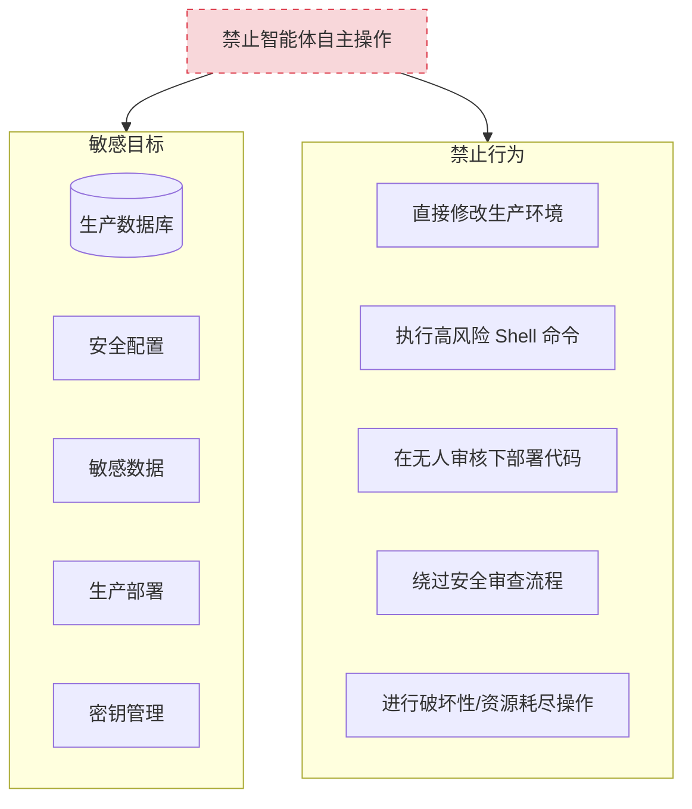
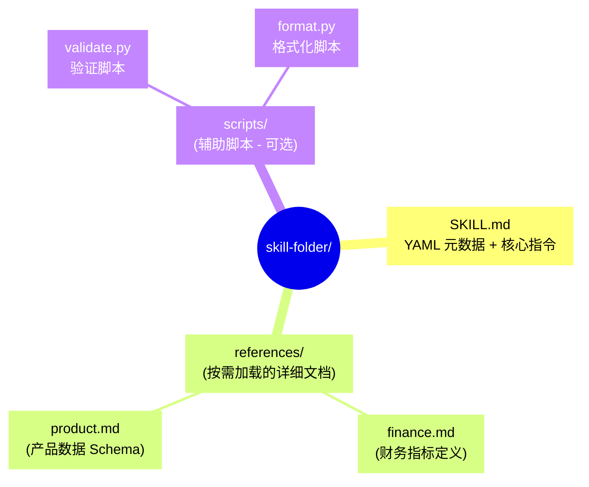
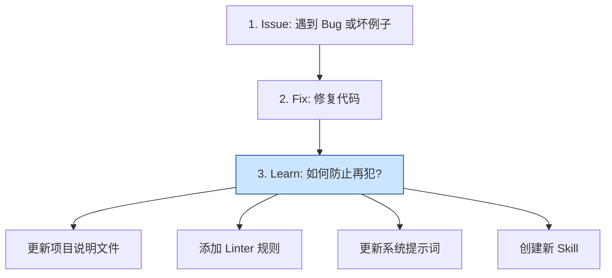
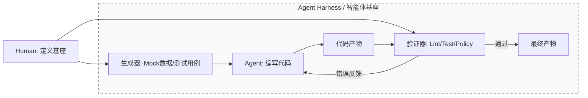
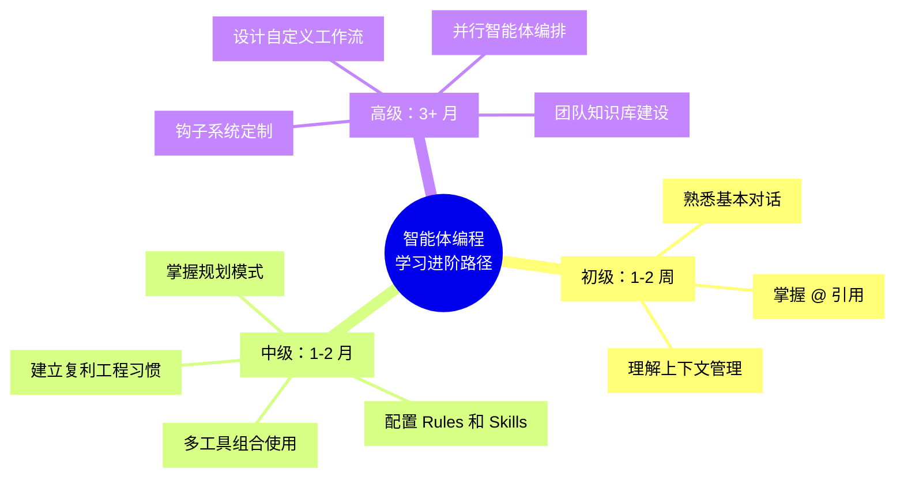

## 10.5 工程化实践

本节汇总智能体编程的工程化实践，聚焦于如何长期、高效、安全地使用智能体进行开发。

### 10.5.1 上下文管理与对话策略

上下文是智能体的“视野”。管理好上下文，是高效协作的基础。

#### 让智能体自己找上下文

不需要手动标记每个文件。现代智能体有强大的搜索工具，按需拉取上下文：

```markdown
❌ 不好的做法：
"请看 @src/api/users.py @src/models/user.py @src/services/user_service.py 
 @src/repositories/user_repo.py @tests/test_users.py 帮我修改用户验证逻辑"

✅ 好的做法：
"帮我修改用户验证逻辑，登录时需要检查用户是否被禁用"
（让智能体自己搜索相关文件）
```

#### 标准化上下文：项目说明文件

虽然智能体擅长搜索，但通过“项目说明文件”（见 [附录 12.3](../12_appendix/12.3_agents_md.md)）提供项目级的“机器可读说明书”，能减少幻觉与不必要的上下文检索时间。这是智能体编程的“地图”。

#### 提升智能体可读性：Agent Legibility

OpenAI 在其工程实践中提出了 **"Agent Legibility"（智能体可读性）** 的概念。这要求我们不仅为人类写代码，更要为智能体优化代码库。

*   **扁平化结构**：避免过深的目录嵌套，让文件路径清晰地反映功能模块。
*   **自描述命名**：函数和变量名应尽可能包含语义信息，减少智能体推理上下文的难度。
*   **显性契约**：使用类型系统（Type Hints）和接口定义（Interfaces）明确数据结构，作为智能体理解代码逻辑的“锚点”。


#### 回退优于修补

> [!TIP]
> **智能体编程黄金法则**：如果智能体的实现偏离了轨道，**不要试图通过后续对话来“修补”它**——这通常会导致代码越来越乱。
> 
> **正确的做法是**：
> 1. 如果你在 Git 环境中，`git reset --hard` 或 `git stash` 回滚更改
> 2. 如果使用规划模式，修改现有计划后重新执行
> 3. 澄清需求，细化步骤，重新运行
> 
> **记住：一次正确的全新生成，永远优于十次修补。**

#### 何时开启新对话与继续对话

| 开启新对话 | 继续对话 |
|-----------|---------|
| 切换到不同任务或功能 | 迭代同一功能 |
| 智能体看起来困惑或重复犯错 | 智能体需要早期对话的上下文 |
| 完成一个逻辑工作单元 | 调试它刚构建的东西 |
| 对话超过 20 轮 | 对话仍然聚焦 |

> **长对话会导致智能体失去焦点**。经过多轮对话和摘要后，上下文积累噪声，智能体可能分心或切换到无关任务。

#### 引用过去的工作

开始新对话时，引用之前的工作记录，而不是复制粘贴整个对话：

```markdown
"继续上次关于认证模块的工作，现在需要添加多因素认证支持"
```

#### 并行智能体与 Git 工作树

利用 Git 工作树，可让多个智能体同时工作而互不干扰：

```
主分支 ─────────────────────────────────────────→
         │ worktree-1              │ worktree-2
         │ 智能体 A: 实现功能 X     │ 智能体 B: 重构模块 Y
         │                         │
         └─────── 合并 ────────────┴────→ 主分支
```

**创建并行工作环境**：

```bash
# 创建工作树

git worktree add ../project-feature-auth -b feature/auth
git worktree add ../project-refactor-api -b refactor/api

# 在不同窗口打开，两个智能体同时工作

# 完成后合并

git merge feature/auth
git merge refactor/api
```

### 10.5.2 代码审查与人类监督

智能体编程的核心原则：**AI 提案，Human 决策**。



图 10-20：智能体编程中的人类监督模型

#### 监督强度分级

| 任务类型 | 风险级别 | 监督要求 |
|---------|---------|---------|
| 格式化、重命名 | 低 | 自动执行，事后检查 |
| 新功能开发 | 中 | 逐步执行，每步确认 |
| 重构核心模块 | 高 | 规划先行，详细审查 |
| 安全相关修改 | 极高 | 专家审查，多人确认 |
| 生产环境操作 | 极高 | 人工执行，智能体仅建议 |

#### 建立检查点

复杂任务的执行应当遵循“计划-执行-检查”的循环：



图 10-21：复杂任务的检查点机制

#### AI 生成代码的审查清单

```markdown
## 功能正确性

- [ ] 代码实现了预期功能
- [ ] 边界情况被正确处理
- [ ] 错误处理完善

## 代码质量

- [ ] 遵循项目代码规范
- [ ] 无明显的性能问题
- [ ] 无重复代码
- [ ] 命名清晰合理

## 安全性

- [ ] 无硬编码的密钥/密码
- [ ] 输入已正确验证
- [ ] 无 SQL 注入风险
- [ ] 无 XSS 风险

## 可维护性

- [ ] 有必要的注释
- [ ] 逻辑清晰易懂
- [ ] 依赖合理

## 测试

- [ ] 有对应的测试用例
- [ ] 测试覆盖关键路径
- [ ] 测试可以通过
```

#### 让智能体自审

```markdown
"审查你刚才生成的代码，检查：
 1. 是否有安全漏洞
 2. 是否遵循了项目的代码规范
 3. 是否有性能问题
 4. 是否需要添加更多测试"
```

### 10.5.3 安全边界


#### 永远不要让智能体做的事情

以下操作应被列入**禁止清单**，必须通过钩子拦截或人工确认：



图 10-22：智能体操作禁止清单（行为与目标）

#### 安全护栏配置

可以通过规则文件配置具体的安全护栏。下面是 cursor 的示例：

```markdown
# rules/security.md

## 禁止操作

- 不要读取或修改 .env 文件
- 不要执行 `rm -rf` 相关命令
- 不要直接操作 production 分支
- 不要输出任何密钥或密码

## 敏感文件保护

以下文件只读，不可修改：
- config/production.yml
- secrets/
- .github/workflows/deploy.yml

## 命令限制

以下命令需要人工确认：
- docker push
- kubectl apply
- npm publish
```

### 10.5.4 知识沉淀体系

传统的 AI 编程是线性的（Prompt → Code），而有效的工程实践致力于构建**具有记忆的系统**。本节将技能系统、钩子系统和复利工程统一为知识沉淀体系。

#### 技能系统

**技能（Skills）** 是一种将过程性知识封装为可复用知识包的高级设计模式。

如果说“工具服务”赋予智能体访问外部系统的能力，那么技能则赋予智能体专业领域知识与稳定工作流，而治具负责提供模拟环境与反馈闭环。

**技能结构**：



图 10-23：技能目录结构思维导图

**SKILL.md 编写规范**：

```markdown
---
name: sql-analysis
description: |
  Use when analyzing business data: revenue, ARR, customer
  segments, product usage. Provides table schemas, metric
  definitions, required filters, and query patterns.
---

# SQL Analysis Skill

## 快速开始工作流

1. **Clarify the request** - 时间范围？客户分群？
2. **Check for existing dashboards** - 查看 references/dashboards.md
3. **Identify the data source** - 优先使用聚合表
4. **Execute the analysis** - 应用必需过滤器

## 标准查询过滤器

- Always exclude test accounts: `WHERE account != 'Test'`
- Always use complete periods only
- Always apply tenant isolation: `WHERE tenant_id = ?`

## 知识库

详细 Schema 见：
- **Revenue & Finance** → `references/finance.md`
- **Product Usage** → `references/product.md`
- **Customer Data** → `references/customer.md`

## 常见错误模式

❌ 不要直接查询 events 表（太大）
✅ 使用 events_daily_agg 聚合表

❌ 不要跨月聚合未完成的月份
✅ 使用 completed_periods 视图
```

**技能设计原则**：

1.  **上下文是昂贵的**：每一个 Token 都要通过“租金”考核。与其写大段原理，不如给出一个精炼的 Example。
2.  **为机器而写**：技能的读者是 AI，不是人类。避免写 changelog、安装指南等人类元数据。
3.  **分层加载**：
    *   **L1 (Metadata)**：始终在上下文中，负责触发。
    *   **L2 (Body)**：触发后加载，核心指令。
    *   **L3 (Resources)**：按需加载，详细文档或大数据表。

**技能构建六步法**：

1.  **Understand**：先手动对话解决问题，理解痛点。
2.  **Plan**：规划哪些作为硬约束（脚本），哪些作为软引（文档）。
3.  **Init**：建立标准目录结构。
4.  **Edit**：填充内容，优先实现依赖的资源（Resources）。
5.  **Validate**：检查格式与命名。
6.  **Iterate**：在实战中打磨，根据 AI 的错误反馈调整指令。

**技能的加载时机**：

| 类型 | 加载时机 | 示例 |
|------|---------|------|
| Rules | 始终加载 | 项目代码规范 |
| Skills | 按需加载 | SQL 分析、代码审查 |
| References | 技能内按需 | 详细 Schema 定义 |

#### 钩子系统

**钩子（Hooks）** 是智能体的生命周期钩子，允许在特定事件发生时自动执行自定义脚本。

**生命周期事件**：

| 钩子 | 触发时机 | 典型用途 |
|------|---------|---------| 
| **PreToolUse** | 工具执行前 | 拦截危险操作、修改参数 |
| **PostToolUse** | 工具执行后 | 自动格式化、审计日志 |
| **PermissionRequest** | 权限请求前 | 自动批准安全命令 |
| **SessionStart** | 会话开始 | 注入项目上下文 |
| **SessionEnd** | 会话结束 | 清理临时文件 |
| **TaskStart** | 任务开始 | 记录任务日志 |
| **TaskEnd** | 任务结束 | 保存执行轨迹 |
| **Error**| 发生错误时 | 错误上报和恢复 |

**钩子实现示例**：

以下是以 TypeScript 编写的一个典型钩子配置示例。虽然这里使用 TS，但钩子的逻辑（拦截、审计、修改）在任何支持插件机制的智能体工具中都是通用的。

```typescript
// .claude/hooks/pre-tool-use.ts
export default async function(context: HookContext) {
  const { tool, params } = context;
  
  // 拦截危险的文件删除
  if (tool === 'file_delete') {
    if (params.path.includes('production')) {
      return {
        block: true,
        message: '禁止删除生产环境文件'
      };
    }
  }
  
  // 审计所有命令执行
  if (tool === 'run_command') {
    await context.log({
      event: 'command_execution',
      command: params.command,
      user: context.user,
      timestamp: new Date()
    });
  }
  
  return { block: false };
}
```

**高级模式：长运行智能体循环**

通过钩子配合技能，可以创建能自主迭代直到成功的“长运行智能体”：

```typescript
// .claude/hooks/grind.ts
// 让智能体"一直改代码直到测试通过"

export default async function(context: HookContext) {
  const MAX_ITERATIONS = 10;
  
  if (context.loopCount < MAX_ITERATIONS) {
    const result = await context.runTests();
    
    if (!result.passed) {
      // 拦截停止信号，返回新的用户消息
      return {
        continue: true,
        message: `测试未通过 (${result.failed}/${result.total})。
错误信息：
${result.errors}

请修复代码并重试。这是第 ${context.loopCount + 1} 次尝试。`
      };
    }
  }
  
  return { continue: false };
}
```

这种模式将“编写-测试-修复”的循环完全自动化，是智能体编程的终极形态之一。

#### 复利工程

复利工程的核心在于构建正向循环——智能体的每一次错误都成为系统进化的养料：



图 10-24：复利工程正向循环

> [!NOTE]
> **版本兼容性提示**：
> 智能体工具更新极快，配置文件的文件名和格式可能随版本变化。请务必查阅工具的最新官方文档，但 **“将隐性知识显性化”** 的复利工程核心思想是永恒的。

#### 版本与兼容性自检

框架、模型与平台的版本变化非常快。为了应对这种变化，建议维护一套**版本管理与兼容性核对的方法**，并把自检拆成“接口、配置、行为”三类：

**接口自检**：
- 工具调用接口：参数结构、返回结构、错误码与重试语义。
- 模型接口：上下文窗口、工具调用能力、结构化输出支持。
- 可观测性接口：链路与跨度数据结构、事件字段、采样策略。

**配置自检**：
- 项目规则文件：位置、格式、加载顺序与覆盖策略。
- 技能与工具服务：目录结构、启用方式、权限与密钥管理。
- 运行模式：审批策略、沙箱策略、网络与文件系统权限。

**行为自检**：
- 任务是否能稳定复现（相同输入的稳定性）。
- 测试与回归是否可自动化运行。
- 失败是否可诊断、可回放、可归因。

与其维护静态的版本号清单表，不如维护一个小而精的**回归样例集**，用来验证升级前后行为是否一致：

1. 选择 10–30 个代表性任务（覆盖工具调用、检索、结构化输出、长任务）。
2. 为每个任务定义验收标准（输出结构、关键字段、允许波动范围）。
3. 每次升级前后跑一次回归，对差异进行记录与解释。

**知识沉淀形式**：

| 形式 | 位置 | 作用 |
|------|------|------|
| 项目说明文件 | 项目根目录 | 项目级知识 |
| Rules | `.agent/rules/` | 行为规则 |
| Skills | `.agent/skills/` | 领域知识 |
| Linter 规则 | ESLint/Pylint 配置 | 自动检查 |
| 测试用例 | tests/ | 回归防护 |

**复利效应**：

随着时间推移，规则与技能会逐步沉淀，带来更低的返工率、更一致的代码风格与更可控的风险边界。

### 10.5.5 基座工程

“基座”（Harness）原指工业生产中用于固定工件、引导刀具的辅助装置。在智能体编程时代，这个概念被重新定义：

> **基座工程**：构建一套包含模拟环境、测试生成器、自动化验证和反馈闭环的“脚手架”，让智能体在其中自主工作并获得准确的反馈。

如果说智能体是“工人”，那么开发者就是“车间设计师”。

#### 核心三要素

一个完整的智能体代码基座（Standard Agent Harness）应包含：

1.  **生成器（Generators）**：自动生成输入数据、测试用例或初始代码骨架。
2.  **验证器（Validators）**：不仅检查语法错误（Linter），还检查逻辑正确性（Tests）和业务规则（Policy）。
3.  **反馈回路（Feedback Loop）**：将验证器的错误信息转化为智能体可读的所谓“修正提示”（Correction Prompt）。



图 10-25：智能体基座工程架构

#### 为什么需要基座？

在传统开发中，如果测试不通过，开发者自己修改代码。而在智能体开发中，**测试报错信息是智能体唯一的“眼睛”**。

*   **没有基座**：智能体写完代码 -> 运行报错 -> 智能体瞎猜 -> 越改越乱。
*   **有基座**：智能体写完代码 -> 基座运行测试 -> 返回精确的错误行号与原因 -> 智能体精准修复。

#### 案例：OpenAI 的 HumanEval 基座

OpenAI 在评估 Codex 能力时，不仅仅是看代码能不能运行，而是构建了一个名为 HumanEval 的基座：
1.  **输入**：函数签名与文档字符串。
2.  **执行**：在一个沙箱容器中运行生成的代码。
3.  **验证**：运行隐藏的单元测试用例。
4.  **反馈**：通过/失败 Pass@k。

在企业落地中，你也应该为你最重要的业务逻辑构建类似的基座，而不是让智能体对着空白编辑器“裸奔”。

### 10.5.6 刻意练习与进阶路径

为什么有些开发者觉得 AI 没用？因为他们没有进行 **刻意练习**。

#### 练习方法

| 练习方式 | 目的 | 实践建议 |
|---------|------|---------| 
| **把 AI 当乐器** | 熟悉“手感” | 每天使用，观察模式 |
| **干净环境实验** | 测试极限 | 在 Side Project 中试验 |
| **刻意犯错** | 理解边界 | 故意给出模糊指令，观察反应 |
| **对比测试** | 发现差异 | 同任务用不同模型/提示词 |
| **复盘分析** | 积累经验 | 记录成功/失败的模式 |

#### 建立肌肉记忆

通过反复练习，建立问题处理的“肌肉记忆”：

```
遇到问题 X ──→ 启动 Y 类型对话

示例：
- 遇到 Bug → Debug Mode + 假设列表
- 新功能 → 规划模式 + TDD
- 重构 → 先画架构图 + 分步执行
- 性能问题 → 让智能体分析并建议
- 文档 → 让智能体基于代码生成
```

#### 学习进阶路径



图 10-26：智能体编程进阶学习路径

### 10.5.7 企业级落地要点

智能体编程在企业落地时，最值得关注的往往不是“平均提升多少”，而是能否建立可复制、可治理的工程体系。下面给出一组更稳定的落地要点：

#### 关键成功因素

1. **开发周期加速**：减少重复劳动，把注意力放在问题定义与验收。
2. **入职时间降低**：把关键知识沉淀为文档、规则与技能，降低口口相传的成本。
3. **质量与一致性**：用测试、lint、审查与护栏把不确定性锁在可控范围内。
4. **知识传承**：隐性知识显性化为规则、技能与可回放的链路。

> [!TIP]
> **案例：OpenAI 的 Harness Engineering**
> 
> OpenAI 曾披露其内部工程实践：通过构建强大的 Harness（治具），他们将大量繁琐的编码工作自动化。工程师不再手动编写 CRUD 代码，而是专注于维护这个“治具系统”——包括各种 Mock 数据、自动化测试生成器和即时反馈机制。这使得少数工程师能够通过智能体驱动海量的功能开发，且保持极高的代码质量。这正是 Agentic Coding 在企业级落地的终极形态。

#### 常见失败模式

| 失败模式 | 原因 | 解决方案 |
|---------|------|---------| 
| “AI 没用” | 缺乏刻意练习 | 投入时间学习工具 |
| 质量下降 | 跳过审查 | 建立审查流程 |
| 知识流失 | 不做沉淀 | 实践复利工程 |
| 安全事故 | 权限过大 | 实施最小权限 |

---

**下一章**: [第十一章：安全、伦理与未来](../11_future/README.md)
