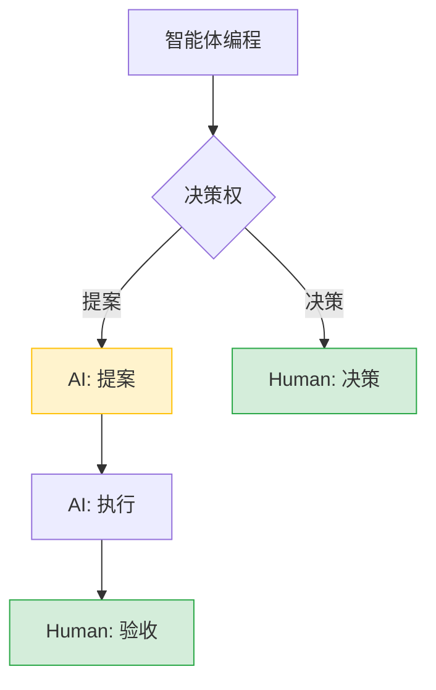
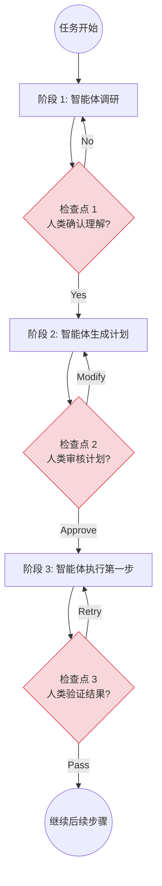
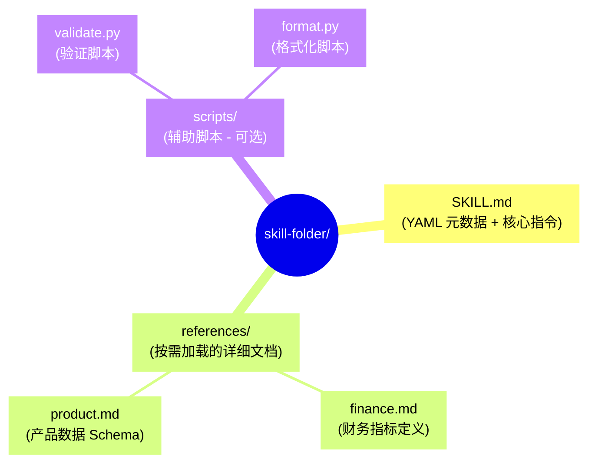
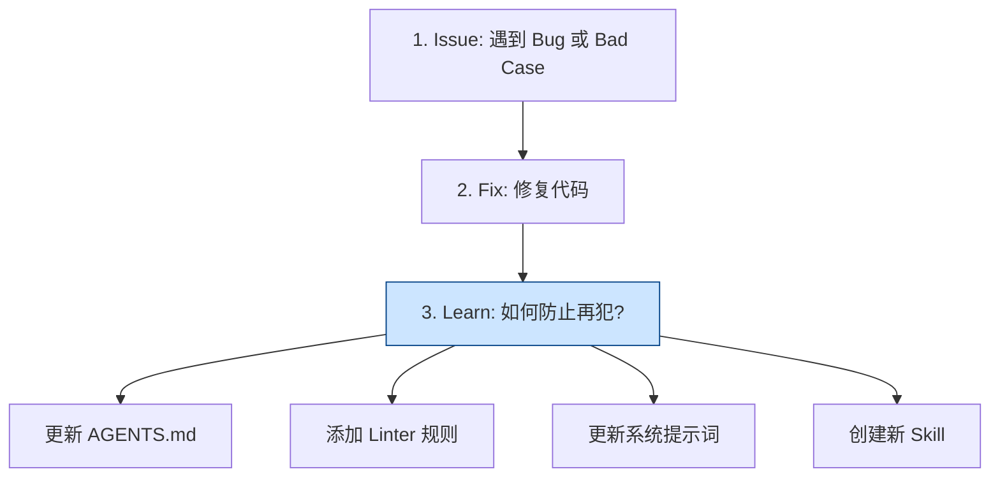
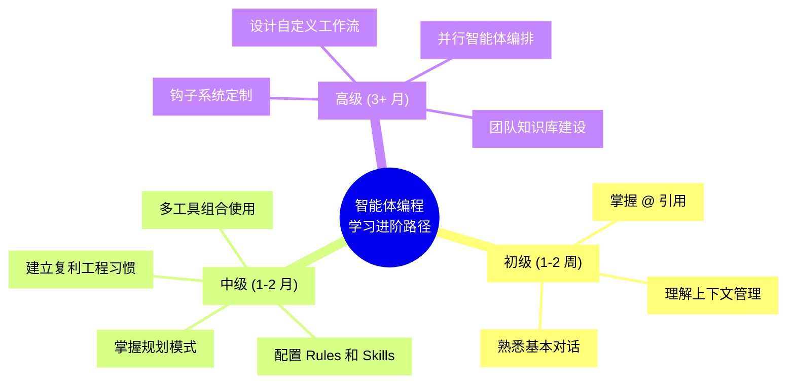

## 10.5 最佳实践与复盘

本节汇总智能体编程的最佳实践，帮助你避免常见陷阱并持续提升效率。

### 10.5.1 提示词最佳实践

#### 提供充足上下文

下面是正反对比示例：

```markdown
❌ 不好的提示词：
"修复这个 bug"

✅ 好的提示词：
"@src/api/users.py 的 get_user 函数在用户 ID 为空时抛出 500 错误。
预期行为：返回 400 Bad Request 并给出清晰的错误信息。
参考 @src/api/orders.py 中类似的错误处理模式。"
```

#### CLEAR 提示词框架

核心要素包含：

```
C - Context    上下文：提供相关背景信息
L - Location   位置：指明具体的文件和位置
E - Expected   预期：描述期望的行为或结果
A - Actual     实际：描述当前的问题或行为
R - Reference  参考：提供相关的参考实现
```

**示例应用**：

```markdown
C：API 使用 FastAPI，认证采用 JWT
L：@src/api/auth.py 的 verify_token 函数
E：Token 过期时应返回 401 并提示刷新
A：目前返回 500 错误，没有有意义的错误信息
R：参考 @src/api/middleware.py 中的错误处理模式
```

#### 分步骤执行复杂任务

与其试图让智能体"一步登天"，不如引导它分而治之：

```markdown
❌ 不好的做法：
"帮我从头开始写一个完整的电商后端"

✅ 好的做法：
1. "先设计数据库 Schema，参考 @docs/requirements.md"
2. "基于 Schema 生成 SQLAlchemy 模型"
3. "实现用户认证模块，使用 JWT"
4. "实现商品 CRUD API"
5. "实现订单处理逻辑"
6. "编写集成测试"
```

#### 验证和测试一起请求

在请求代码生成时，同时要求生成验证逻辑：

```markdown
"实现一个 LRU 缓存类，要求：
1. 支持 get 和 put 操作
2. 容量超限时淘汰最久未使用的项
3. 时间复杂度 O(1)

同时编写完整的单元测试覆盖：
- 基本功能测试
- 边界情况测试
- 并发安全测试"
```

### 10.5.2 保持人类监督

智能体编程黄金法则：



图 10-21：智能体编程中的人类监督模型

#### 监督强度分级

| 任务类型 | 风险级别 | 监督要求 |
|---------|---------|---------|
| 格式化、重命名 | 低 | 自动执行，事后检查 |
| 新功能开发 | 中 | 逐步执行，每步确认 |
| 重构核心模块 | 高 | 规划先行，详细审查 |
| 安全相关修改 | 极高 | 专家审查，多人确认 |
| 生产环境操作 | 极高 | 人工执行，智能体仅建议 |

#### 建立检查点

复杂任务的执行应当遵循"计划-执行-检查"的循环：



图 10-22：复杂任务的检查点机制

### 10.5.3 技能系统设计模式

**技能（Skills）** 是一种将过程性知识封装为可复用知识包的高级设计模式。虽然本节以 **Claude Code**（Anthropic 官方命令行工具）为例，但这套理念同样适用于 Cursor Rules 或自定义 Agent 架构。

#### 什么是技能

如果说 MCP 赋予智能体访问外部系统的能力（"手"），那么技能则赋予智能体专业领域知识（"脑"）。

> **核心比喻**：  
> MCP = 硬件商店的货架（提供工具）  
> Skills = 熟练店员的专业知识（教你如何使用）

#### 技能结构

典型的技能目录结构如下：



图 10-23：技能目录结构思维导图

#### SKILL.md 编写规范

元数据定义示例：

```markdown
---
name: sql-analysis
description: |
  Use when analyzing business data: revenue, ARR, customer 
  segments, product usage. Provides table schemas, metric 
  definitions, required filters, and query patterns.
---

# SQL Analysis Skill

## 快速开始工作流

1. **Clarify the request** - 时间范围？客户分群？
2. **Check for existing dashboards** - 查看 references/dashboards.md
3. **Identify the data source** - 优先使用聚合表
4. **Execute the analysis** - 应用必需过滤器

## 标准查询过滤器

- Always exclude test accounts: `WHERE account != 'Test'`
- Always use complete periods only
- Always apply tenant isolation: `WHERE tenant_id = ?`

## 知识库

详细 Schema 见：
- **Revenue & Finance** → `references/finance.md`
- **Product Usage** → `references/product.md`
- **Customer Data** → `references/customer.md`

## 常见错误模式

❌ 不要直接查询 events 表（太大）
✅ 使用 events_daily_agg 聚合表

❌ 不要跨月聚合未完成的月份
✅ 使用 completed_periods 视图
```

#### 技能的加载时机

| 类型 | 加载时机 | 示例 |
|------|---------|------|
| Rules | 始终加载 | 项目代码规范 |
| Skills | 按需加载 | SQL 分析、代码审查 |
| References | 技能内按需 | 详细 Schema 定义 |

### 10.5.4 钩子系统

**钩子（Hooks）** 是 Claude Code 的生命周期钩子，允许在特定事件发生时自动执行自定义脚本。

#### 生命周期事件

| 钩子 | 触发时机 | 典型用途 |
|------|---------|---------| 
| **PreToolUse** | 工具执行前 | 拦截危险操作、修改参数 |
| **PostToolUse** | 工具执行后 | 自动格式化、审计日志 |
| **PermissionRequest** | 权限请求前 | 自动批准安全命令 |
| **SessionStart** | 会话开始 | 注入项目上下文 |
| **SessionEnd** | 会话结束 | 清理临时文件 |
| **TaskStart** | 任务开始 | 记录任务日志 |
| **TaskEnd** | 任务结束 | 保存执行轨迹 |
| **Error** | 发生错误时 | 错误上报和恢复 |

#### 钩子实现示例

以下是以 TypeScript (Node.js 环境，Claude Code 原生支持) 编写的一个典型钩子配置示例。虽然这里使用 TS，但钩子的逻辑（拦截、审计、修改）在任何支持插件机制的智能体工具中都是通用的。

```typescript
// .claude/hooks/pre-tool-use.ts
export default async function(context: HookContext) {
  const { tool, params } = context;
  
  // 拦截危险的文件删除
  if (tool === 'file_delete') {
    if (params.path.includes('production')) {
      return {
        block: true,
        message: '禁止删除生产环境文件'
      };
    }
  }
  
  // 审计所有命令执行
  if (tool === 'run_command') {
    await context.log({
      event: 'command_execution',
      command: params.command,
      user: context.user,
      timestamp: new Date()
    });
  }
  
  return { block: false };
}
```

#### 高级模式：长运行智能体循环

通过钩子配合技能，可以创建能自主迭代直到成功的"长运行智能体"：

```typescript
// .claude/hooks/grind.ts
// 让智能体"一直改代码直到测试通过"

export default async function(context: HookContext) {
  const MAX_ITERATIONS = 10;
  
  if (context.loopCount < MAX_ITERATIONS) {
    const result = await context.runTests();
    
    if (!result.passed) {
      // 拦截停止信号，返回新的用户消息
      return {
        continue: true,
        message: `测试未通过 (${result.failed}/${result.total})。
错误信息：
${result.errors}

请修复代码并重试。这是第 ${context.loopCount + 1} 次尝试。`
      };
    }
  }
  
  return { continue: false };
}
```

这种模式将"编写-测试-修复"的循环完全自动化，是智能体编程的终极形态之一。

### 10.5.5 复利工程

传统的 AI 编程是线性的（Prompt → Code），而 **复利工程（Compounding Engineering）** 致力于构建具有记忆的系统。

#### 核心循环

复利工程的核心在于构建正向循环：



图 10-24：复利工程正向循环

> [!NOTE]
> **版本兼容性提示**：
> 智能体工具（如 Cursor, Claude Code）更新极快，配置文件的文件名和格式（例如 `.cursorrules` vs `.cursor/rules`）可能会随版本变化。请务必查阅工具的最新官方文档，但 **"将隐性知识显性化"** 的复利工程核心思想是永恒的。

#### 知识沉淀形式

| 形式 | 位置 | 作用 |
|------|------|------|
| AGENTS.md | 项目根目录 | 项目级知识 |
| Rules | `.cursor/rules/` | 行为规则 |
| Skills | 技能目录 | 领域知识 |
| Linter 规则 | ESLint/Pylint 配置 | 自动检查 |
| 测试用例 | tests/ | 回归防护 |

#### 复利效应

随着时间推移，规则和技能的积累会产生显著的复利效应：

```
第 1 个月：项目有 10 条规则
第 2 个月：+15 条规则（来自 bug 修复）
第 3 个月：+20 条规则 + 3 个技能
...
第 12 个月：200+ 条规则 + 15 个技能

结果：
- 智能体错误率下降 80%
- 新人入职时间缩短 60%
- 代码一致性显著提升
```

通过这种方式，智能体的每一次错误都成为系统进化的养料。这是通用模型无法比拟的护城河。

### 10.5.6 刻意练习

为什么有些开发者觉得 AI 没用？因为他们没有进行 **刻意练习**。

#### 练习方法

| 练习方式 | 目的 | 实践建议 |
|---------|------|---------|
| **把 AI 当乐器** | 熟悉"手感" | 每天使用，观察模式 |
| **干净环境实验** | 测试极限 | 在 Side Project 中试验 |
| **刻意犯错** | 理解边界 | 故意给出模糊指令，观察反应 |
| **对比测试** | 发现差异 | 同任务用不同模型/提示词 |
| **复盘分析** | 积累经验 | 记录成功/失败的模式 |

#### 建立肌肉记忆

通过反复练习，建立问题处理的"肌肉记忆"：

```
遇到问题 X ──→ 启动 Y 类型对话

示例：
- 遇到 Bug → Debug Mode + 假设列表
- 新功能 → 规划模式 + TDD
- 重构 → 先画架构图 + 分步执行
- 性能问题 → 让智能体分析并建议
- 文档 → 让智能体基于代码生成
```

#### 学习路径

建议的学习进阶路径：



图 10-25：智能体编程进阶学习路径

### 10.5.7 企业级实践数据

根据 2025-2026 年的行业调研数据，智能体编程已成为前沿科技企业的主流选择：

#### 采用情况

| 指标 | 数据 |
|------|------|
| 企业使用率 | 90% 的企业使用 AI 辅助开发 |
| 效率提升 | 代码生成和文档编写平均节省约 60% 时间 |
| ROI | 平均投资回报期 < 6 个月 |

#### 典型案例

| 公司 | 场景 | 效果 |
|------|------|------|
| Thomson Reuters | 文档搜索 | 从数小时降至分钟级 |
| Dropbox | 代码审查 | 审查周期缩短 40% |
| Zepto | 效率提升 | 客服工单处理时间缩短 20% |
| Kuaishou (快手) | 研发效能 | **AI 代码生成率 >30%**；L2/L3 级需求交付周期缩短 **58%** |
| Stripe | API 文档生成 | 文档覆盖率提升 3 倍 |

#### 关键成功因素

1. **开发周期加速**：消除认知开销，自动追踪依赖关系
2. **入职时间降低**：智能体作为"有完美记忆的搭档"
3. **技术能力民主化**：前端可优化 SQL，后端可改进 UI
4. **知识传承**：隐性知识显性化为规则和技能

#### 常见失败模式

| 失败模式 | 原因 | 解决方案 |
|---------|------|---------|
| "AI 没用" | 缺乏刻意练习 | 投入时间学习工具 |
| 质量下降 | 跳过审查 | 建立审查流程 |
| 知识流失 | 不做沉淀 | 实践复利工程 |
| 安全事故 | 权限过大 | 实施最小权限 |

### 10.5.8 安全边界

#### 永远不要让智能体做的事情

以下操作应被列入**禁止清单**，必须通过钩子拦截或人工确认：


#### 安全护栏配置

可以通过规则文件配置具体的安全护栏：

```markdown
# .cursor/rules/security.md

## 禁止操作

- 不要读取或修改 .env 文件
- 不要执行 `rm -rf` 相关命令
- 不要直接操作 production 分支
- 不要输出任何密钥或密码

## 敏感文件保护

以下文件只读，不可修改：
- config/production.yml
- secrets/
- .github/workflows/deploy.yml

## 命令限制

以下命令需要人工确认：
- docker push
- kubectl apply
- npm publish
```

### 10.5.9 小结

| 最佳实践 | 关键要点 |
|---------|---------|
| **提示词** | CLEAR 框架，分步执行，同时请求测试 |
| **监督** | 分级监督，建立检查点 |
| **技能系统** | 封装领域知识，按需加载 |
| **钩子系统** | 生命周期自动化，长运行智能体 |
| **复利工程** | 每次错误都是进化机会 |
| **刻意练习** | 建立肌肉记忆，持续提升 |
| **安全边界** | 最小权限，禁止清单 |

---

**下一章**: [第十一章：安全、伦理与未来](../11_future/README.md)
