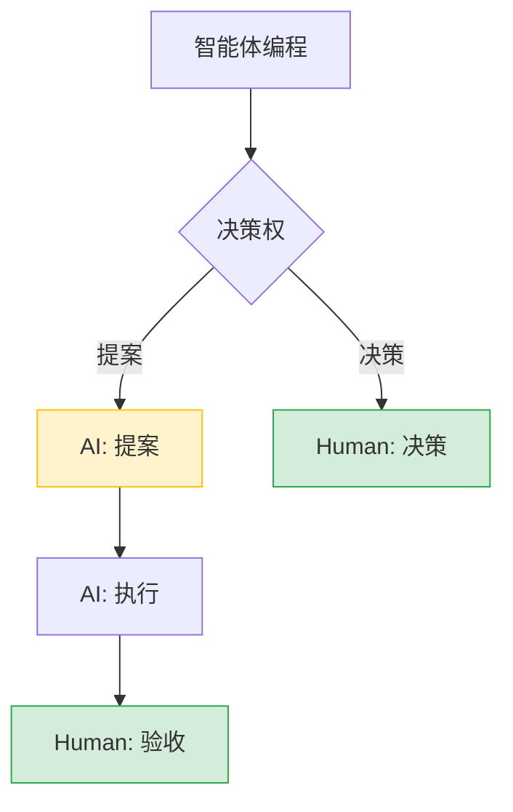
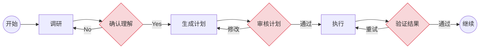
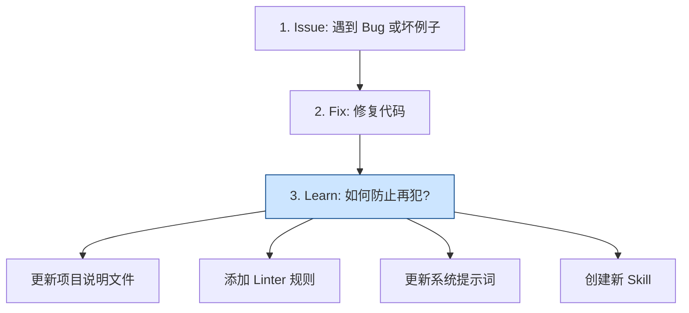
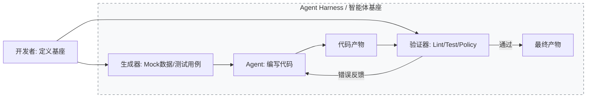
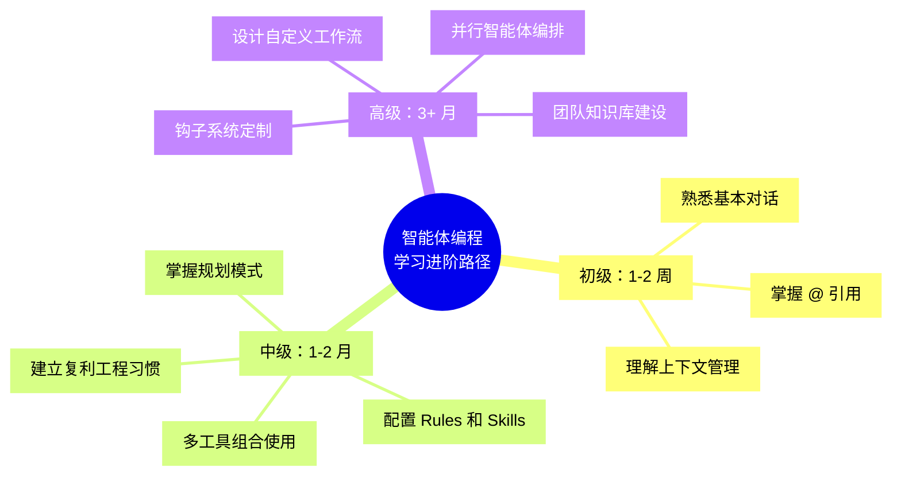

## 10.5 工程化实践

本节汇总智能体编程的工程化实践，聚焦于如何长期、高效、安全地使用智能体进行开发。

### 10.5.1 上下文管理与对话策略

上下文是智能体的“视野”。管理好上下文，是高效协作的基础。

#### 10.5.1.1 让智能体自己找上下文

不需要手动标记每个文件。现代智能体有强大的搜索工具，按需拉取上下文：

```markdown
❌ 不好的做法：
"请看 @src/api/users.py @src/models/user.py @src/services/user_service.py
 @src/repositories/user_repo.py @tests/test_users.py 帮我修改用户验证逻辑"

✅ 好的做法：
"帮我修改用户验证逻辑，登录时需要检查用户是否被禁用"
（让智能体自己搜索相关文件）
```

#### 10.5.1.2 标准化上下文：项目说明文件：AGENTS.md

虽然智能体擅长搜索，但通过统一的“项目说明文件”（推荐命名为 `AGENTS.md`，见 [附录 12.3](../12_appendix/12.3_agents_md.md)）提供项目级的“机器可读说明书”，能减少幻觉与不必要的上下文检索时间。它更适合承载项目目标、代码约定、协作方式、已知陷阱和任务边界，是智能体编程的“地图与说明书”。

开源项目 [agentrc](https://github.com/yeasy/agentrc) 提供了一份经过实战打磨的 `AGENTS.md` 最佳实践模板，内置启动序列、自演化循环、渐进式理解（适用于 brownfield 项目）和注入防御等机制，Claude Code、Codex、Cursor、Copilot、Windsurf、Gemini CLI 等主流工具均可直接读取。

> **重要**：`AGENTS.md` 属于**说明性上下文 / 指令层**，不应被误写成权限执行面的”配置中心”。像 Codex 的 approval mode / sandbox configuration，或 Cursor 的 command approval / auto-run / guardrails，这些才是负责最小权限与执行拦截的真实控制面。把权限控制落在工具自身提供的审批、沙箱、MCP allowlist、hooks 与仓库权限上，通常比把它们塞进 `AGENTS.md` 更可靠。

#### 10.5.1.3 提升智能体可读性：Agent Legibility

OpenAI 在其工程实践中提出了 **“Agent Legibility”（智能体可读性）** 的概念。这要求我们不仅为人类写代码，更要为智能体优化代码库。

*   **扁平化结构**：避免过深的目录嵌套，让文件路径清晰地反映功能模块。
*   **自描述命名**：函数和变量名应尽可能包含语义信息，减少智能体推理上下文的难度。
*   **显性契约**：使用类型系统（Type Hints）和接口定义（Interfaces）明确数据结构，作为智能体理解代码逻辑的“锚点”。

**量化可读性检查 (Quantitative Legibility Checks)**：为了从工程上保障这一点，可以在 CI 流水线中引入针对性指标的防御约束：
1. **圈复杂度 (Cyclomatic Complexity) 限制**：由于 LLM 的注意力窗口在同时追踪过多分支时极易出错，应对复杂度过高（如 McCabe $> 10$）的核心逻辑块进行拦截，强制要求拆分。
2. **类型覆盖率门槛**：强制要求核心模块的方法签名与数据载体必须达到 100% 的类型提示 (Type Hint) 覆盖。
3. **隐式转显式字典拦截**：禁止或强烈警告使用高度动态的黑盒传参（例如 Python 中的 `*args, **kwargs` 满天飞），智能体系统只能基于静态可推导的明确契约生成可靠代码。

#### 10.5.1.4 回退优于修补

> **提示**：智能体编程黄金法则：如果智能体的实现偏离了轨道，**不要试图通过后续对话来“修补”它**——这通常会导致代码越来越乱。
>
> **正确的做法是**：
> 1. 先检查 `git diff` 或变更预览，分清哪些是当前智能体会话的草稿，哪些是你或他人的有效修改
> 2. 优先使用**有边界的回退**：丢弃当前方案、恢复单个文件或单个 hunk、回到独立 worktree / 分支上的上一个稳定检查点，然后从更清晰的 spec 或 prompt 重新开始
> 3. 如果使用规划模式，先修计划再重跑；如果上下文已污染，直接新开对话往往比“补丁式追问”更干净
> 4. `git reset --hard` 之类破坏性命令只能用于你确认没有未提交人工工作、且环境可丢弃的场景；它绝不是共享工作区里的默认正确做法
>
> **记住：一次正确的全新生成，永远优于十次修补。**

#### 10.5.1.5 何时开启新对话与继续对话

| 开启新对话 | 继续对话 |
|-----------|---------|
| 切换到不同任务或功能 | 迭代同一功能 |
| 智能体看起来困惑或重复犯错 | 智能体需要早期对话的上下文 |
| 完成一个逻辑工作单元 | 调试它刚构建的东西 |
| 对话超过 20 轮 | 对话仍然聚焦 |

> **长对话会导致智能体失去焦点**。经过多轮对话和摘要后，上下文积累噪声，智能体可能分心或切换到无关任务。

#### 10.5.1.6 引用过去的工作

开始新对话时，引用之前的工作记录，而不是复制粘贴整个对话：

```markdown
"继续上次关于认证模块的工作，现在需要添加多因素认证支持"
```

#### 10.5.1.7 并行智能体与 Git 工作树

利用 Git 工作树，可让多个智能体同时工作而互不干扰：

```text
主分支 ─────────────────────────────────────────→
         │ worktree-1              │ worktree-2
         │ 智能体 A: 实现功能 X     │ 智能体 B: 重构模块 Y
         │                         │
         └─────── 合并 ────────────┴────→ 主分支
```

**创建并行工作环境**：
下面这组命令的目的，是把“并行开发”变成可回滚、可合并、互不干扰的日常流程。

```bash

 # 创建工作树

git worktree add ../project-feature-auth -b feature/auth
git worktree add ../project-refactor-api -b refactor/api

 # 在不同窗口打开，两个智能体同时工作

 # 完成后合并

git merge feature/auth
git merge refactor/api
```

### 10.5.2 代码审查与人类监督

智能体编程的核心原则：**AI 提案，Human 决策**。


```mermaid
graph TD
    A[智能体编程] --> B{决策权}
    B -- 提案 --> C[AI: 提案]
    B -- 决策 --> D[Human: 决策]
    C --> E[AI: 执行]
    E --> F[Human: 验收]

    style D fill:#d4edda,stroke:#28a745
    style F fill:#d4edda,stroke:#28a745
    style C fill:#fff3cd,stroke:#ffc107
```

图 10-18：智能体编程中的人类监督模型

#### 10.5.2.1 监督强度分级

| 任务类型 | 风险级别 | 监督要求 |
|---------|---------|---------|
| 格式化、重命名 | 低 | 自动执行，事后检查 |
| 新功能开发 | 中 | 逐步执行，每步确认 |
| 重构核心模块 | 高 | 规划先行，详细审查 |
| 安全相关修改 | 极高 | 专家审查，多人确认 |
| 生产环境操作 | 极高 | 人工执行，智能体仅建议 |

#### 10.5.2.2 建立检查点

复杂任务的执行应当遵循“计划-执行-检查”的循环：


```mermaid
graph LR
    Start((开始)) --> R[调研] --> C1{确认理解}
    C1 -- No --> R
    C1 -- Yes --> P[生成计划] --> C2{审核计划}
    C2 -- 修改 --> P
    C2 -- 通过 --> E[执行] --> C3{验证结果}
    C3 -- 重试 --> E
    C3 -- 通过 --> Done((继续))

    style C1 fill:#f8d7da,stroke:#dc3545
    style C2 fill:#f8d7da,stroke:#dc3545
    style C3 fill:#f8d7da,stroke:#dc3545
```

图 10-19：复杂任务的检查点机制

#### 10.5.2.3 AI 生成代码的审查清单

把清单写成固定模板的价值在于：每次评审都能覆盖同一组风险点，避免“凭感觉漏检”。

```markdown

 ## 功能正确性

- [ ] 代码实现了预期功能
- [ ] 边界情况被正确处理
- [ ] 错误处理完善

 ## 代码质量

- [ ] 遵循项目代码规范
- [ ] 无明显的性能问题
- [ ] 无重复代码
- [ ] 命名清晰合理

 ## 安全性

- [ ] 无硬编码的密钥/密码
- [ ] 输入已正确验证
- [ ] 无 SQL 注入风险
- [ ] 无 XSS 风险

 ## 可维护性

- [ ] 有必要的注释
- [ ] 逻辑清晰易懂
- [ ] 依赖合理

 ## 测试

- [ ] 有对应的测试用例
- [ ] 测试覆盖关键路径
- [ ] 测试可以通过
```

#### 10.5.2.4 让智能体自审

```markdown
"审查你刚才生成的代码，检查：
 1. 是否有安全漏洞
 2. 是否遵循了项目的代码规范
 3. 是否有性能问题
 4. 是否需要添加更多测试"
```

#### 10.5.2.5 测试策略

智能体生成的代码具有不确定性，测试是将这种不确定性转化为可控风险的关键手段。

**TDD 驱动智能体**：先写测试，再让智能体实现，是当前最可靠的协作模式。测试既是需求的精确表达，也是智能体自我验证的反馈信号。

```text
开发者：编写测试用例（定义"什么算正确"）
    ↓
智能体：实现代码（让测试通过）
    ↓
验证器：运行测试（提供反馈）
    ↓
智能体：根据失败信息修复（精准迭代）
```

**测试类型选择**：

| 测试类型 | 适用场景 | 与智能体的配合方式 |
|---------|---------|------------------|
| 单元测试 | 纯函数、工具函数 | 智能体擅长，可同时生成实现和测试 |
| 集成测试 | API 端点、服务交互 | 开发者定义测试骨架，智能体填充 |
| 属性测试 | 对抗不确定性 | 用 Hypothesis 等框架定义不变量，智能体实现满足约束的代码 |
| 快照测试 | UI 组件、输出格式 | 首次由智能体生成，后续作为回归防护 |

**关键原则**：测试代码的审查标准应**高于**实现代码——因为测试是验证智能体产出的“裁判”，裁判本身必须可靠。

### 10.5.3 安全边界

#### 10.5.3.1 永远不要让智能体做的事情

以下操作应被列入 **禁止清单**，必须通过产品提供的审批、沙箱、hooks、策略层或人工确认来拦截：

**敏感目标**（禁止智能体自主访问或修改）：生产数据库、安全配置、敏感数据、生产部署流水线、密钥与凭证。

**禁止行为**：

1. 直接修改生产环境
2. 执行高风险 Shell 命令（如 `rm -rf`、`DROP TABLE`）
3. 在无人审核下部署代码
4. 绕过安全审查流程
5. 进行破坏性或资源耗尽操作

#### 10.5.3.2 安全护栏配置

可以通过规则文件配置具体的安全护栏。下面是 Cursor 的示例：

```markdown

 # rules/security.md

 ## 禁止操作

- 不要读取或修改 .env 文件
- 不要执行 `rm -rf` 相关命令
- 不要直接操作 production 分支
- 不要输出任何密钥或密码

 ## 敏感文件保护

以下文件只读，不可修改：
- config/production.yml
- secrets/
- .github/workflows/deploy.yml

 ## 命令限制

以下命令需要人工确认：
- docker push
- kubectl apply
- npm publish
```

### 10.5.4 知识沉淀体系

传统的 AI 编程是线性的（Prompt → Code），而有效的工程实践致力于构建 **具有记忆的系统**。本节将技能系统、钩子系统和复利工程统一为知识沉淀体系。

#### 10.5.4.1 技能系统

**技能（Skills）** 是一种将过程性知识封装为可复用知识包的高级设计模式。如果说“工具服务”赋予智能体访问外部系统的能力，那么技能则赋予智能体专业领域知识与稳定工作流。关于技能的完整定义、目录结构、三阶段加载机制和 SkillsBench 实证分析，详见[第 4.4 节](../04_tools/4.4_skills.md)。

本节聚焦技能在编程实践中的**工程化要点**：

**技能设计原则**：

1.  **上下文是昂贵的**：每一个 Token 都要通过“租金”考核。与其写大段原理，不如给出一个精炼的 Example。
2.  **为机器而写**：技能的读者是 AI，不是人类。避免写 changelog、安装指南等人类元数据。
3.  **分层加载**：L1 (Metadata) 始终在上下文中负责触发；L2 (Body) 触发后加载核心指令；L3 (Resources) 按需加载详细文档。

**技能构建六步法**：

1.  **Understand**：先手动对话解决问题，理解痛点。
2.  **Plan**：规划哪些作为硬约束（脚本），哪些作为软引（文档）。
3.  **Init**：建立标准目录结构。
4.  **Edit**：填充内容，优先实现依赖的资源（Resources）。
5.  **Validate**：检查格式与命名。
6.  **Iterate**：在实战中打磨，根据 AI 的错误反馈调整指令。

**技能的加载时机**：

| 类型 | 加载时机 | 示例 |
|------|---------|------|
| Rules | 始终加载 | 项目代码规范 |
| Skills | 按需加载 | SQL 分析、代码审查 |
| References | 技能内按需 | 详细 Schema 定义 |

#### 10.5.4.2 钩子系统

**钩子（Hooks）** 是智能体的生命周期钩子，允许在特定事件发生时自动执行自定义脚本。

下面这张表应理解为**抽象事件模型**，用于帮助你把 hooks 放到合适的位置；不同产品真正暴露出来的官方 surfaces 并不完全一致。以 Claude Code 当前官方文档为例，事件已经覆盖 session、turn、tool，也扩展到 compaction、worktree、notification 与 elicitation 等面。

| 事件层级 | 抽象事件 | 当前常见官方 surface 示例 | 典型用途 |
|---------|---------|------------------------|---------|
| **Session** | 会话开始 / 会话结束 | `SessionStart`、`SessionEnd` | 注入项目上下文、清理收尾 |
| **Turn** | 用户提交 / 停止 / 停止失败 | `UserPromptSubmit`、`Stop`、`StopFailure` | 校验 prompt、生成结束后审计 |
| **Tool** | 工具前 / 工具后 | `PreToolUse`、`PostToolUse` | 拦截危险命令、格式化、审计 |
| **Context** | 压缩前 / 压缩后 | `PreCompact`、`PostCompact` | 总结上下文、记录压缩点 |
| **Workspace** | 工作树创建 / 删除 | `WorktreeCreate`、`WorktreeRemove` | 隔离环境准备与清理 |
| **Interaction** | 通知 / 追问 / 用户补充结果 | `Notification`、`Elicitation`、`ElicitationResult` | 人机确认、补充缺失信息 |

**钩子实现示例**：

以下是概念性伪代码，展示钩子系统的核心设计思路（拦截、审计、修改）。实际语法因工具而异，例如 Claude Code 当前支持 command / http / prompt / agent 等 hook 类型；其他工具可能只暴露其中一部分能力，但底层逻辑是相通的。

```typescript
// 概念性伪代码：工具执行前的拦截钩子
export default async function(context: HookContext) {
  const { tool, params } = context;

  // 拦截危险的文件删除
  if (tool === 'file_delete') {
    if (params.path.includes('production')) {
      return {
        block: true,
        message: '禁止删除生产环境文件'
      };
    }
  }

  // 审计所有命令执行
  if (tool === 'run_command') {
    await context.log({
      event: 'command_execution',
      command: params.command,
      user: context.user,
      timestamp: new Date()
    });
  }

  return { block: false };
}
```

**高级模式：长运行智能体循环**

通过钩子配合技能，可以创建能自主迭代直到成功的“长运行智能体”。不过这依赖具体产品是否暴露了足够丰富的事件面与可继续执行的控制返回值：

```typescript
// 概念性伪代码：让智能体"一直改代码直到测试通过"

export default async function(context: HookContext) {
  const MAX_ITERATIONS = 10;

  if (context.loopCount < MAX_ITERATIONS) {
    const result = await context.runTests();

    if (!result.passed) {
      // 拦截停止信号，返回新的用户消息
      return {
        continue: true,
        message: `测试未通过 (${result.failed}/${result.total})。
错误信息：
${result.errors}

请修复代码并重试。这是第 ${context.loopCount + 1} 次尝试。`
      };
    }
  }

  return { continue: false };
}
```

这种模式将“编写-测试-修复”的循环完全自动化，是智能体编程的终极形态之一。

#### 10.5.4.3 复利工程

复利工程的核心在于构建正向循环——智能体的每一次错误都成为系统进化的养料：


```mermaid
graph TD
    Issue[1. Issue: 遇到 Bug 或坏例子] --> Fix[2. Fix: 修复代码]
    Fix --> Learn[3. Learn: 如何防止再犯?]
    Learn --> Docs[更新项目说明文件]
    Learn --> Rule[添加 Linter 规则]
    Learn --> Prompt[更新系统提示词]
    Learn --> Skill[创建新 Skill]

    style Learn fill:#cce5ff,stroke:#004085
```

图 10-20：复利工程正向循环

> **注意**：版本兼容性提示：智能体工具更新极快，配置文件的文件名和格式可能随版本变化。请务必查阅工具的最新官方文档，但 **“将隐性知识显性化”** 的复利工程核心思想是永恒的。

#### 10.5.4.4 版本与兼容性自检

框架、模型与平台的版本变化非常快。为了应对这种变化，建议维护一套 **版本管理与兼容性核对的方法**，并把自检拆成“接口、配置、行为”三类：

**接口自检**：
- 工具调用接口：参数结构、返回结构、错误码与重试语义。
- 模型接口：上下文窗口、工具调用能力、结构化输出支持。
- 可观测性接口：链路与跨度数据结构、事件字段、采样策略。

**配置自检**：
- 项目规则文件：位置、格式、加载顺序与覆盖策略。
- 技能与工具服务：目录结构、启用方式、权限与密钥管理。
- 运行模式：审批策略、沙箱策略、网络与文件系统权限。

**行为自检**：
- 任务是否能稳定复现（相同输入的稳定性）。
- 测试与回归是否可自动化运行。
- 失败是否可诊断、可回放、可归因。

与其维护静态的版本号清单表，不如维护一个小而精的 **回归样例集**，用来验证升级前后行为是否一致：

1. 选择 10–30 个代表性任务（覆盖工具调用、检索、结构化输出、长任务）。
2. 为每个任务定义验收标准（输出结构、关键字段、允许波动范围）。
3. 每次升级前后跑一次回归，对差异进行记录与解释。

**知识沉淀形式**：

| 形式 | 位置 | 作用 |
|------|------|------|
| 项目说明文件 | 项目根目录 | 项目级知识 |
| Rules | `.agent/rules/` | 行为规则 |
| Skills | `.agent/skills/` | 领域知识 |
| Linter 规则 | ESLint/Pylint 配置 | 自动检查 |
| 测试用例 | tests/ | 回归防护 |

**复利效应**：

随着时间推移，规则与技能会逐步沉淀，带来更低的返工率、更一致的代码风格与更可控的风险边界。

### 10.5.5 驾驭工程实操

驾驭工程（Harness Engineering）的理论基础与六大组成已在[第 10.1.6 节](10.1_paradigm.md)详细阐述。本节聚焦**如何在自己的项目中落地驾驭系统**。

#### 10.5.5.1 最小可行驾驭系统

为项目构建驾驭系统不需要一步到位。以下是从零开始的推荐路径：

1.  **第一步：可运行的测试套件**——这是驾驭系统的最低要求。没有测试，智能体就是在“裸奔”。哪怕只有 10 个核心路径的测试用例，也比 0 个好得多。
2.  **第二步：结构化的错误反馈**——确保测试失败时输出包含文件名、行号和错误原因，而非模糊的 traceback。这是智能体精准修复的前提。
3.  **第三步：Mock 数据与生成器**——为 API 调用、数据库查询等外部依赖创建稳定的 Mock，让智能体在确定性环境中工作。


```mermaid
graph LR
    Human[开发者: 定义基座] --> Generators
    Human --> Validators

    subgraph Harness [Agent Harness / 智能体基座]
        Generators[生成器: Mock数据/测试用例] --> Agent
        Agent[Agent: 编写代码] --> Code[代码产物]
        Code --> Validators[验证器: Lint/Test/Policy]
        Validators -- 错误反馈 --> Agent
        Validators -- 通过 --> Result[最终产物]
    end

    style Harness fill:#f8f9fa,stroke:#6c757d,stroke-dasharray: 5 5
```

图 10-21：智能体驾驭工程架构

#### 10.5.5.2 业界驾驭系统案例

以下是几个代表性的驾驭系统实践，可作为自建的参考：

| 驾驭系统 | 构建者 | 输入 | 验证方式 | 反馈信号 |
|------|--------|------|---------|---------|
| **HumanEval** | OpenAI (2021) | 函数签名 + docstring | 沙箱运行隐藏单元测试 | Pass@k |
| **SWE-bench** | Princeton (2024) | GitHub Issue 描述 | 运行仓库原有测试套件 | 测试通过率 |
| **内部 CI 驾驭系统** | 企业团队 | 需求描述 + 代码骨架 | Lint + 单元测试 + 集成测试 | 结构化错误报告 |

**关键启示**：不要让智能体对着空白编辑器“裸奔”。为最重要的业务逻辑构建类似的驾驭系统——哪怕是一组 Makefile 目标加上几十个测试用例，也能显著提高智能体的产出质量。

### 10.5.6 刻意练习与进阶路径

为什么有些开发者觉得 AI 没用？因为他们没有进行 **刻意练习**。

#### 10.5.6.1 练习方法

| 练习方式 | 目的 | 实践建议 |
|---------|------|---------|
| **把 AI 当乐器** | 熟悉“手感” | 每天使用，观察模式 |
| **干净环境实验** | 测试极限 | 在 Side Project 中试验 |
| **刻意犯错** | 理解边界 | 故意给出模糊指令，观察反应 |
| **对比测试** | 发现差异 | 同任务用不同模型/提示词 |
| **复盘分析** | 积累经验 | 记录成功/失败的模式 |

#### 10.5.6.2 建立肌肉记忆

通过反复练习，建立问题处理的“肌肉记忆”：

```text
遇到问题 X ──→ 启动 Y 类型对话

示例：
- 遇到 Bug → Debug Mode + 假设列表
- 新功能 → 规划模式 + TDD
- 重构 → 先画架构图 + 分步执行
- 性能问题 → 让智能体分析并建议
- 文档 → 让智能体基于代码生成
```

#### 10.5.6.3 学习进阶路径


```mermaid
mindmap
    root(("智能体编程<br>学习进阶路径"))
        Junior["初级：1-2 周"]
            Basic[熟悉基本对话]
            Ref[掌握 @ 引用]
            Context[理解上下文管理]
        Intermediate["中级：1-2 月"]
            Plan[掌握规划模式]
            Config[配置 Rules 和 Skills]
            Compound[建立复利工程习惯]
            Tools[多工具组合使用]
        Senior["高级：3+ 月"]
            Workflow[设计自定义工作流]
            Hooks[钩子系统定制]
            Parallel[并行智能体编排]
            KB[团队知识库建设]
```

图 10-22：智能体编程进阶学习路径

### 10.5.7 企业级落地要点

智能体编程在企业落地时，最值得关注的往往不是“平均提升多少”，而是能否建立可复制、可治理的工程体系。下面给出一组更稳定的落地要点：

#### 10.5.7.1 关键成功因素

1. **开发周期加速**：减少重复劳动，把注意力放在问题定义与验收。
2. **入职时间降低**：把关键知识沉淀为文档、规则与技能，降低口口相传的成本。
3. **质量与一致性**：用测试、lint、审查与护栏把不确定性锁在可控范围内。
4. **知识传承**：隐性知识显性化为规则、技能与可回放的链路。

> **提示**：案例：OpenAI 的 Harness Engineering
>
> OpenAI 曾披露其内部工程实践：通过构建强大的 Harness（治具），他们将大量繁琐的编码工作自动化。工程师不再手动编写 CRUD 代码，而是专注于维护这个“治具系统”——包括各种 Mock 数据、自动化测试生成器和即时反馈机制。这使得少数工程师能够通过智能体驱动海量的功能开发，且保持极高的代码质量。这正是 Agentic Coding 在企业级落地的终极形态。

#### 10.5.7.2 常见失败模式

| 失败模式 | 原因 | 解决方案 |
|---------|------|---------|
| “AI 没用” | 缺乏刻意练习 | 投入时间学习工具 |
| 质量下降 | 跳过审查 | 建立审查流程 |
| 知识流失 | 不做沉淀 | 实践复利工程 |
| 安全事故 | 权限过大 | 实施最小权限 |

---

**下一章**: [第十一章：安全、伦理与未来](../11_future/README.md)
