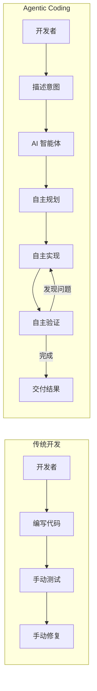
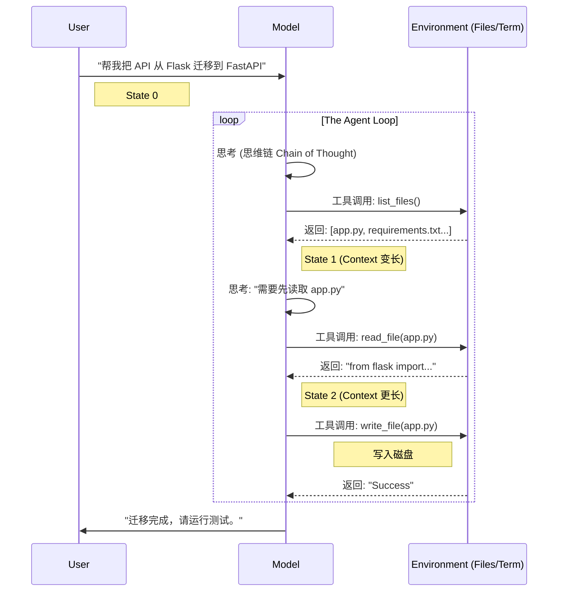

## 11.6 Agentic Coding 实践

2025 年，软件开发领域正经历一场由 AI 智能体驱动的范式转变。从 **Vibe Coding** 到 **Agentic Coding**，开发者的角色正在从"写代码的人"转变为"编排 AI 的人"。

### 11.6.1 什么是 Vibe Coding

**Vibe Coding** 是 AI 专家 Andrej Karpathy 在 2025 年初提出的概念，描述了一种全新的编程风格：

> "完全沉浸在'氛围'中，拥抱指数级增长，忘掉代码的存在。"
> — Andrej Karpathy

#### 核心理念

```
传统编程                      Vibe Coding
    │                             │
    ▼                             ▼
┌─────────────┐            ┌─────────────┐
│ 思考算法     │            │ 描述意图     │
│ 设计结构     │            │ "我想要..."  │
│ 编写代码     │            │             │
│ 调试错误     │      ──→   │ AI 生成代码  │
│ 优化性能     │            │ AI 调试修复  │
│ 编写测试     │            │ AI 编写测试  │
└─────────────┘            └─────────────┘
```

#### Vibe Coding 的特点

| 特点 | 描述 |
|------|------|
| 自然语言驱动 | 用口语化的方式描述需求 |
| 快速原型 | 分钟级别生成可运行代码 |
| 迭代对话 | 通过对话不断调整优化 |
| 低门槛 | 非程序员也能"编程" |

### 11.6.2 什么是 Agentic Coding

**Agentic Coding** 是 Vibe Coding 的进化版——AI 不仅仅生成代码，而是作为一个**自主智能体**，能够：

1. **理解**整个代码库的结构和上下文
2. **规划**实现方案并分解任务
3. **执行**代码编写、修改、重构
4. **验证**运行测试、修复错误
5. **迭代**根据反馈自我改进



### 11.6.3 原理解析：解构智能体循环

要真正掌握 Agentic Coding，我们必须打开 AI 的"黑盒"，看看它是如何工作的。OpenAI 在 *Unrolling the Codex Agent Loop* 中不仅展示了 Codex CLI 的设计，更揭示了所有 Coding Agent 的通用原理。

#### 核心循环 (The Agent Loop)

智能体并不是一次性生成完整代码的神谕，而是一个**状态机**。它的工作流程是一个被"展开"（Unrolled）的循环：



#### 停止序列 (Stop Sequences) 的魔法

模型（Model）本质上是一个"文本补全机"。如果没有约束，它会在生成 `tool_call()` 后继续幻想出工具的返回结果。

智能体工作的关键在于 **Stop Sequence**。
*   当模型生成具体的停止符（如 `\nObservation:` 或 `</tool_code>`）时，推理强制暂停。
*   控制权交还给 Python/Rust 宿主程序。
*   宿主程序执行真正的 Shell 命令或文件读写。
*   宿主将结果拼接到 **提示词 (Prompt)** 后面，**再次调用模型**。

这就是为什么有时候你会感觉到智能体 "卡顿"了一下——那正是由于它停止生成，等待工具执行完并返回结果的时刻。

#### 不可见的状态 (The Invisible State)

在 Chat 界面上，你只看到了"你好"和"结果"。但在冰山之下，Context Window 里堆积了成千上万行你没看见的：
*   **LSP 诊断信息**：你没运行代码，但智能体已经在后台运行了 Linter 并看到了 5 个报错。
*   **文件树快照**：智能体默默看了一眼目录结构。
*   **自我修正的历史**：智能体可能尝试了 3 次修改 import 路径失败，第 4 次才成功，但只展示了最后的结果。

理解这一点，你就会明白：**当智能体表现不佳时，往往不是它"笨"，而是不可见的状态 (上下文 Context) 被污染了。** 重置对话 (New Chat) 就是清空这些不可见噪音的最有效手段。

#### Agent Harness：驾驭模型的缰绳

根据 Cursor 团队的定义，一个完整的 **Agent Harness**（Agent 驾驭系统）由三个核心组件构成：
1.  **Instructions**：系统提示词和规则（Rules），引导行为。
2.  **Tools**：文件编辑、代码搜索、终端执行等能力。
3.  **User Messages**：用户的 **提示词 (prompt)** 和后续指令。

不同的模型（如 Claude 3.5 Sonnet vs GPT-4o）对同一套 Harness 的反应不同。高效的 Agentic Coding 需要我们学会如何通过 Rules 和 Skills 来调整这就 Harness。

### 11.6.4 主流 Agentic Coding 工具

#### Cursor

Cursor 是 2025 年最流行的 AI 原生 IDE，基于 VS Code 构建：

**核心能力**：
- **全代码库理解**：索引整个项目，理解文件关系和代码逻辑
- **智能体模式**：自主完成复杂任务，跨文件修改
- **Composer**：多文件编辑的对话界面
- **@ 引用**：精确指定上下文（@文件、@函数、@文档）

```
用户：@main.py 这个函数有性能问题，用户量大时会很慢。帮我优化并添加缓存。

Cursor 智能体：
1. 分析 main.py 中的函数...
2. 识别性能瓶颈：N+1 查询问题
3. 规划优化方案：
   - 添加 Redis 缓存层
   - 批量查询优化
   - 添加缓存失效逻辑
4. 修改 main.py...
5. 创建 cache.py 缓存模块...
6. 更新 requirements.txt 添加 redis 依赖...
7. 运行测试验证...

完成！已优化函数并添加缓存，响应时间从 2.3s 降至 45ms。
```

#### Claude Code

Claude Code 是 Anthropic 的 CLI 工具，专为终端工作流设计：

**特点**：
- 命令行原生，适合 DevOps 和后端开发
- 强大的代码理解和生成能力
- 支持长上下文（200K tokens）
- 与 Git 工作流深度集成

```bash
# 安装
npm install -g @anthropic-ai/claude-code

# 使用
claude "重构这个目录下的测试文件，使用 pytest 风格"
claude "分析最近 10 个 commit，生成 CHANGELOG"
claude "找出所有未处理的边界情况并添加测试"
```

#### GitHub Copilot Agent Mode

GitHub Copilot 的智能体模式，深度集成 GitHub 生态：

**场景**：
- Issue → 代码：自动根据 Issue 生成 PR
- Review Agent：自动代码审查和修复建议
- Security Agent：自动检测和修复安全漏洞

```yaml
# .github/copilot-agent.yml
on:
  issues:
    types: [labeled]

jobs:
  implement:
    if: contains(github.event.label.name, 'copilot-implement')
    runs-on: ubuntu-latest
    steps:
      - uses: github/copilot-agent@v1
        with:
          task: implement-issue
          auto-pr: true
```

### 11.6.5 开发者角色的转变

#### 从"写代码"到"编排 AI"

```
传统技能栈                    Agentic 时代技能栈
├── 语法精通                  ├── 系统设计思维
├── 算法背诵                  ├── 需求拆解能力
├── 调试技巧                  ├── Prompt Engineering
├── 框架熟练                  ├── Context Engineering
└── 手速快                    ├── AI 工具链整合
                              └── 验收与质量把控
```

#### 新工作流

```python
class AgenticDeveloper:
    """Agentic 时代的开发者工作流"""
    
    def develop_feature(self, requirement: str):
        # 1. 理解并拆解需求
        tasks = self.decompose_requirement(requirement)
        
        # 2. 准备上下文
        context = self.prepare_context(
            relevant_files=self.find_related_code(tasks),
            documentation=self.fetch_docs(tasks),
            examples=self.find_similar_implementations(tasks)
        )
        
        # 3. 委托 AI 智能体执行
        for task in tasks:
            result = self.ai_agent.execute(
                task=task,
                context=context,
                constraints=self.get_constraints()  # 代码规范、安全要求等
            )
            
            # 4. 验收审查
            if not self.review(result):
                self.ai_agent.revise(result, self.feedback)
        
        # 5. 集成测试
        self.run_integration_tests()
        
        # 6. 文档更新
        self.ai_agent.update_documentation()
```

### 11.6.6 最佳实践

#### 提供充足上下文

```markdown
❌ 不好的 Prompt：
"修复这个 bug"

✅ 好的 **提示词 (Prompt)**：
"@src/api/users.py 的 get_user 函数在用户 ID 为空时抛出 500 错误。
预期行为：返回 400 Bad Request 并给出清晰的错误信息。
参考 @src/api/orders.py 中类似的错误处理模式。"
```

#### 分步骤执行复杂任务

```markdown
❌ 不好的做法：
"帮我从头开始写一个完整的电商后端"

✅ 好的做法：
1. "先设计数据库 Schema，参考 @docs/requirements.md"
2. "基于 Schema 生成 SQLAlchemy 模型"
3. "实现用户认证模块，使用 JWT"
4. "实现商品 CRUD API"
5. ...
```

#### 验证和测试

```python
# 让 AI 同时生成代码和测试
prompt = """
实现一个 LRU 缓存类，要求：
1. 支持 get 和 put 操作
2. 容量超限时淘汰最久未使用的项
3. 时间复杂度 O(1)

同时编写完整的单元测试覆盖：
- 基本功能
- 边界情况
- 并发安全
"""
```

#### 保持人类监督

```
Agentic Coding 黄金法则：
├── ✅ AI 生成，人类审查
├── ✅ AI 提案，人类决策
├── ✅ AI 执行，人类验收
├── ❌ 完全自动化关键系统
└── ❌ 跳过代码审查直接部署
```

### 11.6.7 AI 友好的开发者体验 (DevEx for AI)

对人类难的东西，对 AI 也难。**投资于传统的开发者体验（DevEx）就是投资于 AI 的表现。**

#### 1. 更快的反馈循环
*   AI 每一轮都要等待。如果测试要跑 10 分钟，智能体会耗尽上下文或失去耐心（尝试跳过测试）。
*   **目标**：秒级单元测试，快速增量构建。

#### 2. 清晰的架构
*   混乱的依赖关系会让 AI 迷失方向（修改 A 文件导致 B 崩溃）。
*   单文件职责清晰，AI 才能精准手术。

#### 3. 显式优于隐式
*   Human: 推断 `ctx` 对象里有什么。
*   AI: 需要明确的 Type Hint 和文档。

### 11.6.8 Cursor 智能体进阶实践

根据 Cursor 团队的官方最佳实践总结，以下技术能显著提升智能体的工作效率。

#### Plan Mode：规划先于执行

在 Cursor 中按 `Shift+Tab` 可激活 Plan Mode。进入该模式后，智能体不会立即编写代码，而是：

1. **调研代码库**：搜索相关文件，理解现有结构
2. **提出澄清问题**：确认需求边界和约束条件
3. **创建实施计划**：生成可编辑的 Markdown 计划文档
4. **等待批准**：用户确认后才开始实现

```
┌─────────────────────────────────────────────────────┐
│                   Plan Mode 工作流                   │
├─────────────────────────────────────────────────────┤
│  用户请求 → 代码库调研 → 澄清提问 → 生成计划       │
│                                    ↓                │
│  用户审核 ← 修改计划 ← 计划文档 (.cursor/plans/)   │
│                                    ↓                │
│                           批准后开始实现             │
└─────────────────────────────────────────────────────┘
```

> [!TIP]
> **从计划重来**：如果智能体的实现偏离预期，与其通过追问修补，不如回退更改、细化计划后重新执行——这通常更快且结果更干净。

#### 上下文管理策略

**让智能体自己发现上下文**：不必手动 @ 标记每个文件。Cursor 智能体具备 grep 和语义搜索能力，能根据语义自动定位相关代码。只有当你明确知道具体文件时才手动指定，否则包含无关文件反而会干扰智能体判断。

**何时开启新对话**：
- ✅ 切换到不同任务或功能模块时
- ✅ 智能体持续犯相同错误时
- ✅ 完成一个逻辑单元的工作后
- ❌ 仍在迭代同一功能时
- ❌ 调试智能体刚刚构建的内容时

**引用历史**：使用 `@Past Chats` 引用先前对话，比复制粘贴整段历史更高效——智能体会选择性读取相关部分。

**Rules 与 Skills 配置**：

```
.cursor/
├── rules/              # Static Context：始终加载的静态规则
│   └── project.md      # 项目规范、命令、代码风格
├── skills/             # Dynamic Capabilities：按需加载的动态技能
│   └── SKILL.md        # 特定领域的工作流程
└── commands/           # Custom Commands：自定义斜杠命令
    └── pr.md           # 如 /pr 创建 PR 的流程
```

-   **Rules (Static)**：相当于智能体的"肌肉记忆"。适合放置 `npm run build` 命令、"使用 ES Modules"等通用规范。
-   **Skills (Dynamic)**：相当于智能体的"工具箱"。只有在处理特定任务（如"分析财务数据"）时才会被智能体主动调用。

> [!TIP]
> **不要过度设计**：Rules 应该保持精简。只有当智能体反复犯同一个错误时，才将其添加为 Rule。

#### 视觉能力

智能体不仅能读代码，还能"看"世界。
-   **Design to Code**：直接粘贴 UI 设计图或草图，让智能体实现布局和样式。
-   **Visual Debugging**：遇到 UI 错位或报错弹窗，与其费力描述，不如直接截图发给智能体。"看图找 Bug"往往比文字描述更精准。

#### 云端智能体与并行开发

对于耗时较长或独立的任务，可以将其委托给 **Cloud Agent**（云端智能体），从而释放本地开发环境：
-   **适用场景**：编写全套单元测试、更新旧文档、大范围重构。
-   **工作流**：在本地 Cursor 中 @Cloud Agent (或相应指令)，描述任务。云端智能体会在独立的沙箱环境中克隆仓库、通过 PR 提交变更。
-   **Kanban 管理**：可以在 Web 界面上像管理看板一样管理多个并行工作的云端智能体。

#### 并行智能体与 Worktree

Cursor 原生支持 Git worktree，可让多个智能体同时工作而互不干扰：

```
主分支 ─────────────────────────────────────────→
         │ worktree-1              │ worktree-2
         │ 智能体 A: 实现功能 X     │ 智能体 B: 重构模块 Y
         │                         │
         └─────── 合并 ────────────┴────→ 主分支
```

**多模型比较**：对同一问题同时调用多个模型，Cursor 会并排展示结果并推荐最优方案。这对困难问题特别有效——不同模型可能采取不同策略。

#### Debug Mode

当常规交互难以定位 bug 时，Debug Mode 提供系统化的排查流程：

1. **生成多个假设**：智能体列出可能的故障原因
2. **自动插桩**：在关键位置添加日志语句
3. **收集运行时数据**：用户复现 bug 时捕获实际行为
4. **证据驱动修复**：基于实际数据而非猜测定位根因

**适用场景**：
- 可复现但原因不明的 bug
- 竞态条件和时序问题
- 性能问题和内存泄漏
- 曾经正常但现在失效的回归问题

> [!TIP]
> **提供详细的复现步骤**：Debug Mode 的效果取决于你描述问题的精确程度。越具体的复现路径，智能体插入的监测点越有针对性。

### 11.6.9 Claude Skills 系统

**Skills** 是 Claude Code 的核心扩展机制，允许将团队的过程性知识封装为可复用的知识包。

#### 什么是 Skills

如果说 MCP 赋予 Claude 访问外部系统的能力（"手"），那么 Skills 则赋予 Claude 专业领域知识（"脑"）。

> **核心比喻**：  
> MCP = 硬件商店的货架（提供工具）  
> Skills = 熟练店员的专业知识（教你如何使用）

#### Skills 解决的问题

团队积累的硬知识——哪些表是真相来源、为什么某些过滤器必须应用、不同场景下收入如何计算——这些 Claude 无法从公开数据中学习。没有 Skills，每次会话都需要重复解释。

#### 渐进式披露

Skills 的关键设计是**渐进式披露（Progressive Disclosure）**：

```
Claude 始终可见：
├── Skills 索引（名称 + 描述，约 100 词/skill）
│
用户提问"分析收入数据"
│
├── Claude 识别相关 Skill，加载核心指令
│
└── 执行时按需加载详细 Schema 定义
```

这解决了"完整知识"与"有限上下文"的矛盾——你可以构建包含数十个表定义的 Skill，但 Claude 只加载当前查询相关的部分。

#### Skill 结构

```
skill-folder/
├── SKILL.md           # YAML frontmatter + 核心指令
├── references/        # 按需加载的详细文档
│   ├── finance.md     # 财务指标定义
│   └── product.md     # 产品数据 Schema
└── scripts/           # 辅助脚本（可选）
```

**SKILL.md 示例**：

```markdown
---
name: sql-analysis
description: Use when analyzing business data: revenue, ARR, customer 
  segments, product usage. Provides table schemas, metric definitions, 
  required filters, and query patterns.
---

# SQL Analysis Skill

## Quick Start Workflow
1. **Clarify the request** - 时间范围？客户分群？
2. **Check for existing dashboards** - 查看 references/dashboards.md
3. **Identify the data source** - 优先使用聚合表
4. **Execute the analysis** - 应用必需过滤器

## Standard Query Filters
- Always exclude test accounts: `WHERE account != 'Test'`
- Always use complete periods only

## Knowledge Base
详细 Schema 见：
- **Revenue & Finance** → `references/finance.md`
- **Product Usage** → `references/product.md`
```

#### Skills vs MCP 对比

| 维度 | Skills | MCP |
|------|--------|-----|
| 本质 | 过程性知识 | 系统连接 |
| 回答 | "如何做" | "通过什么做" |
| 内容 | 工作流、规范、业务逻辑 | API、数据库、服务 |
| 加载 | 按需渐进披露 | 预先声明 |

**协同模式**：一个 Skill 可以编排多个 MCP 服务器。例如，"季度财务报告" Skill 可能调用 Salesforce MCP、Google Sheets MCP 和 Slack MCP。

---

### 11.6.10 Hooks：Claude Code 自动化

**Hooks** 是 Claude Code 的生命周期钩子，允许在特定事件发生时自动执行自定义脚本。

#### 为什么需要 Hooks

Hooks 解决三类问题：

1. **消除重复操作**：文件写入后自动运行 Prettier，无需每次手动格式化
2. **强制执行规则**：拦截危险命令、验证文件路径、确保命名规范
3. **注入动态上下文**：会话开始时自动加载 Git 状态和 TODO 列表

#### 8 种生命周期事件

| Hook | 触发时机 | 典型用途 |
|------|---------|---------|
| **PreToolUse** | 工具执行前 | 拦截危险操作、修改参数 |
| **PermissionRequest** | 权限请求前 | 自动批准安全命令 |
| **PostToolUse** | 工具执行后 | 自动格式化、审计日志 |
| **PreCompact** | 上下文压缩前 | 备份完整历史 |
| **SessionStart** | 会话开始 | 注入项目上下文 |
| **UserPromptSubmit** | 用户提交后 | 追加优先级信息 |
| **Stop** | 任务完成 | 清理、通知 |
| **SubagentStop** | 子智能体完成 | 聚合结果 |

#### 配置示例

```json
{
  "hooks": {
    "PostToolUse": [
      {
        "matcher": "Write|Edit",
        "hooks": [
          {
            "type": "command",
            "command": "prettier --write \"$CLAUDE_TOOL_INPUT_FILE_PATH\""
          }
        ]
      }
    ],
    "PermissionRequest": [
      {
        "matcher": "Bash(npm test*)",
        "hooks": [
          {
            "type": "command",
            "command": "/path/to/auto-approve-tests.sh"
          }
        ]
      }
    ]
  }
}
```

#### 使用场景

- **PreCompact**：在上下文压缩前保存完整对话日志

#### 高级模式：Long-running Agent Loop (无限循环)

通过 Hooks 配合 Skills，可以创建能自主迭代直到成功的"长运行智能体"。例如，让智能体 **"一直改代码直到测试通过"**。

**示例：.cursor/hooks/grind.ts** (伪代码逻辑)

```typescript
// 这是一个 Stop Hook：当智能体想要停止时触发
// 如果测试没通过，强制智能体继续工作
import { runTests } from "./utils";

const MAX_ITERATIONS = 5;
const input = await Bun.stdin.json(); // 获取智能体状态

if (input.loop_count < MAX_ITERATIONS) {
  const result = runTests();
  
  if (!result.passed) {
    // 拦截停止信号，返回新的 User Message
    console.log(JSON.stringify({
      followup_message: `测试未通过，错误如下：\n${result.errors}\n请修复代码并重试。`
    }));
    process.exit(0); 
  }
}
// 如果测试通过或超过重试次数，允许智能体停止
console.log(JSON.stringify({}));
```

这种模式将"编写-测试-修复"的循环完全自动化，是 Agentic Coding 的终极形态之一。

---

### 11.6.11 企业级 Agentic Coding 实践

根据 2026 年 Anthropic 企业调研（500+ 技术领袖），Agentic Coding 已成为企业主流：

#### 行业数据

| 指标 | 数值 |
|------|------|
| 使用 AI 辅助开发的企业 | **90%** |
| 部署智能体生成生产代码 | **86%** |
| 报告可衡量经济回报 | **80%** |
| 部署跨阶段工作流智能体 | **57%** |

#### 效率提升

| 开发阶段 | 时间节省 |
|---------|---------|
| 规划与构思 | 58% |
| 代码生成 | 59% |
| 文档编写 | 59% |
| 代码审查与测试 | 59% |

#### 标杆案例

- **Thomson Reuters CoCounsel**：法律文档搜索从数小时降至分钟级
- **eSentire**：威胁分析从 5 小时压缩到 7 分钟，与专家一致率 95%
- **Doctolib**：功能交付速度提升 40%
- **Augment Code 客户**：原估 4-8 个月的项目在 2 周内完成

#### 关键优势

1. **开发周期加速**：消除认知开销，自动追踪依赖关系
2. **入职时间从周降到 1-2 天**：智能体作为"有完美记忆的搭档"
3. **突破线性增长瓶颈**：10 人 + 智能体 = 传统 20-30 人团队产出
4. **技术能力民主化**：前端可优化 SQL，后端可改进 UI

---

### 11.6.12 刻意练习：像学乐器一样学习 AI

为什么有些开发者觉得 AI 没用？因为他们没有进行**刻意练习**。

*   **把 AI 当乐器**：你需要练习它的"手感"。什么时候该打断它？什么样的 **提示词 (Prompt)** 会导致幻觉？
*   **在干净环境中实验**：不要只在复杂的遗留代码库中试用。在 Side Project 中测试 AI 的极限。
*   **肌肉记忆**：建立"遇到 X 问题 -> 启动 Y 类型对话"的直觉。

### 11.6.13 局限性与风险

| 风险 | 描述 | 缓解措施 |
|------|------|---------| 
| **代码质量** | AI 可能生成"能用但不优"的代码 | 建立代码审查流程 |
| **安全漏洞** | AI 可能引入安全问题 | 集成安全扫描工具 |
| **过度依赖** | 开发者技能退化 | 保持核心能力训练 |
| **可维护性** | AI 生成的代码可能难以维护 | 要求清晰注释和文档 |
| **知识产权** | 训练数据版权问题 | 了解工具的训练数据来源 |

---

### 11.6.14 小结

Agentic Coding 代表了软件开发的未来方向：

| 维度 | 传统开发 | Agentic Coding |
|------|---------|---------------|
| 核心活动 | 编写代码 | 编排 AI |
| 开发速度 | 线性 | 指数级加速 |
| 入门门槛 | 高 | 显著降低 |
| 人的角色 | 执行者 | 架构师/审查者 |
| 价值来源 | 编码能力 | 设计和判断力 |

**关键洞察**：
1. **AI 是增强，不是替代**：最好的结果来自人机协作
2. **上下文是关键**：AI 的输出质量取决于你提供的上下文
3. **验证不可省略**：无论 AI 多强，人类审查仍然必要
4. **持续学习**：工具在快速迭代，保持学习心态
5. **Skills + MCP 协同**：知识与连接能力相辅相成

> [!TIP]
> **推荐资源**：
> - Cursor 官网：https://cursor.com
> - Claude Code：https://github.com/anthropics/claude-code
> - Claude Skills 指南：https://claude.com/blog/building-skills-for-claude-code
> - GitHub Copilot：https://github.com/features/copilot

---

**返回**: [附录目录](README.md)

