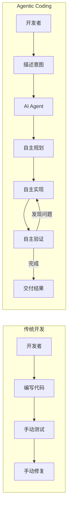

## 11.6 Agentic Coding 实践

2025 年，软件开发领域正经历一场由 AI Agent 驱动的范式转变。从 **Vibe Coding** 到 **Agentic Coding**，开发者的角色正在从"写代码的人"转变为"编排 AI 的人"。

### 11.6.1 什么是 Vibe Coding

**Vibe Coding** 是 AI 专家 Andrej Karpathy 在 2025 年初提出的概念，描述了一种全新的编程风格：

> "完全沉浸在'氛围'中，拥抱指数级增长，忘掉代码的存在。"
> — Andrej Karpathy

#### 核心理念

```
传统编程                      Vibe Coding
    │                             │
    ▼                             ▼
┌─────────────┐            ┌─────────────┐
│ 思考算法     │            │ 描述意图     │
│ 设计结构     │            │ "我想要..."  │
│ 编写代码     │            │             │
│ 调试错误     │      ──→   │ AI 生成代码  │
│ 优化性能     │            │ AI 调试修复  │
│ 编写测试     │            │ AI 编写测试  │
└─────────────┘            └─────────────┘
```

#### Vibe Coding 的特点

| 特点 | 描述 |
|------|------|
| 自然语言驱动 | 用口语化的方式描述需求 |
| 快速原型 | 分钟级别生成可运行代码 |
| 迭代对话 | 通过对话不断调整优化 |
| 低门槛 | 非程序员也能"编程" |

### 11.6.2 什么是 Agentic Coding

**Agentic Coding** 是 Vibe Coding 的进化版——AI 不仅仅生成代码，而是作为一个**自主 Agent**，能够：

1. **理解**整个代码库的结构和上下文
2. **规划**实现方案并分解任务
3. **执行**代码编写、修改、重构
4. **验证**运行测试、修复错误
5. **迭代**根据反馈自我改进



### 11.6.3 主流 Agentic Coding 工具

#### Cursor

Cursor 是 2025 年最流行的 AI 原生 IDE，基于 VS Code 构建：

**核心能力**：
- **全代码库理解**：索引整个项目，理解文件关系和代码逻辑
- **Agent 模式**：自主完成复杂任务，跨文件修改
- **Composer**：多文件编辑的对话界面
- **@ 引用**：精确指定上下文（@文件、@函数、@文档）

```
用户：@main.py 这个函数有性能问题，用户量大时会很慢。帮我优化并添加缓存。

Cursor Agent：
1. 分析 main.py 中的函数...
2. 识别性能瓶颈：N+1 查询问题
3. 规划优化方案：
   - 添加 Redis 缓存层
   - 批量查询优化
   - 添加缓存失效逻辑
4. 修改 main.py...
5. 创建 cache.py 缓存模块...
6. 更新 requirements.txt 添加 redis 依赖...
7. 运行测试验证...

完成！已优化函数并添加缓存，响应时间从 2.3s 降至 45ms。
```

#### Claude Code

Claude Code 是 Anthropic 的 CLI 工具，专为终端工作流设计：

**特点**：
- 命令行原生，适合 DevOps 和后端开发
- 强大的代码理解和生成能力
- 支持长上下文（200K tokens）
- 与 Git 工作流深度集成

```bash
# 安装
npm install -g @anthropic-ai/claude-code

# 使用
claude "重构这个目录下的测试文件，使用 pytest 风格"
claude "分析最近 10 个 commit，生成 CHANGELOG"
claude "找出所有未处理的边界情况并添加测试"
```

#### GitHub Copilot Agent Mode

GitHub Copilot 的 Agent 模式，深度集成 GitHub 生态：

**场景**：
- Issue → 代码：自动根据 Issue 生成 PR
- Review Agent：自动代码审查和修复建议
- Security Agent：自动检测和修复安全漏洞

```yaml
# .github/copilot-agent.yml
on:
  issues:
    types: [labeled]

jobs:
  implement:
    if: contains(github.event.label.name, 'copilot-implement')
    runs-on: ubuntu-latest
    steps:
      - uses: github/copilot-agent@v1
        with:
          task: implement-issue
          auto-pr: true
```

### 11.6.4 开发者角色的转变

#### 从"写代码"到"编排 AI"

```
传统技能栈                    Agentic 时代技能栈
├── 语法精通                  ├── 系统设计思维
├── 算法背诵                  ├── 需求拆解能力
├── 调试技巧                  ├── Prompt Engineering
├── 框架熟练                  ├── Context Engineering
└── 手速快                    ├── AI 工具链整合
                              └── 验收与质量把控
```

#### 新工作流

```python
class AgenticDeveloper:
    """Agentic 时代的开发者工作流"""
    
    def develop_feature(self, requirement: str):
        # 1. 理解并拆解需求
        tasks = self.decompose_requirement(requirement)
        
        # 2. 准备上下文
        context = self.prepare_context(
            relevant_files=self.find_related_code(tasks),
            documentation=self.fetch_docs(tasks),
            examples=self.find_similar_implementations(tasks)
        )
        
        # 3. 委托 AI Agent 执行
        for task in tasks:
            result = self.ai_agent.execute(
                task=task,
                context=context,
                constraints=self.get_constraints()  # 代码规范、安全要求等
            )
            
            # 4. 验收审查
            if not self.review(result):
                self.ai_agent.revise(result, self.feedback)
        
        # 5. 集成测试
        self.run_integration_tests()
        
        # 6. 文档更新
        self.ai_agent.update_documentation()
```

### 11.6.5 最佳实践

#### 提供充足上下文

```markdown
❌ 不好的 Prompt：
"修复这个 bug"

✅ 好的 Prompt：
"@src/api/users.py 的 get_user 函数在用户 ID 为空时抛出 500 错误。
预期行为：返回 400 Bad Request 并给出清晰的错误信息。
参考 @src/api/orders.py 中类似的错误处理模式。"
```

#### 分步骤执行复杂任务

```markdown
❌ 不好的做法：
"帮我从头开始写一个完整的电商后端"

✅ 好的做法：
1. "先设计数据库 Schema，参考 @docs/requirements.md"
2. "基于 Schema 生成 SQLAlchemy 模型"
3. "实现用户认证模块，使用 JWT"
4. "实现商品 CRUD API"
5. ...
```

#### 验证和测试

```python
# 让 AI 同时生成代码和测试
prompt = """
实现一个 LRU 缓存类，要求：
1. 支持 get 和 put 操作
2. 容量超限时淘汰最久未使用的项
3. 时间复杂度 O(1)

同时编写完整的单元测试覆盖：
- 基本功能
- 边界情况
- 并发安全
"""
```

#### 保持人类监督

```
Agentic Coding 黄金法则：
├── ✅ AI 生成，人类审查
├── ✅ AI 提案，人类决策
├── ✅ AI 执行，人类验收
├── ❌ 完全自动化关键系统
└── ❌ 跳过代码审查直接部署
```

### 11.6.6 局限性与风险

| 风险 | 描述 | 缓解措施 |
|------|------|---------|
| **代码质量** | AI 可能生成"能用但不优"的代码 | 建立代码审查流程 |
| **安全漏洞** | AI 可能引入安全问题 | 集成安全扫描工具 |
| **过度依赖** | 开发者技能退化 | 保持核心能力训练 |
| **可维护性** | AI 生成的代码可能难以维护 | 要求清晰注释和文档 |
| **知识产权** | 训练数据版权问题 | 了解工具的训练数据来源 |

### 11.6.7 小结

Agentic Coding 代表了软件开发的未来方向：

| 维度 | 传统开发 | Agentic Coding |
|------|---------|---------------|
| 核心活动 | 编写代码 | 编排 AI |
| 开发速度 | 线性 | 指数级加速 |
| 入门门槛 | 高 | 显著降低 |
| 人的角色 | 执行者 | 架构师/审查者 |
| 价值来源 | 编码能力 | 设计和判断力 |

**关键洞察**：
1. **AI 是增强，不是替代**：最好的结果来自人机协作
2. **上下文是关键**：AI 的输出质量取决于你提供的上下文
3. **验证不可省略**：无论 AI 多强，人类审查仍然必要
4. **持续学习**：工具在快速迭代，保持学习心态

> [!TIP]
> **推荐资源**：
> - Cursor 官网：https://cursor.com
> - Claude Code：https://github.com/anthropics/claude-code
> - GitHub Copilot：https://github.com/features/copilot
> - Andrej Karpathy 原文：https://twitter.com/karpathy/status/...

---

**返回**: [附录目录](README.md)
