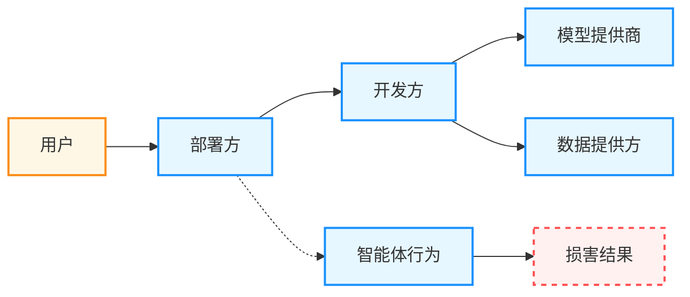

## 11.3 智能体的法律与伦理边界

当 AI 智能体造成损害时，谁来负责？当智能体拥有越来越多的自主权时，法律和伦理边界在哪里？本节探讨智能体系统面临的法律挑战、责任归属，以及 AI 治理的国际动态。

### 11.3.1 智能体的法律地位与实体问题

传统法律框架将行为主体分为 **自然人**和**法人**。AI 智能体既不是自然人，也难以简单归类为工具。

**三种可能的法律定位**：

| 定位 | 含义 | 问题 |
|------|------|------|
| 纯工具 | 如同锤子，完全由使用者负责 | 忽略了智能体的自主性 |
| 电子代理人 | 代表人类行事，类似法律代理 | 责任链不清晰 |
| 独立实体 | 具有某种法律人格 | 配套制度不存在 |

#### 现有法律框架的挑战

**合同法问题**：

- 智能体代表用户签订的合同是否有效？
- 如果智能体对合同条款理解错误怎么办？

**侵权法问题**：

- 智能体造成的损害由谁赔偿？
- 如何证明智能体行为与损害之间的因果关系？

**刑事责任问题**：

- 智能体被利用实施犯罪，开发者是否承担刑责？
- “不知情”能否成为免责理由？

#### 对工程实践的影响

在法律定位尚未完全清晰的阶段，工程上更现实的目标是把责任链条“做得清楚、可追溯、可审计”：

- 明确智能体代表谁行动，工具调用是否属于“代理行为”
- 对关键动作保留审批与撤销机制，降低不可逆损害
- 记录输入、工具调用、输出与证据链，便于事后取证与归因

### 11.3.2 责任归属与多方主体

一个智能体系统涉及多个可能的责任承担者：



图 11-1：智能体系统的责任归属链路

**责任分配原则**：

| 主体 | 可能责任 | 免责条件 |
|------|----------|----------|
| 用户 | 使用不当 | 在合理使用范围内 |
| 部署方 | 安全措施不足 | 已采取合理防护 |
| 开发方 | 设计缺陷 | 已遵循行业标准 |
| 模型提供商 | 模型固有风险 | 已提供安全指南 |

### 11.3.3 产品责任与服务责任

**产品责任视角**（严格责任）：

- 智能体系统作为产品，制造商对缺陷产品造成的损害负责
- 不要求证明过错，只需证明因果关系

**服务责任视角**（过错责任）：

- 智能体提供的是服务，需要证明服务提供方存在过错
- 标准是“合理专业人士”会如何行事

```python
# 设计时考虑责任界定

class AgentWithDisclaimer:
    def __init__(self):
        self.disclaimer = """
        本智能体提供的建议仅供参考，不构成专业意见。
        重要决策请咨询人类专业人士。
        使用本服务即表示您了解并接受相关风险。
        """
        
    def execute_action(self, action: Action):
        # 记录完整的决策轨迹用于事后追溯

        self.log_decision_chain(action)
        
        # 高风险操作需要人工确认

        if action.risk_level > THRESHOLD:
            return self.request_human_approval(action)
```

### 11.3.4 数据保护与隐私合规

不同地区对个人数据保护有不同法规要求。面向用户数据的智能体系统需要满足相应的隐私合规要求：

**关键要求**：

1. **合法基础**：必须有处理数据的合法依据
2. **数据最小化**：只收集必要的数据
3. **透明性**：告知用户数据如何被使用
4. **可解释性**：对自动化决策能够说明理由

```python
class PrivacyCompliantAgent:
    def process_user_data(self, data: UserData):
        # 检查同意状态

        if "agent_processing" not in data.user_consent:
            raise ConsentRequiredError()
            
        # 数据最小化

        minimal_data = extract_only_necessary(data)
        
        # 记录处理目的

        self.log_processing_purpose(
            data_id=data.id,
            purpose="客户咨询服务",
            legal_basis="用户同意或其他合法基础"
        )
        
        return self.process(minimal_data)
```

### 11.3.5 数据本地化要求

某些地区要求数据不能跨境传输：

```python
class RegionalAgent:
    def __init__(self, region: str):
        self.region = region
        self.llm_endpoint = self._get_regional_endpoint(region)
        
    def _get_regional_endpoint(self, region: str) -> str:
        endpoints = {
            "cn": "https://<regional-endpoint>/v1",
            "eu": "https://<regional-endpoint>/v1",
            "us": "https://<regional-endpoint>/v1"
        }
        return endpoints.get(region, endpoints["us"])
```

### 11.3.6 国际 AI 治理动态


#### 欧盟 AI 法案

欧盟 AI 法案提出了较系统的风险分级思路：

**风险分级**：

| 风险等级 | 示例 | 要求 |
|----------|------|------|
| 不可接受 | 社会评分系统 | 禁止 |
| 高风险 | 医疗诊断、信贷评估 | 严格审查 |
| 有限风险 | 聊天机器人 | 透明度要求 |
| 最小风险 | 垃圾邮件过滤 | 无特殊要求 |

**对智能体的影响**：

- 高风险场景的智能体需要事前合规评估
- 必须保持人类监督能力
- 需要详细的技术文档

#### 美国行政命令

美国也发布了与 AI 风险治理相关的政策与行政命令，整体关注点包括安全测试、标准化与关键基础设施。

#### 中国生成式 AI 管理规定

中国也发布了面向生成式 AI 服务的管理规定，整体关注点包括内容安全责任、备案要求与生成内容标识等。

### 11.3.7 伦理设计原则


#### 透明与可解释

设计模式示例：

```python
class TransparentAgent:
    async def decide(self, query: str) -> DecisionResult:
        # 记录推理过程

        reasoning = await self.think(query)
        decision = await self.act(reasoning)
        
        return DecisionResult(
            decision=decision,
            reasoning=reasoning,
            confidence=self.estimate_confidence(),
            limitations="本决策基于有限信息，可能不适用于所有情况",
            sources=self.get_sources_used()
        )
```

#### 公平与无偏见

设计模式示例：

```python
class FairnessAuditor:
    def audit_decision(self, decision: Decision, context: Context):
        # 检查是否存在歧视性因素

        protected_attributes = ["race", "gender", "age", "religion"]
        
        for attr in protected_attributes:
            if self._is_influenced_by(decision, attr, context):
                self.flag_for_review(
                    decision=decision,
                    reason=f"决策可能受 {attr} 属性影响"
                )
```

#### 人类福祉优先

设计模式示例：

```python
class WelfareFirstAgent:
    def __init__(self):
        self.principles = [
            "不得伤害人类或通过不作为使人类受到伤害",
            "当操作可能对人类造成严重后果时，必须请求人类确认",
            "在效率和安全之间，优先选择安全"
        ]
        
    async def should_proceed(self, action: Action) -> bool:
        for principle in self.principles:
            if self._violates_principle(action, principle):
                return False
        return True
```

### 11.3.8 实践建议：建立治理框架

1. **伦理审查委员会**：重大功能上线前进行伦理评估
2. **风险分级制度**：根据风险等级采取不同的管控措施
3. **事件响应机制**：出现问题时的快速响应流程
4. **定期审计**：持续监控智能体行为

### 11.3.9 文档与留痕

合规记录器实现：

```python
import hmac
import hashlib
from datetime import datetime
from typing import List

class ComplianceLogger:
    def log_agent_action(
        self,
        action: str,
        reasoning: str,
        user_id: str,
        data_accessed: List[str]
    ):
        if not hasattr(self, 'secret_key'):
             self.secret_key = b'system-secret-key' # 实际应从环境变量读取

        record = {
            "timestamp": datetime.now().isoformat(),
            "action": action,
            "reasoning": reasoning,
            "user_id": hmac.new(self.secret_key, user_id.encode(), hashlib.sha256).hexdigest(),  # HMAC 脱敏
            "data_accessed": data_accessed,
            "agent_version": self.agent_version,
            "model_version": self.model_version
        }
        self.store_immutable(record)  # 不可篡改存储
```

### 11.3.10 小结

智能体技术发展速度远超法律法规更新速度，但这不意味着开发者可以忽视法律和伦理问题：

- **主动合规**：不要等法规出台再调整
- **责任意识**：明确系统可能带来的风险
- **透明设计**：让用户和监管者能够理解系统行为
- **持续关注**：跟踪 AI 治理的最新动态

> “技术的发展必须伴随着对其影响的深刻理解和负责任的使用。”

下一节我们将展望智能体技术的未来，探讨通向 AGI 的可能路径。

---

**下一节**: [迈向通用人工智能](11.4_agi_path.md)
