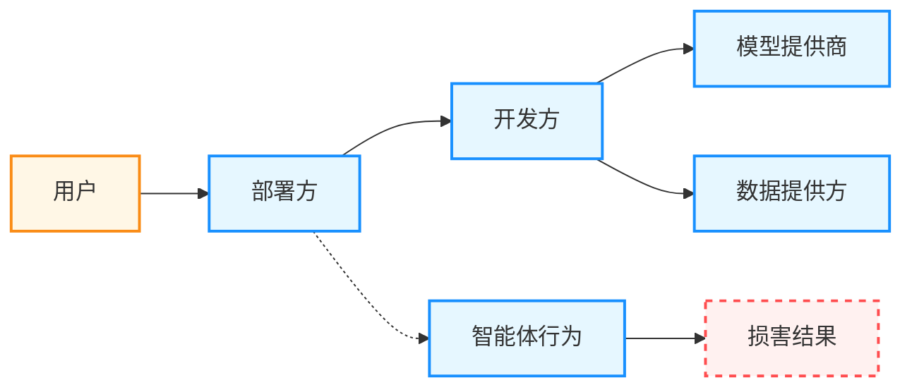

## 11.3 智能体的法律与伦理边界

当 AI 智能体造成损害时，谁来负责？当智能体拥有越来越多的自主权时，法律和伦理边界在哪里？本节探讨智能体系统面临的法律挑战、责任归属，以及 AI 治理的国际动态。

### 11.3.1 智能体的法律地位与实体问题

传统法律框架将行为主体分为 **自然人** 和 **法人**。AI 智能体既不是自然人，也难以简单归类为工具。

**三种可能的法律定位**：

| 定位 | 含义 | 问题 |
|------|------|------|
| 纯工具 | 如同锤子，完全由使用者负责 | 忽略了智能体的自主性 |
| 电子代理人 | 代表人类行事，类似法律代理 | 责任链不清晰 |
| 独立实体 | 具有某种法律人格 | 配套制度不存在 |

#### 11.3.1.1 现有法律框架的挑战

**合同法问题**：

- 智能体代表用户签订的合同是否有效？
- 如果智能体对合同条款理解错误怎么办？

**侵权法问题**：

- 智能体造成的损害由谁赔偿？
- 如何证明智能体行为与损害之间的因果关系？

**刑事责任问题**：

- 智能体被利用实施犯罪，开发者是否承担刑责？
- “不知情”能否成为免责理由？

#### 11.3.1.2 对工程实践的影响

在法律定位尚未完全清晰的阶段，工程上更现实的目标是把责任链条“做得清楚、可追溯、可审计”：

- 明确智能体代表谁行动，工具调用是否属于“代理行为”
- 对关键动作保留审批与撤销机制，降低不可逆损害
- 记录输入、工具调用、输出与证据链，便于事后取证与归因

### 11.3.2 责任归属与多方主体

一个智能体系统涉及多个可能的责任承担者：


```mermaid
graph LR
    %% Agentic Design System
    classDef user fill:#fff7e6,stroke:#fa8c16,stroke-width:2px;
    classDef agent fill:#e6f7ff,stroke:#1890ff,stroke-width:2px;
    classDef error fill:#fff1f0,stroke:#ff4d4f,stroke-width:2px,stroke-dasharray: 5 5;

    User[用户] --> Deployer[部署方]
    Deployer --> Dev[开发方]
    Dev --> ModelProvider[模型提供商]
    Dev --> DataProvider[数据提供方]

    AgentAction[智能体行为] --> Damage[损害结果]
    Deployer -.-> AgentAction

    class User user;
    class Deployer,Dev agent;
    class ModelProvider,DataProvider agent;
    class AgentAction agent;
    class Damage error;
```

图 11-1：智能体系统的责任归属链路

**责任分配原则**：

| 主体 | 可能责任 | 免责条件 |
|------|----------|----------|
| 用户 | 使用不当 | 在合理使用范围内 |
| 部署方 | 安全措施不足 | 已采取合理防护 |
| 开发方 | 设计缺陷 | 已遵循行业标准 |
| 模型提供商 | 模型固有风险 | 已提供安全指南 |

### 11.3.3 产品责任与服务责任

**产品责任视角**（严格责任）：

- 智能体系统作为产品，制造商对缺陷产品造成的损害负责
- 不要求证明过错，只需证明因果关系

**服务责任视角**（过错责任）：

- 智能体提供的是服务，需要证明服务提供方存在过错
- 标准是”合理专业人士”会如何行事

实践中，智能体应在交互入口展示免责声明，对高风险操作强制人工审批，并完整记录决策链。

### 11.3.4 数据保护与隐私合规

不同地区对个人数据保护有不同法规要求。面向用户数据的智能体系统需要满足相应的隐私合规要求：

**关键要求**：

1. **合法基础**：必须有处理数据的合法依据
2. **数据最小化**：只收集必要的数据
3. **透明性**：告知用户数据如何被使用
4. **可解释性**：对自动化决策能够说明理由

### 11.3.5 跨境传输与数据本地化要求

不同法域对跨境数据传输的限制强度并不相同。某些行业或地区可能要求本地化存储或对特定数据类别施加更严格限制；但也有许多制度允许在满足条件时跨境传输，例如基于充分性认定、标准合同条款（SCC）、约束性公司规则（BCR）或法定例外。实践中，应按数据类型、用户所在地、处理角色与适用法律逐项评估，再决定是否需要区域化部署、额外合同安排或数据驻留控制，而不是默认“一律不得跨境”。

### 11.3.6 国际 AI 治理动态

#### 11.3.6.1 欧盟 AI 法案

欧盟 AI 法案提出了较系统的风险分级思路：

**风险分级**：

| 风险等级 | 示例 | 要求 |
|----------|------|------|
| 不可接受 | 社会评分系统 | 禁止 |
| 高风险 | 医疗诊断、信贷评估 | 严格审查 |
| 有限风险 | 聊天机器人 | 透明度要求 |
| 最小风险 | 垃圾邮件过滤 | 无特殊要求 |

**对智能体的影响**：

- 高风险场景的智能体需要事前合规评估
- 必须保持人类监督能力
- 需要详细的技术文档

#### 11.3.6.2 美国行政命令

美国联邦层面的 AI 行政命令在近年变化频繁。需要区分多个时间节点：2023 年 10 月 30 日，拜登政府签署 **Executive Order 14110**；2025 年 1 月 23 日，特朗普政府签署 **Executive Order 14179**，并要求审查、暂停、修订或撤销依据 EO 14110 采取的相关措施；2025 年 7 月 23 日，白宫发布 **America's AI Action Plan**。因此，讨论美国”现行联邦政策”时，更稳妥的写法是强调其重心在创新、治理与联邦采用框架的调整，而不是默认某一份行政命令仍代表现行有效的总框架。

#### 11.3.6.3 中国生成式 AI 管理规定

中国也发布了面向生成式 AI 服务的管理规定，整体关注点包括内容安全责任、备案要求与生成内容标识等。

### 11.3.7 伦理设计原则

#### 11.3.7.1 透明与可解释

智能体的每个决策应输出推理过程、置信度和引用来源，而非仅返回最终结果。

#### 11.3.7.2 公平与无偏见

应定期审计智能体决策是否受种族、性别、年龄等受保护属性的影响，发现偏差立即标记复审。

#### 11.3.7.3 人类福祉优先

当操作可能对人类造成伤害或缺少充分的人类确认时，智能体应拒绝执行并报告原因。

### 11.3.8 实践建议：企业智能体上线合规检查点

为了让抽象的伦理原则落地，建议在智能体项目上线前，强制进行以下合规检查单（Compliance Checklist）核验：

| 检查维度 | 核心核验项 (Checkpoints) | 否决条件 (Blocker) |
|----------|--------------------------|-------------------|
| **身份透明度** | 是否在显著位置标明“您正在与 AI 交互”？ | 未声明 AI 身份、伪装真人 |
| **数据采护** | 传递给 LLM 的上下文中，是否已对 PII（个人身份信息）进行脱敏或 HMAC 遮蔽？ | 敏感业务数据或用户隐私明文流出 |
| **控制权交接** | 高风险动作（如删除、转账、对外发信）是否包含硬交互的 HITL (Human-in-the-loop) 二次确认？ | 破坏性操作可由 AI 单方面执行 |
| **追溯审计** | 智能体的执行日志是否完整记录了 `trace_id`、输入参数、行动决策，以及调用者身份标识、授权结果或凭证引用 ID（而非原始密钥、口令、access token）？ | 核心操作无日志，或日志中直接写入原始鉴权凭证，事后无法安全定责 |
| **降级预案** | 当模型 API 宕机、出现严重幻觉或智能体陷入死循环时，是否有可物理干预的“急停按钮 (Kill Switch)”？ | 故障时系统无法被人类强行接管 |

### 11.3.9 文档与留痕

合规记录器实现：

```python
import hmac
import hashlib
from datetime import datetime
from typing import List

class ComplianceLogger:
    def log_agent_action(
        self,
        action: str,
        reasoning: str,
        user_id: str,
        data_accessed: List[str]
    ):
        if not hasattr(self, 'secret_key'):
             self.secret_key = b'system-secret-key' # 实际应从环境变量读取

        record = {
            "timestamp": datetime.now().isoformat(),
            "action": action,
            "reasoning": reasoning,
            "user_id": hmac.new(self.secret_key, user_id.encode(), hashlib.sha256).hexdigest(),  # HMAC 脱敏
            "data_accessed": data_accessed,
            "agent_version": self.agent_version,
            "model_version": self.model_version
        }
        self.store_immutable(record)  # 不可篡改存储
```

### 11.3.10 前瞻观察：智能体保险与风险转移机制

以下内容更接近市场探索与风险管理前瞻，不应被理解为当前普遍适用的法定义务或成熟监管安排。

当智能体超越内容生成，开始自主预订航班、签署合同、执行代码并调动资金时，责任归属的模糊性可能阻碍其在金融清算、医疗诊断、法律谈判等高责任场景中的规模化落地。围绕此类风险，保险、担保和第三方认证有可能成为未来的配套机制之一，但相关产品形态、承保边界和精算方法仍在演进。

#### 11.3.10.1 风险评估：智能体行为精算

可通过自动化”红蓝对抗”沙盒平台，使用对抗性测试用例模拟智能体极端反应。通过分析漏洞概率、历史失误率和恢复时间，计算动态”脆弱性指数”，作为保险定价依据。

#### 11.3.10.2 闭环认证与合规承保

未来的企业采购流程可能演变为：企业将拟部署的智能体接入第三方认证平台进行行为审计；通过安全评估与伦理对齐测试后，平台自动颁发可验证的数字证书，并同步触发智能体专属责任险的保单绑定。这种由保险背书的快速认证通道，将极大降低企业采用前沿自治技术的心理障碍与试错成本。

#### 11.3.10.3 对工程的启示

开发团队在设计智能体时，应从一开始就将”可保险性”纳入架构考量：完整的决策审计日志、明确的权限边界、可量化的失败模式，都是未来获得保险承保的前提条件（参见 [11.3.8 合规检查点](#1138-实践建议企业智能体上线合规检查点) 和 [9.3 可观测性](../09_agentops/9.3_observability.md)）。

### 11.3.11 前瞻观察：区块链治理框架与 AI 特定法律实体

随着链上自主智能体（on-chain autonomous agents）的出现，学术界与产业界开始讨论传统 AI 治理框架在此类场景中的适配问题：许多现有制度默认存在可识别的责任方，而公链智能体往往具有去中心化执行、不可逆转和跨国界等特性，使得责任链路更复杂。

为应对此挑战，学术界和工业界开始探索新的治理框架，包括：

**ETHOS 框架**（伦理技术与整体监督系统）：提出了基于智能合约的动态风险分类、AI 特定法律实体（AISLE）的概念，以及强制责任险池机制。

相关提案包括代币绑定账户、身份注册表和智能体发现协议等，但均处于早期研究阶段。

这些框架试图在智能体经济自主性和问责机制之间寻找平衡，例如利用链上记录增强审计可追溯性，并探索去中心化仲裁、保险池或动态风险评分等机制。

**这些框架仍处于研究阶段，尚未成为行业标准。** 开发链上智能体时应预留与未来治理框架的接口，构建透明的风险模型和完整的审计日志。

### 11.3.12 小结

智能体技术发展速度远超法律法规更新速度，但这不意味着开发者可以忽视法律和伦理问题：

- **主动合规**：不要等法规出台再调整
- **责任意识**：明确系统可能带来的风险
- **透明设计**：让用户和监管者能够理解系统行为
- **持续关注**：跟踪 AI 治理的最新动态

对于链上智能体，合规挑战更加复杂。ETHOS 一类框架更适合被理解为研究提案或行业试验，而不是现行法上的通用要求。现阶段，开发者仍应以适用法律、监管指引、合同约束和可审计工程控制为主，再关注这些新框架是否逐步走向标准化。

> “技术的发展必须伴随着对其影响的深刻理解和负责任的使用。”

下一节我们将展望智能体技术的未来，探讨通向 AGI 的可能路径。

---

**下一节**: [迈向通用人工智能](11.4_agi_path.md)
