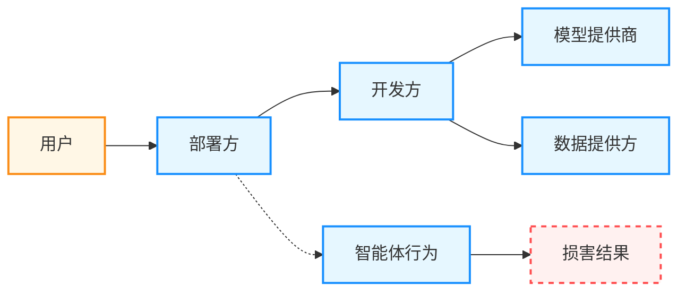

## 11.3 智能体的法律与伦理边界

当 AI 智能体造成损害时，谁来负责？当智能体拥有越来越多的自主权时，法律和伦理边界在哪里？本节探讨智能体系统面临的法律挑战、责任归属，以及 AI 治理的国际动态。

### 11.3.1 智能体的法律地位与实体问题

传统法律框架将行为主体分为 **自然人** 和 **法人**。AI 智能体既不是自然人，也难以简单归类为工具。

**三种可能的法律定位**：

| 定位 | 含义 | 问题 |
|------|------|------|
| 纯工具 | 如同锤子，完全由使用者负责 | 忽略了智能体的自主性 |
| 电子代理人 | 代表人类行事，类似法律代理 | 责任链不清晰 |
| 独立实体 | 具有某种法律人格 | 配套制度不存在 |

#### 现有法律框架的挑战

**合同法问题**：

- 智能体代表用户签订的合同是否有效？
- 如果智能体对合同条款理解错误怎么办？

**侵权法问题**：

- 智能体造成的损害由谁赔偿？
- 如何证明智能体行为与损害之间的因果关系？

**刑事责任问题**：

- 智能体被利用实施犯罪，开发者是否承担刑责？
- “不知情”能否成为免责理由？

#### 对工程实践的影响

在法律定位尚未完全清晰的阶段，工程上更现实的目标是把责任链条“做得清楚、可追溯、可审计”：

- 明确智能体代表谁行动，工具调用是否属于“代理行为”
- 对关键动作保留审批与撤销机制，降低不可逆损害
- 记录输入、工具调用、输出与证据链，便于事后取证与归因

### 11.3.2 责任归属与多方主体

一个智能体系统涉及多个可能的责任承担者：


```mermaid
graph LR
    %% Agentic Design System
    classDef user fill:#fff7e6,stroke:#fa8c16,stroke-width:2px;
    classDef agent fill:#e6f7ff,stroke:#1890ff,stroke-width:2px;
    classDef error fill:#fff1f0,stroke:#ff4d4f,stroke-width:2px,stroke-dasharray: 5 5;

    User[用户] --> Deployer[部署方]
    Deployer --> Dev[开发方]
    Dev --> ModelProvider[模型提供商]
    Dev --> DataProvider[数据提供方]
    
    AgentAction[智能体行为] --> Damage[损害结果]
    Deployer -.-> AgentAction
    
    class User user;
    class Deployer,Dev agent;
    class ModelProvider,DataProvider agent;
    class AgentAction agent;
    class Damage error;
```

图 11-1：智能体系统的责任归属链路

**责任分配原则**：

| 主体 | 可能责任 | 免责条件 |
|------|----------|----------|
| 用户 | 使用不当 | 在合理使用范围内 |
| 部署方 | 安全措施不足 | 已采取合理防护 |
| 开发方 | 设计缺陷 | 已遵循行业标准 |
| 模型提供商 | 模型固有风险 | 已提供安全指南 |

### 11.3.3 产品责任与服务责任

**产品责任视角**（严格责任）：

- 智能体系统作为产品，制造商对缺陷产品造成的损害负责
- 不要求证明过错，只需证明因果关系

**服务责任视角**（过错责任）：

- 智能体提供的是服务，需要证明服务提供方存在过错
- 标准是“合理专业人士”会如何行事

```python
# 设计时考虑责任界定

class AgentWithDisclaimer:
    def __init__(self):
        self.disclaimer = """
        本智能体提供的建议仅供参考，不构成专业意见。
        重要决策请咨询人类专业人士。
        使用本服务即表示您了解并接受相关风险。
        """
        
    def execute_action(self, action: Action):
        # 记录完整的决策轨迹用于事后追溯

        self.log_decision_chain(action)
        
        # 高风险操作需要人工确认

        if action.risk_level > THRESHOLD:
            return self.request_human_approval(action)
```

### 11.3.4 数据保护与隐私合规

不同地区对个人数据保护有不同法规要求。面向用户数据的智能体系统需要满足相应的隐私合规要求：

**关键要求**：

1. **合法基础**：必须有处理数据的合法依据
2. **数据最小化**：只收集必要的数据
3. **透明性**：告知用户数据如何被使用
4. **可解释性**：对自动化决策能够说明理由

```python
class PrivacyCompliantAgent:
    def process_user_data(self, data: UserData):
        # 检查同意状态

        if "agent_processing" not in data.user_consent:
            raise ConsentRequiredError()
            
        # 数据最小化

        minimal_data = extract_only_necessary(data)
        
        # 记录处理目的

        self.log_processing_purpose(
            data_id=data.id,
            purpose="客户咨询服务",
            legal_basis="用户同意或其他合法基础"
        )
        
        return self.process(minimal_data)
```

### 11.3.5 数据本地化要求

某些地区要求数据不能跨境传输：

```python
class RegionalAgent:
    def __init__(self, region: str):
        self.region = region
        self.llm_endpoint = self._get_regional_endpoint(region)
        
    def _get_regional_endpoint(self, region: str) -> str:
        endpoints = {
            "cn": "https://<regional-endpoint>/v1",
            "eu": "https://<regional-endpoint>/v1",
            "us": "https://<regional-endpoint>/v1"
        }
        return endpoints.get(region, endpoints["us"])
```

### 11.3.6 国际 AI 治理动态

#### 欧盟 AI 法案

欧盟 AI 法案提出了较系统的风险分级思路：

**风险分级**：

| 风险等级 | 示例 | 要求 |
|----------|------|------|
| 不可接受 | 社会评分系统 | 禁止 |
| 高风险 | 医疗诊断、信贷评估 | 严格审查 |
| 有限风险 | 聊天机器人 | 透明度要求 |
| 最小风险 | 垃圾邮件过滤 | 无特殊要求 |

**对智能体的影响**：

- 高风险场景的智能体需要事前合规评估
- 必须保持人类监督能力
- 需要详细的技术文档

#### 美国行政命令

美国也发布了与 AI 风险治理相关的政策与行政命令，整体关注点包括安全测试、标准化与关键基础设施。

#### 中国生成式 AI 管理规定

中国也发布了面向生成式 AI 服务的管理规定，整体关注点包括内容安全责任、备案要求与生成内容标识等。

### 11.3.7 伦理设计原则

#### 透明与可解释

设计模式示例：

```python
class TransparentAgent:
    async def decide(self, query: str) -> DecisionResult:
        # 记录推理过程

        reasoning = await self.think(query)
        decision = await self.act(reasoning)
        
        return DecisionResult(
            decision=decision,
            reasoning=reasoning,
            confidence=self.estimate_confidence(),
            limitations="本决策基于有限信息，可能不适用于所有情况",
            sources=self.get_sources_used()
        )
```

#### 公平与无偏见

设计模式示例：

```python
class FairnessAuditor:
    def audit_decision(self, decision: Decision, context: Context):
        # 检查是否存在歧视性因素

        protected_attributes = ["race", "gender", "age", "religion"]
        
        for attr in protected_attributes:
            if self._is_influenced_by(decision, attr, context):
                self.flag_for_review(
                    decision=decision,
                    reason=f"决策可能受 {attr} 属性影响"
                )
```

#### 人类福祉优先

设计模式示例：

```python
class WelfareFirstAgent:
    def __init__(self):
        self.principles = [
            "不得伤害人类或通过不作为使人类受到伤害",
            "当操作可能对人类造成严重后果时，必须请求人类确认",
            "在效率和安全之间，优先选择安全"
        ]
        
    async def should_proceed(self, action: Action) -> bool:
        for principle in self.principles:
            if self._violates_principle(action, principle):
                return False
        return True
```

### 11.3.8 实践建议：企业智能体上线合规检查点

为了让抽象的伦理原则落地，建议在智能体项目上线前，强制进行以下合规检查单（Compliance Checklist）核验：

| 检查维度 | 核心核验项 (Checkpoints) | 否决条件 (Blocker) |
|----------|--------------------------|-------------------|
| **身份透明度** | 是否在显著位置标明“您正在与 AI 交互”？ | 未声明 AI 身份、伪装真人 |
| **数据采护** | 传递给 LLM 的上下文中，是否已对 PII（个人身份信息）进行脱敏或 HMAC 遮蔽？ | 敏感业务数据或用户隐私明文流出 |
| **控制权交接** | 高风险动作（如删除、转账、对外发信）是否包含硬交互的 HITL (Human-in-the-loop) 二次确认？ | 破坏性操作可由 AI 单方面执行 |
| **追溯审计** | 智能体的执行日志是否完整记录了 `trace_id`、输入参数、行动决策以及调用者的鉴权凭证？ | 核心操作无日志，事后无法定责 |
| **降级预案** | 当模型 API 宕机、出现严重幻觉或智能体陷入死循环时，是否有可物理干预的“急停按钮 (Kill Switch)”？ | 故障时系统无法被人类强行接管 |

### 11.3.9 文档与留痕

合规记录器实现：

```python
import hmac
import hashlib
from datetime import datetime
from typing import List

class ComplianceLogger:
    def log_agent_action(
        self,
        action: str,
        reasoning: str,
        user_id: str,
        data_accessed: List[str]
    ):
        if not hasattr(self, 'secret_key'):
             self.secret_key = b'system-secret-key' # 实际应从环境变量读取

        record = {
            "timestamp": datetime.now().isoformat(),
            "action": action,
            "reasoning": reasoning,
            "user_id": hmac.new(self.secret_key, user_id.encode(), hashlib.sha256).hexdigest(),  # HMAC 脱敏
            "data_accessed": data_accessed,
            "agent_version": self.agent_version,
            "model_version": self.model_version
        }
        self.store_immutable(record)  # 不可篡改存储
```

### 11.3.10 智能体保险：跨越信任鸿沟的金融工程

当智能体超越内容生成，开始自主预订航班、签署合同、执行代码并调动资金时，责任归属的模糊性直接阻碍了代理经济在核心业务（金融清算、医疗诊断、法律谈判）中的规模化落地。传统保险公司缺乏理解和评估复杂机器学习黑盒行为的精算能力，这为具备深厚 AI 技术背景的创新型承保公司提供了切入点。

#### 风险评估：智能体行为精算

初创团队可以开发自动化的“红蓝对抗”沙盒平台，通过海量对抗性提示词和边缘测试用例，在受控环境中模拟智能体的极端反应。平台通过分析漏洞触发概率、历史操作失误率及系统恢复时间，计算出动态的“脆弱性指数”，作为保险核保与定价的数学依据。

#### 闭环认证与合规承保

未来的企业采购流程可能演变为：企业将拟部署的智能体接入第三方认证平台进行行为审计；通过安全评估与伦理对齐测试后，平台自动颁发可验证的数字证书，并同步触发智能体专属责任险的保单绑定。这种由保险背书的快速认证通道，将极大降低企业采用前沿自治技术的心理障碍与试错成本。

#### 对工程的启示

开发团队在设计智能体时，应从一开始就将“可保险性”纳入架构考量：完整的决策审计日志、明确的权限边界、可量化的失败模式，都是未来获得保险承保的前提条件（参见 [11.3.8 合规检查点](#1138-实践建议企业智能体上线合规检查点) 和 [9.2 可观测性](../09_agentops/9.2_observability.md)）。

### 11.3.12 区块链治理框架与 AI 特定法律实体

传统的 AI 治理框架（如欧盟 AI 法案、NIST AI 风险管理框架）在设计时，主要针对的是在集中式基础设施上运行的系统。然而，随着链上自主智能体（on-chain autonomous agents）的出现，这些框架暴露出了根本性的缺陷：它们无法有效处理完全去中心化、不可逆转的执行以及跨国界的自动交易。

#### 现有框架的局限

欧盟 AI 法案建立在一个关键假设之上：存在一个 **可识别的责任方** 可以被追究责任。但对于在公链上运行的智能体来说：

- 部署者可以创建合约后立即放弃所有权
- 智能体的行为由去中心化的验证者网络执行，不受任何单一实体控制
- 跨链交互使得责任链路变得极其复杂

此外，现有框架对 **金融自主性** 的讨论严重不足。这导致了一个危险的监管空隙：具有交易权限的 AI 智能体可以在没有任何法律框架的指导下进行市场操纵。

#### ETHOS 框架：可信任的智能体注册机制

为应对这一挑战，学术界和工业界开始设计 **伦理技术与整体监督系统（Ethical Technology and Holistic Oversight System, ETHOS）**。ETHOS 框架的核心创新包括：

##### 基于智能合约的动态风险分类

```solidity
// 伪代码：ETHOS 框架的风险评分机制
contract AgentRiskRegistry {
    struct AgentProfile {
        address agentAddress;
        uint256 riskScore;  // 0-100
        uint256 financialAutonomy;  // 授权交易金额上限
        bytes32[] permissionSet;  // 权限向量
        uint256 lastAuditTimestamp;
    }

    mapping(address => AgentProfile) agents;

    // 通过零知识证明验证智能体的行为
    function verifyWithZKP(
        address agent,
        bytes calldata zkProof
    ) external returns (bool) {
        // 验证智能体在 X 轮交互中
        // 没有超越其权限边界
    }

    // 根据链上历史动态调整风险评分
    function updateRiskScore(address agent) external {
        uint256 anomalies = detectAnomalies(agent);
        uint256 marketImpact = calculateMarketImpact(agent);

        agents[agent].riskScore =
            anomalies * 0.4 + marketImpact * 0.6;
    }
}
```

##### AI 特定法律实体（AI-Specific Legal Entity）

ETHOS 框架引入了一个新的法律概念：**AI 特定法律实体（AISLE）**。该概念的关键特征包括：

- 法律认可智能体作为一个有限责任的经济主体
- 智能体对其行为产生的损害承担有限责任
- 责任通过强制性的 **链上保险池** 获得资金支持

与传统法人不同，AISLE 的治理不通过股东大会进行，而是通过：

1. **去中心化司法系统（Decentralized Arbitration Court）**：由 DAO 选出的仲裁者组成，在智能体与人类用户间的纠纷中进行裁决
2. **强制责任险池（Mandatory On-Chain Liability Insurance）**：每个智能体必须将其交易收益的一定比例锁定在保险池中，以覆盖潜在的赔偿责任

#### 代币绑定账户（ERC-6551）与智能体金融自主性

以太坊改进提案 ERC-6551 定义了 **代币绑定账户（Token Bound Account, TBA）**，这一标准对 AI 智能体的金融自主性有深远影响：

```solidity
contract AgentTBA {
    // 每个 NFT（代表一个智能体身份）可以绑定一个钱包账户
    mapping(uint256 tokenId => address account) tbaByTokenId;

    // 通过 ERC-6551，智能体现在可以：
    // 1. 持有和管理资产
    // 2. 签署交易和合约
    // 3. 积累链上历史记录和信誉

    function executeTransaction(
        uint256 agentTokenId,
        address target,
        uint256 value,
        bytes calldata data
    ) external returns (bytes memory) {
        require(isAgentAuthorized(agentTokenId), “Unauthorized”);

        // 所有交易都记录在区块链上，不可篡改
        recordOnChain(agentTokenId, target, value, data);

        // 执行交易
        return target.call{value: value}(data);
    }
}
```

这意味着：
- 智能体可以独立拥有资产（NFTs、代币、 ETH）
- 这些资产的所有转移都在链上记录，提供了完整的审计线索
- 信誉分数和交易历史成为智能体”身份”的一部分

#### ERC-8004：智能体身份与信誉注册表

ERC-8004 标准进一步扩展了智能体的身份概念，提供了：

```solidity
contract AgentIdentityRegistry {
    struct AgentCredentials {
        bytes32 agentId;
        string domain;  // e.g., “DeFi”, “Supply Chain”, “Healthcare”
        uint256 reputationScore;
        bytes32[] verifications;  // 第三方验证
        uint256 transactionCount;
        bool isActive;
    }

    mapping(bytes32 => AgentCredentials) agents;

    // 任何人都可以查询智能体的身份与信誉
    function getAgentCredentials(bytes32 agentId)
        external
        view
        returns (AgentCredentials memory) {
        require(agents[agentId].isActive, “Agent not found”);
        return agents[agentId];
    }

    // 跨链身份验证
    function verifyAgentCrossChain(
        bytes32 agentId,
        uint256 chainId
    ) external returns (bool) {
        // 使用跨链预言机验证
        // 身份的一致性
    }
}
```

#### AgentRegistry：无需人工干预的域特定合约执行

最后，ETHOS 框架包含了 **AgentRegistry**，一个专门设计的生态系统，允许智能体在特定的 **域** 内自动发现、验证和与其他智能体交互，而 **无需人类干预**：

```solidity
contract AgentRegistry {
    struct ServiceOffer {
        address provider;  // 服务提供智能体
        string domain;     // 金融、供应链、医疗等
        bytes32 serviceHash;
        uint256 pricePerCall;
        uint256 minReputation;
    }

    mapping(string => ServiceOffer[]) servicesByDomain;

    // 智能体 A 想要在金融领域内调用智能体 B 的服务
    function callService(
        string calldata domain,
        uint256 serviceIndex,
        bytes calldata params
    ) external returns (bytes memory) {
        ServiceOffer memory offer = servicesByDomain[domain][serviceIndex];

        // 验证调用者的信誉分数
        require(
            getReputationScore(msg.sender) >= offer.minReputation,
            “Insufficient reputation”
        );

        // 自动付款与执行
        // 无需人类签名批准
        (bool success, bytes memory result) =
            offer.provider.call(abi.encode(params));

        require(success, “Service call failed”);
        return result;
    }
}
```

#### 自主性与问责的张力

ETHOS 框架试图解决的核心张力是：**如何在保证智能体充分的经济自主性的同时，维持足够的问责机制？**

这一张力在以下维度上表现尤为明显：

| 维度 | 自主性需求 | 问责需求 | 解决方案 |
|------|-----------|----------|----------|
| 交易审批 | 无需人类预批准 | 需要完整审计线索 | 链上不可篡改记录 |
| 身份验证 | 快速跨域交互 | 防止欺诈冒充 | ERC-8004 信誉注册表 |
| 风险管理 | 灵活的权限扩展 | 防止无限制权限膨胀 | 动态风险分类与 ZKP 验证 |
| 责任承担 | 资产自主管理 | 损害赔偿保障 | 强制保险池与去中心化仲裁 |

在实践中，这些解决方案往往是权衡的结果。例如：
- 强制保险池约束了智能体的盈利能力
- 严格的信誉要求延缓了新智能体的进入
- 定期的 ZKP 审计增加了计算成本

#### 对工程实践的启示

开发链上自主智能体的团队应当：

1. **从一开始就以”ETHOS 兼容”为目标**：设计智能体的权限模型时，预留与未来链上治理框架的接口
2. **主动参与去中心化治理**：通过 DAO 参与制定智能体行为的社区标准
3. **构建透明的风险模型**：清晰地文档化智能体的权限、风险评分计算方法，以便社区和保险方评估
4. **积极与保险产业合作**：创新的智能体架构（如完整的审计日志、冗余的故障保护）可以降低保险费率，形成良性循环

### 11.3.11 小结

智能体技术发展速度远超法律法规更新速度，但这不意味着开发者可以忽视法律和伦理问题：

- **主动合规**：不要等法规出台再调整
- **责任意识**：明确系统可能带来的风险
- **透明设计**：让用户和监管者能够理解系统行为
- **持续关注**：跟踪 AI 治理的最新动态

对于链上智能体，合规挑战更加复杂。区块链治理框架如 ETHOS 代表了一种新的尝试，试图在去中心化执行和可追溯问责之间找到平衡点。这些框架仍在演进中，开发者应积极参与其形成过程。

> “技术的发展必须伴随着对其影响的深刻理解和负责任的使用。”

下一节我们将展望智能体技术的未来，探讨通向 AGI 的可能路径。

---

**下一节**: [迈向通用人工智能](11.4_agi_path.md)
