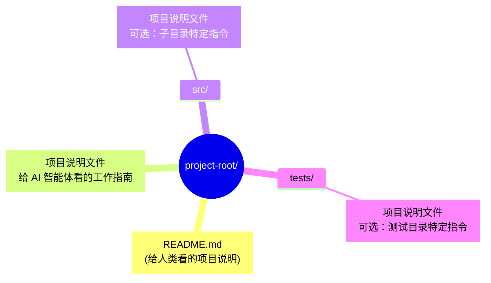
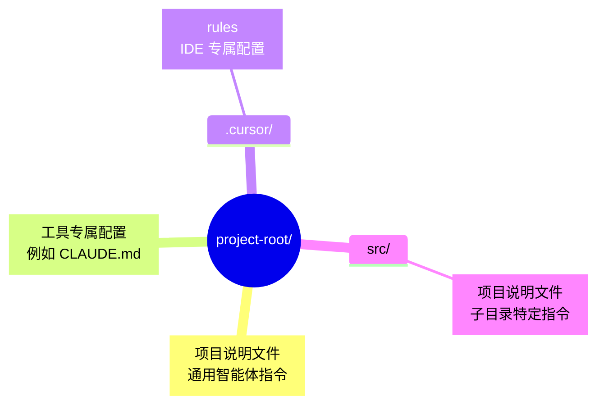

## 12.3 AGENTS.md 规范指南

`AGENTS.md`（项目说明文件）是一类面向 AI 编程智能体的项目级说明文档，用于集中存放构建命令、测试入口、代码风格、安全边界与工具权限控制等关键信息。不同工具生态可能仍在使用各种前缀名（如 CLAUDE.md、.cursorrules），但理念高度一致，并在长远上正逐渐向通用的 `AGENTS.md` 收敛。

### 12.3.1 什么是 AGENTS.md 与核心概念

`AGENTS.md` 是面向 AI 编程智能体的项目级操作手册，重点回答“能做什么、如何做、不能做什么”。如果说 `README.md` 是给人类开发者看的项目说明，那么 `AGENTS.md` 就是给 AI 编程智能体看的“机器可读说明书”。

> **类比**：  
> - `README.md` → 人类开发者的项目介绍  
> - `AGENTS.md` → AI 编程智能体的工作与合规指南

### 12.3.2 为什么需要项目说明文件

传统的 README.md 存在以下问题：

1. **面向人类**：包含快速入门、项目描述等人类易读但机器难以精确解析的内容
2. **信息分散**：构建命令、测试规则、代码风格等信息可能散落在多个文件中
3. **格式不统一**：每个项目的写法不同，Agent 需要“猜测”

项目说明文件通过标准化格式解决这些问题：

- 给智能体一个 **清晰、可预测** 的指令位置
- 提供 **精确、步骤化** 的操作指南
- 保持 README 简洁，专注人类读者

### 12.3.3 文件结构与基本布局

文件结构通常由根目录主文件、子目录补充文件和可按需引用的扩展文档索引组成。



图 12-1：项目说明文件布局结构

**嵌套规则**：

- 根目录的说明文件适用于整个项目
- 子目录的说明文件可以覆盖或补充父目录的指令
- 适用于 Monorepo 等大型项目

### 12.3.4 推荐内容结构

一个完整的项目说明文件通常包含以下部分：

#### 项目概述

````markdown
# Project Overview

This is a TypeScript-based web application using Next.js 14.
Architecture: Monorepo with apps/ and packages/ directories.
````

#### 构建与测试命令

```markdown
# Build & Test

###  Build

npm run build

###  Test

npm run test              # 运行所有测试
npm run test:unit         # 仅单元测试
npm run test:e2e          # 端到端测试

###  Lint

npm run lint              # ESLint + Prettier
```

#### 代码风格指南

```markdown
# Code Style

- Use TypeScript strict mode
- Prefer functional components over class components
- Use named exports, avoid default exports
- Maximum line length: 100 characters
- Use `const` by default, `let` only when necessary
```

#### 测试规范

```markdown
# Testing Guidelines

- All new features must have unit tests
- Test files should be co-located: `foo.ts` → `foo.test.ts`
- Use `describe` for grouping, `it` for individual tests
- Mock external APIs in tests
```

#### 安全考虑

```markdown
# Security

- Never commit secrets or API keys
- Use environment variables for configuration
- Validate all user input
- Avoid `eval()` and `dangerouslySetInnerHTML`
```

#### Pull Request 指南

```markdown
# Pull Request Guidelines

- Keep PRs focused and small (< 500 lines changed)
- Write meaningful commit messages
- Include tests for new functionality
- Update documentation if needed
```

#### 完整示例

````markdown
# 项目说明文件（示例）

###  Project Overview

A Python REST API.
- Framework: <web-framework>
- Database: <database>
- Authentication: <auth>

###  Environment Setup


```bash
python -m venv venv
source venv/bin/activate
pip install -r requirements.txt
cp .env.example .env
```

###  Build & Run


```bash
# Development

uvicorn app.main:app --reload

# Production

uvicorn app.main:app --host 0.0.0.0 --port 8000
```

###  Test Commands


```bash
# Run all tests

pytest

# Run with coverage

pytest --cov=app --cov-report=html

# Run specific test file

pytest tests/test_users.py
```

###  Code Style

- Follow PEP 8
- Use type hints for all function parameters and returns
- Docstrings in Google style
- Max line length: 88 (Black formatter)

###  File Naming

- API routes: `app/routers/{resource}.py`
- Models: `app/models/{entity}.py`
- Schemas: `app/schemas/{entity}.py`
- Tests: `tests/test_{module}.py`

###  Security

- Validate all input with Pydantic models
- Use parameterized queries (SQLAlchemy handles this)
- Never log passwords or tokens
- Rate limit all public endpoints
````

### 12.3.5 工具支持与配置关系

不同工具生态对项目说明文件的支持程度不同：有的会自动加载指定文件名，有的需要在配置中声明路径。建议以“文件内容结构”作为稳定部分，以“文件名与加载方式”作为可替换的适配层。

项目说明文件旨在 **统一** 而非取代现有的工具特定配置：

| 工具 | 专用配置 | 项目说明文件的作用 |
|------|----------|-----------------|
| IDE / 编辑器插件 | 项目内规则目录 | 提供通用指令 |
| CLI 智能体 | 项目内配置文件 | 提供通用指令 |
| 自动化机器人 | CI 配置 | 提供项目上下文 |

**最佳实践**：将通用指令放在项目说明文件中，将工具特定配置放在各自文件中。

### 12.3.6 高级技巧与最佳实践

**高级技巧：渐进式披露**

不要试图把所有信息都塞进一个项目说明文件。这会消耗 **词元** 并降低智能体的注意力。**推荐结构**：

```
agent_docs/
  ├── architecture.md
  ├── testing_guide.md
  └── database_schema.md
项目说明文件（只包含索引和指针）
```

在项目说明文件中：
> “关于数据库设计细节，请阅读 `agent_docs/database_schema.md`。”

智能体会自行决定何时深入阅读。

**核心原则：What / Why / How**

一个好的配置文件应该回答三个问题：

1. **WHAT**: 技术栈、项目结构。
2. **WHY**: 设计决策的背景。
3. **HOW**: 如何运行、测试、验证。

**反模式：不要做 Linter 的工作**

❌ **错误做法**：在 **提示词 (Prompt)** 中详细规定代码风格（空格还是 Tab、换行习惯）。
* **后果**：浪费 Token，执行不稳定。

✅ **正确做法**：使用 ESLint / Prettier / Ruff 等格式化工具。
* 让工具自动修复格式与 Lint 错误。智能体只需要知道 "run `npm run lint:fix`"。

### 12.3.7 逐步采用与验证

**快速开始**

1. 在项目根目录创建项目说明文件
2. 复制上面的模板并根据项目调整
3. 重点填写 **构建命令**和**代码风格** 部分

**逐步完善**

- 第一周：基础构建和测试命令
- 第二周：代码风格和命名规范
- 第三周：安全规则和 PR 指南
- 持续：根据智能体表现调整和补充

**验证效果**

使用 AI 编程 Agent 进行以下测试：

1. “请添加一个新的 API 端点”——检查是否遵循文件命名规范
2. “请为这个函数添加测试”——检查测试是否放在正确位置
3. “请修复这个 bug”——检查是否运行了测试套件

### 12.3.8 CI 持续集成与 Linter 检查

`AGENTS.md` 不能仅仅是一份被遗忘在根目录的纯文档，**必须加入 CI/CD 流程以防止其随时间发生“沉默腐烂”**。

**1. 目录强制校验 (Linter)**

通过编写一段简单的 CI 脚本（例如 `scripts/lint_agents_md.py`）并挂载到 Actions：

```python
import sys

def lint_agents_md():
    try:
        with open("AGENTS.md", "r") as f:
            content = f.read()
    except FileNotFoundError:
        print("❌ 错误: 必须在根目录提供 AGENTS.md")
        sys.exit(1)
        
    required_sections = ["# Build", "# Test", "# Code Style", "# Permissions"]
    
    for sec in required_sections:
        if sec not in content:
            print(f"❌ 错误: AGENTS.md 缺失核心要求章节 '{sec}'")
            sys.exit(1)
            
    # 避免占用过长上下文
    if content.count('\n') > 500:
        print("❌ 错误: AGENTS.md 太长，请使用子文件并在主文件引用")
        sys.exit(1)
        
    print("✅ AGENTS.md 结构校验通过")

if __name__ == "__main__":
    lint_agents_md()
```

**2. 绑定工具鉴权 (Permission Constraints)**

应探索在系统网关层将 `AGENTS.md` 解析为“声明式权限账本”（Declarative Permission Ledger）：

```markdown
# Permissions
- allowed_mcp_servers: ["db-readonly", "github-repo-read"]
- allowed_fs_paths: ["src/", "tests/", "docs/"]
- blocked_shell_commands: ["rm -rf", "docker push", "npm publish"]
```

从而实现“代码化安全边界 (Security-as-Code)”。

### 12.3.9 其他资源与配置对比

**相关资源**

建议查阅大模型工具链（如 Cursor、Cline、Aider 等）的最新官方文档，确认其支持的规则加载机制。

**与其他配置文件的对比**

| 维度 | 项目说明文件 | 工具专属配置文件 |
|------|-----------|-----------|
| 标准化 | 目标是跨工具通用 | 工具专属 |
| 适用范围 | 尽量跨工具复用 | 仅特定工具 |
| 层级位置 | 根目录 + 子目录 | 根目录 + 父目录 + 用户目录 |
| 核心内容 | 构建命令、测试、代码风格 | 工作流、工具连接相关特化配置 |
| 加载方式 | 工具主动读取或声明路径 | 随工具原生机制自动加载 |

两者的互补结构图如下：



图 12-2：项目说明文件与工具专属配置共存结构

> [!TIP]
> **最佳实践**：项目说明文件应随项目演进持续维护，重点关注：构建/测试入口、代码规范、安全边界、回归样例集。

---

**下一节**: [案例模板与检查清单](12.4_case_templates.md)
